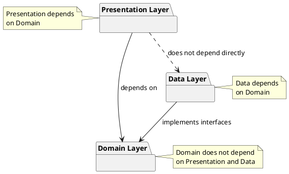

# Architectural principles of the PianoFlow application

## 1. Introduction

This document describes the architectural principles and approaches used in the development of the **PianoFlow** application — an Android application for learning and practicing playing the piano using MIDI devices.

### Purpose of the document

The document defines:
- High-level architectural principles of development
- The structure of the application layers
- The hierarchy of packages
- Design patterns and their application
- Rules for dependencies between components
- Implementation examples for typical scenarios

### Application context

PianoFlow is a simulator and a system for checking piano playing, connected via USB to an Android device. A detailed description of the application is presented in the document [Application Description](../../../README.md).

### Connection with development requirements

The architectural principles are based on the requirements from the development rules:
- **Minimal coupling** between system components
- **Independence of the core from the client** — the core of the system should not depend on Android-specific components, which will allow it to be reused in the future as a separate service with its own API

## 2. High-level architectural principles

### 2.1. Low Coupling

**Definition**: Coupling is a measure of the dependence of one module on another. Minimal coupling means that the components of the system should be as independent of each other as possible.

**Application in PianoFlow**:
- Components interact through clearly defined interfaces
- Changes in one layer should not require changes in other layers
- Business logic is isolated from implementation details (Android API, UI frameworks)

**Examples**:
- The Domain layer does not know about the existence of Android classes (`Activity`, `Fragment`, `ViewModel`)
- Repository interfaces are defined in the Domain layer, and their implementation is in the Data layer
- Use Cases do not depend on specific data sources (MIDI, database, network)

### 2.2. Independence of the core from the client

**Dependency Inversion Principle**: High-level modules (business logic) should not depend on low-level modules (implementation details). Both should depend on abstractions.

**Possibility of reusing the core**:
The core of the system (Domain layer) is designed in such a way that it can be reused:
- As a separate service with a REST API
- In other client applications (for example, a web version)
- As a library for other projects

**Division into layers**:
The architecture is divided into three main layers:
1. **Presentation Layer** — Android-specific layer (UI, navigation)
2. **Domain Layer** — the core of the system (business logic, independent of the platform)
3. **Data Layer** — implementation of data sources (MIDI, storage)

## 3. Architectural layers (Clean Architecture)

The application architecture is based on the principles of **Clean Architecture**, which ensures the separation of responsibilities and the independence of business logic from implementation details.

### 3.1. Presentation Layer

**Purpose**: Responsible for displaying data to the user and handling user input.

**Components**:
- **UI (View)**: `Activities`, `Fragments`, and `Composable` screens responsible for displaying data and passing user events to the `ViewModel`.
- **ViewModel**: Manages the UI state, handles events, and interacts with the `Domain` layer. It is the source of state for the UI.
- **UI State**: Immutable data classes that represent the complete state of the screen for display.
- **Navigation**: Components that manage the flow of screens in the application.

**Characteristics**:
- Depends only on the Domain layer
- Contains no business logic
- Uses the MVVM pattern and a unidirectional data flow (UDF)

**Example of package structure**:
```
presentation/
├── di/
│   └── PresentationModule.kt
├── ui/
│   ├── main/
│   │   └── MainFragment.kt
│   └── midi/
│       └── MidiConnectionFragment.kt
└── viewmodel/
    ├── MainViewModel.kt
    └── MidiConnectionViewModel.kt
```

### 3.2. Domain Layer (Core)

**Purpose**: Contains the business logic of the application and is the core of the system.

**Components**:
- **Use Cases** (Interactors) — specific business operations
- **Domain Models** — business entities (Note, MidiEvent)
- **Repository Interfaces** — abstractions for data access

**Characteristics**:
- **Independent of Android** and the **Data layer**.
- **Pure Kotlin** — can be reused in other projects.

**Example of package structure**:
```
domain/
├── model/
│   ├── Note.kt
│   └── MidiEvent.kt
├── repository/
│   ├── MidiRepository.kt (interface)
│   └── GameRepository.kt (interface)
└── usecase/
    ├── midi/
    │   ├── ConnectMidiDeviceUseCase.kt
    │   └── ProcessMidiMessageUseCase.kt
    └── game/
        ├── AnalyzePerformanceUseCase.kt
        └── StartGameSessionUseCase.kt
```

**Links to the description of the approach**:
- **Clean Architecture** — the main methodology:
  - Robert Martin's book "Clean Architecture: A Craftsman's Guide to Software Structure and Design" (2017)
  - Original article: [blog.cleancoder.com/uncle-bob/2012/08/13/the-clean-architecture.html](https://blog.cleancoder.com/uncle-bob/2012/08/13/the-clean-architecture.html)
- **Hexagonal Architecture** — a related approach:
  - Alistair Cockburn's original article: [alistair.cockburn.us/hexagonal-architecture](https://alistair.cockburn.us/hexagonal-architecture/)
  - Wikipedia: [en.wikipedia.org/wiki/Hexagonal_architecture_(software)](https://en.wikipedia.org/wiki/Hexagonal_architecture_(software))
- **Android Clean Architecture** — application in Android:
  - Google's official guide: [developer.android.com/topic/architecture](https://developer.android.com/topic/architecture)
  - Android Architecture Guide: [developer.android.com/jetpack/guide](https://developer.android.com/jetpack/guide)
- **Additional resources**:
  - SOLID Principles (Dependency Inversion Principle): [en.wikipedia.org/wiki/SOLID](https://en.wikipedia.org/wiki/SOLID)

### 3.3. Data Layer

**Purpose**: Implements data sources and provides data to the Domain layer through Repository interfaces.

**Components**:
- **Repository Implementations** — implementation of interfaces from the Domain layer
- **Data Sources** — specific data sources (MIDI, Room)
- **Data Models** and **Mappers** — data models and their converters to/from Domain Models.

**Characteristics**:
- Depends on the Domain layer (implements its interfaces).
- Isolates the details of working with data (Android MIDI API, Room) from the Domain layer.

**Example of package structure**:
```
data/
├── di/
│   └── DataModule.kt
├── datasource/
│   ├── midi/
│   │   ├── MidiDataSource.kt
│   │   └── MidiReceiver.kt
│   └── local/
│       └── GameDatabase.kt
├── mapper/
│   └── MidiEventMapper.kt
├── model/
│   └── MidiEventEntity.kt
└── repository/
    ├── MidiRepositoryImpl.kt
    └── GameRepositoryImpl.kt
```

### 3.4. Architecture layer diagram

```plantuml
@startuml
!include https://raw.githubusercontent.com/plantuml-stdlib/C4-PlantUML/master/C4_Component.puml
title C4 Level 3: PianoFlow Architecture Components
LAYOUT_WITH_LEGEND()
Container_Boundary(presentation, "Presentation Layer (Android-specific)") {
    Component(activity, "Activity/Fragment", "Android Component", "UI display and input handling")
    Component(viewModel, "ViewModel", "Jetpack ViewModel", "UI state management, calling Use Cases")
}
Container_Boundary(domain, "Domain Layer (Core - Android independent)") {
    Component(useCase, "Use Cases", "Kotlin", "Application business logic")
    Component(domainModel, "Domain Models", "Kotlin", "Business entities")
    Component(repoInterface, "Repository Interfaces", "Kotlin", "Abstractions for data access")
}
Container_Boundary(data, "Data Layer (Implementation of data sources)") {
    Component(repoImpl, "Repository Implementations", "Kotlin", "Implementation of repository interfaces")
    Component(dataSource, "Data Source", "Android API, Room", "Data sources (MIDI, DB)")
}
Rel(activity, viewModel, "Uses", " ")
Rel(viewModel, useCase, "Calls", " ")
Rel(useCase, repoInterface, "Uses", " ")
Rel_Back(useCase, domainModel, "Uses")
Rel_Up(repoImpl, repoInterface, "Implements", " ")
Rel(repoImpl, dataSource, "Uses", " ")
@enduml
```

## 4. Package Hierarchy Principle

To ensure uniformity and predictability of the project structure, all packages are named according to the following hierarchical principle:

**`{layer}.{component_type}.{functionality}`**

1.  **Layer**: The first level defines the architectural layer (`presentation`, `domain`, `data`).
2.  **Component Type**: The second level indicates the purpose of the component within the layer (`usecase`, `repository`, `viewmodel`, `ui`, `di`, etc.).
3.  **Functionality (Feature)**: The third (optional) level groups components by feature (`midi`, `game`). It is used when there are many components of the same type.

**Examples**:
-   **Correct**: `domain.usecase.midi` (Layer: domain, Type: usecase, Feature: midi)
-   **Correct**: `presentation.di` (Layer: presentation, Type: di)
-   **Incorrect**: `presentation.midi.viewmodel` (Order violated: feature before type)
-   **Incorrect**: `domain.midi.MidiConnectionUseCase` (The `MidiConnectionUseCase.kt` file should be in the `domain.usecase.midi` package)

This principle is applied to all layers to achieve maximum consistency.

## 5. Design patterns

### 5.1. MVVM (Model-View-ViewModel)

**Application**: Presentation Layer

**Description**:
- **Model** — Domain layer (Use Cases, Domain Models)
- **View** — Activities, Fragments, Composables (display data)
- **ViewModel** — manages the UI state, calls Use Cases

### 5.2. Repository Pattern (Data Layer)

**Application**: Abstraction of data access in the Data Layer. It is a **Single Source of Truth**.

### 5.3. Use Cases (Interactors) (Domain Layer)

**Application**: Encapsulation of business logic in the Domain Layer. Each Use Case is responsible for **one specific business operation**.

### 5.4. Dependency Injection

**Application**: Managing dependencies in all layers using Hilt.

## 6. UI/UX Design System

### 6.1. Material Design 3

The application follows the **[Material Design 3](https://m3.material.io/)** guidelines as the single UI/UX standard for all visual components and interaction patterns.

**Key principles adopted from M3**:
- **Color system**: dynamic color roles (`Primary`, `Secondary`, `Tertiary`, `Surface`, `Error`, and their `On*`/`Container` variants). All colors are defined via `MaterialTheme.colorScheme` — hardcoded color values in composables are prohibited.
- **Typography**: the M3 type scale (`displayLarge` → `labelSmall`). All text styles come from `MaterialTheme.typography`.
- **Shape**: the M3 shape system (`extraSmall` → `extraLarge`). Corner radii are taken from `MaterialTheme.shapes`.
- **Components**: prefer M3 Compose components (`Button`, `Card`, `TopAppBar`, `NavigationBar`, `Scaffold`, etc.) over custom implementations where M3 provides an equivalent.
- **Theming**: the app theme is defined in the `presentation` layer and injected at the root composable. Dynamic color (Android 12+) support is opt-in; a static fallback palette is always provided.

**References**:
- Material Design 3 specification: [m3.material.io](https://m3.material.io/)
- Jetpack Compose Material 3: [developer.android.com/jetpack/compose/designsystems/material3](https://developer.android.com/jetpack/compose/designsystems/material3)
- Material Theme Builder (color palette tool): [material-foundation.github.io/material-theme-builder](https://material-foundation.github.io/material-theme-builder)

## 7. General package structure

The final package structure, following the described principle:

```
com.astrizhachuk.pianoflow/
├── presentation/              # Presentation layer
│   ├── di/                    # DI modules for Presentation
│   ├── model/                 # UI models (e.g., UI State)
│   ├── ui/                    # UI controllers, grouped by feature
│   │   ├── main/
│   │   └── midi/
│   └── viewmodel/             # ViewModels, grouped by feature
│       ├── main/
│       └── midi/
├── domain/                    # Domain layer (core)
│   ├── exception/
│   ├── model/                 # Business entities
│   ├── repository/            # Repository interfaces
│   └── usecase/               # Use cases, grouped by feature
│       ├── midi/
│       └── game/
└── data/                      # Data layer
    ├── di/                    # DI modules for Data
    ├── datasource/            # Data sources, grouped by type
    │   ├── local/
    │   └── midi/
    ├── mapper/                # Model mappers
    ├── model/                 # Data models (entities for DB, DTOs, etc.)
    └── repository/            # Repository implementations
```

## 8. Dependency rules

### 8.1. Basic rules

1. **Domain does not depend on Presentation and Data**.
2. **Presentation depends on Domain**.
3. **Data depends on Domain**.
4. **Presentation does not depend directly on Data**.
5. All operations in the Data and Domain layers are **Main-safe**.

### 8.2. Direction of dependencies

```
Presentation → Domain ← Data
```
Dependencies are directed **towards the center** (Domain), which is an independent core.



## 9. Build Optimization (R8/ProGuard)

To reduce the size of the application, improve performance, and protect the code from reverse engineering, the **R8** tool is used, which is included in the Android Gradle Plugin.

### 9.1. Configuration principles

1.  **Release build**:
    -   Minimization is always enabled (`isMinifyEnabled = true`). This activates three processes:
        -   **Shrinking**: R8 identifies and removes unused classes, fields, methods, and attributes.
        -   **Optimization**: R8 analyzes and rewrites the code to further reduce the size of the application.
        -   **Obfuscation**: R8 renames classes, fields, and methods using short and meaningless names, which makes it difficult to analyze the code.

2.  **Debug build**:
    -   Minimization is disabled (`isMinifyEnabled = false`) to speed up the build and preserve the possibility of full debugging (method names, class names, and line numbers are saved).

### 9.2. ProGuard rule files

Some code used through reflection (for example, when serializing data, by DI frameworks) may be mistakenly removed by R8. To avoid this, rule files (`proguard-rules.pro`) are used.

**Basic rules**:
-   Keep data model classes (DTOs) that are used for serialization/deserialization (for example, with Gson/Moshi).
-   Keep classes generated by Hilt/Dagger for dependency injection.
-   Keep custom `View`, `Serializable`/`Parcelable` classes.

**Example of a rule (`-keep`):**
```proguard
# Keep all public classes and their public members in the model package
-keep public class com.astrizhachuk.pianoflow.data.model.** {
    public *;
}
```

## 10. Logging system

A standardized logging system is used to collect and analyze information about the application's operation.

### 10.1. Tool: Timber

**Timber** is used as the main logging library.
**Advantages**:
-   Provides a convenient API.
-   Automatically adds the tag of the class from which the log was called.
-   Allows you to easily configure different behavior for `debug` and `release` builds.

### 10.2. Logging principles

1.  **Initialization**: In the `PianoFlowApplication` class, "trees are planted" for Timber.
    -   In a `debug` build, `Timber.DebugTree()` is used, which outputs logs to Logcat.
    -   In a `release` build, a custom tree (`ReleaseTree`) is planted, which either does nothing or sends critical errors to an analytics system (for example, Firebase Crashlytics).

    ```kotlin
    // PianoFlowApplication.kt
    class PianoFlowApplication : Application() {
        override fun onCreate() {
            super.onCreate()
            if (BuildConfig.DEBUG) {
                Timber.plant(Timber.DebugTree())
            } else {
                Timber.plant(CrashReportingTree()) // Example for Crashlytics
            }
        }
    }
    ```

2.  **Using logging levels**:

    -   `Timber.v(message: String)` (Verbose)
        -   **Not used** in the project to keep the logs clean.

    -   `Timber.d(message: String)` (Debug)
        -   **Purpose**: Detailed information for debugging. Used for tracing code execution, outputting variable states, algorithm steps.
        -   **Example**: `Timber.d("Processing MIDI event: $event")`
        -   **Rule**: These logs should only be useful to the developer during debugging.

    -   `Timber.i(message: String)` (Info)
        -   **Purpose**: Important but expected events in the application lifecycle. Allows you to track the general progress of execution.
        -   **Example**: `Timber.i("MIDI device connected: ${device.name}")`, `Timber.i("Starting game session for track: ${track.id}")`

    -   `Timber.w(message: String, throwable: Throwable? = null)` (Warning)
        -   **Purpose**: Potential problems or non-critical errors that do not interrupt the application, but which are worth paying attention to.
        -   **Example**: `Timber.w("Received an unexpected MIDI message type. Skipping.")`

    -   `Timber.e(throwable: Throwable, message: String)` (Error)
        -   **Purpose**: Critical errors and exceptions that have led to a failure in the operation of a function or the entire application.
        -   **Example**: `catch (e: IOException) { Timber.e(e, "Failed to read MIDI data from source.") }`
        -   **Rule**: A `Throwable` object must always be passed. In `release` builds, these logs should be sent to a crash reporting system.

## 11. Extracting the core as a separate library

The architecture is designed with the principle of **independence of the core from the client**, which makes it possible to use the Domain layer in various contexts (Android, Desktop, Web).

### 11.1. Structure for multi-platform use

The package hierarchy principle is preserved within each module.

```
pianoflow-core/              # Separate library (core)
└── src/
    └── commonMain/
        └── kotlin/
            └── com/astrizhachuk/pianoflow/domain/
                ├── model/
                ├── usecase/
                └── repository/

pianoflow-android/           # Android application
└── app/src/main/java/com/astrizhachuk/pianoflow/
    ├── presentation/
    └── data/
```

### 11.2. Adapters for different platforms

Each platform implements its own adapters (`data` layer) for working with MIDI, implementing the interfaces from the `domain` layer.

| Platform | MIDI API | Adapter implementation |
|-----------|----------|---------------------|
| **Android** | Android MIDI API | `AndroidMidiRepositoryImpl` |
| **Windows** | Windows MIDI API | `WindowsMidiRepositoryImpl` |
| **Web** | Web MIDI API | `WebMidiRepositoryImpl` |


### 11.3. C4 Scheme: Context and Containers

#### C4 Level 1: System Context

```plantuml
@startuml
!include https://raw.githubusercontent.com/plantuml-stdlib/C4-PlantUML/master/C4_Context.puml

title C4 Level 1: System Context - PianoFlow

LAYOUT_WITH_LEGEND()

Person(user, "User", "A person who wants to learn to play the piano.")

System_Boundary(clients, "Client applications") {
    System(androidApp, "Android application", "Allows the user to practice on an Android device.")
    System(windowsApp, "Windows application", "Allows the user to practice on a Windows PC.")
    System(webApp, "Web application", "Allows the user to practice in a browser.")
}

System(core, "PianoFlow Core", "A Kotlin Multiplatform library containing the main business logic.")
System_Ext(midiDevice, "MIDI device", "A physical piano or MIDI keyboard.")

Rel(user, androidApp, "Uses")
Rel(user, windowsApp, "Uses")
Rel(user, webApp, "Uses")

Rel(androidApp, core, "Uses the core")
Rel(windowsApp, core, "Uses the core")
Rel(webApp, core, "Uses the core")

Rel(androidApp, midiDevice, "Connects via", "USB/MIDI")
Rel(windowsApp, midiDevice, "Connects via", "USB/MIDI")
Rel(webApp, midiDevice, "Connects via", "Web MIDI API")
@enduml
```

#### C4 Level 2: Containers

```plantuml
@startuml
!include https://raw.githubusercontent.com/plantuml-stdlib/C4-PlantUML/master/C4_Container.puml

title C4 Level 2: Containers - PianoFlow Multi-Platform Architecture

LAYOUT_WITH_LEGEND()

Person(user, "User", "A piano student.")

System_Ext(midiDevice, "MIDI device", "A physical piano or MIDI keyboard.")

System_Boundary(coreBoundary, "PianoFlow Core (KMP Library)") {
    Container(domain, "Domain Layer", "Kotlin", "Use Cases, Domain Models, Repository Interfaces.")
}

System_Boundary(androidBoundary, "Android application") {
    Container(androidUi, "UI (Activities, Fragments, Compose)", "Android UI Toolkit", "Displays the interface, handles input.")
    Container(androidData, "Data Adapters", "Kotlin", "Implements repositories using the Android MIDI API.")
    
    Rel(androidUi, domain, "Uses", "Kotlin API")
    Rel(androidData, domain, "Implements", "Kotlin API")
    Rel(androidData, midiDevice, "Reads MIDI events from", "Android MIDI API")
}

System_Boundary(windowsBoundary, "Windows application") {
    Container(windowsUi, "UI (Compose for Desktop)", "Jetpack Compose", "Displays the interface, handles input.")
    Container(windowsData, "Data Adapters", "Kotlin/JVM", "Implements repositories using the Windows MIDI API.")
    
    Rel(windowsUi, domain, "Uses", "Kotlin API")
    Rel(windowsData, domain, "Implements", "Kotlin API")
    Rel(windowsData, midiDevice, "Reads MIDI events from", "Windows MIDI API")
}

System_Boundary(webBoundary, "Web application") {
    Container(webUi, "UI (React, Compose for Web)", "JavaScript/WASM", "Displays the interface in a browser.")
    Container(webData, "Data Adapters", "Kotlin/JS", "Implements repositories using the Web MIDI API.")

    Rel(webUi, domain, "Uses", "Kotlin API")
    Rel(webData, domain, "Implements", "Kotlin API")
    Rel(webData, midiDevice, "Reads MIDI events from", "Web MIDI API")
}

Rel(user, androidUi, "Uses")
Rel(user, windowsUi, "Uses")
Rel(user, webUi, "Uses")
@enduml
```

#### C4 Level 3: Core Components

```plantuml
@startuml
!include https://raw.githubusercontent.com/plantuml-stdlib/C4-PlantUML/master/C4_Component.puml

title C4 Level 3: PianoFlow Core Components

LAYOUT_WITH_LEGEND()

Container_Boundary(core, "PianoFlow Core (Library)") {
    Component(useCases, "Use Cases", "Kotlin", "Encapsulates business logic (game analysis, MIDI processing).")
    Component(models, "Domain Models", "Kotlin", "Representation of business entities (notes, sessions, events).")
    Component(repoInterfaces, "Repository Interfaces", "Kotlin", "Abstractions for data access (MidiRepository, GameRepository).")

    Rel(useCases, models, "Uses")
    Rel(useCases, repoInterfaces, "Uses")
}

Container_Boundary(platform, "Platform Adapters (Outside the core)") {
    Component(androidAdapter, "Android Adapter", "Kotlin", "Implements Repository Interfaces using the Android MIDI API.")
    Component(windowsAdapter, "Windows Adapter", "Kotlin/JVM", "Implements Repository Interfaces using the Windows MIDI API.")
    Component(webAdapter, "Web Adapter", "Kotlin/JS", "Implements Repository Interfaces using the Web MIDI API.")
}


Rel_Up(androidAdapter, repoInterfaces, "Implements")
Rel_Up(windowsAdapter, repoInterfaces, "Implements")
Rel_Up(webAdapter, repoInterfaces, "Implements")
@enduml
```

## 12. String resources and localization

### 12.1. Principles of working with strings

1.  **All strings in resources**: All text that the user sees must be moved to string resource files (`res/values/strings.xml`). Hardcoding strings in code (`.kt` files) or in layouts (`.xml` files) is strictly prohibited.
    -   **Correct**: `android:text="@string/app_name"`
    -   **Incorrect**: `android:text="PianoFlow"`

2.  **Uniformity of naming**: The names of string resources should be predictable and reflect their purpose. `snake_case` is used.
    -   **Example**: `connection_state_connected`, `error_message_midi_not_supported`.

### 12.2. Localization support

The application must support at least two localizations:

1.  **English (en)** — is the default language. All strings are initially added to the `res/values/strings.xml` file.
2.  **Russian (ru)** — is an additional localization. All strings must be translated and added to the `res/values-ru/strings.xml` file.

Both localization files must be kept up to date. When adding a new string to `values/strings.xml`, you must immediately add its translation to `values-ru/strings.xml`.

## Related documents
- [Application description](../ru/README.md)
