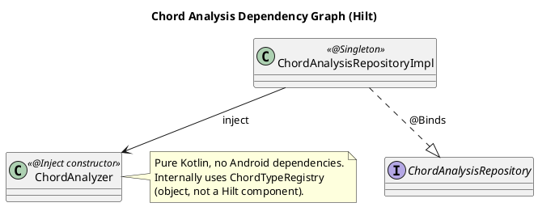
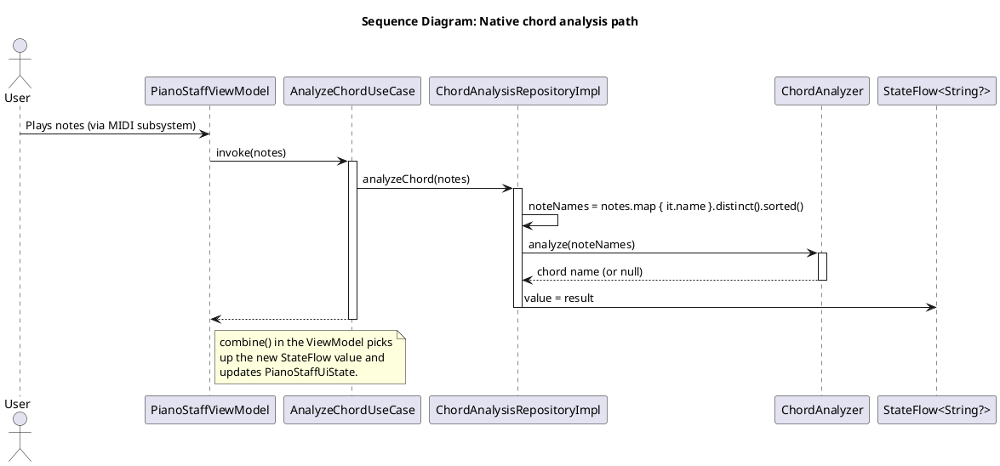

# Technical Specification: Native Kotlin Chord Analysis

## 1. General Information

### 1.1. Purpose

The chord analysis subsystem provides synchronous, platform-independent chord and single-note recognition. The implementation is a pure-Kotlin domain service with no Android dependencies, suitable for reuse on other platforms (see `docs/en/plans/ARCHITECTURE_PRINCIPLES.md` §11).

Behavior:

1. Accepts a list of note names like `["C4", "E4", "G4"]`.
2. For **two or more** notes — returns a chord name string (`"C"`, `"Am"`, `"G7"`, `"Em#5/C"`, etc.) or `null` if no match is found.
3. For a **single** note — returns its enharmonically simplified name (e.g. `E#4 → F4`, `Cb4 → B3`, `Cx4 → D4`, `Ebb4 → D4`).
4. Preserves the enharmonic spelling of input notes in the chord name (`Db` stays `Db`, never becomes `C#`).
5. Returns the result **synchronously** — no callbacks, no main-loop hops.

The reactive contract `ChordAnalysisRepository.chordAnalysisResult: StateFlow<String?>` carries the result to the Presentation layer.

### 1.2. Base Documents

- [Architectural Principles](../plans/ARCHITECTURE_PRINCIPLES.md)
- [Technical Specification: MIDI Message Processing](./MIDI_MESSAGE_PROCESSING.md)
- [Testing Strategy](../plans/TESTING_STRATEGY.md)

## 2. Architectural Solution

### 2.1. Components

The chord analysis subsystem lives in the Domain layer as a pure-Kotlin service. The Data layer hosts only the `ChordAnalysisRepositoryImpl` adapter, which holds the reactive state and delegates analysis to the domain service.

**Domain Layer**
- **`Pitch`** (`domain.model.music`): parsed note — letter, alteration, octave (nullable), MIDI number (nullable), chroma index. Pure data class.
- **`ChordType`** (`domain.model.music`): single chord type — 12-bit chroma bitmask and primary symbol (e.g. `"M"`, `"m"`, `"7"`, `"m7"`).
- **`ChordTypeRegistry`** (`domain.service.analysis`): internal object owning the inline table of 106 chord types and an indexed lookup `Map<chroma, List<ChordType>>`. Loaded once via lazy initialization.
- **`ChordAnalyzer`** (`domain.service.analysis`): public domain service with the single entry point `analyze(noteNames: List<String>): String?`. Internally performs note parsing, pitch-class extraction, chord matching, and output formatting. Provides single-note enharmonic simplification when only one note is supplied.

**Data Layer**
- **`ChordAnalysisRepositoryImpl`**: holds a `MutableStateFlow<String?>` and exposes `analyzeChord(notes: List<Note>)`. Deduplicates and sorts note names, then synchronously invokes `ChordAnalyzer.analyze(...)` and writes the result directly to the `StateFlow`. No threading or platform dependencies.

#### 2.1.1. C4 Level 2: Containers

```plantuml
@startuml
!include https://raw.githubusercontent.com/plantuml-stdlib/C4-PlantUML/master/C4_Container.puml

title C4 - Level 2: Chord Analysis Subsystem

Person(user, "User", "Musician playing the keyboard")

System_Boundary(piano_flow, "PianoFlow Application") {
    Container(vm, "PianoStaffViewModel", "Kotlin", "Coordinates analysis and updates UI state")
    Container(analyze_chord, "AnalyzeChordUseCase", "Kotlin", "Initiates chord analysis (fire-and-forget)")
    Container(observe_chord, "ObserveChordAnalysisResultsUseCase", "Kotlin Flow", "Provides analysis results")
    Container(chord_repo, "ChordAnalysisRepository", "Kotlin", "Abstraction for chord analysis")
    Container(chord_repo_impl, "ChordAnalysisRepositoryImpl", "Kotlin", "Implementation, holds StateFlow")
    Container(chord_analyzer, "ChordAnalyzer", "Pure Kotlin", "Native chord detection engine")
}

Rel(vm, analyze_chord, "analyzeChord()")
Rel(vm, observe_chord, "observeChordAnalysisResults()")
Rel(analyze_chord, chord_repo, "analyzeChord()")
Rel(observe_chord, chord_repo, "observeChordAnalysisResults()")
Rel(chord_repo_impl, chord_repo, "@Binds")
Rel(chord_repo_impl, chord_analyzer, "Delegates analyze()")

@enduml
```

#### 2.1.2. C4 Level 3: Chord Analysis Subsystem Components

```plantuml
@startuml
!include https://raw.githubusercontent.com/plantuml-stdlib/C4-PlantUML/master/C4_Component.puml

title C4 - Level 3: Native Chord Analysis Components

Container_Boundary(presentation, "Presentation Layer") {
    Component(vm, "PianoStaffViewModel", "ViewModel", "Calls analysis, observes results")
}

Container_Boundary(domain, "Domain Layer") {
    Component(analyze_chord_uc, "AnalyzeChordUseCase", "Use Case", "Fire-and-forget analysis")
    Component(observe_chord_uc, "ObserveChordAnalysisResultsUseCase", "Use Case", "Subscription to results")
    Component(chord_repo, "ChordAnalysisRepository", "Interface", "Chord analysis contract")
    Component(chord_analyzer, "ChordAnalyzer", "Domain Service", "Public API: analyze(noteNames): String?")
    Component(chord_registry, "ChordTypeRegistry", "Internal Object", "106 chord types + chroma index")
    Component(pitch_model, "Pitch", "Model", "Parsed note: letter, alter, octave, MIDI, chroma")
    Component(chord_type_model, "ChordType", "Model", "chroma bitmask + symbol")
}

Container_Boundary(data, "Data Layer") {
    Component(chord_repo_impl, "ChordAnalysisRepositoryImpl", "Repository Impl", "Owns StateFlow, delegates to ChordAnalyzer")
}

Rel(vm, analyze_chord_uc, "analyzeChord()")
Rel(vm, observe_chord_uc, "observeChordAnalysisResults()")
Rel(analyze_chord_uc, chord_repo, "analyzeChord()")
Rel(observe_chord_uc, chord_repo, "observeChordAnalysisResults()")
Rel(chord_repo_impl, chord_repo, "@Binds")
Rel(chord_repo_impl, chord_analyzer, "Uses")
Rel(chord_analyzer, chord_registry, "Looks up chord types")
Rel(chord_analyzer, pitch_model, "Parses input")
Rel(chord_registry, chord_type_model, "Holds")

@enduml
```

### 2.2. API and Data Models

**Domain Layer:**

```kotlin
// com.astrizhachuk.pianoflow.domain.model.music.Pitch.kt
/**
 * Parsed musical note. Internal representation used by the analysis engine.
 *
 * @param letter Note letter 'A'..'G'.
 * @param alter Accidental sign: -2 (bb), -1 (b), 0 (natural), +1 (#), +2 (x).
 * @param octave Octave number, or null if the input note name had no octave.
 * @param midi MIDI pitch (0..127) when octave is present and within range, else null.
 * @param chroma Pitch class 0..11 (semitones from C, modulo 12).
 */
internal data class Pitch(
    val letter: Char,
    val alter: Int,
    val octave: Int?,
    val midi: Int?,
    val chroma: Int
)

// com.astrizhachuk.pianoflow.domain.model.music.ChordType.kt
/**
 * One chord type from the registry.
 *
 * @param chroma 12-bit pitch-class bitmask, bit 0 = root present.
 * @param symbol Primary chord symbol appended to the root note name (e.g. "M", "m", "7").
 */
internal data class ChordType(
    val chroma: Int,
    val symbol: String
)

// com.astrizhachuk.pianoflow.domain.service.analysis.ChordAnalyzer.kt
/**
 * Domain service for native chord and single-note analysis. Pure Kotlin, platform-independent.
 *
 * Synchronous and main-safe.
 */
class ChordAnalyzer @Inject constructor() {
    /**
     * Analyzes a list of note names.
     *
     * @param noteNames Sorted, deduplicated list of note names (e.g. ["C4", "E4", "G4"]).
     *     Empty list, or list of only invalid notes, returns null.
     *     Single valid note returns its enharmonically simplified name.
     *     Two or more valid notes return a chord name or null if no chord type matches.
     * @return Chord name, simplified note name, or null.
     */
    fun analyze(noteNames: List<String>): String?
}

// com.astrizhachuk.pianoflow.domain.repository.ChordAnalysisRepository.kt
interface ChordAnalysisRepository {
    val chordAnalysisResult: StateFlow<String?>
    fun analyzeChord(notes: List<Note>)
}
```

The `ChordAnalysisRepository` interface is the stable boundary between the chord-analysis subsystem and its consumers (`AnalyzeChordUseCase`, `ObserveChordAnalysisResultsUseCase`, `PianoStaffViewModel`).

### 2.3. Dependency Graph

The chord analysis subsystem uses Hilt for dependency injection.



`ChordAnalyzer` is `@Inject constructor`-able and stateless. `ChordAnalysisRepositoryImpl` is `@Singleton` and holds the `StateFlow` for the analysis result. No Hilt providers for `WebView`, `Gson`, or any JS runtime are required by this subsystem.

## 3. Algorithm

The algorithm uses pure arithmetic and table lookups — no external dependencies. Conventions follow Tonal.js v6 (`Tonal.Chord.detect` and `Tonal.Note.simplify`); behavior is compatible with that library.

### 3.1. Note Name Parsing

Input grammar: `^([A-Ga-g])([#b]+|x)?(-?\d+)?$`. The parser must accept:

- Plain letters: `C`, `D`, ..., `B` (case-insensitive)
- Sharps and flats: `C#`, `Bb`, `F##`, `Bbb`
- Double sharp shorthand: `Cx` (equivalent to `C##`) — exactly one `x`; mixing `x` with `#` or `b`, or repeating `x`, is invalid
- Octave (optional): integer, may be negative — `C-1`, `C0`, `C4`, `G9`

Parsing produces a `Pitch`:

- `letter` — uppercased input letter.
- `alter` = `(#-count) − (b-count) + (2 if x is present else 0)`. Mixing `#` and `b`, mixing `x` with anything else, or repeating `x` is invalid and yields `null`.
- `octave` — the parsed integer, or `null` if absent.
- `chroma` = `(letterChroma[letter] + alter + 12) mod 12`, where the letter-to-chroma map is `{C:0, D:2, E:4, F:5, G:7, A:9, B:11}`.
- `midi` = `(octave + 1) * 12 + letterChroma[letter] + alter` when `octave` is present and the result lies in `0..127`; otherwise `null`. The alteration shifts MIDI without wrapping the octave, so `B#4 → 72` (sounds as `C5`) and `Cb4 → 59` (sounds as `B3`).

Empty strings, malformed strings, and unknown letters (e.g. `H`) yield `null`.

### 3.2. Chord Detection (N ≥ 2 valid notes)

#### Step 1 — Extract pitch classes

Drop the octave from each note, keep the pitch class. Invalid notes are silently filtered out.

```
["C4", "E4", "G4"]  →  ["C", "E", "G"]
["F#3", "A3", "C4"] →  ["F#", "A", "C"]
```

#### Step 2 — Build chroma → name lookup

Build a `Map<Int, String>` from chroma index to the **first** input note name with that chroma. This preserves the enharmonic spelling supplied by the caller:

```
["Db", "F", "Ab"]  →  {1:"Db", 5:"F", 8:"Ab"}
["C#", "F", "G#"]  →  {1:"C#", 5:"F", 8:"G#"}
```

Both inputs represent the same pitches but produce different output spellings.

#### Step 3 — Build chroma bitmask

Represent the input pitch-class set as a 12-bit value (bit `i` set iff chroma `i` is present):

```
["C", "E", "G"]  →  bits {0, 4, 7}  →  binary 100010010000
```

The implementation MAY use a 12-bit `Int` and `Integer.rotateRight` on the lower 12 bits, or a 12-character `String` and string rotation — both produce identical results. The reference implementation chooses the `Int` form for performance.

#### Step 4 — Try all 12 rotations

For each `u` in `0..11`, compute the bitmask rotated so that chroma `u` becomes the new bit 0 ("what intervals would these notes form if `u` were the root?").

Only rotations whose new bit 0 is set can match any chord type, because every chord type in the registry has bit 0 = `1` (the root is always present). This yields a fast-path early exit for irrelevant rotations.

#### Step 5 — Match against the chord type registry

For each rotated bitmask, look up all `ChordType` entries whose `chroma` field equals the rotation. Multiple chord types may share the same chroma — all matches are collected.

```
"100010010000"  →  matches "M"     → root C  → chord "CM"
"100100001000"  →  matches "m#5"   → root E  → chord "Em#5" (inversion of C major)
"100001000100"  →  no match
```

#### Step 6 — Assign weight and build the name

Let `bassChroma` = chroma of the first input note (after deduplication, the lowest-named/sorted input). For each match at rotation `u`:

- `u == bassChroma` (root equals the bass note) — **weight 1.0**, name = `"<root><symbol>"` (e.g. `"CM"`).
- `u != bassChroma` (inversion) — **weight 0.5**, name = `"<root><symbol>/<bassName>"` (e.g. `"Em#5/C"`).

The root note name is taken from the chroma → name lookup built in Step 2; if the lookup has no entry for chroma `u` (because rotation lands on a chroma not in the input), the root cannot be one of the input notes and that case never produces a match — root names are only needed for chromas already in the lookup.

#### Step 7 — Sort and pick the best

Filter results to `weight > 0`, sort by descending weight, take the **first** result.

```
detect(["C4","E4","G4"])  →  ["CM", "Em#5/C"]   →  "CM"
detect(["E4","G4","C5"])  →  ["Em#5", "CM/E"]   →  "Em#5"
detect(["A4","C5","E5"])  →  ["Am"]             →  "Am"
detect(["C4","D4","E4"])  →  []                 →  null
```

#### Step 8 — Output formatting

A trailing `M` is stripped so that root-position major chords render as `"C"` rather than `"CM"`:

- If the candidate ends with `M` (case-sensitive), strip the final `M`. Examples: `"CM" → "C"`, `"DbM" → "Db"`.
- Otherwise leave the candidate unchanged. Examples: `"Am"`, `"G7"`, `"Em#5/C"`, `"CM/E"` (the inversion form keeps `M` because it is not at the end of the string).

The formatting rule is intentionally minimal — anything more aggressive would break the `Em#5/C` and `CM/E` shapes that legitimately contain `M` mid-string.

### 3.3. Single-Note Simplification (N = 1 valid note)

Direct port of `Tonal.Note.simplify`:

1. Parse the input into a `Pitch`. If parsing fails, return `null`.
2. Choose the chromatic scale based on `alter`:
   - `alter > 0` → use the **sharp** scale: `["C", "C#", "D", "D#", "E", "F", "F#", "G", "G#", "A", "A#", "B"]`.
   - `alter ≤ 0` → use the **flat** scale: `["C", "Db", "D", "Eb", "E", "F", "Gb", "G", "Ab", "A", "Bb", "B"]`.
3. Take the note name at index `chroma` from the chosen scale.
4. If the input had an octave: append the recomputed octave `floor(midi / 12) − 1`. This handles cross-octave cases automatically (e.g. `B#4 → C5`, `Cb4 → B3`).
5. If the input had no octave (e.g. `"E#"`), omit the octave from the output (`"F"`).

| Input  | MIDI | alter | Sharps? | Chroma | Output |
|--------|------|-------|---------|--------|--------|
| `C4`   | 60   | 0     | no      | 0      | `C4`   |
| `G#4`  | 68   | +1    | yes     | 8      | `G#4`  |
| `Ab4`  | 68   | -1    | no      | 8      | `Ab4`  |
| `E#4`  | 65   | +1    | yes     | 5      | `F4`   |
| `Fb4`  | 64   | -1    | no      | 4      | `E4`   |
| `B#4`  | 72   | +1    | yes     | 0      | `C5`   |
| `Cb4`  | 59   | -1    | no      | 11     | `B3`   |
| `Cx4`  | 62   | +2    | yes     | 2      | `D4`   |
| `Ebb4` | 62   | -2    | no      | 2      | `D4`   |

### 3.4. Routing

`ChordAnalyzer.analyze(noteNames)` dispatches by the number of **valid** parsed pitches (after silently dropping malformed inputs):

| Valid pitches | Behavior |
|---------------|----------|
| 0             | return `null` |
| 1             | run single-note simplification (3.3) |
| ≥ 2           | run chord detection (3.2), then output formatting (Step 8) |

## 4. Behavior and Edge Cases

| Input | Behavior |
|-------|----------|
| `[]` | `null` |
| `["Z4"]` (fully invalid) | `null` |
| `["C4", "Z4", "E4"]` | invalid filtered out → 2 pitches → chord detection |
| `["C4", "Z4"]` | invalid filtered out → 1 pitch → simplify → `"C4"` |
| `["C4", "C4"]` (duplicate string) | the upstream repository already calls `.distinct()` before passing to the analyzer; analyzer additionally deduplicates by chroma keeping first spelling |
| `["C#4", "Db4"]` (different spellings, same chroma) | first spelling wins (after upstream sort) → only one pitch class, no chord detected → `null` |
| `["C4", "D4", "E4"]` (no matching chord type) | `null` |

**Enharmonic stability.** The chroma → name lookup is built in input order. The repository sorts note names lexicographically before calling the analyzer, so `["C#4", "Db4"]` is deterministically reduced to its sorted-first spelling.

**Logging.** `ChordAnalyzer` is pure Kotlin and does not depend on Timber or any logging facility. Diagnostic logging stays in `ChordAnalysisRepositoryImpl` (Data layer): `Timber.d` on entry, `Timber.e` on caught exceptions.

**Exceptions.** Neither the parser nor the registry throws. `analyze()` is total: it returns `null` on any input that cannot be classified. The `try/catch` in `ChordAnalysisRepositoryImpl` is retained as defense-in-depth.

**Performance.** The algorithm runs in O(1) with respect to input size (12 rotations, each an O(1) hash lookup in the chroma index). Worst-case latency is sub-millisecond.

## 5. Lifecycle and Interaction

### 5.1. Principle of Operation

1. `PianoStaffViewModel` observes `ObserveMidiMessagesUseCase` (a stream of `List<Note>` produced by the MIDI subsystem).
2. On each new list, it invokes `AnalyzeChordUseCase(notes)` (fire-and-forget).
3. `AnalyzeChordUseCase` calls `ChordAnalysisRepository.analyzeChord(notes)`.
4. `ChordAnalysisRepositoryImpl` deduplicates and sorts note names, then calls `ChordAnalyzer.analyze(noteNames)` synchronously.
5. The result is written to the `StateFlow<String?>` directly, with no thread hop.
6. `ObserveChordAnalysisResultsUseCase` exposes the `StateFlow` to the view model, which combines it with the note stream into `PianoStaffUiState`.



The sequence is fully synchronous on the calling thread of `analyzeChord`: no thread hops, no callbacks, no asynchronous initialization.

### 5.2. Internal Structure of `ChordAnalyzer.analyze`

```plantuml
@startuml
title Activity: ChordAnalyzer.analyze(noteNames)

start
:parse each name into Pitch;
:filter out null (invalid);
if (pitches.isEmpty()) then (yes)
  :return null;
  stop
endif
if (pitches.size == 1) then (yes)
  :simplify single pitch;
  :return name;
  stop
endif
:build chroma -> name map;
:build chroma bitmask;
:bassChroma = pitches[0].chroma;
:results = []
;
repeat
  :rotate bitmask by u;
  if (rotation bit 0 == 1) then (yes)
    :lookup chord types in registry;
    repeat
      if (u == bassChroma) then (yes)
        :weight = 1.0
        name = root + symbol;
      else (no)
        :weight = 0.5
        name = root + symbol + "/" + bass;
      endif
      :push (weight, name);
    repeat while (more types?)
  endif
repeat while (u < 12)
if (results.isEmpty()) then (yes)
  :return null;
  stop
endif
:sort by weight desc;
:best = results[0].name;
:strip trailing 'M';
:return best;
stop

@enduml
```

## 6. Acceptance Criteria

### Functional

- Reference outputs of `chordAnalysisResult`:
  - `[C4, E4, G4]` → `"C"`
  - `[A4, C5, E5]` → `"Am"`
  - `[E4, G4, C5]` → `"Em#5/C"` (inversion of C major)
  - `[C4, D4, E4]` → `null`
  - `[C4]` → `"C4"` (simplify, no change)
  - `[E#4]` → `"F4"` (simplify)
  - `[Cb4]` → `"B3"` (simplify, cross-octave)
- Single notes return their simplified name, never a chord name. Invalid single inputs return `null`.
- Multiple notes that do not match any chord type return `null`. The Presentation layer interprets `null` as "Not defined".

### Architectural

- `app/src/main/java/com/astrizhachuk/pianoflow/domain/` contains no references to `android.*` or `androidx.*`.
- `ChordAnalysisRepositoryImpl` contains no references to `WebView`, `Handler`, or `Looper` (synchronous, no platform threading).

### Testing

- All tests in `app/src/test/` pass under `./gradlew test`.
- `ChordAnalyzerTest` covers: basic triads (major, minor, diminished, augmented), seventh chords, sus2/sus4, ninths/elevenths/thirteenths, altered chords, inversions, enharmonic input variants, duplicates, partial-invalid input, fully invalid input, empty list, single-note simplification (sharps, flats, double accidentals, cross-octave), names without octave.
- `PitchTest` covers: valid letters, valid alterations (`#`, `##`, `b`, `bb`, `x`, `xx`), valid octaves (negative and large), MIDI computation, invalid letters (`H`), mixed alterations (`C#b`), empty input.
- `ChordTypeRegistryTest` covers: registry size = 106; every chroma is exactly 12 bits; every chroma has bit 0 set; lookup index returns all entries; spot-checks for known types (`M`, `m`, `7`, `m7`, `dim`, `aug`).
- `ChordAnalysisRepositoryImplTest` runs as plain JUnit + MockK + Turbine, without Robolectric.

### Build

- `./gradlew assembleDebug` succeeds.
- `./gradlew assembleRelease` succeeds (R8 minification on).
- `./gradlew lint` produces no new warnings.

### Manual smoke test

For routine testing, play these C-rooted chords on a connected MIDI keyboard and verify the displayed name:

| Chord type | Notes (from C) | Expected display |
|------------|----------------|------------------|
| Major triad | C, E, G | `C` |
| Minor triad | C, D#, G | `Cm` |
| Diminished triad | C, D#, F# | `Cdim` |
| Augmented triad | C, E, G# | `Caug` |
| sus2 | C, D, G | `Csus2` |
| sus4 | C, F, G | `Csus4` |
| Dominant 7 | C, E, G, A# | `C7` |
| Major 7 | C, E, G, B | `Cmaj7` |
| Minor 7 | C, D#, G, A# | `Cm7` |
| Half-diminished (m7b5) | C, D#, F#, A# | `Cm7b5` |

For exhaustive coverage of all 106 chord types, see the **Notes from C** column in Appendix A.

`MidiMessageParser` emits sharp note names (e.g., MIDI 63 → `D#4`), so play the `D#`/`Eb` key for any flat-third or flat-sixth interval — the same key produces the same MIDI number regardless of label. Single-note enharmonic simplification (3.3) is an internal feature of `ChordAnalyzer` and is not visible through the keyboard UI, since `MidiMessageParser` already emits canonical sharp names; verify this behavior via `ChordAnalyzerTest` instead.

## Appendix A: Chord Type Database (106 entries)

Source: `Tonal.ChordType.all()` v6, transcribed for the inline registry. Each row contributes one `ChordType(chroma, symbol)` to the registry, where `chroma` is the 12-bit string parsed into an `Int` and `symbol` is the **first** alias (the leading entry in the `aliases` column).

The implementation is free to organize the table for readability (one constant list, grouped by quality, etc.) as long as all 106 entries are present and the indexed lookup returns every entry.

The **Notes from C** column lists the concrete pitches of each chord rooted at C, using the sharp note names emitted by `MidiMessageParser` (so `D#` rather than `Eb`, `A#` rather than `Bb`, etc.). For interactive verification, play the listed keys; the displayed chord name is `C` + the first symbol from the `aliases` column, with a trailing capital `M` stripped (so the major-triad row displays `C` rather than `CM`). Collision rows return the first registered symbol — see the collision table below.

| # | name | aliases | intervals | chroma | quality | Notes from C |
|---|------|---------|-----------|--------|---------|--------------|
| 1 | fifth | `5` | 1P 5P | `100000010000` | Unknown | C, G |
| 2 | | `M7#5sus4` | 1P 4P 5A 7M | `100001001001` | Augmented | C, F, G#, B |
| 3 | | `7#5sus4` | 1P 4P 5A 7m | `100001001010` | Augmented | C, F, G#, A# |
| 4 | suspended fourth | `sus4` `sus` | 1P 4P 5P | `100001010000` | Unknown | C, F, G |
| 5 | | `M7sus4` | 1P 4P 5P 7M | `100001010001` | Unknown | C, F, G, B |
| 6 | suspended fourth seventh | `7sus4` `7sus` | 1P 4P 5P 7m | `100001010010` | Unknown | C, F, G, A# |
| 7 | | `7no5` | 1P 3M 7m | `100010000010` | Major | C, E, A# |
| 8 | augmented | `aug` `+` `+5` `^#5` | 1P 3M 5A | `100010001000` | Augmented | C, E, G# |
| 9 | major seventh flat sixth | `M7b6` `^7b6` | 1P 3M 6m 7M | `100010001001` | Major | C, E, G#, B |
| 10 | augmented seventh | `maj7#5` `maj7+5` `+maj7` `^7#5` | 1P 3M 5A 7M | `100010001001` | Augmented | C, E, G#, B |
| 11 | | `7#5` `+7` `7+` `7aug` `aug7` | 1P 3M 5A 7m | `100010001010` | Augmented | C, E, G#, A# |
| 12 | | `7b13` | 1P 3M 7m 13m | `100010001010` | Major | C, E, G#, A# |
| 13 | major | `M` `^` `` `maj` | 1P 3M 5P | `100010010000` | Major | C, E, G |
| 14 | major seventh | `maj7` `Δ` `ma7` `M7` `Maj7` `^7` | 1P 3M 5P 7M | `100010010001` | Major | C, E, G, B |
| 15 | dominant seventh | `7` `dom` | 1P 3M 5P 7m | `100010010010` | Major | C, E, G, A# |
| 16 | sixth | `6` `add6` `add13` `M6` | 1P 3M 5P 6M | `100010010100` | Major | C, E, G, A |
| 17 | | `7add6` `67` `7add13` | 1P 3M 5P 7m 13M | `100010010110` | Major | C, E, G, A, A# |
| 18 | | `7b6` | 1P 3M 5P 6m 7m | `100010011010` | Major | C, E, G, G#, A# |
| 19 | | `Mb5` | 1P 3M 5d | `100010100000` | Major | C, E, F# |
| 20 | | `M7b5` | 1P 3M 5d 7M | `100010100001` | Major | C, E, F#, B |
| 21 | | `7b5` | 1P 3M 5d 7m | `100010100010` | Major | C, E, F#, A# |
| 22 | major seventh sharp eleventh | `maj#4` `Δ#4` `Δ#11` `M7#11` `^7#11` `maj7#11` | 1P 3M 5P 7M 11A | `100010110001` | Major | C, E, F#, G, B |
| 23 | lydian dominant seventh | `7#11` `7#4` | 1P 3M 5P 7m 11A | `100010110010` | Major | C, E, F#, G, A# |
| 24 | | `M6#11` `M6b5` `6#11` `6b5` | 1P 3M 5P 6M 11A | `100010110100` | Major | C, E, F#, G, A |
| 25 | | `7#11b13` `7b5b13` | 1P 3M 5P 7m 11A 13m | `100010111010` | Major | C, E, F#, G, G#, A# |
| 26 | minor augmented | `m#5` `-#5` `m+` | 1P 3m 5A | `100100001000` | Augmented | C, D#, G# |
| 27 | | `mb6M7` | 1P 3m 6m 7M | `100100001001` | Minor | C, D#, G#, B |
| 28 | | `m7#5` | 1P 3m 6m 7m | `100100001010` | Minor | C, D#, G#, A# |
| 29 | minor | `m` `min` `-` | 1P 3m 5P | `100100010000` | Minor | C, D#, G |
| 30 | minor/major seventh | `m/ma7` `m/maj7` `mM7` `mMaj7` `m/M7` `-Δ7` `mΔ` `-^7` `-maj7` | 1P 3m 5P 7M | `100100010001` | Minor | C, D#, G, B |
| 31 | minor seventh | `m7` `min7` `mi7` `-7` | 1P 3m 5P 7m | `100100010010` | Minor | C, D#, G, A# |
| 32 | minor sixth | `m6` `-6` | 1P 3m 5P 6M | `100100010100` | Minor | C, D#, G, A |
| 33 | | `mMaj7b6` | 1P 3m 5P 6m 7M | `100100011001` | Minor | C, D#, G, G#, B |
| 34 | diminished | `dim` `°` `o` | 1P 3m 5d | `100100100000` | Diminished | C, D#, F# |
| 35 | | `oM7` | 1P 3m 5d 7M | `100100100001` | Diminished | C, D#, F#, B |
| 36 | half-diminished | `m7b5` `ø` `-7b5` `h7` `h` | 1P 3m 5d 7m | `100100100010` | Diminished | C, D#, F#, A# |
| 37 | diminished seventh | `dim7` `°7` `o7` | 1P 3m 5d 7d | `100100100100` | Diminished | C, D#, F#, A |
| 38 | | `o7M7` | 1P 3m 5d 6M 7M | `100100100101` | Diminished | C, D#, F#, A, B |
| 39 | | `4` `quartal` | 1P 4P 7m 10m | `100101000010` | Unknown | C, D#, F, A# |
| 40 | | `madd4` | 1P 3m 4P 5P | `100101010000` | Minor | C, D#, F, G |
| 41 | | `m7add11` `m7add4` | 1P 3m 5P 7m 11P | `100101010010` | Minor | C, D#, F, G, A# |
| 42 | | `+add#9` | 1P 3M 5A 9A | `100110001000` | Augmented | C, D#, E, G# |
| 43 | | `7#5#9` `7#9#5` `7alt` | 1P 3M 5A 7m 9A | `100110001010` | Augmented | C, D#, E, G#, A# |
| 44 | dominant sharp ninth | `7#9` | 1P 3M 5P 7m 9A | `100110010010` | Major | C, D#, E, G, A# |
| 45 | | `13#9` | 1P 3M 5P 7m 9A 13M | `100110010110` | Major | C, D#, E, G, A, A# |
| 46 | | `7#9b13` | 1P 3M 5P 7m 9A 13m | `100110011010` | Major | C, D#, E, G, G#, A# |
| 47 | | `maj7#9#11` | 1P 3M 5P 7M 9A 11A | `100110110001` | Major | C, D#, E, F#, G, B |
| 48 | | `7#9#11` `7b5#9` `7#9b5` | 1P 3M 5P 7m 9A 11A | `100110110010` | Major | C, D#, E, F#, G, A# |
| 49 | | `13#9#11` | 1P 3M 5P 7m 9A 11A 13M | `100110110110` | Major | C, D#, E, F#, G, A, A# |
| 50 | | `7#9#11b13` | 1P 3M 5P 7m 9A 11A 13m | `100110111010` | Major | C, D#, E, F#, G, G#, A# |
| 51 | suspended second | `sus2` | 1P 2M 5P | `101000010000` | Unknown | C, D, G |
| 52 | | `M9#5sus4` | 1P 4P 5A 7M 9M | `101001001001` | Augmented | C, D, F, G#, B |
| 53 | | `sus24` `sus4add9` | 1P 2M 4P 5P | `101001010000` | Unknown | C, D, F, G |
| 54 | | `M9sus4` | 1P 4P 5P 7M 9M | `101001010001` | Unknown | C, D, F, G, B |
| 55 | eleventh | `11` | 1P 5P 7m 9M 11P | `101001010010` | Unknown | C, D, F, G, A# |
| 56 | | `9sus4` `9sus` | 1P 4P 5P 7m 9M | `101001010010` | Unknown | C, D, F, G, A# |
| 57 | | `13sus4` `13sus` | 1P 4P 5P 7m 9M 13M | `101001010110` | Unknown | C, D, F, G, A, A# |
| 58 | | `9no5` | 1P 3M 7m 9M | `101010000010` | Major | C, D, E, A# |
| 59 | | `13no5` | 1P 3M 7m 9M 13M | `101010000110` | Major | C, D, E, A, A# |
| 60 | | `M#5add9` `+add9` | 1P 3M 5A 9M | `101010001000` | Augmented | C, D, E, G# |
| 61 | | `maj9#5` `Maj9#5` | 1P 3M 5A 7M 9M | `101010001001` | Augmented | C, D, E, G#, B |
| 62 | | `9#5` `9+` | 1P 3M 5A 7m 9M | `101010001010` | Augmented | C, D, E, G#, A# |
| 63 | | `9b13` | 1P 3M 7m 9M 13m | `101010001010` | Major | C, D, E, G#, A# |
| 64 | | `Madd9` `2` `add9` `add2` | 1P 3M 5P 9M | `101010010000` | Major | C, D, E, G |
| 65 | major ninth | `maj9` `Δ9` `^9` | 1P 3M 5P 7M 9M | `101010010001` | Major | C, D, E, G, B |
| 66 | dominant ninth | `9` | 1P 3M 5P 7m 9M | `101010010010` | Major | C, D, E, G, A# |
| 67 | sixth added ninth | `6add9` `6/9` `69` `M69` | 1P 3M 5P 6M 9M | `101010010100` | Major | C, D, E, G, A |
| 68 | major thirteenth | `maj13` `Maj13` `^13` | 1P 3M 5P 7M 9M 13M | `101010010101` | Major | C, D, E, G, A, B |
| 69 | | `M7add13` | 1P 3M 5P 6M 7M 9M | `101010010101` | Major | C, D, E, G, A, B |
| 70 | dominant thirteenth | `13` | 1P 3M 5P 7m 9M 13M | `101010010110` | Major | C, D, E, G, A, A# |
| 71 | | `M9b5` | 1P 3M 5d 7M 9M | `101010100001` | Major | C, D, E, F#, B |
| 72 | | `9b5` | 1P 3M 5d 7m 9M | `101010100010` | Major | C, D, E, F#, A# |
| 73 | | `13b5` | 1P 3M 5d 6M 7m 9M | `101010100110` | Major | C, D, E, F#, A, A# |
| 74 | | `9#5#11` | 1P 3M 5A 7m 9M 11A | `101010101010` | Augmented | C, D, E, F#, G#, A# |
| 75 | major sharp eleventh (lydian) | `maj9#11` `Δ9#11` `^9#11` | 1P 3M 5P 7M 9M 11A | `101010110001` | Major | C, D, E, F#, G, B |
| 76 | | `9#11` `9+4` `9#4` | 1P 3M 5P 7m 9M 11A | `101010110010` | Major | C, D, E, F#, G, A# |
| 77 | | `69#11` | 1P 3M 5P 6M 9M 11A | `101010110100` | Major | C, D, E, F#, G, A |
| 78 | | `M13#11` `maj13#11` `M13+4` `M13#4` | 1P 3M 5P 7M 9M 11A 13M | `101010110101` | Major | C, D, E, F#, G, A, B |
| 79 | | `13#11` `13+4` `13#4` | 1P 3M 5P 7m 9M 11A 13M | `101010110110` | Major | C, D, E, F#, G, A, A# |
| 80 | | `9#11b13` `9b5b13` | 1P 3M 5P 7m 9M 11A 13m | `101010111010` | Major | C, D, E, F#, G, G#, A# |
| 81 | | `m9#5` | 1P 3m 6m 7m 9M | `101100001010` | Minor | C, D, D#, G#, A# |
| 82 | | `madd9` | 1P 3m 5P 9M | `101100010000` | Minor | C, D, D#, G |
| 83 | minor/major ninth | `mM9` `mMaj9` `-^9` | 1P 3m 5P 7M 9M | `101100010001` | Minor | C, D, D#, G, B |
| 84 | minor ninth | `m9` `-9` | 1P 3m 5P 7m 9M | `101100010010` | Minor | C, D, D#, G, A# |
| 85 | | `m69` `-69` | 1P 3m 5P 6M 9M | `101100010100` | Minor | C, D, D#, G, A |
| 86 | minor thirteenth | `m13` `-13` | 1P 3m 5P 7m 9M 13M | `101100010110` | Minor | C, D, D#, G, A, A# |
| 87 | | `mMaj9b6` | 1P 3m 5P 6m 7M 9M | `101100011001` | Minor | C, D, D#, G, G#, B |
| 88 | | `m9b5` | 1P 2M 3m 5d 7m | `101100100010` | Diminished | C, D, D#, F#, A# |
| 89 | | `m11A` | 1P 3m 5A 7m 9M 11P | `101101001010` | Augmented | C, D, D#, F, G#, A# |
| 90 | minor eleventh | `m11` `-11` | 1P 3m 5P 7m 9M 11P | `101101010010` | Minor | C, D, D#, F, G, A# |
| 91 | suspended fourth flat ninth | `b9sus` `phryg` `7b9sus` `7b9sus4` | 1P 4P 5P 7m 9m | `110001010010` | Unknown | C, C#, F, G, A# |
| 92 | | `11b9` | 1P 5P 7m 9m 11P | `110001010010` | Unknown | C, C#, F, G, A# |
| 93 | | `7sus4b9b13` `7b9b13sus4` | 1P 4P 5P 7m 9m 13m | `110001011010` | Unknown | C, C#, F, G, G#, A# |
| 94 | altered | `alt7` | 1P 3M 7m 9m | `110010000010` | Major | C, C#, E, A# |
| 95 | | `7#5b9` `7b9#5` | 1P 3M 5A 7m 9m | `110010001010` | Augmented | C, C#, E, G#, A# |
| 96 | | `Maddb9` | 1P 3M 5P 9m | `110010010000` | Major | C, C#, E, G |
| 97 | | `M7b9` | 1P 3M 5P 7M 9m | `110010010001` | Major | C, C#, E, G, B |
| 98 | dominant flat ninth | `7b9` | 1P 3M 5P 7m 9m | `110010010010` | Major | C, C#, E, G, A# |
| 99 | | `13b9` | 1P 3M 5P 7m 9m 13M | `110010010110` | Major | C, C#, E, G, A, A# |
| 100 | | `7b9b13` | 1P 3M 5P 7m 9m 13m | `110010011010` | Major | C, C#, E, G, G#, A# |
| 101 | | `7#5b9#11` | 1P 3M 5A 7m 9m 11A | `110010101010` | Augmented | C, C#, E, F#, G#, A# |
| 102 | | `7b9#11` `7b5b9` `7b9b5` | 1P 3M 5P 7m 9m 11A | `110010110010` | Major | C, C#, E, F#, G, A# |
| 103 | | `13b9#11` | 1P 3M 5P 7m 9m 11A 13M | `110010110110` | Major | C, C#, E, F#, G, A, A# |
| 104 | | `7b9b13#11` `7b9#11b13` `7b5b9b13` | 1P 3M 5P 7m 9m 11A 13m | `110010111010` | Major | C, C#, E, F#, G, G#, A# |
| 105 | | `mb6b9` | 1P 3m 6m 9m | `110100001000` | Minor | C, C#, D#, G# |
| 106 | | `7b9#9` | 1P 3M 5P 7m 9m 9A | `110110010010` | Major | C, C#, D#, E, G, A# |

Note: `chroma` collisions are intentional. The following bitmasks are shared by multiple chord types; the registry stores all of them, and the lookup returns all matching entries:

| chroma | symbols (first alias) |
|--------|---------|
| `100010001001` | `M7b6`, `maj7#5` |
| `100010001010` | `7#5`, `7b13` |
| `101001010010` | `11`, `9sus4` |
| `101010001010` | `9#5`, `9b13` |
| `101010010101` | `maj13`, `M7add13` |
| `110001010010` | `b9sus`, `11b9` |

When multiple types share a chroma, the engine returns the first symbol in the list above (insertion order). This matches the Tonal.js behavior, where the chord type list is iterated in declaration order.

The `intervals`, `quality`, and the alias columns beyond the first are reference information and are **not** required by the runtime — only `chroma` and the primary alias drive matching and output formatting.

## Appendix B: Interval Notation

The `intervals` column above uses the following codes (for reference; not consumed by the runtime):

| Code | Meaning | Semitones |
|------|---------|-----------|
| `1P` | Perfect unison | 0 |
| `2M` | Major second | 2 |
| `2m` / `9m` | Minor second / flat ninth | 1 |
| `3M` | Major third | 4 |
| `3m` | Minor third | 3 |
| `4P` / `11P` | Perfect fourth / eleventh | 5 |
| `5P` | Perfect fifth | 7 |
| `5A` | Augmented fifth | 8 |
| `5d` | Diminished fifth | 6 |
| `6M` / `13M` | Major sixth / thirteenth | 9 |
| `6m` / `13m` | Minor sixth / flat thirteenth | 8 |
| `7M` | Major seventh | 11 |
| `7m` | Minor seventh | 10 |
| `7d` | Diminished seventh | 9 |
| `9M` | Major ninth | 14 (= 2 mod 12) |
| `9A` | Augmented ninth / sharp ninth | 15 (= 3 mod 12) |
| `10m` | Minor tenth | 15 (= 3 mod 12) |
| `11A` | Augmented eleventh / sharp eleventh | 18 (= 6 mod 12) |

Intervals wider than an octave (9th, 11th, 13th) collapse onto the same chroma positions as their within-octave equivalents because the chroma bitmask is modulo 12.
