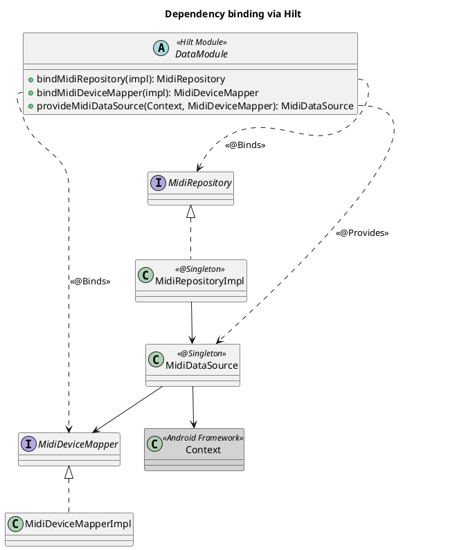
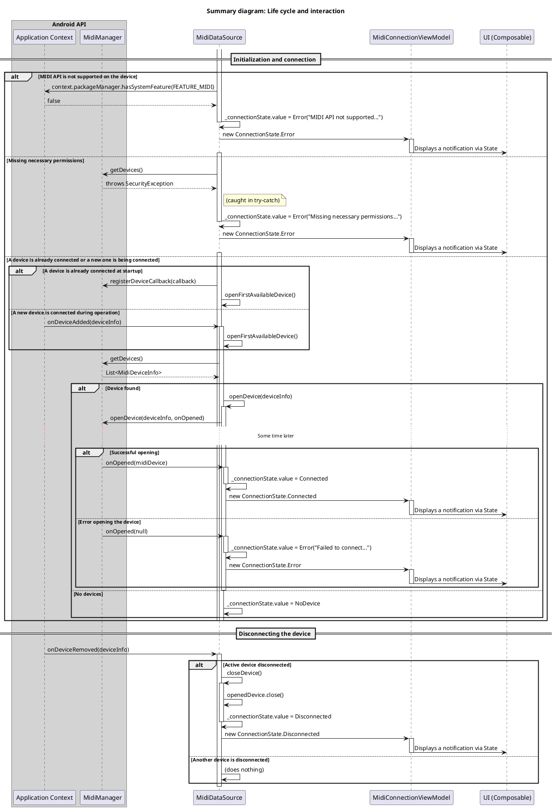

# Technical Specification: Implementation of MIDI Keyboard Connection State Tracking

## 1. General Information

### 1.1. Purpose of the enhancement

Implement functionality for automatically tracking the connection state of a MIDI keyboard to an Android device and informing the user about changes in this state.

### 1.2. Base documents

- [Architectural principles](../plans/ARCHITECTURE_PRINCIPLES.md)
- [Scenarios: Status tracking and notifications](../uc/MIDI_KEYBOARD_CONNECTION_STATE.md)

## 2. Architectural solution

### 2.1. Components

The tracking system will be built on the principles of a multi-layered architecture (Clean Architecture) and divided into the following components, grouped by layer:

**Domain Layer**
- **`MidiRepository`:** An abstraction over the data source that defines the contract for obtaining the connection state.
- **`MidiDevice`:** A domain model that represents information about a connected MIDI device.
- **`MidiDeviceMapper`:** An interface that defines the contract for converting MIDI API data models to the `MidiDevice` domain model.
- **`TrackMidiConnectionUseCase`:** Business logic that provides a `Flow<ConnectionState>` for the `Presentation Layer`.
- **`ShowConnectionNotificationUseCase`:** A component that is used to display notifications to the user.

**Data Layer**
- **`MidiDataSource`:** Encapsulates all work with the Android MIDI API (`MidiManager`), using `Context` to access system services. It tracks connections and disconnections, broadcasting them in a `Flow`.
- **`MidiDeviceMapperImpl`:** Implementation of the `MidiDeviceMapper` interface.

**Presentation Layer**
- **`MidiConnectionViewModel`:** A `ViewModel` that subscribes to the `Flow` from the `UseCase` and initiates the display of notifications.
- **`MainActivity`:** The main `Activity` of the application. It uses `setContent` to display the `Composable` hierarchy built on `Scaffold`, which manages the screen structure and contains a `SnackbarHost` for showing notifications.

```plantuml
@startuml
!include https://raw.githubusercontent.com/plantuml-stdlib/C4-PlantUML/master/C4_Component.puml

title C4 - Level 3: MIDI Tracking System Components

System_Ext(android_sdk, "Android SDK", "Context and system services (MidiManager)")

Container_Boundary(presentation, "Presentation Layer") {
    Component(vm, "MidiConnectionViewModel", "ViewModel", "Subscribes to changes and initiates notifications.")
    Component(activity, "MainActivity", "UI Host", "Displays Composable UI built on Scaffold.")
}

Container_Boundary(domain, "Domain Layer") {
    Component(track_uc, "TrackMidiConnectionUseCase", "Use Case", "Provides a state Flow.")
    Component(notify_uc, "ShowConnectionNotificationUseCase", "Use Case", "Displays notifications.")
    Component(repo, "MidiRepository", "Interface", "Contract for receiving data.")
    Component(mapper, "MidiDeviceMapper", "Interface", "Contract for converting DTOs.")
    Component(state, "ConnectionState", "Sealed Interface", "State model.")
    Component(device, "MidiDevice", "Data Class", "Device domain model.")
}

Container_Boundary(data, "Data Layer") {
    Component(repo_impl, "MidiRepositoryImpl", "Implementation", "Proxies data from the DataSource.")
    Component(ds, "MidiDataSource", "Data Source", "Works with the Android MIDI API using Context.")
    Component(mapper_impl, "MidiDeviceMapperImpl", "Implementation", "Converts a DTO to a domain model.")
}

' Connections
Rel(activity, vm, "Uses")
Rel(vm, track_uc, "Invokes")
Rel(vm, notify_uc, "Invokes")
Rel(track_uc, repo, "Depends on")
Rel(repo_impl, repo, "@Binds")
Rel(repo_impl, ds, "Depends on")
Rel(ds, mapper, "Depends on")
Rel(ds, android_sdk, "Uses", "MidiManager, Context")
Rel(mapper_impl, mapper, "@Binds")
Rel(track_uc, state, "Returns Flow<ConnectionState>")

Rel(state, device, "Contains")
Rel(mapper_impl, device, "Creates")

@enduml
```

### 2.2. API and Data Models

**Domain Layer:**

```kotlin
// com.astrizhachuk.pianoflow.domain.model.ConnectionState.kt
sealed interface ConnectionState {
    data class Connected(val device: MidiDevice) : ConnectionState
    data object Disconnected : ConnectionState
    data class Error(val message: String) : ConnectionState
    data object NoDevice : ConnectionState
}

// com.astrizhachuk.pianoflow.domain.model.MidiDevice.kt
data class MidiDevice(val id: Int, val name: String, val product: String, val manufacturer: String)

// com.astrizhachuk.pianoflow.domain.repository.MidiRepository.kt
interface MidiRepository {
    fun observeConnectionState(): Flow<ConnectionState>
}
```

### 2.3. Dependency Graph

To let Hilt know how to provide implementations for interfaces, `DataModule` is used.

```kotlin
// com.astrizhachuk.pianoflow.data.di.DataModule.kt

@Module
@InstallIn(SingletonComponent::class)
abstract class DataModule {

    @Binds
    abstract fun bindMidiRepository(impl: MidiRepositoryImpl): MidiRepository

    @Binds
    abstract fun bindMidiDeviceMapper(impl: MidiDeviceMapperImpl): MidiDeviceMapper

    companion object {
        @Provides
        @Singleton
        fun provideMidiDataSource(
            @ApplicationContext context: Context,
            midiDeviceMapper: MidiDeviceMapper
        ): MidiDataSource {
            return MidiDataSource(context, midiDeviceMapper)
        }
    }
}
```

- **`@Binds`** effectively tells Hilt which implementations to use for which interfaces (`MidiRepository` and `MidiDeviceMapper`).
- **`@Provides`** is used for `provideMidiDataSource` because logic is required to create this object.
- **`provideMidiDataSource`** creates a `MidiDataSource` by injecting the application context and `MidiDeviceMapper` into it. This component is the central point that encapsulates all the logic for working with the Android MIDI API.
- **`@Singleton`** ensures that only one instance will be created for each of these components.



## 3. Life cycle and interaction

### 3.1. Principle of operation

1. **Initialization and life cycle**:
    * `MidiDataSource` is injected as a **singleton** (`@Singleton`). When it is created, it first performs a **precondition check**:
        * It checks if the MIDI API is available on the device via `context.packageManager.hasSystemFeature(PackageManager.FEATURE_MIDI)`. If not, it immediately sends the state `ConnectionState.Error("MIDI API is not supported on this device.")` and stops further initialization.
        * All further interactions with `MidiManager` (getting a list of devices, registering a callback) are wrapped in a `try-catch` block to catch a `SecurityException`. If it occurs, the state `ConnectionState.Error("Missing necessary permissions to work with MIDI.")` is sent.
    * For its work, it uses the **application context** (`ApplicationContext`), not the `Activity` context. This ensures that MIDI device tracking continues in the background.
    * If the checks are successful, the `init` block of `MidiDataSource` immediately registers `MidiManager.DeviceCallback`.
    * Immediately after registration, `MidiDataSource` tries to connect to any already connected device.

2. **Detection and connection**:
    * **At startup**: `openFirstAvailableDevice()` requests a list of devices from `MidiManager`. If devices are found, it takes the first one and calls `openDevice()`.
    * **During operation**: When the user connects a new MIDI device, `DeviceCallback.onDeviceAdded()` is triggered. If there is no active connection at the moment, `onDeviceAdded` calls `openFirstAvailableDevice()`.

3. **Asynchronous connection opening**:
    * The `openDevice()` method calls `midiManager.openDevice()`, which works asynchronously.
    * A lambda function is passed as a callback, which will be executed when the opening attempt is completed.
    * **Success**: If the `MidiDevice` is successfully received (not `null`), it is saved in `openedDevice`, and `ConnectionState.Connected` is sent to `_connectionState`.
    * **Failure**: If the device could not be opened (`null`), `ConnectionState.Error("Failed to connect to device: ${deviceInfo.name}")` is sent to `_connectionState`, where `deviceInfo.name` is the name of the device that could not be opened.

4. **Disconnecting the device**:
    * When the user physically disconnects the MIDI device, `DeviceCallback.onDeviceRemoved()` is triggered.
    * If the `id` of the disconnected device matches the `id` of the current `openedDevice`, `closeDevice()` is called.
    * `closeDevice()` closes the connection (`openedDevice.close()`), resets the reference and sends the value `ConnectionState.Disconnected` to `_connectionState`.

5. **Consuming the state at the UI level**:
    * **`MidiConnectionViewModel`**, whose life cycle is tied to the `Activity`, receives a `Flow<ConnectionState>` from the `domain` layer and uses `ShowConnectionNotificationUseCase` to send messages to the `UserNotifier`.
    * **`MainActivity`** in `setContent` creates a `Scaffold` with a `SnackbarHostState`.
    * Inside the `Scaffold`, a `Composable` observer function is called, which uses `LaunchedEffect` to subscribe to the `Flow` of messages from `UserNotifier`.
    * When a new message arrives, it is displayed via `snackbarHostState.showSnackbar()`. This approach ensures that the subscription is active only when the UI is visible, and `MidiDataSource` continues to run in the background.

### 3.2. Summary interaction diagram

This diagram combines all the key scenarios: initialization, connection, disconnection, and error handling. It shows how `MidiDataSource` reacts to various events and changes its state, and how `MidiConnectionViewModel` initiates notifications that are then displayed in the Composable UI.



## 4. Acceptance criteria

- When a MIDI keyboard is connected, the system automatically connects to it.
- The user sees a notification about the successful connection with the device name.
- When the keyboard is disconnected, the user sees a corresponding notification.
- When launched on a device that does not support MIDI, the user sees the notification: "MIDI API is not supported on this device".
- If the application lacks the necessary permissions, the user sees the notification: "Missing necessary permissions to work with MIDI".
- If a failure occurs while opening a connection to a specific keyboard, the user sees the notification: "Failed to connect to device: [device name]".
- The tracking and notification logic works correctly when the `Activity` is restarted.

---