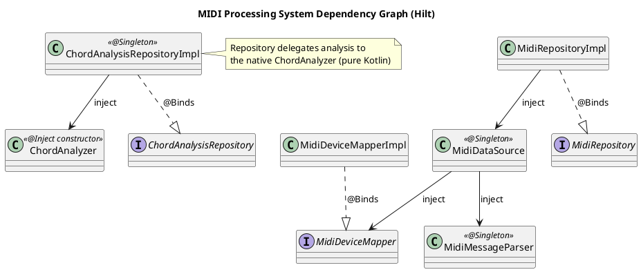
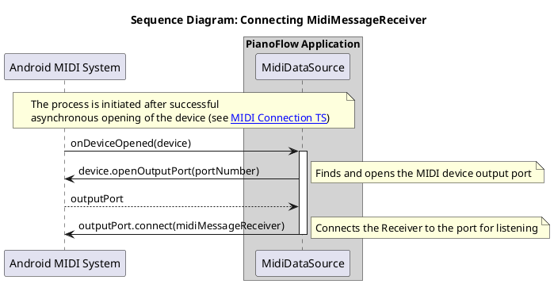
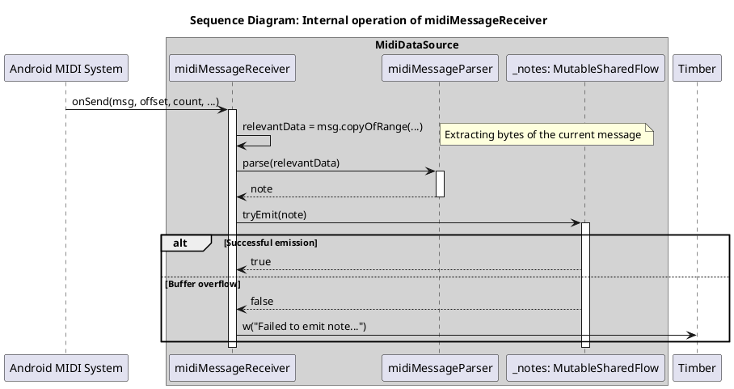
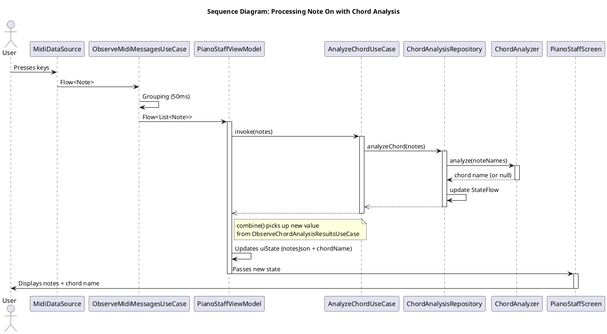
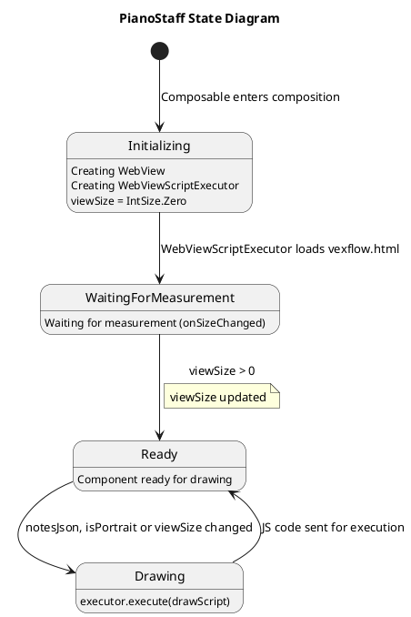
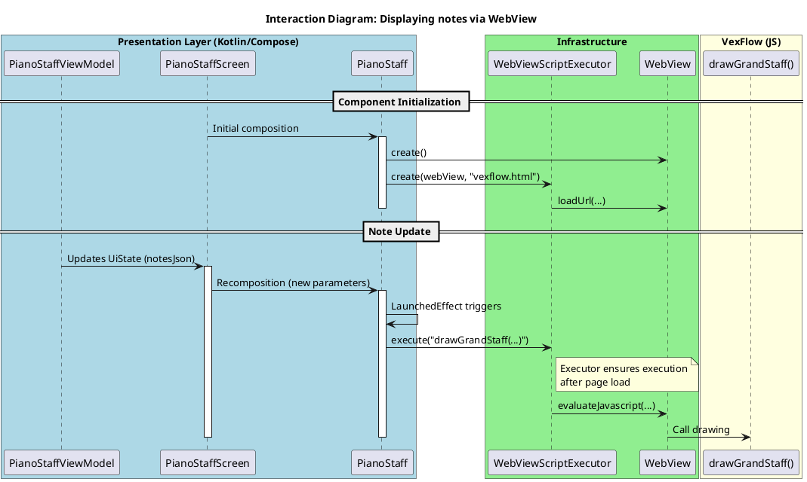

# Technical Specification: Implementation of MIDI Message Processing and Display

## 1. General Information

### 1.1. Purpose of the Enhancement

Implement functionality for receiving, processing, analyzing, and visualizing MIDI messages (notes) coming from a connected MIDI keyboard. Key tasks:
- Display notes and chords played by the user on a musical staff in real time.
- Analyze recognized chords and display their names (e.g., "C Major", "Am", "G7").
- Correctly handle single notes (do not display them as unrecognized chords).

### 1.2. Base Documents

- [Architectural Principles](../plans/ARCHITECTURE_PRINCIPLES.md)
- [Use Cases: Receiving and Displaying MIDI Messages](../uc/MIDI_MESSAGE_PROCESSING.md)
- [Technical Specification: Implementation of MIDI Keyboard Connection State Tracking](./MIDI_CONNECTION.md)

## 2. Architectural Solution

### 2.1. Architecture Diagrams

The MIDI message processing system is integrated into the existing architecture, extending the `Data` and `Domain` layers and adding new components to the `Presentation` layer. Chord analysis is performed by the built-in `ChordAnalyzer` engine in pure Kotlin (see [Native Kotlin Chord Analysis](./CHORD_ANALYSIS.md)).

**Data Layer**
- **`MidiDataSource`:** Extended to handle incoming MIDI messages. After successfully opening a device (`MidiManager.openDevice`), it connects a `MidiReceiver` to the device's **output port** (`MidiOutputPort`) to receive data.
- **`MidiMessageReceiver`:** Internal implementation of `android.media.midi.MidiReceiver`, responsible for receiving raw MIDI data (`byte[]`).
- **`MidiMessageParser`:** Component that receives raw data from `MidiMessageReceiver`, parses it, and converts it into the `Note` domain model. Ignores all messages except `Note On` (with velocity > 0).
- **`MidiRepositoryImpl`:** Repository implementation that provides a stream of incoming notes.
- **`ChordAnalysisRepositoryImpl`:** Chord analysis repository implementation. Delegates recognition to the `ChordAnalyzer` engine synchronously and updates `StateFlow<String?>` directly without thread hops.

**Domain Layer**
- **`Note`:** Domain model of a note (MIDI number and musical name, e.g. "C4").
- **`MidiRepository`:** Interface for obtaining the note stream.
- **`ObserveMidiMessagesUseCase`:** Groups individual notes into chords (lists) via `channelFlow` with a 50 ms delay.
- **`ChordAnalysisRepository`:** Interface with `analyzeChord()` and `chordAnalysisResult` members.
- **`AnalyzeChordUseCase`:** Use case for triggering asynchronous chord analysis (fire-and-forget).
- **`ObserveChordAnalysisResultsUseCase`:** Use case for subscribing to analysis results.
- **`ChordAnalyzer`:** Domain service for native chord detection and single-note simplification. Pure Kotlin, synchronous, main-safe. Internal structure and algorithm are described in the [Chord Analysis specification](./CHORD_ANALYSIS.md).

**Presentation Layer**
- **`PianoStaffViewModel`:** Manages UI state. Combines (`combine`) the note stream and analysis results. Initiates a new analysis when the note set changes.
- **`PianoStaffUiState`:** UI state:
  - `notesJson: String` — JSON representation of notes for visualization via VexFlow.
  - `chordName: String?` — name of the recognized chord, or the localized string "Not defined".
- **`PianoStaffScreen`:** Composable screen that displays played notes on the musical staff and the chord name.
- **`PianoStaff`:** Composable that hosts a `WebView` and renders the musical staff via the VexFlow JS library.
- **`VexflowNoteMapper`:** Converts a `List<Note>` into the JSON format expected by VexFlow.
- **`WebViewScriptExecutor`:** Generic executor that runs JavaScript inside a hidden `WebView`. Manages page-load timing and pending-script queueing. Used by `PianoStaff` for VexFlow rendering, but contains no music-specific logic.

#### 2.1.1. C4 Level 2: Containers

```plantuml
@startuml
!include https://raw.githubusercontent.com/plantuml-stdlib/C4-PlantUML/master/C4_Container.puml

title C4 - Level 2: PianoFlow Application Containers

Person(user, "User", "Musician playing the keyboard")
System_Ext(midi_device, "MIDI Keyboard", "External physical device")
System_Ext(vexflow, "VexFlow", "JavaScript notation library (vexflow.html)")

System_Boundary(piano_flow, "PianoFlow Application") {
    Container(ui, "UI (Compose)", "Kotlin, Jetpack Compose", "Displays staff and chord names")
    Container(vm, "ViewModel", "Kotlin", "Manages UI state and coordinates analysis")
    Container(observe_midi, "ObserveMidiMessagesUseCase", "Kotlin Flow", "Groups notes into chords")
    Container(analyze_chord, "AnalyzeChordUseCase", "Kotlin", "Initiates chord analysis")
    Container(observe_chord, "ObserveChordAnalysisResultsUseCase", "Kotlin Flow", "Provides analysis results")
    Container(midi_repo, "MidiRepository", "Kotlin", "Abstraction for MIDI data")
    Container(chord_repo, "ChordAnalysisRepository", "Kotlin", "Abstraction for chord analysis")
    Container(midi_repo_impl, "MidiRepositoryImpl", "Kotlin", "Implementation of MIDI repository")
    Container(chord_repo_impl, "ChordAnalysisRepositoryImpl", "Kotlin", "Implementation of chord analysis")
    Container(chord_analyzer, "ChordAnalyzer", "Pure Kotlin", "Native chord detection engine")
    Container(script_executor, "WebViewScriptExecutor", "Kotlin + WebView", "Generic JS executor; used by PianoStaff for VexFlow rendering")
}

Rel(user, midi_device, "Plays notes")
Rel(midi_device, midi_repo_impl, "Sends MIDI messages")
Rel(midi_repo_impl, midi_repo, "Implements")
Rel(chord_repo_impl, chord_repo, "Implements")
Rel(chord_repo_impl, chord_analyzer, "Delegates analyze()")

Rel(vm, observe_midi, "observeNotes()")
Rel(vm, analyze_chord, "analyzeChord()")
Rel(vm, observe_chord, "observeChordAnalysisResults()")

Rel(observe_midi, midi_repo, "observeNotes()")
Rel(analyze_chord, chord_repo, "analyzeChord()")
Rel(observe_chord, chord_repo, "observeChordAnalysisResults()")

Rel(midi_repo_impl, midi_repo, "@Binds")
Rel(chord_repo_impl, chord_repo, "@Binds")

Rel(vm, ui, "Updates UiState")
Rel(ui, script_executor, "PianoStaff calls execute(drawScript)")
Rel(script_executor, vexflow, "Loads vexflow.html, calls drawGrandStaff()")

@enduml
```

#### 2.1.2. C4 Level 3a: MIDI Subsystem Components

```plantuml
@startuml
!include https://raw.githubusercontent.com/plantuml-stdlib/C4-PlantUML/master/C4_Component.puml

title C4 - Level 3a: MIDI Subsystem Components

System_Ext(midi_device, "MIDI Keyboard", "Physical device")
System_Ext(android_sdk, "Android SDK", "MidiReceiver, MidiOutputPort")

Container_Boundary(presentation, "Presentation Layer") {
    Component(vm, "PianoStaffViewModel", "ViewModel", "Updates notesJson")
}

Container_Boundary(domain, "Domain Layer") {
    Component(observe_midi_uc, "ObserveMidiMessagesUseCase", "Use Case", "Groups notes into chords")
    Component(midi_repo, "MidiRepository", "Interface", "Contract for MIDI data")
    Component(note, "Note", "Model", "Domain model of a note")
}

Container_Boundary(data, "Data Layer") {
    Component(midi_repo_impl, "MidiRepositoryImpl", "Repository Impl", "Manages note flow")
    Component(ds, "MidiDataSource", "Data Source", "Converts MIDI to notes")
    Component(parser, "MidiMessageParser", "Parser", "Parses raw MIDI data")
    Component(receiver, "MidiMessageReceiver", "Receiver", "android.media.midi.MidiReceiver")
}

' Presentation-Domain Connections
Rel(vm, observe_midi_uc, "observeNotes()")

' Domain-Domain Connections
Rel(observe_midi_uc, midi_repo, "observeNotes()")
Rel(observe_midi_uc, note, "Flow<List<Note>>")

' Bindings
Rel(midi_repo_impl, midi_repo, "@Binds")

' Data Layer Connections
Rel(midi_repo_impl, ds, "Uses")
Rel(ds, parser, "Uses")
Rel(ds, receiver, "Creates")
Rel(parser, note, "Creates")
Rel(receiver, android_sdk, "Implements")

' External Systems
Rel(midi_device, ds, "Sends MIDI messages")

@enduml
```

#### 2.1.3. C4 Level 3b: Chord Analysis Subsystem Components

```plantuml
@startuml
!include https://raw.githubusercontent.com/plantuml-stdlib/C4-PlantUML/master/C4_Component.puml

title C4 - Level 3b: Chord Analysis Subsystem Components

Container_Boundary(presentation, "Presentation Layer") {
    Component(vm, "PianoStaffViewModel", "ViewModel", "Invokes analysis and receives results")
}

Container_Boundary(domain, "Domain Layer") {
    Component(analyze_chord_uc, "AnalyzeChordUseCase", "Use Case", "Fire-and-forget analysis")
    Component(observe_chord_uc, "ObserveChordAnalysisResultsUseCase", "Use Case", "Subscription to results")
    Component(chord_repo, "ChordAnalysisRepository", "Interface", "Chord analysis contract")
    Component(chord_analyzer, "ChordAnalyzer", "Domain Service", "Native engine: analyze(noteNames)")
}

Container_Boundary(data, "Data Layer") {
    Component(chord_repo_impl, "ChordAnalysisRepositoryImpl", "Repository Impl", "Owns StateFlow, delegates to ChordAnalyzer")
}

' Presentation-Domain Connections
Rel(vm, analyze_chord_uc, "analyzeChord()")
Rel(vm, observe_chord_uc, "observeChordAnalysisResults()")

' Use Cases-Repository Connections
Rel(analyze_chord_uc, chord_repo, "analyzeChord()")
Rel(observe_chord_uc, chord_repo, "observeChordAnalysisResults()")

' Bindings
Rel(chord_repo_impl, chord_repo, "@Binds")

' Data Layer Connections
Rel(chord_repo_impl, chord_analyzer, "Uses")

@enduml
```

> Internal structure of `ChordAnalyzer` (parser, chord type registry, models `Pitch` and `ChordType`) is documented in [Native Kotlin Chord Analysis](./CHORD_ANALYSIS.md).

#### 2.1.4. C4 Level 3c: Note Rendering Pipeline

```plantuml
@startuml
!include https://raw.githubusercontent.com/plantuml-stdlib/C4-PlantUML/master/C4_Component.puml

title C4 - Level 3c: Note Rendering Pipeline

System_Ext(android_sdk, "Android SDK", "WebView, WebViewClient")
System_Ext(vexflow, "VexFlow", "JavaScript library (vexflow.html)")

Container_Boundary(presentation, "Presentation Layer") {
    Component(vm, "PianoStaffViewModel", "ViewModel", "Provides notesJson via UiState")
    Component(screen, "PianoStaffScreen", "Composable", "Hosts PianoStaff and chord name")
    Component(staff, "PianoStaff", "Composable", "Wraps WebView, drives redraw on state change")
    Component(mapper, "VexflowNoteMapper", "Mapper", "Converts List<Note> to VexFlow JSON")
    Component(executor, "WebViewScriptExecutor", "Infrastructure", "Manages WebView lifecycle and JS queue")
}

' Presentation flow
Rel(vm, mapper, "Builds notesJson")
Rel(vm, screen, "uiState (notesJson, chordName)")
Rel(screen, staff, "Passes notes and rendering parameters")
Rel(staff, executor, "execute(drawScript)")

' Infrastructure
Rel(executor, android_sdk, "evaluateJavascript()")
Rel(android_sdk, vexflow, "Loads vexflow.html, calls drawGrandStaff()")

@enduml
```

### 2.2. API and Data Models

This section presents the software interfaces and data models distributed across the architecture layers.

**Domain Layer:**

```kotlin
// com.astrizhachuk.pianoflow.domain.model.Note.kt
/**
 * Domain model of a note.
 */
data class Note(
    val pitch: Int,   // MIDI note number (0-127)
    val name: String  // Musical note name (e.g., "C4")
)

// com.astrizhachuk.pianoflow.domain.repository.MidiRepository.kt
/**
 * Repository interface for MIDI operations.
 */
interface MidiRepository {
    fun observeConnectionState(): Flow<ConnectionState>
    fun observeNotes(): Flow<Note>
}

// com.astrizhachuk.pianoflow.domain.repository.ChordAnalysisRepository.kt
/**
 * Repository interface for chord analysis.
 */
interface ChordAnalysisRepository {
    val chordAnalysisResult: StateFlow<String?>
    fun analyzeChord(notes: List<Note>)
}

// com.astrizhachuk.pianoflow.domain.service.analysis.ChordAnalyzer.kt
/**
 * Domain service for native chord and single-note analysis.
 * Synchronous, main-safe, pure Kotlin.
 */
class ChordAnalyzer {
    fun analyze(noteNames: List<String>): String?
}
```

**Data Layer:**

```kotlin
// com.astrizhachuk.pianoflow.data.datasource.midi.MidiMessageParser.kt
/**
 * Parser for raw MIDI messages.
 */
class MidiMessageParser {
    fun parse(data: ByteArray): Note?
}
```

**Presentation Layer:**

```kotlin
// com.astrizhachuk.pianoflow.presentation.model.pianostaff.PianoStaffUiState.kt
/**
 * UI state for the screen with the musical staff.
 */
data class PianoStaffUiState(
    val notesJson: String = "{\"treble\":[], \"bass\":[]}",
    val chordName: String? = null
)

// com.astrizhachuk.pianoflow.presentation.ui.pianostaff.WebViewScriptExecutor.kt
/**
 * Executes JavaScript inside a hidden WebView; used by PianoStaff for VexFlow rendering.
 */
class WebViewScriptExecutor(webView: WebView, pageUrl: String) {
    fun execute(script: String, onResult: (String?) -> Unit)
}
```

### 2.3. Dependency Graph

The system uses Hilt for dependency management.



## 3. Lifecycle and Interaction

### 3.1. Principle of Operation

1. **Connecting the Receiver**:
   * After `MidiDataSource` successfully opens a connection to a MIDI device, it finds the first available **output port** (`MidiOutputPort`) of the device.
   * `MidiDataSource` calls `outputPort.connect(midiMessageReceiver)` to start receiving MIDI data.



2. **Receiving and Parsing Messages**:
   * When the user presses a key, the MIDI keyboard sends a message. `MidiMessageReceiver.onSend()` is called with the raw data (`byte[]`).
   * `MidiMessageReceiver` immediately passes this data to `MidiMessageParser`.
   * `MidiMessageParser` analyzes the bytes. If it is `Note On`, it extracts the note number and creates a `Note` object (including its musical name via `pitchToName`), which it passes back to `MidiDataSource`.
   * `MidiDataSource` sends the received `Note` to a `SharedFlow`.



3. **Grouping and Transmitting Notes**:

   * `MidiRepositoryImpl` proxies `Flow<Note>` from `MidiDataSource` via `observeNotes()`.
   * `ObserveMidiMessagesUseCase` subscribes to this stream. It uses `Kotlin Flow` operators (inside `channelFlow` with `launch` and `delay`) to group notes arriving within a short period (`50 ms`) into a single `List<Note>` (a chord). Each new `Note` resets the timer, allowing for chords played not perfectly simultaneously (arpeggiato) to be captured.
4. **Chord Analysis**:

   * `PianoStaffViewModel` observes `ObserveMidiMessagesUseCase`. When a new list of notes arrives:
     1. Initiates analysis via `AnalyzeChordUseCase(notes)`. This is a fire-and-forget operation.
     2. `AnalyzeChordUseCase` calls `ChordAnalysisRepository.analyzeChord(notes)`.
     3. The repository deduplicates and sorts note names, then **synchronously** invokes `ChordAnalyzer.analyze(noteNames)`.
     4. The result is written directly into the repository's `StateFlow<String?>` (no thread hop, no callbacks).
   * In parallel, `PianoStaffViewModel` combines (`combine`) the note stream and the analysis result stream from `ObserveChordAnalysisResultsUseCase`.
   * See [Native Kotlin Chord Analysis](./CHORD_ANALYSIS.md) for the algorithm and the chord type registry.
5. **UI Display**:

   * The combination result forms `PianoStaffUiState`.
   * If a chord is recognized, `chordName` contains the name. If notes are present but analysis is empty — "Not defined" is displayed.
   * `PianoStaffScreen` receives `uiState` and passes `notesJson` to the `PianoStaff` component.



### 3.2. Note Display Mechanism

The musical staff is drawn using a `WebView` and the [VexFlow](https://www.vexflow.com/) JavaScript library. This approach separates the drawing logic from the native code, leveraging the powerful capabilities of web technologies for musical notation visualization.

**Key Components:**

- **`PianoStaff` Composable:** Wraps an `AndroidView` where a `WebView` is created and configured. This component manages the `WebView` lifecycle and redraws.
- **`WebViewScriptExecutor`:** Used inside the component to manage JS execution and HTML resource loading.
- **`VexflowNoteMapper.kt`**: Contains logic for converting `List<Note>` into the final JSON object.
- **`vexflow.html`:** HTML file in `assets` containing logic for calling `VexFlow` functions (version [4.2.2](https://cdn.jsdelivr.net/npm/vexflow@4.2.2/build/cjs/vexflow.js), also located in `assets`).

**Workflow:**

1. **Initialization**: `PianoStaff` creates a `WebView` instance and initializes `WebViewScriptExecutor`, which loads `vexflow.html`.
2. **Size Tracking**: The `onSizeChanged` modifier updates the `viewSize` state. This is necessary for VexFlow to know the available drawing area.
3. **Drawing Trigger**: `LaunchedEffect` monitors changes to `notesJson`, `isPortrait` (orientation parameter), and `viewSize`.
4. **Drawing Execution**: When `viewSize` becomes non-zero, a JavaScript call to `drawGrandStaff` is formed. The call is passed to `WebViewScriptExecutor`, which executes it in the `WebView` context.
5. **JSON Format**: Data is passed as a single JSON object containing separate arrays for treble and bass clefs.
   ```json
   {
     "treble": [{"keys":["c/5"], "duration":"w"}, {"keys":["g/4"], "duration":"w", "ghost":true}],
     "bass": [{"keys":["c/4"], "duration":"w"}, {"keys":["e/3", "g/3"], "duration":"w"}]
   }
   ```

**`PianoStaff` Lifecycle State Diagram**



**Interaction Diagram**



## 4. Acceptance Criteria

### Note Display

- When a single key is pressed on the MIDI keyboard, the corresponding note is immediately displayed on the musical staff.
- When multiple keys are pressed simultaneously (a chord), all corresponding notes are displayed on the musical staff.
- Each new press event (`Note On`) results in a complete screen clear before displaying new notes.
- The system only reacts to key press messages (`Note On`); release messages (`Note Off`) and other types of MIDI messages are ignored.
- Note visualization on screen occurs without visible delays after pressing a key.
- The functionality works stably with rapid and repeated key presses; the application does not crash or freeze.
- When the screen is rotated, the musical staff is correctly redrawn considering the new orientation.

### Chord Analysis and Display

- For each recognized chord (2+ notes), its name is displayed on screen (e.g., "C Major", "Am", "G7sus4").
- For single notes, NO chord name is displayed (the field remains empty).
- If multiple notes do not form a known chord, the text "Not defined" is displayed (or according to localization).
- Chord analysis is synchronous, sub-millisecond, and main-safe; no UI-thread blocking is observable.
- Analysis results are updated in `StateFlow` and are safe for concurrent access from different threads.
- The system uses a native Kotlin chord detection engine (see [Native Kotlin Chord Analysis](./CHORD_ANALYSIS.md)), ensuring accurate recognition of standard musical chords.

## See Also

- [Document on Kotlin Flow](../tech/KOTLIN_FLOW.md)
- [Document on MIDI API in Android](../tech/MIDI.md)
