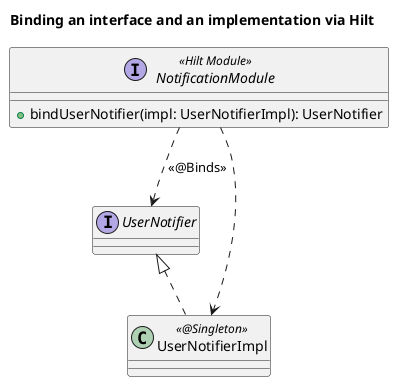
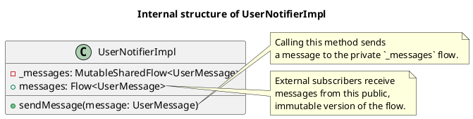
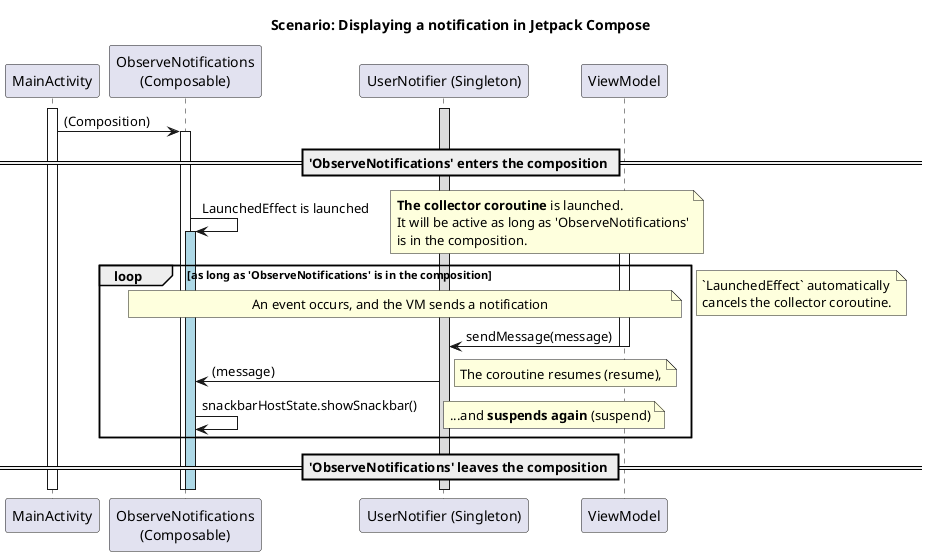
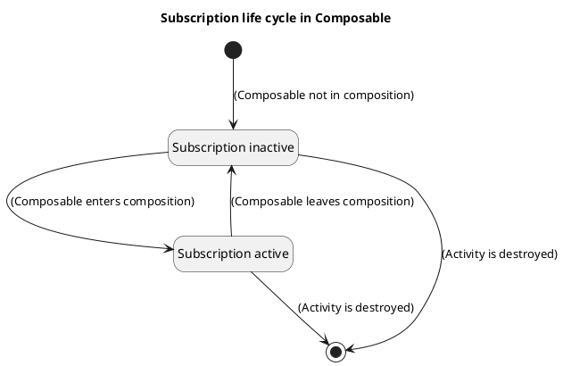

# Technical task: Implementation of a user notification mechanism

## 1. General information

### 1.1. Purpose of the development

Implement a universal, reusable component for asynchronously sending and displaying notifications to the user using Jetpack Compose.

### 1.2. Basic documents

- [Architectural principles](../plans/ARCHITECTURE_PRINCIPLES.md)
- [Scenarios: Status tracking and notifications](../uc/MIDI_KEYBOARD_CONNECTION_STATE.md)
- [Technical task: Tracking the connection of a USB MIDI keyboard](./MIDI_CONNECTION.md)

## 2. Architectural solution

### 2.1. Components

To notify the user in the application, a mechanism is introduced consisting of the following components in the `Presentation Layer`:

*   `UserNotifier` (interface) and `UserNotifierImpl` (implementation): Provide asynchronous transmission of UI events from the `ViewModel` to the UI layer according to the "publisher-subscriber" principle.
*   `UserMessage`: Data model for the message displayed to the user.
*   `NotificationModule`: Hilt-module that provides the `UserNotifier` dependency.
*   **`MainActivity`**: Acts as a host for `Composable` components, contains a `Scaffold` with a `SnackbarHost`.
*   **`ObserveNotifications`**: `Composable`-observer function that subscribes to `UserNotifier` and shows a `Snackbar`.

This mechanism allows the `ViewModel` to send messages without having a direct link to the UI, which corresponds to the principles of clean architecture.

```plantuml
@startuml
!include https://raw.githubusercontent.com/plantuml-stdlib/C4-PlantUML/master/C4_Component.puml

title C4 - Level 3: Notification mechanism components (Compose)

Container_Boundary(presentation, "Presentation Layer") {
    Component(vm, "MidiConnectionViewModel", "ViewModel", "Forms and sends a message.")
    Component(observer, "ObserveNotifications", "Composable", "Subscribes to UserNotifier and shows a Snackbar.")

    Component(notifier, "UserNotifier", "Interface", "Contract for sending and receiving notifications.")
    Component(impl, "UserNotifierImpl", "Singleton", "Implementation of an event bus on SharedFlow.")
    Component(message, "UserMessage", "Data Class", "Data model for the UI.")
    Component(di, "NotificationModule", "Hilt Module", "Provides the UserNotifier dependency.")

    Rel(impl, notifier, "Implements")
    Rel(di, notifier, "@Binds")

    Rel(vm, notifier, "Uses for sending")
    Rel(observer, notifier, "Uses for subscribing")
    
    Rel(vm, message, "Creates")
    Rel(notifier, message, "Transmits")
}
@enduml
```

### 2.2. API

```kotlin
// Model for a message to the user
data class UserMessage(val text: String)

// Interface for sending and receiving messages
interface UserNotifier {
    val messages: Flow<UserMessage>
    fun sendMessage(message: UserMessage)
}
```

### 2.3. Dependency injection

To let Hilt know that when requesting the `UserNotifier` interface, you need to provide an instance of the `UserNotifierImpl` class, `NotificationModule` is used.

```kotlin
// File: di/NotificationModule.kt
@Module
@InstallIn(SingletonComponent::class)
interface NotificationModule {

    @Binds
    fun bindUserNotifier(impl: UserNotifierImpl): UserNotifier
}

// File: service/UserNotifierImpl.kt
@Singleton
class UserNotifierImpl @Inject constructor() : UserNotifier {
    // ... implementation ...
}
```

*   `@Singleton` on the `UserNotifierImpl` class tells Hilt that this class should have one instance for the entire application.
*   `@Binds` in `NotificationModule` links the `UserNotifier` request to its implementation. Hilt automatically applies the `@Singleton` scope from the implementation to this binding.



### 2.4. Implementation of UserNotifierImpl

The `UserNotifierImpl` class uses `MutableSharedFlow` to create an event bus. The flow is configured with the following parameters:

*   `replay = 0`: New subscribers do not receive previous messages.
*   `extraBufferCapacity = 1`: Stores one message if the subscriber does not have time to process it.
*   `onBufferOverflow = BufferOverflow.DROP_OLDEST`: Discards the oldest message when the buffer overflows.



## 3. Life cycle and interaction of components

### 3.1. Principle of operation

The interaction is built on the "publisher-subscriber" principle within the Jetpack Compose architecture:

1.  **Publisher** (for example, `MidiConnectionViewModel`) based on its internal logic decides that it is necessary to notify the user.
2.  It creates a `UserMessage` object and sends it to `UserNotifier`.
3.  **Subscriber** (`ObserveNotifications`) is a `Composable` function located inside a `Scaffold`.
4.  Using `LaunchedEffect`, the subscriber creates a long-lived coroutine that subscribes to the `Flow` of messages from `UserNotifier`.
5.  As soon as the publisher sends a new message, `LaunchedEffect` receives it and calls `snackbarHostState.showSnackbar()` to display it.

### 3.2. Sequence of events

The diagram below illustrates a scenario using `LaunchedEffect`.



### 3.3. Life cycle management

*   **Publisher (`MidiConnectionViewModel`)**: Its life cycle is tied to the navigation graph or `Activity`. It can send messages to `UserNotifier` at any time as long as it exists.
*   **Event bus (`UserNotifier`)**: Is a singleton (`@Singleton`), so it lives for the entire life cycle of the application.
*   **Subscriber (`ObserveNotifications`)**: The subscription life cycle is now fully managed by Jetpack Compose:
    *   **Subscription is created**: when `ObserveNotifications` is first added to the composition (appears on the screen), `LaunchedEffect` launches a coroutine that subscribes to the `Flow` of messages.
    *   **Subscription is canceled**: when `ObserveNotifications` is removed from the composition (for example, when switching to another screen or closing the `Activity`), `LaunchedEffect` automatically cancels the coroutine, safely ending the subscription.

The state diagram below illustrates the life cycle of a subscription in `Composable`.



Thus, we have a guarantee that the UI is updated only when it is visible to the user, while all the logic is encapsulated inside `Composable` components, which corresponds to modern practices.

## 4. Acceptance criteria

- When a MIDI keyboard is connected, a notification (Snackbar) appears on the screen with a message containing its name.
- When the MIDI keyboard is disconnected, a notification (Snackbar) appears on the screen with the message "MIDI keyboard disconnected".

## See also

- [See the document on Kotlin Flow](../tech/KOTLIN_FLOW.md)
- [See the document on the MIDI API in Android](../tech/MIDI.md)
