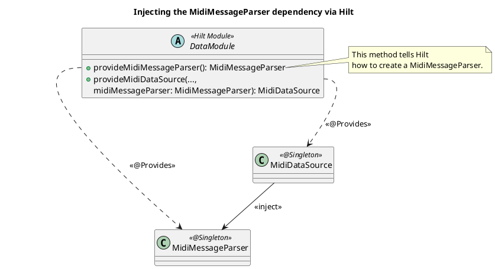
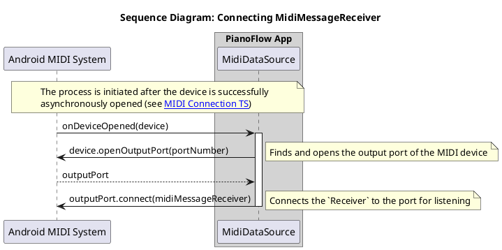
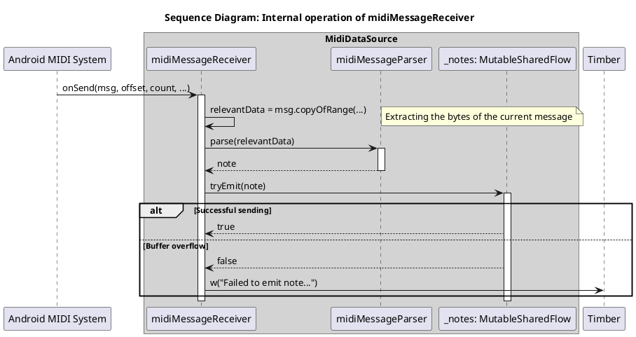
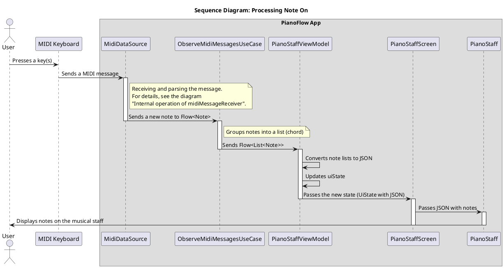
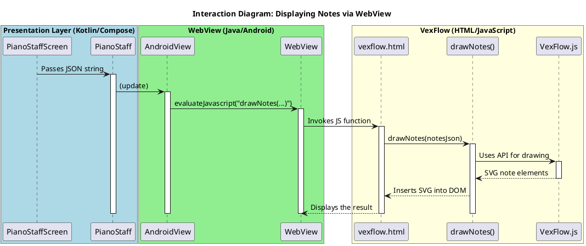

# Technical Specification: Implementation of MIDI Message Processing and Display

## 1. General Information

### 1.1. Purpose of the Enhancement

Implement functionality for receiving, processing, and visualizing MIDI messages (notes) coming from a connected MIDI keyboard. The main task is to display the notes and chords played by the user on a musical staff in real time.

### 1.2. Base Documents

- [Architectural Principles](../plans/ARCHITECTURE_PRINCIPLES.md)
- [Scenarios: Receiving and Displaying MIDI Messages](../uc/MIDI_MESSAGE_PROCESSING.md)
- [Technical Specification: Implementation of MIDI Keyboard Connection State Tracking](./MIDI_CONNECTION.md)

## 2. Architectural Solution

### 2.1. Components

The MIDI message processing system is integrated into the existing architecture, extending the functionality of the `Data` and `Domain` layers and adding new components to the `Presentation` layer.

**Data Layer**
- **`MidiDataSource`:** Extended to handle incoming MIDI messages. After successfully opening a device (`MidiManager.openDevice`), it connects a `MidiReceiver` to the device's **output port** (`MidiOutputPort`) to receive data.
- **`MidiMessageReceiver`:** An internal implementation of `android.media.midi.MidiReceiver` responsible for receiving raw MIDI data (`byte[]`).
- **`MidiMessageParser`:** A component that receives raw data from `MidiMessageReceiver`, parses it, and converts it into the `Note` domain model. It ignores all messages except `Note On`.
- **`MidiRepositoryImpl`:** An implementation of the repository that provides a stream of incoming notes.

**Domain Layer**
- **`Note`:** A domain model representing a single note (pitch).
- **`MidiRepository`:** The interface is supplemented with a method for observing incoming notes (`Flow<Note>`).
- **`ObserveMidiMessagesUseCase`:** A `Use Case` that receives a stream of single notes and converts it into a `Flow<List<Note>>`, grouping rapid successive presses into a single chord.

**Presentation Layer**
- **`PianoStaffViewModel`:** A new `ViewModel` for the screen with the musical staff. It receives a `Flow` of notes from `ObserveMidiMessagesUseCase` and converts it into a state for the UI.
- **`PianoStaffScreen`:** A `Composable` screen that displays the played notes on the musical staff.
- **`MainActivity`**: The main `Activity` of the application. It uses `setContent` to display the `Composable` hierarchy built on `Scaffold`, which manages the screen structure and contains a `SnackbarHost` for showing notifications.

```plantuml
@startuml
!include https://raw.githubusercontent.com/plantuml-stdlib/C4-PlantUML/master/C4_Component.puml

title C4 - Level 3: MIDI Message Processing System Components

System_Ext(midi_device, "MIDI Keyboard", "Physical device")
System_Ext(android_sdk, "Android SDK", "MidiReceiver, MidiOutputPort")

Container_Boundary(presentation, "Presentation Layer") {
    Component(activity, "MainActivity", "Activity", "Displays Composable UI using Scaffold.")
    Component(vm, "PianoStaffViewModel", "ViewModel", "Manages UI state by receiving notes and forming PianoStaffUiState.")
    Component(screen, "PianoStaffScreen", "Composable", "A screen that displays a musical staff, receiving state from the ViewModel.")
    Component(staff, "PianoStaff", "Composable", "A component for directly drawing the musical staff.")
}

Container_Boundary(domain, "Domain Layer") {
    Component(observe_uc, "ObserveMidiMessagesUseCase", "Use Case", "Groups notes into chords.")
    Component(repo, "MidiRepository", "Interface", "A contract for receiving MIDI data.")
    Component(note, "Note", "Data Class", "The domain model of a note.")
}

Container_Boundary(data, "Data Layer") {
    Component(repo_impl, "MidiRepositoryImpl", "Implementation", "Repository implementation.")
    Component(ds, "MidiDataSource", "Data Source", "Receives messages via MidiReceiver.")
    Component(parser, "MidiMessageParser", "Parser", "Parses raw MIDI messages.")
    Component(receiver, "MidiMessageReceiver", "Receiver", "Implementation of android.media.midi.MidiReceiver.")
}

' Connections
Rel(activity, screen, "Displays")
Rel(screen, staff, "Uses")
Rel(screen, vm, "Observes", "PianoStaffUiState")
Rel(vm, observe_uc, "Invokes")
Rel(observe_uc, repo, "Invokes observeNotes()")

Rel(repo_impl, repo, "@Binds")
Rel(repo_impl, ds, "Depends on")

Rel(ds, parser, "Uses")
Rel(ds, receiver, "Creates and connects")
Rel(receiver, android_sdk, "Implements")
Rel(receiver, parser, "Transfers data to")

Rel(midi_device, ds, "Sends MIDI messages", "USB/Bluetooth")

Rel(observe_uc, note, "Returns Flow<List<Note>>")
Rel(parser, note, "Creates")

@enduml
```

### 2.2. API and Data Models

**Domain Layer:**

```kotlin
// com.astrizhachuk.pianoflow.domain.model.Note.kt
data class Note(
    val pitch: Int // MIDI note number (0-127)
)

// com.astrizhachuk.pianoflow.domain.repository.MidiRepository.kt
interface MidiRepository {
    fun observeConnectionState(): Flow<ConnectionState>
    fun observeNotes(): Flow<Note> // Returns a stream of single notes
}
```

**Presentation Layer:**

```kotlin
// com.astrizhachuk.pianoflow.presentation.model.pianostaff.PianoStaffUiState.kt
data class PianoStaffUiState(
    val notesJson: String = "[]"
)

// com.astrizhachuk.pianoflow.presentation.viewmodel.pianostaff.PianoStaffViewModel.kt
@HiltViewModel
class PianoStaffViewModel @Inject constructor(
    observeMidiMessagesUseCase: ObserveMidiMessagesUseCase
) : ViewModel() {

    private val _uiState = MutableStateFlow(PianoStaffUiState())
    val uiState: StateFlow<PianoStaffUiState> = _uiState.asStateFlow()
}
```

**PianoStaffScreen** is a `Composable` function that gets a `PianoStaffViewModel` via Hilt, subscribes to `uiState` changes, and passes data to `PianoStaff` for drawing.

```kotlin
// com.astrizhachuk.pianoflow.presentation.ui.pianostaff.PianoStaffScreen.kt
@Composable
fun PianoStaffScreen(
    modifier: Modifier = Modifier,
    viewModel: PianoStaffViewModel = hiltViewModel()
) {
    val uiState by viewModel.uiState.collectAsStateWithLifecycle()

    Box(
        modifier = modifier
            .fillMaxSize()
            .padding(horizontal = 32.dp, vertical = 32.dp),
        contentAlignment = Alignment.Center
    ) {
        PianoStaff(
            notesJson = uiState.notesJson
        )
    }
}
```

### 2.3. Extension of Dependencies

`MidiMessageParser` has been added to the Hilt dependency graph and injected into `MidiDataSource`.

```kotlin
// com.astrizhachuk.pianoflow.data.di.DataModule.kt
// ...
companion object {
    @Provides
    @Singleton
    fun provideMidiDataSource(
        @ApplicationContext context: Context,
        midiDeviceMapper: MidiDeviceMapper,
        midiMessageParser: MidiMessageParser // Dependency added
    ): MidiDataSource {
        return MidiDataSource(context, midiDeviceMapper, midiMessageParser)
    }

    @Provides
    @Singleton
    fun provideMidiMessageParser(): MidiMessageParser {
        return MidiMessageParser()
    }
}
```



## 3. Lifecycle and Interaction

### 3.1. Principle of Operation

1.  **Connecting the `Receiver`**:
    *   After `MidiDataSource` successfully opens a connection to a MIDI device, it finds the first available **output port** (`MidiOutputPort`) of the device.
    *   `MidiDataSource` calls `outputPort.connect(midiMessageReceiver)` to start receiving MIDI data.



2.  **Receiving and Parsing Messages**:
    *   When the user presses a key, the MIDI keyboard sends a message. `MidiMessageReceiver.onSend()` is called with the raw data (`byte[]`).
    *   `MidiMessageReceiver` immediately passes this data to `MidiMessageParser`.
    *   `MidiMessageParser` analyzes the bytes. If it is `Note On`, it extracts the note number and creates a `Note` object, which it passes back to `MidiDataSource`.
    *   `MidiDataSource` sends the received `Note` to a `SharedFlow`.



3.  **Grouping and Transmitting Notes**:
    *   `MidiRepositoryImpl` proxies the `Flow<Note>` from `MidiDataSource` via `observeNotes()`.
    *   `ObserveMidiMessagesUseCase` subscribes to this stream. It uses `Kotlin Flow` operators (e.g., `channelFlow` with `delay`) to group notes that arrive within a short period of time (`50 ms`) into a single list `List<Note>` (a chord).

4.  **Displaying on the UI**:
    *   `PianoStaffViewModel` subscribes to the `Flow<List<Note>>` from `ObserveMidiMessagesUseCase`.
    *   `PianoStaffViewModel` converts the list of notes into a JSON string using `toVexflowJson()` and updates its `StateFlow<PianoStaffUiState>`, which contains the `notesJson` JSON string.
    *   `PianoStaffScreen`, which is subscribed to `uiState`, receives this JSON string and passes it to the `PianoStaff` `Composable` component for final drawing.



### 3.2. Note Display Mechanism

The musical staff is drawn using a `WebView` and the [VexFlow](https://www.vexflow.com/) JavaScript library. This approach allows separating the drawing logic from the native code, using the powerful capabilities of web technologies for visualizing musical notation.

**Key Components:**

- **`PianoStaff` Composable:** Wraps an `AndroidView` in which a `WebView` is created and configured.
- **`vexflow.html`:** An HTML file located in `app/src/main/assets/`. It contains the basic markup, styles, and the main JavaScript code for working with VexFlow.
- **`vexflow.js`:** The VexFlow library itself (version [4.2.2](https://cdn.jsdelivr.net/npm/vexflow@4.2.2/build/cjs/vexflow.js)), also located in `assets`.

**Process:**

1.  **`WebView` Initialization:** When the `PianoStaff` `Composable` is created, `AndroidView` initializes the `WebView` and loads the local HTML file `file:///android_asset/vexflow.html`.
2.  **Data Transfer:** Each time the `uiState` is updated in `PianoStaffScreen`, the `update` block of `AndroidView` is called.
3.  **JavaScript Invocation:** Inside `update`, the JavaScript function `drawNotes` is called in the `WebView` using the `evaluateJavascript` method.
4.  **Drawing in `WebView`:** The `notesJson` JSON string is passed as an argument to `drawNotes`. The JavaScript code in `vexflow.html` parses this string and uses the VexFlow API to draw notes on an SVG canvas inside the `WebView`.

**Interaction Diagram**



## 4. Acceptance Criteria

- When a single key is pressed on the MIDI keyboard, the corresponding note is immediately displayed on the musical staff.
- When multiple keys are pressed simultaneously (a chord), all corresponding notes are displayed on the musical staff.
- Each new press event (`Note On`) causes the screen to be completely cleared before displaying the new notes.
- The system only reacts to key press messages (`Note On`); release messages (`Note Off`) and other types of MIDI messages are ignored.
- The visualization of notes on the screen occurs without visible delays after pressing a key.
- The functionality works stably with rapid and repeated key presses, the application does not crash or freeze.

## See Also

- [See the document on Kotlin Flow](../tech/KOTLIN_FLOW.md)
- [See the document on the MIDI API in Android](../tech/MIDI.md)
