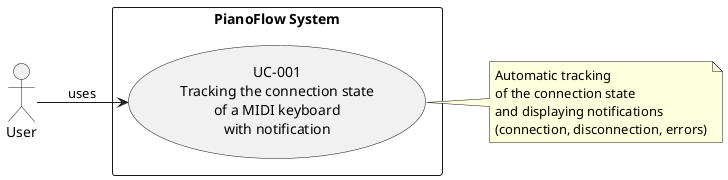
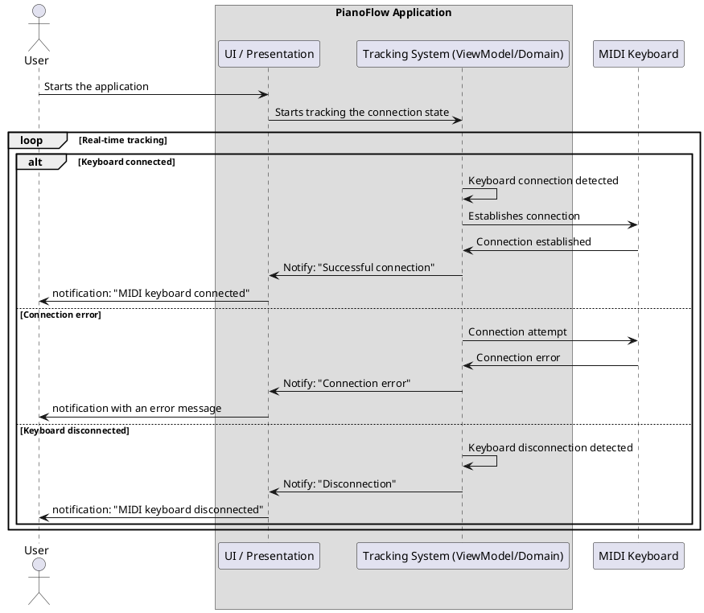

# Scenarios for tracking the connection state of a MIDI keyboard

## Purpose of the document

This document describes scenarios for using the functionality of tracking the connection state of a MIDI keyboard to an Android device, including user notification.

## General description of the functionality

The application automatically tracks the connection state of the MIDI keyboard via USB and informs the user about its changes through system notifications (for example, Toast/Snackbar):

- **When connecting the keyboard**: automatically connects to the first found keyboard and displays a connection notification.
- **When disconnecting the keyboard**: displays a disconnection notification.
- **In case of a connection error**: displays a notification with an error message.
- **In the absence of a connection and an error**: does not display anything to the user.

**Limitations:**

- Only one MIDI keyboard is supported at a time.
- Automatic connection to the first found keyboard.
- Feedback on the connection status is provided exclusively through system notifications, without the ability to disable them.

---

## UC-001: Tracking the state and notification of the MIDI keyboard connection

### Identifier
UC-001

### Name
Tracking the state and notification of the MIDI keyboard connection

### Brief description
The system automatically tracks the connection and disconnection of the MIDI keyboard via USB. When the first available keyboard is detected, the system automatically connects to it and informs the user about the connection status through notifications.

### Actor
User

### Preconditions
1. Permission to work with MIDI is granted (if required by the system).

### Postconditions
1. The system continues to track changes in the connection state.
2. The user is informed about the current connection status (if the keyboard is connected, disconnected, or an error has occurred).

### Main flow

1. The user starts the application.
2. The system starts automatic tracking of the connection state of MIDI keyboards.
3. The user connects a MIDI keyboard via USB to an Android device.
4. The system detects the connected MIDI keyboard.
5. The system automatically connects to the found keyboard.
6. The system successfully establishes a connection with the keyboard.
7. The system forms and displays a notification to the user about the successful connection.
8. The system continues to track the connection state.

### Alternative flows

#### A1: The keyboard is already connected when the application starts
1. The user starts the application.
2. The system starts automatic tracking of the connection state of MIDI keyboards.
3. The system detects an already connected MIDI keyboard.
4. The system automatically connects to the found keyboard.
5. The system successfully establishes a connection.
6. The system forms and displays a notification to the user about the successful connection.
7. The system continues to track the connection state.

#### A2: Error when connecting to the keyboard
1. The system starts automatic tracking of the connection state of MIDI keyboards.
2. The user connects a MIDI keyboard via USB.
3. The system detects the connected MIDI keyboard.
4. The system tries to automatically connect to the keyboard.
5. The system cannot establish a connection (an error occurs).
6. The system forms and displays a notification to the user about the error.
7. The system continues to track the connection state.

#### A3: The keyboard is disconnected during operation
1. The system tracks the connected MIDI keyboard.
2. The user disconnects the MIDI keyboard from the Android device.
3. The system detects the keyboard disconnection.
4. The system terminates the connection with the keyboard.
5. The system forms and displays a notification to the user about the disconnection.
6. The system continues to track the connection state to detect new keyboards.

#### A4: Multiple keyboards are connected simultaneously
1. The system detects several connected MIDI keyboards.
2. The system selects the first found keyboard.
3. The system automatically connects only to the first keyboard.
4. The system ignores the rest of the keyboards.
5. The system forms and displays a notification to the user about the successful connection.
6. The system continues to track the connection state.

#### A5: No permission to work with MIDI
1. The system starts automatic tracking of the connection state of MIDI keyboards.
2. The system cannot access MIDI devices due to lack of permissions.
3. The system forms and displays a notification to the user about the error.
4. The system continues to track the connection state.

#### A6: MIDI API is not available
1. The system starts automatic tracking of the connection state of MIDI keyboards.
2. The system cannot use the MIDI API (not supported by the device).
3. The system forms and displays a notification to the user about the error.
4. The system continues to track the connection state.

---

## Acceptance criteria

- When a MIDI keyboard is connected, the system automatically connects to the first one found.
- On successful connection, the user sees the notification "MIDI keyboard connected".
- When the keyboard is disconnected, the notification "MIDI keyboard disconnected" is displayed.
- In case of a connection error, the user sees a notification with a clear error message.
- All connection-related errors are handled and displayed to the user as notifications.
- The system reacts to the connection/disconnection of the keyboard in real time and continues to track the state.
- If there are several keyboards, the system connects only to the first one found, ignoring the others.
- The functionality works stably with multiple connections and disconnections.
- Only one MIDI keyboard can be connected at a time.

