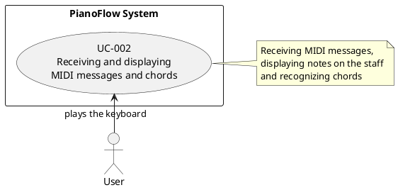
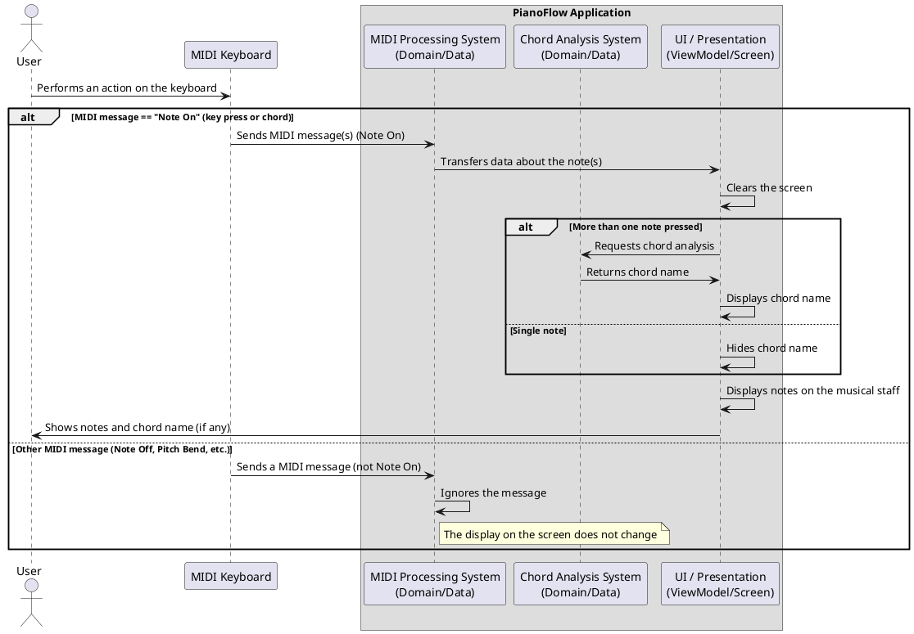

# Scenarios for receiving and processing MIDI messages

## Purpose of the document

This document describes use case scenarios for the functionality of receiving and processing MIDI messages from a connected MIDI keyboard. The main focus is on displaying information about the notes played on the application screen and automatically identifying chord names.

## General description of the functionality

After a successful connection of a MIDI keyboard (according to [UC-001](./MIDI_KEYBOARD_CONNECTION_STATE.md)), the application starts listening for incoming MIDI messages. When key press events (`Note On`) are received, the system processes them and displays them on the screen.

-   **Displaying single notes**: When one key is pressed, a note is displayed on the staff on the screen. The chord name is not displayed.
-   **Displaying chords and their names**: When several keys are pressed simultaneously, all the notes of the chord are displayed on the staff, and the recognized chord name (e.g., "C Major", "Am") is shown.
-   **Screen update**: Before displaying new notes, the screen is cleared of the previous ones.

**Limitations:**
-   Notes are displayed only on a `Note On` event. `Note Off` events (releasing a key) are ignored for display updates in this scenario.
-   The system does not process or display the duration of notes or other parameters (for example, velocity), only the pitch.

---
## UC-002: Receiving and displaying MIDI messages

### Identifier
UC-002

### Name
Receiving and displaying MIDI messages

### Brief description
The system receives MIDI messages from a connected keyboard, processes key press events, displays the played notes on a musical staff, and shows the name of the recognized chord.

### Actor
User

### Preconditions
1.  The application is running.
2.  The MIDI keyboard is successfully connected to the device, and the system is ready to receive data (postcondition of [UC-001](./MIDI_KEYBOARD_CONNECTION_STATE.md)).

### Postconditions
1.  The user sees notes on the screen corresponding to the keys pressed on the keyboard.
2.  If multiple keys are pressed, the user sees the name of the recognized chord.
3.  The system is ready to receive the next MIDI messages.

### Main flow (pressing one key)

1.  The user presses one key on the connected MIDI keyboard.
2.  The system receives a `Note On` MIDI message with information about the pitch of the note.
3.  The system clears the screen of all previously displayed notes and chord names.
4.  The system processes the message, extracting the MIDI number of the note.
5.  The system displays the note on the musical staff.
6.  The system does not display a chord name for a single note.
7.  The system waits for the next press event.

### Alternative flows

#### A1: Pressing several keys at the same time (chord)
1.  The user presses several keys on the MIDI keyboard simultaneously or with a minimum delay.
2.  The system receives several `Note On` MIDI messages.
3.  The system clears the screen of all previously displayed notes and chord names.
4.  The system processes all received messages, forming a list of pressed notes.
5.  The system displays all the notes of the chord on the musical staff.
6.  The system analyzes the list of notes to determine the chord name.
7.  If the chord is recognized, the system displays its name (e.g., "C Major").
8.  If the combination of notes is not recognized as a standard chord, the system displays "Unknown" (or localized equivalent).
9.  The system waits for the next press event.

#### A2: Receiving a MIDI message that is not a note press
1.  The user performs an action on the MIDI keyboard that is not a key press (for example, uses the Pitch Bend wheel or releases a key - `Note Off`).
2.  The system receives a corresponding MIDI message (not `Note On`).
3.  The system ignores this message.
4.  The display on the screen does not change.

---

## Acceptance criteria

### Note Display
1.  When a single key is pressed on the MIDI keyboard, the corresponding note is immediately displayed on the musical staff.
2.  When multiple keys are pressed simultaneously (a chord), all corresponding notes are displayed on the musical staff.
3.  Each new press event (`Note On`) causes the screen to be completely cleared before displaying new notes.
4.  The system only reacts to key press messages (`Note On`); release messages (`Note Off`) and other types of MIDI messages are ignored.
5.  The visualization of notes on the screen occurs without visible delays after pressing a key.
6.  The functionality works stably with rapid and repeated key presses, the application does not crash or freeze.

### Chord Analysis and Display
1.  For each recognized chord (2 or more notes), its name is displayed on the screen (e.g., "C Major", "Am", "G7sus4").
2.  For single notes, the chord name is NOT displayed.
3.  If multiple notes do not form a chord known to the system, the text "Unknown" is displayed.
4. Chord analysis is performed asynchronously and does not block the application interface.
5. Chord names correspond to standard musical notation.

---
