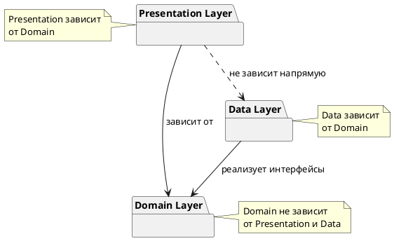
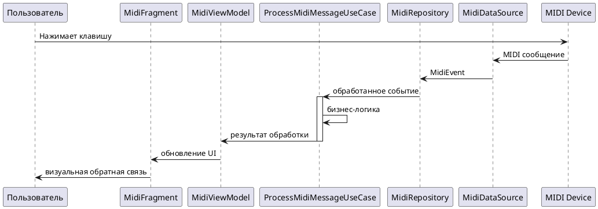
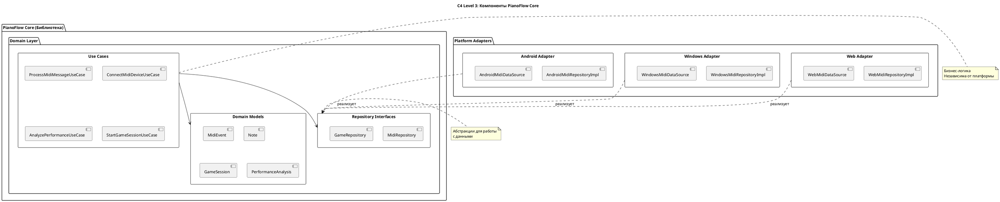

# Архитектурные принципы приложения PianoFlow

## 1. Введение

Данный документ описывает архитектурные принципы и подходы, используемые при разработке приложения **PianoFlow** — Android-приложения для обучения и тренировки игры на фортепиано с использованием MIDI-устройств.

### Цель документа

Документ определяет:
- Высокоуровневые архитектурные принципы разработки
- Структуру слоев приложения
- Паттерны проектирования и их применение
- Правила зависимостей между компонентами
- Примеры реализации для типичных сценариев

### Контекст приложения

PianoFlow представляет собой тренажер и систему проверки игры на пианино, подключенном через USB к Android-устройству. Подробное описание приложения представлено в документе [APPLICATION_DESCRIPTION.md](APPLICATION_DESCRIPTION.md).

### Связь с требованиями разработки

Архитектурные принципы основаны на требованиях из правил разработки:
- **Минимальная связность** между компонентами системы
- **Независимость ядра от клиента** — ядро системы не должно зависеть от Android-специфичных компонентов, что позволит в будущем переиспользовать его как отдельный сервис со своим API

## 2. Высокоуровневые архитектурные принципы

### 2.1. Минимальная связность (Low Coupling)

**Определение**: Связность (coupling) — это мера зависимости одного модуля от другого. Минимальная связность означает, что компоненты системы должны быть максимально независимы друг от друга.

**Применение в PianoFlow**:
- Компоненты взаимодействуют через четко определенные интерфейсы
- Изменения в одном слое не должны требовать изменений в других слоях
- Бизнес-логика изолирована от деталей реализации (Android API, UI-фреймворки)

**Примеры**:
- Domain-слой не знает о существовании Android-классов (`Activity`, `Fragment`, `ViewModel`)
- Repository-интерфейсы определены в Domain-слое, а их реализация — в Data-слое
- Use Cases не зависят от конкретных источников данных (MIDI, база данных, сеть)

### 2.2. Независимость ядра от клиента

**Принцип инверсии зависимостей**: Модули высокого уровня (бизнес-логика) не должны зависеть от модулей низкого уровня (детали реализации). Оба должны зависеть от абстракций.

**Возможность переиспользования ядра**:
Ядро системы (Domain-слой) спроектировано таким образом, что может быть переиспользовано:
- Как отдельный сервис с REST API
- В других клиентских приложениях (например, веб-версия)
- В качестве библиотеки для других проектов

**Разделение на слои**:
Архитектура разделена на три основных слоя:
1. **Presentation Layer** — Android-специфичный слой (UI, навигация)
2. **Domain Layer** — ядро системы (бизнес-логика, независимо от платформы)
3. **Data Layer** — реализация источников данных (MIDI, хранилище)

## 3. Архитектурные слои (Clean Architecture)

Архитектура приложения основана на принципах **Clean Architecture**, которая обеспечивает разделение ответственности и независимость бизнес-логики от деталей реализации.

### 3.1. Presentation Layer (Слой представления)

**Назначение**: Отвечает за отображение данных пользователю и обработку пользовательского ввода.

**Компоненты**:
- **Activities и Fragments** — Android-компоненты для отображения UI
- **ViewModels** — управление UI-состоянием и взаимодействие с Domain-слоем
- **UI-компоненты** — пользовательский интерфейс (layouts, views)
- **Навигация** — переходы между экранами

**Характеристики**:
- Зависит только от Domain-слоя
- Не содержит бизнес-логики
- Использует паттерн MVVM для разделения UI и логики
- **Использует однонаправленный поток данных (Unidirectional Data Flow - UDF)**: Состояние (UI State) передается из ViewModel в UI, а события от UI передаются в ViewModel для обработки.
- **UI-состояние инкапсулируется в отдельный объект**: ViewModel предоставляет единый объект состояния (например, `data class`), который содержит все данные для отрисовки экрана. Это состояние передается через `StateFlow`.

**Пример структуры**:
```
presentation/
├── ui/
│   ├── main/
│   │   ├── MainActivity.kt
│   │   ├── MainFragment.kt
│   │   └── MainViewModel.kt
│   └── midi/
│       ├── MidiConnectionFragment.kt
│       └── MidiConnectionViewModel.kt
└── navigation/
    └── Navigation.kt
```

### 3.2. Domain Layer (Слой домена / Ядро)

**Назначение**: Содержит бизнес-логику приложения и является ядром системы.

**Компоненты**:
- **Use Cases** (Interactors) — конкретные бизнес-операции
- **Domain Models** — бизнес-сущности (Note, MidiEvent, GameSession и т.д.)
- **Repository Interfaces** — абстракции для доступа к данным
- **Domain Exceptions** — бизнес-исключения

**Характеристики**:
- **Независим от Android** — не содержит Android-специфичных классов
- **Независим от Data-слоя** — использует только интерфейсы
- **Чистый Kotlin** — может быть переиспользован в других проектах

**Пример структуры**:
```
domain/
├── model/
│   ├── Note.kt
│   ├── MidiEvent.kt
│   └── GameSession.kt
├── usecase/
│   ├── midi/
│   │   ├── ConnectMidiDeviceUseCase.kt
│   │   └── ProcessMidiMessageUseCase.kt
│   └── game/
│       ├── AnalyzePerformanceUseCase.kt
│       └── StartGameSessionUseCase.kt
└── repository/
    ├── MidiRepository.kt (интерфейс)
    └── GameRepository.kt (интерфейс)
```

**Ссылки на описание подхода**:
- **Clean Architecture (Чистая архитектура)** — основная методология:
  - Книга Роберта Мартина "Clean Architecture: A Craftsman's Guide to Software Structure and Design" (2017)
  - Оригинальная статья: [blog.cleancoder.com/uncle-bob/2012/08/13/the-clean-architecture.html](https://blog.cleancoder.com/uncle-bob/2012/08/13/the-clean-architecture.html)
  - Русский перевод книги: "Чистая архитектура. Искусство разработки программного обеспечения" (издательство Питер)
- **Hexagonal Architecture (Гексагональная архитектура)** — связанный подход:
  - Оригинальная статья Алистера Кокберна: [alistair.cockburn.us/hexagonal-architecture](https://alistair.cockburn.us/hexagonal-architecture/)
  - Wikipedia: [en.wikipedia.org/wiki/Hexagonal_architecture_(software)](https://en.wikipedia.org/wiki/Hexagonal_architecture_(software))
  - Русская Wikipedia: [ru.wikipedia.org/wiki/Гексагональная_архитектура](https://ru.wikipedia.org/wiki/%D0%93%D0%B5%D0%BA%D1%81%D0%B0%D0%B3%D0%BE%D0%BD%D0%B0%D0%BB%D1%8C%D0%BD%D0%B0%D1%8F_%D0%B0%D1%80%D1%85%D0%B8%D1%82%D0%B5%D0%BA%D1%82%D1%83%D1%80%D0%B0)
- **Android Clean Architecture** — применение в Android:
  - Официальный гайд Google: [developer.android.com/topic/architecture](https://developer.android.com/topic/architecture)
  - Android Architecture Guide: [developer.android.com/jetpack/guide](https://developer.android.com/jetpack/guide)
- **Дополнительные ресурсы**:
  - Статья на Habr: [habr.com/ru/companies/otus/articles/732178](https://habr.com/ru/companies/otus/articles/732178/)
  - Принципы SOLID (Dependency Inversion Principle): [ru.wikipedia.org/wiki/SOLID](https://ru.wikipedia.org/wiki/SOLID_(%D0%BF%D1%80%D0%BE%D0%B3%D1%80%D0%B0%D0%BC%D0%BC%D0%B8%D1%80%D0%BE%D0%B2%D0%B0%D0%BD%D0%B8%D0%B5))

### 3.3. Data Layer (Слой данных)

**Назначение**: Реализует источники данных и предоставляет данные Domain-слою через Repository-интерфейсы.

**Компоненты**:
- **Repository Implementations** — реализация интерфейсов из Domain-слоя
- **Data Sources** — конкретные источники данных:
  - MIDI-источник (Android MIDI API)
  - Локальное хранилище (Room, SharedPreferences)
  - Сетевые источники (если потребуется в будущем)
- **Data Models** — модели данных для хранения и передачи
- **Mappers** — преобразование между Data Models и Domain Models

**Характеристики**:
- Зависит от Domain-слоя (реализует его интерфейсы)
- Может зависеть от Android-специфичных API (MidiManager, Room и т.д.)
- Изолирует детали работы с данными от Domain-слоя

**Пример структуры**:
```
data/
├── repository/
│   ├── MidiRepositoryImpl.kt
│   └── GameRepositoryImpl.kt
├── datasource/
│   ├── midi/
│   │   ├── MidiDataSource.kt
│   │   └── MidiReceiver.kt
│   └── local/
│       ├── GameDatabase.kt
│       └── PreferencesDataSource.kt
├── model/
│   ├── MidiEventEntity.kt
│   └── GameSessionEntity.kt
└── mapper/
    ├── MidiEventMapper.kt
    └── GameSessionMapper.kt
```

## 4. Паттерны проектирования

### 4.1. MVVM (Model-View-ViewModel)

**Применение**: Presentation Layer

**Описание**:
- **Model** — Domain-слой (Use Cases, Domain Models)
- **View** — Activities, Fragments (отображают данные)
- **ViewModel** — управляет UI-состоянием, вызывает Use Cases

**Преимущества**:
- Разделение UI и бизнес-логики
- Сохранение состояния при изменениях конфигурации
- Упрощение тестирования

**Пример**:
```kotlin
// ViewModel вызывает Use Case из Domain-слоя
class MidiConnectionViewModel(
    private val connectMidiDeviceUseCase: ConnectMidiDeviceUseCase
) : ViewModel() {
    private val _connectionState = MutableStateFlow<ConnectionState>(ConnectionState.Disconnected)
    val connectionState: StateFlow<ConnectionState> = _connectionState.asStateFlow()
    
    fun connectDevice(deviceId: Int) {
        viewModelScope.launch {
            _connectionState.value = ConnectionState.Connecting
            val result = connectMidiDeviceUseCase(deviceId)
            _connectionState.value = result.fold(
                onSuccess = { ConnectionState.Connected(it) },
                onFailure = { ConnectionState.Error(it.message) }
            )
        }
    }
}
```

### 4.2. Repository Pattern (Слой данных)

**Применение**: Абстракция доступа к данным в Data Layer.

**Роль**: Repository является **единым источником истины (Single Source of Truth)** для определенных данных. Он инкапсулирует логику, которая решает, откуда брать данные (из локальной базы данных, из сети, из кэша) и предоставляет их остальной части приложения, в первую очередь Domain-слою.

**Основные принципы**:
- **Инкапсуляция источников данных**: Repository скрывает от `ViewModel` и Use Cases то, как данные хранятся и откуда они получаются.
- **Предоставление данных**: Данные предоставляются в виде реактивных потоков (например, `Flow<T>`), чтобы UI мог автоматически обновляться при их изменении.
- **Обработка операций с данными**: Repository содержит методы для чтения, записи, обновления и удаления данных.

**Правила именования**:
- **Repository**: Именуется по типу данных, за которые он отвечает.
  - *Пример*: `MidiRepository`, `GameSettingsRepository`.
- **Data Source**: Именуется с указанием типа данных и его источника.
  - *Пример*: `MidiRemoteDataSource`, `GameSettingsLocalDataSource`.

**Пример**:
```kotlin
// Domain-слой: интерфейс
interface MidiRepository {
    // Предоставляет поток данных, который будет обновляться
    fun observeMidiMessages(): Flow<MidiEvent>

    suspend fun getAvailableDevices(): List<MidiDevice>
}

// Data-слой: реализация
class MidiRepositoryImpl(
    private val midiLocalDataSource: MidiLocalDataSource,
    // private val midiRemoteDataSource: MidiRemoteDataSource // если бы был
) : MidiRepository {
    override fun observeMidiMessages(): Flow<MidiEvent> {
        // Логика, решающая, откуда брать данные.
        // Здесь мы просто передаем поток из локального источника.
        return midiLocalDataSource.observeMessages()
    }
    // ...
}
```

### 4.3. Use Cases (Interactors) (Слой домена)

**Применение**: Инкапсуляция бизнес-логики в Domain Layer.

**Роль**: Use Case (или Interactor) — это класс, который содержит одну конкретную бизнес-операцию. Он вызывается из `ViewModel` и может использовать один или несколько репозиториев для выполнения своей задачи.

**Основные принципы**:
- **Принцип одиночной ответственности**: Каждый Use Case отвечает только за одну операцию.
- **Переиспользуемость**: Сложная бизнес-логика, используемая в нескольких `ViewModel`, должна быть вынесена в Use Case.
- **Простота и чистота**: Use Case не должен содержать логики, связанной с UI или жизненным циклом Android. Он не должен иметь собственного изменяемого состояния.
- **Один публичный метод**: Use Case должен иметь только один публичный метод `invoke()`, что позволяет вызывать экземпляр класса как функцию.

**Правила именования**:
- Имя класса должно следовать шаблону: `Глагол в настоящем времени + Объект (опционально) + UseCase`.
  - *Пример*: `ConnectMidiDeviceUseCase`, `FormatDateUseCase`.

**Пример**:
```kotlin
class ProcessMidiMessageUseCase(
    private val gameRepository: GameRepository
) {
    suspend operator fun invoke(message: MidiEvent): Result<ProcessedNote> {
        // 1. Валидация и обработка MIDI-сообщения
        val note = parseMidiMessage(message)

        // 2. Взаимодействие с репозиторием
        return gameRepository.addNoteToSession(note)
            .map { ProcessedNote(note, it) }
    }
}
```

### 4.4. Dependency Injection

**Применение**: Управление зависимостями во всех слоях.

**Описание**:
- Использование DI-фреймворка (например, Hilt или Koin)
- Зависимости предоставляются через конструкторы
- Упрощает тестирование и управление зависимостями

**Преимущества**:
- Слабая связность между компонентами
- Упрощение тестирования (легко подменить зависимости)
- Централизованное управление зависимостями

## 5. Структура модулей/пакетов

Рекомендуемая структура пакетов для приложения PianoFlow:

```
com.astrizhachuk.pianoflow/
├── presentation/          # Android-специфичный слой
│   ├── ui/
│   │   ├── main/
│   │   ├── midi/
│   │   └── game/
│   ├── navigation/
│   └── di/               # DI-модули для Presentation
├── domain/               # Ядро (независимо от Android)
│   ├── model/
│   ├── usecase/
│   │   ├── midi/
│   │   └── game/
│   ├── repository/
│   └── exception/
└── data/                 # Реализация источников данных
    ├── repository/
    ├── datasource/
    │   ├── midi/
    │   └── local/
    ├── model/
    ├── mapper/
    └── di/               # DI-модули для Data
```

## 6. Диаграммы

### 6.1. Диаграмма слоев архитектуры

```plantuml
@startuml
package "Presentation Layer
(Android-специфичный)" {
    [Activity/Fragment] as Activity
    [ViewModel] as ViewModel
    [UI Components] as UI
}

package "Domain Layer
(Ядро - независимо от Android)" {
    [Use Cases] as UseCase
    [Domain Models] as DomainModel
    [Repository Interfaces] as RepoInterface
}

package "Data Layer
(Реализация источников данных)" {
    [Repository Implementations] as RepoImpl
    [MIDI Data Source] as MidiDS
    [Local Data Source] as LocalDS
}

Activity --> ViewModel
ViewModel --> UseCase
UseCase --> RepoInterface
UseCase --> DomainModel
RepoImpl --> RepoInterface
RepoImpl --> MidiDS
RepoImpl --> LocalDS
@enduml
```

### 6.2. Диаграмма зависимостей между слоями



### 6.3. Пример потока данных для MIDI-обработки



## 7. Правила зависимостей

### 7.1. Основные правила

1. **Domain не зависит от Presentation и Data**
   - Domain-слой не содержит импортов Android-классов
   - Domain-слой не знает о деталях реализации источников данных

2. **Presentation зависит от Domain**
   - ViewModels вызывают Use Cases
   - UI отображает Domain Models

3. **Data зависит от Domain**
   - Repository-реализации реализуют интерфейсы из Domain-слоя
   - Data Models преобразуются в Domain Models через мапперы

4. **Presentation не зависит напрямую от Data**
   - Все взаимодействие происходит через Domain-слой
   - ViewModels не знают о конкретных реализациях Repository

5.  **Все операции в Data и Domain слоях должны быть безопасны для вызова из главного потока (Main-safe)**. Любые длительные или блокирующие операции (работа с сетью, базой данных) должны выполняться в фоновом потоке с использованием корутин (`Dispatchers.IO`). Функции репозиториев и Use Cases должны быть `suspend`-функциями или возвращать `Flow`.

### 7.2. Направление зависимостей

```
Presentation → Domain ← Data
```

- Зависимости направлены **к центру** (Domain)
- Domain является **независимым ядром**
- Presentation и Data могут быть заменены без изменения Domain

## 8. Примеры применения

### 8.1. Пример структуры для MIDI-обработки

**Domain Model**:
```kotlin
// domain/model/MidiEvent.kt
data class MidiEvent(
    val note: Int,
    val velocity: Int,
    val channel: Int,
    val timestamp: Long
)
```

**Repository Interface**:
```kotlin
// domain/repository/MidiRepository.kt
interface MidiRepository {
    suspend fun getAvailableDevices(): List<MidiDevice>
    suspend fun connectToDevice(deviceId: Int): Result<MidiConnection>
    fun observeMidiMessages(): Flow<MidiEvent>
}
```

**Use Case**:
```kotlin
// domain/usecase/midi/ProcessMidiMessageUseCase.kt
class ProcessMidiMessageUseCase(
    private val midiRepository: MidiRepository
) {
    suspend operator fun invoke(event: MidiEvent): Result<ProcessedNote> {
        // Бизнес-логика обработки
        return Result.success(ProcessedNote.from(event))
    }
}
```

**Repository Implementation**:
```kotlin
// data/repository/MidiRepositoryImpl.kt
class MidiRepositoryImpl(
    private val midiDataSource: MidiDataSource
) : MidiRepository {
    override fun observeMidiMessages(): Flow<MidiEvent> {
        return midiDataSource.observeMessages()
            .map { it.toDomainModel() }
    }
}
```

**ViewModel**:
```kotlin
// presentation/ui/midi/MidiConnectionViewModel.kt
class MidiConnectionViewModel(
    private val processMidiMessageUseCase: ProcessMidiMessageUseCase
) : ViewModel() {
    private val _notes = MutableStateFlow<List<ProcessedNote>>(emptyList())
    val notes: StateFlow<List<ProcessedNote>> = _notes.asStateFlow()
    
    fun processMessage(event: MidiEvent) {
        viewModelScope.launch {
            processMidiMessageUseCase(event)
                .onSuccess { note -> 
                    _notes.value = _notes.value + note
                }
        }
    }
}
```

### 8.2. Пример Use Case для анализа игры

```kotlin
// domain/usecase/game/AnalyzePerformanceUseCase.kt
class AnalyzePerformanceUseCase(
    private val gameRepository: GameRepository
) {
    suspend operator fun invoke(sessionId: String): Result<PerformanceAnalysis> {
        return gameRepository.getSession(sessionId)
            .map { session ->
                PerformanceAnalysis(
                    accuracy = calculateAccuracy(session.notes),
                    timing = analyzeTiming(session.notes),
                    mistakes = identifyMistakes(session.notes, session.expectedNotes)
                )
            }
    }
    
    private fun calculateAccuracy(notes: List<Note>): Float {
        // Бизнес-логика расчета точности
    }
}
```

### 8.3. Пример Repository для MIDI-данных

```kotlin
// data/repository/MidiRepositoryImpl.kt
@Singleton
class MidiRepositoryImpl @Inject constructor(
    private val midiDataSource: MidiDataSource,
    @ApplicationContext private val context: Context
) : MidiRepository {
    
    private val midiManager: MidiManager by lazy {
        context.getSystemService(Context.MIDI_SERVICE) as MidiManager
    }
    
    override suspend fun getAvailableDevices(): List<MidiDevice> {
        return midiManager.devices
            .map { it.toDomainModel() }
    }
    
    override suspend fun connectToDevice(deviceId: Int): Result<MidiConnection> {
        return try {
            val device = midiManager.getDevice(deviceId)
            val connection = midiDataSource.connect(device)
            Result.success(connection.toDomainModel())
        } catch (e: Exception) {
            Result.failure(e)
        }
    }
    
    override fun observeMidiMessages(): Flow<MidiEvent> {
        return midiDataSource.observeMessages()
            .map { it.toDomainModel() }
    }
}
```

## 9. Вынесение ядра как отдельной библиотеки

### 9.1. Анализ возможности


Архитектура спроектирована с учетом принципа **независимости ядра от клиента** (см. раздел 2.2), что делает возможным использование Domain-слоя в различных контекстах:

#### Преимущества текущей архитектуры:

1. **Domain-слой независим от платформы**
   - Не содержит Android-специфичных классов
   - Использует только чистый Kotlin и стандартные библиотеки
   - Может быть скомпилирован как Kotlin Multiplatform библиотека

2. **Четкое разделение через интерфейсы**
   - Repository-интерфейсы определены в Domain-слое
   - Каждая платформа реализует свои адаптеры для Data-слоя
   - Use Cases работают только с абстракциями

3. **Возможность переиспользования**
   - Ядро может быть использовано в Android-приложении
   - Ядро может быть использовано в Windows-приложении (Kotlin/Native или Kotlin/JVM)
   - Ядро может быть использовано в веб-приложении (Kotlin/JS или через WebAssembly)

#### Варианты реализации:

**Вариант 1: Kotlin Multiplatform Library**
- Domain-слой компилируется как KMP-модуль
- Поддерживает Android, JVM (Windows), JS (Web)
- Единый код для всех платформ

**Вариант 2: Отдельный Gradle-модуль**
- Domain-слой выносится в отдельный модуль `:core` или `:domain`
- Может быть опубликован как библиотека (Maven/Gradle)
- Каждая платформа подключает библиотеку и реализует свои адаптеры

**Вариант 3: REST API сервис**
- Ядро работает как backend-сервис
- Клиенты (Android, Windows, Web) взаимодействуют через REST API
- Подходит для централизованной обработки и синхронизации данных

### 9.2. Структура для мультиплатформенного использования

При вынесении ядра как библиотеки, структура проекта может выглядеть следующим образом:

```
pianoflow-core/              # Отдельная библиотека (ядро)
├── domain/                  # Domain-слой (чистый Kotlin)
│   ├── model/
│   ├── usecase/
│   └── repository/          # Интерфейсы
└── build.gradle.kts

pianoflow-android/           # Android-приложение
├── app/
│   ├── presentation/        # Android UI
│   └── data/                # Android-адаптеры (Android MIDI API)
└── build.gradle.kts
    dependencies {
        implementation(project(":pianoflow-core"))
    }

pianoflow-windows/           # Windows-приложение
├── app/
│   ├── presentation/         # Desktop UI (Compose Multiplatform)
│   └── data/                # Windows-адаптеры (Windows MIDI API)
└── build.gradle.kts
    dependencies {
        implementation(project(":pianoflow-core"))
    }

pianoflow-web/               # Веб-приложение
├── app/
│   ├── presentation/        # Web UI (React, Vue, или Compose for Web)
│   └── data/                # Web-адаптеры (Web MIDI API)
└── build.gradle.kts
    dependencies {
        implementation(project(":pianoflow-core"))
    }
```

### 9.3. Адаптеры для разных платформ

Каждая платформа реализует свои адаптеры для работы с MIDI:

| Платформа | MIDI API | Реализация адаптера |
|-----------|----------|---------------------|
| **Android** | Android MIDI API (`android.media.midi`) | `AndroidMidiRepositoryImpl` |
| **Windows** | Windows MIDI API (WinMM или UWP MIDI) | `WindowsMidiRepositoryImpl` |
| **Web** | Web MIDI API (`navigator.requestMIDIAccess`) | `WebMidiRepositoryImpl` |

Все адаптеры реализуют один и тот же интерфейс `MidiRepository` из Domain-слоя, что обеспечивает единообразное использование ядра на всех платформах.

### 9.4. Схема C4: Контекст и контейнеры

#### C4 Level 1: Системный контекст

```plantuml
@startuml
!define RECTANGLE class

title C4 Level 1: Системный контекст - PianoFlow Core

actor "Пользователь" as User

rectangle "Android приложение
PianoFlow" as AndroidApp {
}

rectangle "Windows приложение
PianoFlow" as WindowsApp {
}

rectangle "Веб-приложение
PianoFlow" as WebApp {
}

rectangle "PianoFlow Core
(Ядро - библиотека)" as Core {
}

rectangle "MIDI-устройство
(Пианино/Клавиатура)" as MidiDevice

User --> AndroidApp : Использует
User --> WindowsApp : Использует
User --> WebApp : Использует

AndroidApp --> Core : Использует ядро
WindowsApp --> Core : Использует ядро
WebApp --> Core : Использует ядро

AndroidApp --> MidiDevice : Подключение через USB
WindowsApp --> MidiDevice : Подключение через USB
WebApp --> MidiDevice : Подключение через браузер

@enduml
```

#### C4 Level 2: Контейнеры

```plantuml
@startuml
!define RECTANGLE class

title C4 Level 2: Контейнеры - PianoFlow Core

actor "Пользователь" as User

package "Android приложение" {
    rectangle "Android UI
(Activities, Fragments)" as AndroidUI
    rectangle "Android ViewModels" as AndroidVM
    rectangle "Android Data Adapters
(Android MIDI API)" as AndroidData
}

package "Windows приложение" {
    rectangle "Desktop UI
(Compose Multiplatform)" as WindowsUI
    rectangle "Desktop ViewModels" as WindowsVM
    rectangle "Windows Data Adapters
(Windows MIDI API)" as WindowsData
}

package "Веб-приложение" {
    rectangle "Web UI
(React/Vue/Compose)" as WebUI
    rectangle "Web ViewModels" as WebVM
    rectangle "Web Data Adapters
(Web MIDI API)" as WebData
}

package "PianoFlow Core
(Библиотека)" {
    rectangle "Domain Layer
(Use Cases, Models)" as Domain
    rectangle "Repository Interfaces" as RepoInterfaces
}

rectangle "MIDI-устройство" as MidiDevice

User --> AndroidUI
User --> WindowsUI
User --> WebUI

AndroidUI --> AndroidVM
AndroidVM --> Domain
AndroidVM --> RepoInterfaces
AndroidData ..> RepoInterfaces : реализует
AndroidData --> MidiDevice

WindowsUI --> WindowsVM
WindowsVM --> Domain
WindowsVM --> RepoInterfaces
WindowsData ..> RepoInterfaces : реализует
WindowsData --> MidiDevice

WebUI --> WebVM
WebVM --> Domain
WebVM --> RepoInterfaces
WebData ..> RepoInterfaces : реализует
WebData --> MidiDevice

note right of Domain
  Ядро независимо от платформы
  Чистый Kotlin код
end note

note right of RepoInterfaces
  Интерфейсы определены в ядре
  Каждая платформа реализует свои адаптеры
end note

@enduml
```

#### C4 Level 3: Компоненты ядра



### 9.5. Пример использования ядра в веб-приложении

Аналогично сайту pianomarvel.com, веб-приложение может использовать Web MIDI API для подключения к MIDI-устройству:

```kotlin
// Web-адаптер для MIDI
class WebMidiRepositoryImpl : MidiRepository {
    private var midiAccess: MIDIAccess? = null
    
    override suspend fun getAvailableDevices(): List<MidiDevice> {
        midiAccess = navigator.requestMIDIAccess().await()
        return midiAccess!!.inputs.map { it.toDomainModel() }
    }
    
    override fun observeMidiMessages(): Flow<MidiEvent> {
        return callbackFlow {
            midiAccess?.inputs?.forEach { input ->
                input.onmidimessage = { event ->
                    trySend(event.toDomainModel())
                }
            }
            awaitClose()
        }
    }
}

// Использование в веб-приложении
class WebMidiViewModel(
    private val processMidiMessageUseCase: ProcessMidiMessageUseCase,
    private val midiRepository: MidiRepository
) {
    fun startListening() {
        viewModelScope.launch {
            midiRepository.observeMidiMessages()
                .collect { event ->
                    processMidiMessageUseCase(event)
                        .onSuccess { note ->
                            // Обновление UI
                        }
                }
        }
    }
}
```

### 9.6. Преимущества вынесения ядра

1. **Единая бизнес-логика** — одна реализация для всех платформ
2. **Легкое тестирование** — ядро тестируется независимо от платформы
3. **Быстрая разработка** — новые функции добавляются один раз в ядро
4. **Консистентность** — одинаковое поведение на всех платформах
5. **Переиспользование** — ядро может быть использовано в других проектах

### 9.7. Рекомендации по реализации

1. **Вынести Domain-слой в отдельный модуль** на раннем этапе разработки
2. **Использовать Kotlin Multiplatform** для поддержки нескольких платформ из одного кода
3. **Определить четкие интерфейсы** для всех внешних зависимостей (MIDI, хранилище)
4. **Создать платформо-специфичные адаптеры** для каждой целевой платформы
5. **Покрыть ядро unit-тестами** для обеспечения качества при переиспользовании

## 10. Заключение

Данная архитектура обеспечивает:
- **Минимальную связность** между компонентами
- **Независимость ядра** от Android-специфичных компонентов
- **Возможность переиспользования** Domain-слоя в других проектах
- **Мультиплатформенность** — ядро может использоваться в Android, Windows и Web-приложениях
- **Упрощение тестирования** за счет четкого разделения слоев
- **Масштабируемость** — легко добавлять новые функции и источники данных

При разработке новых функций необходимо следовать описанным принципам и структуре слоев, чтобы сохранить архитектурную целостность приложения и возможность вынесения ядра как отдельной библиотеки.

## Связанные документы

- [Описание приложения](APPLICATION_DESCRIPTION.md) — общее описание PianoFlow

