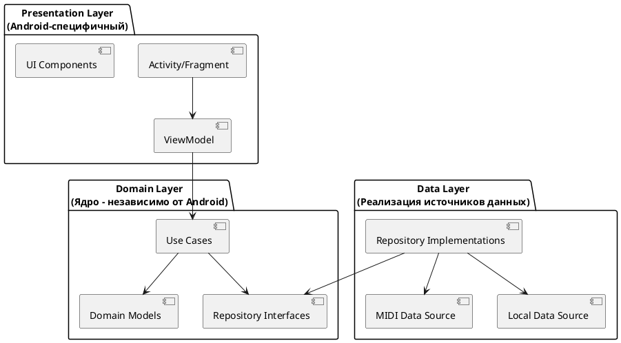
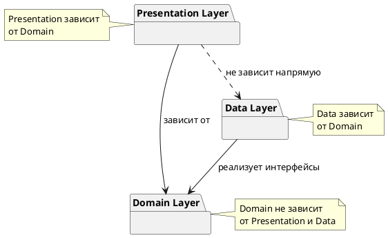
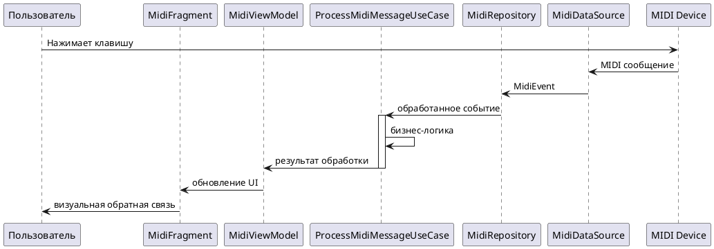

# Архитектурные принципы приложения PianoFlow

## 1. Введение

Данный документ описывает архитектурные принципы и подходы, используемые при разработке приложения **PianoFlow** — Android-приложения для обучения и тренировки игры на фортепиано с использованием MIDI-устройств.

### Цель документа

Документ определяет:
- Высокоуровневые архитектурные принципы разработки
- Структуру слоев приложения
- Паттерны проектирования и их применение
- Правила зависимостей между компонентами
- Примеры реализации для типичных сценариев

### Контекст приложения

PianoFlow представляет собой тренажер и систему проверки игры на пианино, подключенном через USB к Android-устройству. Подробное описание приложения представлено в документе [APPLICATION_DESCRIPTION.md](APPLICATION_DESCRIPTION.md).

### Связь с требованиями разработки

Архитектурные принципы основаны на требованиях из правил разработки:
- **Минимальная связность** между компонентами системы
- **Независимость ядра от клиента** — ядро системы не должно зависеть от Android-специфичных компонентов, что позволит в будущем переиспользовать его как отдельный сервис со своим API

## 2. Высокоуровневые архитектурные принципы

### 2.1. Минимальная связность (Low Coupling)

**Определение**: Связность (coupling) — это мера зависимости одного модуля от другого. Минимальная связность означает, что компоненты системы должны быть максимально независимы друг от друга.

**Применение в PianoFlow**:
- Компоненты взаимодействуют через четко определенные интерфейсы
- Изменения в одном слое не должны требовать изменений в других слоях
- Бизнес-логика изолирована от деталей реализации (Android API, UI-фреймворки)

**Примеры**:
- Domain-слой не знает о существовании Android-классов (`Activity`, `Fragment`, `ViewModel`)
- Repository-интерфейсы определены в Domain-слое, а их реализация — в Data-слое
- Use Cases не зависят от конкретных источников данных (MIDI, база данных, сеть)

### 2.2. Независимость ядра от клиента

**Принцип инверсии зависимостей**: Модули высокого уровня (бизнес-логика) не должны зависеть от модулей низкого уровня (детали реализации). Оба должны зависеть от абстракций.

**Возможность переиспользования ядра**:
Ядро системы (Domain-слой) спроектировано таким образом, что может быть переиспользовано:
- Как отдельный сервис с REST API
- В других клиентских приложениях (например, веб-версия)
- В качестве библиотеки для других проектов

**Разделение на слои**:
Архитектура разделена на три основных слоя:
1. **Presentation Layer** — Android-специфичный слой (UI, навигация)
2. **Domain Layer** — ядро системы (бизнес-логика, независимо от платформы)
3. **Data Layer** — реализация источников данных (MIDI, хранилище)

## 3. Архитектурные слои (Clean Architecture)

Архитектура приложения основана на принципах **Clean Architecture**, которая обеспечивает разделение ответственности и независимость бизнес-логики от деталей реализации.

### 3.1. Presentation Layer (Слой представления)

**Назначение**: Отвечает за отображение данных пользователю и обработку пользовательского ввода.

**Компоненты**:
- **Activities и Fragments** — Android-компоненты для отображения UI
- **ViewModels** — управление UI-состоянием и взаимодействие с Domain-слоем
- **UI-компоненты** — пользовательский интерфейс (layouts, views)
- **Навигация** — переходы между экранами

**Характеристики**:
- Зависит только от Domain-слоя
- Не содержит бизнес-логики
- Использует паттерн MVVM для разделения UI и логики

**Пример структуры**:
```
presentation/
├── ui/
│   ├── main/
│   │   ├── MainActivity.kt
│   │   ├── MainFragment.kt
│   │   └── MainViewModel.kt
│   └── midi/
│       ├── MidiConnectionFragment.kt
│       └── MidiConnectionViewModel.kt
└── navigation/
    └── Navigation.kt
```

### 3.2. Domain Layer (Слой домена / Ядро)

**Назначение**: Содержит бизнес-логику приложения и является ядром системы.

**Компоненты**:
- **Use Cases** (Interactors) — конкретные бизнес-операции
- **Domain Models** — бизнес-сущности (Note, MidiEvent, GameSession и т.д.)
- **Repository Interfaces** — абстракции для доступа к данным
- **Domain Exceptions** — бизнес-исключения

**Характеристики**:
- **Независим от Android** — не содержит Android-специфичных классов
- **Независим от Data-слоя** — использует только интерфейсы
- **Чистый Kotlin** — может быть переиспользован в других проектах

**Пример структуры**:
```
domain/
├── model/
│   ├── Note.kt
│   ├── MidiEvent.kt
│   └── GameSession.kt
├── usecase/
│   ├── midi/
│   │   ├── ConnectMidiDeviceUseCase.kt
│   │   └── ProcessMidiMessageUseCase.kt
│   └── game/
│       ├── AnalyzePerformanceUseCase.kt
│       └── StartGameSessionUseCase.kt
└── repository/
    ├── MidiRepository.kt (интерфейс)
    └── GameRepository.kt (интерфейс)
```

### 3.3. Data Layer (Слой данных)

**Назначение**: Реализует источники данных и предоставляет данные Domain-слою через Repository-интерфейсы.

**Компоненты**:
- **Repository Implementations** — реализация интерфейсов из Domain-слоя
- **Data Sources** — конкретные источники данных:
  - MIDI-источник (Android MIDI API)
  - Локальное хранилище (Room, SharedPreferences)
  - Сетевые источники (если потребуется в будущем)
- **Data Models** — модели данных для хранения и передачи
- **Mappers** — преобразование между Data Models и Domain Models

**Характеристики**:
- Зависит от Domain-слоя (реализует его интерфейсы)
- Может зависеть от Android-специфичных API (MidiManager, Room и т.д.)
- Изолирует детали работы с данными от Domain-слоя

**Пример структуры**:
```
data/
├── repository/
│   ├── MidiRepositoryImpl.kt
│   └── GameRepositoryImpl.kt
├── datasource/
│   ├── midi/
│   │   ├── MidiDataSource.kt
│   │   └── MidiReceiver.kt
│   └── local/
│       ├── GameDatabase.kt
│       └── PreferencesDataSource.kt
├── model/
│   ├── MidiEventEntity.kt
│   └── GameSessionEntity.kt
└── mapper/
    ├── MidiEventMapper.kt
    └── GameSessionMapper.kt
```

## 4. Паттерны проектирования

### 4.1. MVVM (Model-View-ViewModel)

**Применение**: Presentation Layer

**Описание**:
- **Model** — Domain-слой (Use Cases, Domain Models)
- **View** — Activities, Fragments (отображают данные)
- **ViewModel** — управляет UI-состоянием, вызывает Use Cases

**Преимущества**:
- Разделение UI и бизнес-логики
- Сохранение состояния при изменениях конфигурации
- Упрощение тестирования

**Пример**:
```kotlin
// ViewModel вызывает Use Case из Domain-слоя
class MidiConnectionViewModel(
    private val connectMidiDeviceUseCase: ConnectMidiDeviceUseCase
) : ViewModel() {
    private val _connectionState = MutableStateFlow<ConnectionState>(ConnectionState.Disconnected)
    val connectionState: StateFlow<ConnectionState> = _connectionState.asStateFlow()
    
    fun connectDevice(deviceId: Int) {
        viewModelScope.launch {
            _connectionState.value = ConnectionState.Connecting
            val result = connectMidiDeviceUseCase(deviceId)
            _connectionState.value = result.fold(
                onSuccess = { ConnectionState.Connected(it) },
                onFailure = { ConnectionState.Error(it.message) }
            )
        }
    }
}
```

### 4.2. Repository Pattern

**Применение**: Абстракция доступа к данным

**Описание**:
- Интерфейсы Repository определены в Domain-слое
- Реализации Repository находятся в Data-слое
- Use Cases работают только с интерфейсами

**Преимущества**:
- Изоляция Domain-слоя от деталей источников данных
- Возможность легко заменить источник данных
- Упрощение тестирования (можно использовать mock-реализации)

**Пример**:
```kotlin
// Domain-слой: интерфейс
interface MidiRepository {
    suspend fun getAvailableDevices(): List<MidiDevice>
    suspend fun connectToDevice(deviceId: Int): Result<MidiConnection>
    suspend fun observeMidiMessages(): Flow<MidiEvent>
}

// Data-слой: реализация
class MidiRepositoryImpl(
    private val midiDataSource: MidiDataSource
) : MidiRepository {
    override suspend fun getAvailableDevices(): List<MidiDevice> {
        return midiDataSource.scanDevices()
    }
    // ...
}
```

### 4.3. Use Cases (Interactors)

**Применение**: Domain Layer

**Описание**:
- Каждый Use Case представляет одну бизнес-операцию
- Use Case координирует работу с Repository
- Use Case содержит бизнес-логику и валидацию

**Преимущества**:
- Четкое разделение бизнес-операций
- Переиспользуемость логики
- Простота тестирования

**Пример**:
```kotlin
class ProcessMidiMessageUseCase(
    private val midiRepository: MidiRepository,
    private val gameRepository: GameRepository
) {
    suspend operator fun invoke(message: MidiEvent): Result<ProcessedNote> {
        // Бизнес-логика обработки MIDI-сообщения
        val note = parseMidiMessage(message)
        
        // Сохранение в текущую сессию игры
        return gameRepository.addNoteToSession(note)
            .map { ProcessedNote(note, it) }
    }
}
```

### 4.4. Dependency Injection

**Применение**: Управление зависимостями во всех слоях

**Описание**:
- Использование DI-фреймворка (например, Hilt или Koin)
- Зависимости предоставляются через конструкторы
- Упрощает тестирование и управление зависимостями

**Преимущества**:
- Слабая связность между компонентами
- Упрощение тестирования (легко подменить зависимости)
- Централизованное управление зависимостями

## 5. Структура модулей/пакетов

Рекомендуемая структура пакетов для приложения PianoFlow:

```
com.astrizhachuk.pianoflow/
├── presentation/          # Android-специфичный слой
│   ├── ui/
│   │   ├── main/
│   │   ├── midi/
│   │   └── game/
│   ├── navigation/
│   └── di/               # DI-модули для Presentation
├── domain/               # Ядро (независимо от Android)
│   ├── model/
│   ├── usecase/
│   │   ├── midi/
│   │   └── game/
│   ├── repository/
│   └── exception/
└── data/                 # Реализация источников данных
    ├── repository/
    ├── datasource/
    │   ├── midi/
    │   └── local/
    ├── model/
    ├── mapper/
    └── di/               # DI-модули для Data
```

## 6. Диаграммы

### 6.1. Диаграмма слоев архитектуры



### 6.2. Диаграмма зависимостей между слоями



### 6.3. Пример потока данных для MIDI-обработки



## 7. Правила зависимостей

### 7.1. Основные правила

1. **Domain не зависит от Presentation и Data**
   - Domain-слой не содержит импортов Android-классов
   - Domain-слой не знает о деталях реализации источников данных

2. **Presentation зависит от Domain**
   - ViewModels вызывают Use Cases
   - UI отображает Domain Models

3. **Data зависит от Domain**
   - Repository-реализации реализуют интерфейсы из Domain-слоя
   - Data Models преобразуются в Domain Models через мапперы

4. **Presentation не зависит напрямую от Data**
   - Все взаимодействие происходит через Domain-слой
   - ViewModels не знают о конкретных реализациях Repository

### 7.2. Направление зависимостей

```
Presentation → Domain ← Data
```

- Зависимости направлены **к центру** (Domain)
- Domain является **независимым ядром**
- Presentation и Data могут быть заменены без изменения Domain

## 8. Примеры применения

### 8.1. Пример структуры для MIDI-обработки

**Domain Model**:
```kotlin
// domain/model/MidiEvent.kt
data class MidiEvent(
    val note: Int,
    val velocity: Int,
    val channel: Int,
    val timestamp: Long
)
```

**Repository Interface**:
```kotlin
// domain/repository/MidiRepository.kt
interface MidiRepository {
    suspend fun getAvailableDevices(): List<MidiDevice>
    suspend fun connectToDevice(deviceId: Int): Result<MidiConnection>
    fun observeMidiMessages(): Flow<MidiEvent>
}
```

**Use Case**:
```kotlin
// domain/usecase/midi/ProcessMidiMessageUseCase.kt
class ProcessMidiMessageUseCase(
    private val midiRepository: MidiRepository
) {
    suspend operator fun invoke(event: MidiEvent): Result<ProcessedNote> {
        // Бизнес-логика обработки
        return Result.success(ProcessedNote.from(event))
    }
}
```

**Repository Implementation**:
```kotlin
// data/repository/MidiRepositoryImpl.kt
class MidiRepositoryImpl(
    private val midiDataSource: MidiDataSource
) : MidiRepository {
    override fun observeMidiMessages(): Flow<MidiEvent> {
        return midiDataSource.observeMessages()
            .map { it.toDomainModel() }
    }
}
```

**ViewModel**:
```kotlin
// presentation/ui/midi/MidiConnectionViewModel.kt
class MidiConnectionViewModel(
    private val processMidiMessageUseCase: ProcessMidiMessageUseCase
) : ViewModel() {
    private val _notes = MutableStateFlow<List<ProcessedNote>>(emptyList())
    val notes: StateFlow<List<ProcessedNote>> = _notes.asStateFlow()
    
    fun processMessage(event: MidiEvent) {
        viewModelScope.launch {
            processMidiMessageUseCase(event)
                .onSuccess { note -> 
                    _notes.value = _notes.value + note
                }
        }
    }
}
```

### 8.2. Пример Use Case для анализа игры

```kotlin
// domain/usecase/game/AnalyzePerformanceUseCase.kt
class AnalyzePerformanceUseCase(
    private val gameRepository: GameRepository
) {
    suspend operator fun invoke(sessionId: String): Result<PerformanceAnalysis> {
        return gameRepository.getSession(sessionId)
            .map { session ->
                PerformanceAnalysis(
                    accuracy = calculateAccuracy(session.notes),
                    timing = analyzeTiming(session.notes),
                    mistakes = identifyMistakes(session.notes, session.expectedNotes)
                )
            }
    }
    
    private fun calculateAccuracy(notes: List<Note>): Float {
        // Бизнес-логика расчета точности
    }
}
```

### 8.3. Пример Repository для MIDI-данных

```kotlin
// data/repository/MidiRepositoryImpl.kt
@Singleton
class MidiRepositoryImpl @Inject constructor(
    private val midiDataSource: MidiDataSource,
    @ApplicationContext private val context: Context
) : MidiRepository {
    
    private val midiManager: MidiManager by lazy {
        context.getSystemService(Context.MIDI_SERVICE) as MidiManager
    }
    
    override suspend fun getAvailableDevices(): List<MidiDevice> {
        return midiManager.devices
            .map { it.toDomainModel() }
    }
    
    override suspend fun connectToDevice(deviceId: Int): Result<MidiConnection> {
        return try {
            val device = midiManager.getDevice(deviceId)
            val connection = midiDataSource.connect(device)
            Result.success(connection.toDomainModel())
        } catch (e: Exception) {
            Result.failure(e)
        }
    }
    
    override fun observeMidiMessages(): Flow<MidiEvent> {
        return midiDataSource.observeMessages()
            .map { it.toDomainModel() }
    }
}
```

## 9. Заключение

Данная архитектура обеспечивает:
- **Минимальную связность** между компонентами
- **Независимость ядра** от Android-специфичных компонентов
- **Возможность переиспользования** Domain-слоя в других проектах
- **Упрощение тестирования** за счет четкого разделения слоев
- **Масштабируемость** — легко добавлять новые функции и источники данных

При разработке новых функций необходимо следовать описанным принципам и структуре слоев, чтобы сохранить архитектурную целостность приложения.

## Связанные документы

- [Описание приложения](APPLICATION_DESCRIPTION.md) — общее описание PianoFlow
- [План MIDI-тестирования](MIDI_TEST_PLAN.md) — план реализации MIDI-подключения

