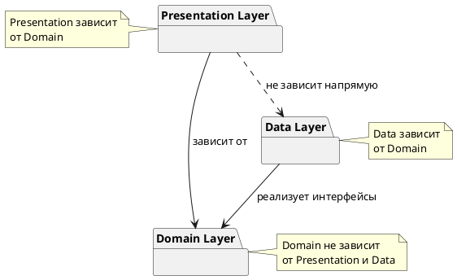

# Архитектурные принципы приложения PianoFlow

## 1. Введение

Данный документ описывает архитектурные принципы и подходы, используемые при разработке приложения **PianoFlow** — Android-приложения для обучения и тренировки игры на фортепиано с использованием MIDI-устройств.

### Цель документа

Документ определяет:
- Высокоуровневые архитектурные принципы разработки
- Структуру слоев приложения
- Иерархию пакетов
- Паттерны проектирования и их применение
- Правила зависимостей между компонентами
- Примеры реализации для типичных сценариев

### Контекст приложения

PianoFlow представляет собой тренажер и систему проверки игры на пианино, подключенном через USB к Android-устройству. Подробное описание приложения представлено в документе [Описание приложения](../README.md).

### Связь с требованиями разработки

Архитектурные принципы основаны на требованиях из правил разработки:
- **Минимальная связность** между компонентами системы
- **Независимость ядра от клиента** — ядро системы не должно зависеть от Android-специфичных компонентов, что позволит в будущем переиспользовать его как отдельный сервис со своим API

## 2. Высокоуровневые архитектурные принципы

### 2.1. Минимальная связность (Low Coupling)

**Определение**: Связность (coupling) — это мера зависимости одного модуля от другого. Минимальная связность означает, что компоненты системы должны быть максимально независимы друг от друга.

**Применение в PianoFlow**:
- Компоненты взаимодействуют через четко определенные интерфейсы
- Изменения в одном слое не должны требовать изменений в других слоях
- Бизнес-логика изолирована от деталей реализации (Android API, UI-фреймворки)

**Примеры**:
- Domain-слой не знает о существовании Android-классов (`Activity`, `Fragment`, `ViewModel`)
- Repository-интерфейсы определены в Domain-слое, а их реализация — в Data-слое
- Use Cases не зависят от конкретных источников данных (MIDI, база данных, сеть)

### 2.2. Независимость ядра от клиента

**Принцип инверсии зависимостей**: Модули высокого уровня (бизнес-логика) не должны зависеть от модулей низкого уровня (детали реализации). Оба должны зависеть от абстракций.

**Возможность переиспользования ядра**:
Ядро системы (Domain-слой) спроектировано таким образом, что может быть переиспользовано:
- Как отдельный сервис с REST API
- В других клиентских приложениях (например, веб-версия)
- В качестве библиотеки для других проектов

**Разделение на слои**:
Архитектура разделена на три основных слоя:
1. **Presentation Layer** — Android-специфичный слой (UI, навигация)
2. **Domain Layer** — ядро системы (бизнес-логика, независимо от платформы)
3. **Data Layer** — реализация источников данных (MIDI, хранилище)

## 3. Архитектурные слои (Clean Architecture)

Архитектура приложения основана на принципах **Clean Architecture**, которая обеспечивает разделение ответственности и независимость бизнес-логики от деталей реализации.

### 3.1. Presentation Layer (Слой представления)

**Назначение**: Отвечает за отображение данных пользователю и обработку пользовательского ввода.

**Компоненты**:
- **UI (View)**: `Activities`, `Fragments` и `Composable`-экраны, отвечающие за отображение данных и передачу событий пользователя в `ViewModel`.
- **ViewModel**: Управляет состоянием UI, обрабатывает события и взаимодействует с `Domain` слоем. Является источником состояния для UI.
- **UI State**: Неизменяемые (immutable) классы данных, которые представляют собой полное состояние экрана для отображения.
- **Навигация**: Компоненты, управляющие потоком экранов в приложении.

**Характеристики**:
- Зависит только от Domain-слоя
- Не содержит бизнес-логики
- Использует паттерн MVVM и однонаправленный поток данных (UDF)

**Пример структуры пакетов**:
```
presentation/
├── di/
│   └── PresentationModule.kt
├── ui/
│   ├── main/
│   │   └── MainFragment.kt
│   └── midi/
│       └── MidiConnectionFragment.kt
└── viewmodel/
    ├── MainViewModel.kt
    └── MidiConnectionViewModel.kt
```

### 3.2. Domain Layer (Слой домена / Ядро)

**Назначение**: Содержит бизнес-логику приложения и является ядром системы.

**Компоненты**:
- **Use Cases** (Interactors) — конкретные бизнес-операции
- **Domain Models** — бизнес-сущности (Note, MidiEvent)
- **Repository Interfaces** — абстракции для доступа к данным

**Характеристики**:
- **Независим от Android** и от **Data-слоя**.
- **Чистый Kotlin** — может быть переиспользован в других проектах.

**Пример структуры пакетов**:
```
domain/
├── model/
│   ├── Note.kt
│   └── MidiEvent.kt
├── repository/
│   ├── MidiRepository.kt (интерфейс)
│   └── GameRepository.kt (интерфейс)
└── usecase/
    ├── midi/
    │   ├── ConnectMidiDeviceUseCase.kt
    │   └── ProcessMidiMessageUseCase.kt
    └── game/
        ├── AnalyzePerformanceUseCase.kt
        └── StartGameSessionUseCase.kt
```

**Ссылки на описание подхода**:
- **Clean Architecture (Чистая архитектура)** — основная методология:
  - Книга Роберта Мартина "Clean Architecture: A Craftsman's Guide to Software Structure and Design" (2017)
  - Оригинальная статья: [blog.cleancoder.com/uncle-bob/2012/08/13/the-clean-architecture.html](https://blog.cleancoder.com/uncle-bob/2012/08/13/the-clean-architecture.html)
  - Русский перевод книги: "Чистая архитектура. Искусство разработки программного обеспечения" (издательство Питер)
- **Hexagonal Architecture (Гексагональная архитектура)** — связанный подход:
  - Оригинальная статья Алистера Кокберна: [alistair.cockburn.us/hexagonal-architecture](https://alistair.cockburn.us/hexagonal-architecture/)
  - Wikipedia: [en.wikipedia.org/wiki/Hexagonal_architecture_(software)](https://en.wikipedia.org/wiki/Hexagonal_architecture_(software))
  - Русская Wikipedia: [ru.wikipedia.org/wiki/Гексагональная_архитектура](https://ru.wikipedia.org/wiki/%D0%93%D0%B5%D0%BA%D1%81%D0%B0%D0%B3%D0%BE%D0%BD%D0%B0%D0%BB%D1%8C%D0%BD%D0%B0%D1%8F_%D0%B0%D1%80%D1%85%D0%B8%D1%82%D0%B5%D0%BA%D1%82%D1%83%D1%80%D0%B0)
- **Android Clean Architecture** — применение в Android:
  - Официальный гайд Google: [developer.android.com/topic/architecture](https://developer.android.com/topic/architecture)
  - Android Architecture Guide: [developer.android.com/jetpack/guide](https://developer.android.com/jetpack/guide)
- **Дополнительные ресурсы**:
  - Статья на Habr: [habr.com/ru/companies/otus/articles/732178](https://habr.com/ru/companies/otus/articles/732178/)
  - Принципы SOLID (Dependency Inversion Principle): [ru.wikipedia.org/wiki/SOLID](https://ru.wikipedia.org/wiki/SOLID_(%D0%BF%D1%80%D0%BE%D0%B3%D1%80%D0%B0%D0%BC%D0%BC%D0%B8%D1%80%D0%BE%D0%B2%D0%B0%D0%BD%D0%B8%D0%B5))

### 3.3. Data Layer (Слой данных)

**Назначение**: Реализует источники данных и предоставляет данные Domain-слою через Repository-интерфейсы.

**Компоненты**:
- **Repository Implementations** — реализация интерфейсов из Domain-слоя
- **Data Sources** — конкретные источники данных (MIDI, Room)
- **Data Models** и **Mappers** — модели данных и их преобразователи в/из Domain Models.

**Характеристики**:
- Зависит от Domain-слоя (реализует его интерфейсы).
- Изолирует детали работы с данными (Android MIDI API, Room) от Domain-слоя.

**Пример структуры пакетов**:
```
data/
├── di/
│   └── DataModule.kt
├── datasource/
│   ├── midi/
│   │   ├── MidiDataSource.kt
│   │   └── MidiReceiver.kt
│   └── local/
│       └── GameDatabase.kt
├── mapper/
│   └── MidiEventMapper.kt
├── model/
│   └── MidiEventEntity.kt
└── repository/
    ├── MidiRepositoryImpl.kt
    └── GameRepositoryImpl.kt
```

### 3.4. Диаграмма слоев архитектуры

```plantuml
@startuml
!include https://raw.githubusercontent.com/plantuml-stdlib/C4-PlantUML/master/C4_Component.puml
title C4 Level 3: Компоненты архитектуры PianoFlow
LAYOUT_WITH_LEGEND()
Container_Boundary(presentation, "Presentation Layer (Android-специфичный)") {
    Component(activity, "Activity/Fragment", "Android Component", "Отображение UI и обработка ввода")
    Component(viewModel, "ViewModel", "Jetpack ViewModel", "Управление UI-состоянием, вызов Use Cases")
}
Container_Boundary(domain, "Domain Layer (Ядро - независимо от Android)") {
    Component(useCase, "Use Cases", "Kotlin", "Бизнес-логика приложения")
    Component(domainModel, "Domain Models", "Kotlin", "Бизнес-сущности")
    Component(repoInterface, "Repository Interfaces", "Kotlin", "Абстракции для доступа к данным")
}
Container_Boundary(data, "Data Layer (Реализация источников данных)") {
    Component(repoImpl, "Repository Implementations", "Kotlin", "Реализация интерфейсов репозиториев")
    Component(dataSource, "Data Source", "Android API, Room", "Источники данных (MIDI, БД)")
}
Rel(activity, viewModel, "Использует", " ")
Rel(viewModel, useCase, "Вызывает", " ")
Rel(useCase, repoInterface, "Использует", " ")
Rel_Back(useCase, domainModel, "Использует")
Rel_Up(repoImpl, repoInterface, "Реализует", " ")
Rel(repoImpl, dataSource, "Использует", " ")
@enduml
```

## 4. Принцип иерархии пакетов (Package Hierarchy)

Для обеспечения единообразия и предсказуемости структуры проекта, все пакеты именуются в соответствии со следующим иерархическим принципом:

**`{слой}.{тип_компонента}.{функциональность}`**

1.  **Слой (Layer)**: Первый уровень определяет архитектурный слой (`presentation`, `domain`, `data`).
2.  **Тип компонента (Component Type)**: Второй уровень указывает на назначение компонента в рамках слоя (`usecase`, `repository`, `viewmodel`, `ui`, `di`, и т.д.).
3.  **Функциональность (Feature)**: Третий (опциональный) уровень группирует компоненты по фиче (`midi`, `game`). Используется, когда компонентов одного типа становится много.

**Примеры**:
-   **Правильно**: `domain.usecase.midi` (Слой: domain, Тип: usecase, Фича: midi)
-   **Правильно**: `presentation.di` (Слой: presentation, Тип: di)
-   **Неправильно**: `presentation.midi.viewmodel` (Нарушен порядок: фича перед типом)
-   **Неправильно**: `domain.midi.MidiConnectionUseCase` (Файл `MidiConnectionUseCase.kt` должен быть в пакете `domain.usecase.midi`)

Этот принцип применяется ко всем слоям для достижения максимальной консистентности.

## 5. Паттерны проектирования

### 5.1. MVVM (Model-View-ViewModel)

**Применение**: Presentation Layer

**Описание**:
- **Model** — Domain-слой (Use Cases, Domain Models)
- **View** — Activities, Fragments, Composables (отображают данные)
- **ViewModel** — управляет UI-состоянием, вызывает Use Cases

### 5.2. Repository Pattern (Слой данных)

**Применение**: Абстракция доступа к данным в Data Layer. Является **единым источником истины (Single Source of Truth)**.

### 5.3. Use Cases (Interactors) (Слой домена)

**Применение**: Инкапсуляция бизнес-логики в Domain Layer. Каждый Use Case отвечает за **одну конкретную бизнес-операцию**.

### 5.4. Dependency Injection

**Применение**: Управление зависимостями во всех слоях с помощью Hilt.

## 6. Общая структура пакетов

Итоговая структура пакетов, следующая описанному принципу:

```
com.astrizhachuk.pianoflow/
├── presentation/              # Слой представления
│   ├── di/                    # DI-модули для Presentation
│   ├── model/                 # UI-модели (e.g., UI State)
│   ├── ui/                    # UI-контроллеры, сгруппированные по фичам
│   │   ├── main/
│   │   └── midi/
│   └── viewmodel/             # ViewModels, сгруппированные по фичам
│       ├── main/
│       └── midi/
├── domain/                    # Слой домена (ядро)
│   ├── exception/
│   ├── model/                 # Бизнес-сущности
│   ├── repository/            # Интерфейсы репозиториев
│   └── usecase/               # Use cases, сгруппированные по фичам
│       ├── midi/
│       └── game/
└── data/                      # Слой данных
    ├── di/                    # DI-модули для Data
    ├── datasource/            # Источники данных, сгруппированные по типу
    │   ├── local/
    │   └── midi/
    ├── mapper/                # Мапперы моделей
    ├── model/                 # Модели данных (сущности для БД, DTO и т.п.)
    └── repository/            # Реализации репозиториев
```

## 7. Правила зависимостей

### 7.1. Основные правила

1. **Domain не зависит от Presentation и Data**.
2. **Presentation зависит от Domain**.
3. **Data зависит от Domain**.
4. **Presentation не зависит напрямую от Data**.
5. Все операции в Data и Domain слоях **безопасны для вызова из главного потока (Main-safe)**.

### 7.2. Направление зависимостей

```
Presentation → Domain ← Data
```
Зависимости направлены **к центру** (Domain), который является независимым ядром.



## 8. Оптимизация сборки (R8/ProGuard)

Для уменьшения размера приложения, повышения производительности и защиты кода от реверс-инжиниринга используется инструмент **R8**, который включен в Android Gradle Plugin.

### 8.1. Принципы настройки

1.  **Release-сборка**:
    -   Всегда включается минимизация (`isMinifyEnabled = true`). Это активирует три процесса:
        -   **Сокращение (Shrinking)**: R8 определяет и удаляет неиспользуемые классы, поля, методы и атрибуты.
        -   **Оптимизация (Optimization)**: R8 анализирует и переписывает код для дальнейшего уменьшения размера приложения.
        -   **Обфускация (Obfuscation)**: R8 переименовывает классы, поля и методы, используя короткие и бессмысленные имена, что затрудняет анализ кода.

2.  **Debug-сборка**:
    -   Минимизация отключена (`isMinifyEnabled = false`) для ускорения сборки и сохранения возможности полноценной отладки (сохраняются имена методов, классов и номера строк).

### 8.2. Файлы правил ProGuard

Некоторый код, используемый через рефлексию (например, при сериализации данных, DI-фреймворками), может быть ошибочно удален R8. Чтобы этого избежать, используются файлы правил (`proguard-rules.pro`).

**Основные правила**:
-   Сохранять классы моделей данных (DTO), которые используются для сериализации/десериализации (например, с помощью Gson/Moshi).
-   Сохранять классы, генерируемые Hilt/Dagger для внедрения зависимостей.
-   Сохранять кастомные `View`, `Serializable`/`Parcelable` классы.

**Пример правила (`-keep`):**
```proguard
# Сохранить все публичные классы и их публичные члены в пакете model
-keep public class com.astrizhachuk.pianoflow.data.model.** {
    public *;
}
```

## 9. Система логирования

Для сбора и анализа информации о работе приложения используется стандартизированная система логирования.

### 9.1. Инструмент: Timber

В качестве основной библиотеки для логирования используется **Timber**.
**Преимущества**:
-   Предоставляет удобный API.
-   Автоматически добавляет тег класса, из которого был вызван лог.
-   Позволяет легко настраивать разное поведение для `debug` и `release` сборок.

### 9.2. Принципы логирования

1.  **Инициализация**: В классе `PianoFlowApplication` происходит "посадка деревьев" (planting trees) для Timber.
    -   В `debug`-сборке используется `Timber.DebugTree()`, который выводит логи в Logcat.
    -   В `release`-сборке сажается кастомное дерево (`ReleaseTree`), которое либо ничего не делает, либо отправляет критические ошибки в систему аналитики (например, Firebase Crashlytics).

    ```kotlin
    // PianoFlowApplication.kt
    class PianoFlowApplication : Application() {
        override fun onCreate() {
            super.onCreate()
            if (BuildConfig.DEBUG) {
                Timber.plant(Timber.DebugTree())
            } else {
                Timber.plant(CrashReportingTree()) // Пример для Crashlytics
            }
        }
    }
    ```

2.  **Использование уровней логирования**:

    -   `Timber.v(message: String)` (Verbose)
        -   **Не используется** в проекте для поддержания чистоты логов.

    -   `Timber.d(message: String)` (Debug)
        -   **Назначение**: Детальная информация для отладки. Используется для трассировки выполнения кода, вывода состояний переменных, шагов алгоритма.
        -   **Пример**: `Timber.d("Processing MIDI event: $event")`
        -   **Правило**: Эти логи должны быть полезны только разработчику во время отладки.

    -   `Timber.i(message: String)` (Info)
        -   **Назначение**: Важные, но ожидаемые события в жизненном цикле приложения. Позволяет отследить общий ход выполнения.
        -   **Пример**: `Timber.i("MIDI device connected: ${device.name}")`, `Timber.i("Starting game session for track: ${track.id}")`

    -   `Timber.w(message: String, throwable: Throwable? = null)` (Warning)
        -   **Назначение**: Потенциальные проблемы или некритичные ошибки, которые не прерывают работу приложения, но на которые стоит обратить внимание.
        -   **Пример**: `Timber.w("Received an unexpected MIDI message type. Skipping.")`

    -   `Timber.e(throwable: Throwable, message: String)` (Error)
        -   **Назначение**: Критические ошибки и исключения, которые привели к сбою в работе функции или всего приложения.
        -   **Пример**: `catch (e: IOException) { Timber.e(e, "Failed to read MIDI data from source.") }`
        -   **Правило**: Всегда должен передаваться объект `Throwable`. В `release`-сборках эти логи должны отправляться в систему краш-репортинга.

## 10. Вынесение ядра как отдельной библиотеки

Архитектура спроектирована с учетом принципа **независимости ядра от клиента**, что делает возможным использование Domain-слоя в различных контекстах (Android, Desktop, Web).

### 10.1. Структура для мультиплатформенного использования

Принцип иерархии пакетов сохраняется внутри каждого модуля.

```
pianoflow-core/              # Отдельная библиотека (ядро)
└── src/
    └── commonMain/
        └── kotlin/
            └── com/astrizhachuk/pianoflow/domain/
                ├── model/
                ├── usecase/
                └── repository/

pianoflow-android/           # Android-приложение
└── app/src/main/java/com/astrizhachuk/pianoflow/
    ├── presentation/
    └── data/
```

### 10.2. Адаптеры для разных платформ

Каждая платформа реализует свои адаптеры (`data` слой) для работы с MIDI, реализуя интерфейсы из `domain` слоя.

| Платформа | MIDI API | Реализация адаптера |
|-----------|----------|---------------------|
| **Android** | Android MIDI API | `AndroidMidiRepositoryImpl` |
| **Windows** | Windows MIDI API | `WindowsMidiRepositoryImpl` |
| **Web** | Web MIDI API | `WebMidiRepositoryImpl` |


### 10.3. Схема C4: Контекст и контейнеры

#### C4 Level 1: Системный контекст

```plantuml
@startuml
!include https://raw.githubusercontent.com/plantuml-stdlib/C4-PlantUML/master/C4_Context.puml

title C4 Level 1: Системный контекст - PianoFlow

LAYOUT_WITH_LEGEND()

Person(user, "Пользователь", "Человек, который хочет научиться играть на пианино.")

System_Boundary(clients, "Клиентские приложения") {
    System(androidApp, "Android приложение", "Позволяет пользователю тренироваться на Android-устройстве.")
    System(windowsApp, "Windows приложение", "Позволяет пользователю тренироваться на ПК с Windows.")
    System(webApp, "Веб-приложение", "Позволяет пользователю тренироваться в браузере.")
}

System(core, "PianoFlow Core", "Kotlin Multiplatform библиотека, содержащая основную бизнес-логику.")
System_Ext(midiDevice, "MIDI-устройство", "Физическое пианино или MIDI-клавиатура.")

Rel(user, androidApp, "Использует")
Rel(user, windowsApp, "Использует")
Rel(user, webApp, "Использует")

Rel(androidApp, core, "Использует ядро")
Rel(windowsApp, core, "Использует ядро")
Rel(webApp, core, "Использует ядро")

Rel(androidApp, midiDevice, "Подключается через", "USB/MIDI")
Rel(windowsApp, midiDevice, "Подключается через", "USB/MIDI")
Rel(webApp, midiDevice, "Подключается через", "Web MIDI API")
@enduml
```

#### C4 Level 2: Контейнеры

```plantuml
@startuml
!include https://raw.githubusercontent.com/plantuml-stdlib/C4-PlantUML/master/C4_Container.puml

title C4 Level 2: Контейнеры - Мультиплатформенная архитектура PianoFlow

LAYOUT_WITH_LEGEND()

Person(user, "Пользователь", "Ученик игры на фортепиано.")

System_Ext(midiDevice, "MIDI-устройство", "Физическое пианино или MIDI-клавиатура.")

System_Boundary(coreBoundary, "PianoFlow Core (KMP Библиотека)") {
    Container(domain, "Domain Layer", "Kotlin", "Use Cases, Domain Models, Repository Interfaces.")
}

System_Boundary(androidBoundary, "Android приложение") {
    Container(androidUi, "UI (Activities, Fragments, Compose)", "Android UI Toolkit", "Отображает интерфейс, обрабатывает ввод.")
    Container(androidData, "Data Adapters", "Kotlin", "Реализует репозитории с использованием Android MIDI API.")
    
    Rel(androidUi, domain, "Использует", "Kotlin API")
    Rel(androidData, domain, "Реализует", "Kotlin API")
    Rel(androidData, midiDevice, "Читает MIDI-события из", "Android MIDI API")
}

System_Boundary(windowsBoundary, "Windows приложение") {
    Container(windowsUi, "UI (Compose for Desktop)", "Jetpack Compose", "Отображает интерфейс, обрабатывает ввод.")
    Container(windowsData, "Data Adapters", "Kotlin/JVM", "Реализует репозитории с использованием Windows MIDI API.")
    
    Rel(windowsUi, domain, "Использует", "Kotlin API")
    Rel(windowsData, domain, "Реализует", "Kotlin API")
    Rel(windowsData, midiDevice, "Читает MIDI-события из", "Windows MIDI API")
}

System_Boundary(webBoundary, "Веб-приложение") {
    Container(webUi, "UI (React, Compose for Web)", "JavaScript/WASM", "Отображает интерфейс в браузере.")
    Container(webData, "Data Adapters", "Kotlin/JS", "Реализует репозитории с использованием Web MIDI API.")

    Rel(webUi, domain, "Использует", "Kotlin API")
    Rel(webData, domain, "Реализует", "Kotlin API")
    Rel(webData, midiDevice, "Читает MIDI-события из", "Web MIDI API")
}

Rel(user, androidUi, "Использует")
Rel(user, windowsUi, "Использует")
Rel(user, webUi, "Использует")
@enduml
```

#### C4 Level 3: Компоненты ядра

```plantuml
@startuml
!include https://raw.githubusercontent.com/plantuml-stdlib/C4-PlantUML/master/C4_Component.puml

title C4 Level 3: Компоненты ядра PianoFlow Core

LAYOUT_WITH_LEGEND()

Container_Boundary(core, "PianoFlow Core (Библиотека)") {
    Component(useCases, "Use Cases", "Kotlin", "Инкапсулирует бизнес-логику (анализ игры, обработка MIDI).")
    Component(models, "Domain Models", "Kotlin", "Представление бизнес-сущностей (ноты, сессии, события).")
    Component(repoInterfaces, "Repository Interfaces", "Kotlin", "Абстракции для доступа к данным (MidiRepository, GameRepository).")

    Rel(useCases, models, "Использует")
    Rel(useCases, repoInterfaces, "Использует")
}

Container_Boundary(platform, "Platform Adapters (Вне ядра)") {
    Component(androidAdapter, "Android Adapter", "Kotlin", "Реализует Repository Interfaces, используя Android MIDI API.")
    Component(windowsAdapter, "Windows Adapter", "Kotlin/JVM", "Реализует Repository Interfaces, используя Windows MIDI API.")
    Component(webAdapter, "Web Adapter", "Kotlin/JS", "Реализует Repository Interfaces, используя Web MIDI API.")
}


Rel_Up(androidAdapter, repoInterfaces, "Реализует")
Rel_Up(windowsAdapter, repoInterfaces, "Реализует")
Rel_Up(webAdapter, repoInterfaces, "Реализует")
@enduml
```

## 11. Строковые ресурсы и локализация

### 11.1. Принципы работы со строками

1.  **Все строки в ресурсах**: Весь текст, который видит пользователь, должен быть вынесен в файлы строковых ресурсов (`res/values/strings.xml`). Жесткое кодирование (хардкод) строк в коде (`.kt` файлы) или в макетах (`.xml` файлы) строго запрещено.
    -   **Правильно**: `android:text="@string/app_name"`
    -   **Неправильно**: `android:text="PianoFlow"`

2.  **Единообразие именования**: Имена строковых ресурсов должны быть предсказуемыми и отражать их назначение. Используется `snake_case`.
    -   **Пример**: `connection_state_connected`, `error_message_midi_not_supported`.

### 11.2. Поддержка локализаций

Приложение должно поддерживать как минимум две локализации:

1.  **Английский (en)** — является языком по умолчанию. Все строки изначально добавляются в файл `res/values/strings.xml`.
2.  **Русский (ru)** — является дополнительной локализацией. Все строки должны быть переведены и добавлены в файл `res/values-ru/strings.xml`.

Оба файла локализации должны поддерживаться в актуальном состоянии. При добавлении новой строки в `values/strings.xml` необходимо сразу же добавлять ее перевод в `values-ru/strings.xml`.

## Связанные документы
- [Описание приложения](../ru/README.md)
