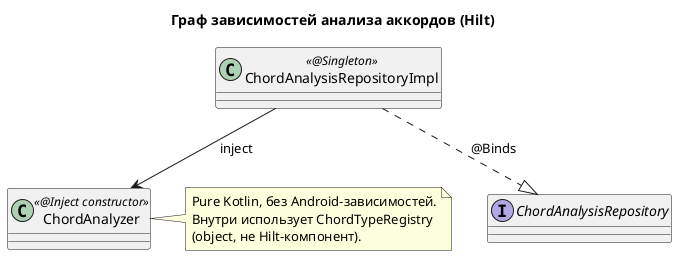
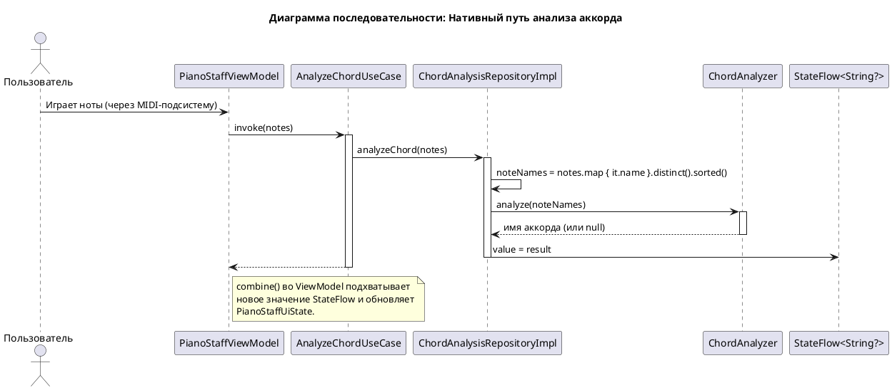

# Техническое задание: Нативный анализ аккордов на Kotlin

## 1. Общая информация

### 1.1. Назначение

Подсистема анализа аккордов обеспечивает синхронное платформо-независимое распознавание аккордов и одиночных нот. Реализация — доменный сервис на чистом Kotlin без Android-зависимостей, пригодный для переиспользования на других платформах (см. `docs/ru/plans/ARCHITECTURE_PRINCIPLES.md` §11).

Поведение:

1. Принимает список названий нот вида `["C4", "E4", "G4"]`.
2. Для **двух и более** нот — возвращает строку имени аккорда (`"C"`, `"Am"`, `"G7"`, `"Em#5/C"` и т. п.) либо `null`, если совпадение не найдено.
3. Для **одной** ноты — возвращает ее энгармонически упрощенное имя (например, `E#4 → F4`, `Cb4 → B3`, `Cx4 → D4`, `Ebb4 → D4`).
4. Сохраняет энгармоническое написание входных нот в имени аккорда (`Db` остается `Db`, не превращается в `C#`).
5. Возвращает результат **синхронно** — без callback-ов и переходов через main-loop.

Реактивный контракт `ChordAnalysisRepository.chordAnalysisResult: StateFlow<String?>` доставляет результат в Presentation-слой.

### 1.2. Базовые документы

- [Архитектурные принципы](../plans/ARCHITECTURE_PRINCIPLES.md)
- [Техническое задание: Обработка MIDI-сообщений](./MIDI_MESSAGE_PROCESSING.md)
- [Стратегия тестирования](../plans/TESTING_STRATEGY.md)

## 2. Архитектурное решение

### 2.1. Компоненты

Подсистема анализа аккордов располагается в Domain-слое как сервис на чистом Kotlin. В Data-слое находится только адаптер `ChordAnalysisRepositoryImpl`, удерживающий реактивное состояние и делегирующий анализ доменному сервису.

**Domain Layer**
- **`Pitch`** (`domain.model.music`): разобранная нота — буква, альтерация, октава (nullable), MIDI-номер (nullable), chroma. Чистая data-модель.
- **`ChordType`** (`domain.model.music`): один тип аккорда — 12-битный chroma и основной символ (например, `"M"`, `"m"`, `"7"`, `"m7"`).
- **`ChordTypeRegistry`** (`domain.service.analysis`): internal-объект, владеющий встроенной таблицей из 106 типов аккордов и индексным lookup-ом `Map<chroma, List<ChordType>>`. Загружается один раз через lazy-инициализацию.
- **`ChordAnalyzer`** (`domain.service.analysis`): публичный доменный сервис с единственной точкой входа `analyze(noteNames: List<String>): String?`. Внутри выполняет парсинг нот, извлечение pitch class-ов, поиск аккорда и форматирование вывода. При одной входной ноте выполняет энгармоническое упрощение.

**Data Layer**
- **`ChordAnalysisRepositoryImpl`**: содержит `MutableStateFlow<String?>` и публичный метод `analyzeChord(notes: List<Note>)`. Дедуплицирует и сортирует имена нот, затем синхронно вызывает `ChordAnalyzer.analyze(...)` и записывает результат напрямую в `StateFlow`. Без многопоточности и платформенных зависимостей.

#### 2.1.1. C4 Level 2: Контейнеры

```plantuml
@startuml
!include https://raw.githubusercontent.com/plantuml-stdlib/C4-PlantUML/master/C4_Container.puml

title C4 - Level 2: Подсистема анализа аккордов

Person(user, "Пользователь", "Музыкант, играющий на клавиатуре")

System_Boundary(piano_flow, "Приложение PianoFlow") {
    Container(vm, "PianoStaffViewModel", "Kotlin", "Координирует анализ и обновляет UI-состояние")
    Container(analyze_chord, "AnalyzeChordUseCase", "Kotlin", "Запускает анализ (fire-and-forget)")
    Container(observe_chord, "ObserveChordAnalysisResultsUseCase", "Kotlin Flow", "Поставляет результаты анализа")
    Container(chord_repo, "ChordAnalysisRepository", "Kotlin", "Абстракция анализа аккордов")
    Container(chord_repo_impl, "ChordAnalysisRepositoryImpl", "Kotlin", "Реализация, держит StateFlow")
    Container(chord_analyzer, "ChordAnalyzer", "Pure Kotlin", "Нативный движок распознавания аккордов")
}

Rel(vm, analyze_chord, "analyzeChord()")
Rel(vm, observe_chord, "observeChordAnalysisResults()")
Rel(analyze_chord, chord_repo, "analyzeChord()")
Rel(observe_chord, chord_repo, "observeChordAnalysisResults()")
Rel(chord_repo_impl, chord_repo, "@Binds")
Rel(chord_repo_impl, chord_analyzer, "Делегирует analyze()")

@enduml
```

#### 2.1.2. C4 Level 3: Компоненты подсистемы анализа аккордов

```plantuml
@startuml
!include https://raw.githubusercontent.com/plantuml-stdlib/C4-PlantUML/master/C4_Component.puml

title C4 - Level 3: Компоненты нативного анализа аккордов

Container_Boundary(presentation, "Presentation Layer") {
    Component(vm, "PianoStaffViewModel", "ViewModel", "Вызывает анализ, получает результаты")
}

Container_Boundary(domain, "Domain Layer") {
    Component(analyze_chord_uc, "AnalyzeChordUseCase", "Use Case", "Fire-and-forget анализ")
    Component(observe_chord_uc, "ObserveChordAnalysisResultsUseCase", "Use Case", "Подписка на результаты")
    Component(chord_repo, "ChordAnalysisRepository", "Interface", "Контракт анализа аккордов")
    Component(chord_analyzer, "ChordAnalyzer", "Domain Service", "Публичный API: analyze(noteNames): String?")
    Component(chord_registry, "ChordTypeRegistry", "Internal Object", "106 типов аккордов + индекс по chroma")
    Component(pitch_model, "Pitch", "Model", "Разобранная нота: буква, альтерация, октава, MIDI, chroma")
    Component(chord_type_model, "ChordType", "Model", "chroma + символ")
}

Container_Boundary(data, "Data Layer") {
    Component(chord_repo_impl, "ChordAnalysisRepositoryImpl", "Repository Impl", "Владеет StateFlow, делегирует ChordAnalyzer")
}

Rel(vm, analyze_chord_uc, "analyzeChord()")
Rel(vm, observe_chord_uc, "observeChordAnalysisResults()")
Rel(analyze_chord_uc, chord_repo, "analyzeChord()")
Rel(observe_chord_uc, chord_repo, "observeChordAnalysisResults()")
Rel(chord_repo_impl, chord_repo, "@Binds")
Rel(chord_repo_impl, chord_analyzer, "Использует")
Rel(chord_analyzer, chord_registry, "Ищет типы аккордов")
Rel(chord_analyzer, pitch_model, "Парсит вход")
Rel(chord_registry, chord_type_model, "Содержит")

@enduml
```

### 2.2. API и модели данных

**Domain Layer:**

```kotlin
// com.astrizhachuk.pianoflow.domain.model.music.Pitch.kt
/**
 * Разобранная нота. Внутреннее представление, используемое движком анализа.
 *
 * @param letter Буква ноты 'A'..'G'.
 * @param alter Знак альтерации: -2 (bb), -1 (b), 0 (натуральная), +1 (#), +2 (x).
 * @param octave Номер октавы либо null, если входное имя не содержит октаву.
 * @param midi MIDI-номер (0..127), когда октава задана и попадает в диапазон, иначе null.
 * @param chroma Pitch class 0..11 (полутоны от C, по модулю 12).
 */
internal data class Pitch(
    val letter: Char,
    val alter: Int,
    val octave: Int?,
    val midi: Int?,
    val chroma: Int
)

// com.astrizhachuk.pianoflow.domain.model.music.ChordType.kt
/**
 * Один тип аккорда из реестра.
 *
 * @param chroma 12-битная битовая маска pitch class-ов; бит 0 = корень присутствует.
 * @param symbol Основной символ аккорда, добавляемый к имени корневой ноты (например, "M", "m", "7").
 */
internal data class ChordType(
    val chroma: Int,
    val symbol: String
)

// com.astrizhachuk.pianoflow.domain.service.analysis.ChordAnalyzer.kt
/**
 * Доменный сервис нативного анализа аккордов и одиночных нот. Pure Kotlin, без платформенных зависимостей.
 *
 * Синхронный, main-safe.
 */
class ChordAnalyzer @Inject constructor() {
    /**
     * Анализирует список названий нот.
     *
     * @param noteNames Отсортированный список названий нот без дубликатов (например, ["C4", "E4", "G4"]).
     *     Пустой список или список только из невалидных нот возвращает null.
     *     Одна валидная нота возвращает ее энгармонически упрощенное имя.
     *     Две и более валидные ноты возвращают имя аккорда либо null, если ни один тип не совпал.
     * @return Имя аккорда, упрощенное имя ноты либо null.
     */
    fun analyze(noteNames: List<String>): String?
}

// com.astrizhachuk.pianoflow.domain.repository.ChordAnalysisRepository.kt
interface ChordAnalysisRepository {
    val chordAnalysisResult: StateFlow<String?>
    fun analyzeChord(notes: List<Note>)
}
```

Интерфейс `ChordAnalysisRepository` — стабильная граница между подсистемой анализа аккордов и ее потребителями (`AnalyzeChordUseCase`, `ObserveChordAnalysisResultsUseCase`, `PianoStaffViewModel`).

### 2.3. Граф зависимостей

Подсистема анализа аккордов использует Hilt для внедрения зависимостей.



`ChordAnalyzer` помечен `@Inject constructor` и не имеет состояния. `ChordAnalysisRepositoryImpl` — `@Singleton`, держит `StateFlow` с результатом анализа. Подсистема не требует Hilt-провайдеров для `WebView`, `Gson` и других JS-рантаймов.

## 3. Алгоритм

Алгоритм состоит из чистой арифметики и поиска по таблицам — без внешних зависимостей. Конвенции следуют Tonal.js v6 (`Tonal.Chord.detect` и `Tonal.Note.simplify`); поведение совместимо с этой библиотекой.

### 3.1. Парсинг названий нот

Грамматика входа: `^([A-Ga-g])([#b]+|x)?(-?\d+)?$`. Парсер должен принимать:

- Простые буквы: `C`, `D`, ..., `B` (регистр не важен)
- Диезы и бемоли: `C#`, `Bb`, `F##`, `Bbb`
- Сокращение для двойного диеза: `Cx` (эквивалент `C##`) — ровно один `x`; смешивание `x` с `#` или `b`, а также повторение `x` недопустимы
- Октава (опционально): целое число, может быть отрицательным — `C-1`, `C0`, `C4`, `G9`

Парсинг возвращает `Pitch`:

- `letter` — буква в верхнем регистре.
- `alter` = `(количество #) − (количество b) + (2, если присутствует x, иначе 0)`. Смешивание `#` и `b`, смешивание `x` с чем-либо еще или повторение `x` недопустимо и возвращает `null`.
- `octave` — разобранное целое или `null` при отсутствии.
- `chroma` = `(letterChroma[letter] + alter + 12) mod 12`, где таблица буква → chroma: `{C:0, D:2, E:4, F:5, G:7, A:9, B:11}`.
- `midi` = `(octave + 1) * 12 + letterChroma[letter] + alter`, если octave задан и результат лежит в `0..127`; иначе `null`. Альтерация сдвигает MIDI без обертки октавы, поэтому `B#4 → 72` (звучит как `C5`) и `Cb4 → 59` (звучит как `B3`).

Пустые строки, невалидные строки и неизвестные буквы (например, `H`) возвращают `null`.

### 3.2. Распознавание аккорда (N ≥ 2 валидных нот)

#### Шаг 1 — Извлечение pitch class-ов

Из каждой ноты убирается октава, остается pitch class. Невалидные ноты тихо отбрасываются.

```
["C4", "E4", "G4"]  →  ["C", "E", "G"]
["F#3", "A3", "C4"] →  ["F#", "A", "C"]
```

#### Шаг 2 — Построение таблицы chroma → имя

Строится `Map<Int, String>` от chroma-индекса к **первому** входному названию ноты с этим chroma. Это сохраняет энгармоническое написание, переданное вызывающим:

```
["Db", "F", "Ab"]  →  {1:"Db", 5:"F", 8:"Ab"}
["C#", "F", "G#"]  →  {1:"C#", 5:"F", 8:"G#"}
```

Оба входа представляют одни и те же высоты, но дают разные написания на выходе.

#### Шаг 3 — Построение chroma-битовой маски

Множество pitch class-ов представляется 12-битным значением (бит `i` установлен, если chroma `i` присутствует):

```
["C", "E", "G"]  →  биты {0, 4, 7}  →  binary 100010010000
```

Реализация может использовать 12-битный `Int` и `Integer.rotateRight` по младшим 12 битам либо 12-символьную `String` со строковой ротацией — оба варианта дают идентичный результат. Эталонная реализация выбирает форму на `Int` ради производительности.

#### Шаг 4 — Перебор всех 12 ротаций

Для каждого `u` в `0..11` вычисляется битовая маска, повернутая так, чтобы chroma `u` стал новым битом 0 («какие интервалы образовали бы эти ноты, если бы `u` был корнем?»).

Только ротации, у которых новый бит 0 установлен, могут совпасть с каким-либо типом аккорда, поскольку в каждом типе из реестра бит 0 = `1` (корень всегда присутствует). Это дает быстрый выход для нерелевантных ротаций.

#### Шаг 5 — Сопоставление с реестром типов аккордов

Для каждой ротированной маски ищутся все записи `ChordType`, у которых поле `chroma` равно ротации. Несколько типов могут иметь одинаковый chroma — все совпадения собираются.

```
"100010010000"  →  совпадает с "M"     → корень C  → аккорд "CM"
"100100001000"  →  совпадает с "m#5"   → корень E  → аккорд "Em#5" (обращение До мажора)
"100001000100"  →  нет совпадений
```

#### Шаг 6 — Назначение веса и формирование имени

Пусть `bassChroma` = chroma первой входной ноты (после дедупликации — самой ранней по сортировке). Для каждого совпадения на ротации `u`:

- `u == bassChroma` (корень совпадает с басовой нотой) — **вес 1.0**, имя = `"<корень><символ>"` (например, `"CM"`).
- `u != bassChroma` (обращение) — **вес 0.5**, имя = `"<корень><символ>/<басовое_имя>"` (например, `"Em#5/C"`).

Имя корневой ноты берется из таблицы chroma → имя, построенной на Шаге 2; если в таблице нет записи для chroma `u` (потому что ротация попала на chroma, отсутствующий во входе), такой случай никогда не дает совпадение — имена корней нужны только для chroma, которые уже есть в таблице.

#### Шаг 7 — Сортировка и выбор лучшего

Отфильтровать результаты до `weight > 0`, отсортировать по убыванию веса, взять **первый**.

```
detect(["C4","E4","G4"])  →  ["CM", "Em#5/C"]   →  "CM"
detect(["E4","G4","C5"])  →  ["Em#5", "CM/E"]   →  "Em#5"
detect(["A4","C5","E5"])  →  ["Am"]             →  "Am"
detect(["C4","D4","E4"])  →  []                 →  null
```

#### Шаг 8 — Форматирование вывода

Концевая `M` срезается, чтобы мажор в основной позиции отображался как `"C"`, а не `"CM"`:

- Если кандидат заканчивается на `M` (с учетом регистра), убрать концевую `M`. Примеры: `"CM" → "C"`, `"DbM" → "Db"`.
- Иначе оставить кандидата без изменений. Примеры: `"Am"`, `"G7"`, `"Em#5/C"`, `"CM/E"` (форма обращения сохраняет `M`, потому что она не в конце строки).

Правило форматирования намеренно минималистично — более агрессивная обработка сломала бы формы вида `Em#5/C` и `CM/E`, легитимно содержащие `M` в середине.

### 3.3. Упрощение одиночной ноты (N = 1 валидная нота)

Прямой порт `Tonal.Note.simplify`:

1. Разобрать вход в `Pitch`. Если парсинг провалился, вернуть `null`.
2. Выбрать хроматический ряд по знаку `alter`:
   - `alter > 0` → **диезный** ряд: `["C", "C#", "D", "D#", "E", "F", "F#", "G", "G#", "A", "A#", "B"]`.
   - `alter ≤ 0` → **бемольный** ряд: `["C", "Db", "D", "Eb", "E", "F", "Gb", "G", "Ab", "A", "Bb", "B"]`.
3. Взять имя ноты по индексу `chroma` из выбранного ряда.
4. Если у входа была октава: добавить пересчитанную октаву `floor(midi / 12) − 1`. Это автоматически обрабатывает межоктавные случаи (например, `B#4 → C5`, `Cb4 → B3`).
5. Если у входа не было октавы (например, `"E#"`), на выходе октава тоже опускается (`"F"`).

| Вход   | MIDI | alter | Диезы? | Chroma | Результат |
|--------|------|-------|--------|--------|-----------|
| `C4`   | 60   | 0     | нет    | 0      | `C4`      |
| `G#4`  | 68   | +1    | да     | 8      | `G#4`     |
| `Ab4`  | 68   | -1    | нет    | 8      | `Ab4`     |
| `E#4`  | 65   | +1    | да     | 5      | `F4`      |
| `Fb4`  | 64   | -1    | нет    | 4      | `E4`      |
| `B#4`  | 72   | +1    | да     | 0      | `C5`      |
| `Cb4`  | 59   | -1    | нет    | 11     | `B3`      |
| `Cx4`  | 62   | +2    | да     | 2      | `D4`      |
| `Ebb4` | 62   | -2    | нет    | 2      | `D4`      |

### 3.4. Маршрутизация

`ChordAnalyzer.analyze(noteNames)` диспатчит по количеству **валидных** разобранных pitch-ей (после тихой фильтрации некорректных входов):

| Валидных pitch-ей | Поведение |
|-------------------|-----------|
| 0                 | возврат `null` |
| 1                 | упрощение одиночной ноты (3.3) |
| ≥ 2               | распознавание аккорда (3.2), затем форматирование вывода (Шаг 8) |

## 4. Поведение и граничные случаи

| Вход | Поведение |
|------|-----------|
| `[]` | `null` |
| `["Z4"]` (полностью невалидный) | `null` |
| `["C4", "Z4", "E4"]` | невалидные отброшены → 2 pitch-а → распознавание аккорда |
| `["C4", "Z4"]` | невалидные отброшены → 1 pitch → упрощение → `"C4"` |
| `["C4", "C4"]` (строковый дубликат) | вышестоящий репозиторий уже вызывает `.distinct()`; анализатор дополнительно дедуплицирует по chroma, оставляя первое написание |
| `["C#4", "Db4"]` (разные написания, одинаковый chroma) | первое написание побеждает (после сортировки в репозитории) → только один pitch class, аккорд не распознается → `null` |
| `["C4", "D4", "E4"]` (нет совпадающего типа аккорда) | `null` |

**Энгармоническая стабильность.** Таблица chroma → имя строится в порядке поступления входов. Репозиторий сортирует имена нот лексикографически до вызова анализатора, так что `["C#4", "Db4"]` детерминированно сводится к написанию, идущему первым по сортировке.

**Логирование.** `ChordAnalyzer` — pure Kotlin и не зависит от Timber или какого-либо логгера. Диагностическое логирование остается в `ChordAnalysisRepositoryImpl` (Data-слой): `Timber.d` на входе, `Timber.e` на пойманных исключениях.

**Исключения.** Ни парсер, ни реестр не бросают исключения. `analyze()` тотален: возвращает `null` при любом входе, который не удается классифицировать. `try/catch` в `ChordAnalysisRepositoryImpl` сохраняется как defense-in-depth.

**Производительность.** Алгоритм работает за O(1) по размеру входа (12 ротаций, каждая — O(1) lookup в hash-индексе chroma). Худший случай — менее миллисекунды.

## 5. Жизненный цикл и взаимодействие

### 5.1. Принцип работы

1. `PianoStaffViewModel` наблюдает за `ObserveMidiMessagesUseCase` (поток `List<Note>` из MIDI-подсистемы).
2. На каждый новый список вызывает `AnalyzeChordUseCase(notes)` (fire-and-forget).
3. `AnalyzeChordUseCase` вызывает `ChordAnalysisRepository.analyzeChord(notes)`.
4. `ChordAnalysisRepositoryImpl` дедуплицирует и сортирует имена нот, затем синхронно вызывает `ChordAnalyzer.analyze(noteNames)`.
5. Результат напрямую записывается в `StateFlow<String?>`, без перехода между потоками.
6. `ObserveChordAnalysisResultsUseCase` отдает `StateFlow` во view-model, которая объединяет его с потоком нот в `PianoStaffUiState`.



Последовательность полностью синхронна на потоке вызывающего `analyzeChord`: без переключений потоков, без callback-ов, без асинхронной инициализации.

### 5.2. Внутренняя структура `ChordAnalyzer.analyze`

```plantuml
@startuml
title Activity: ChordAnalyzer.analyze(noteNames)

start
:разобрать каждое имя в Pitch;
:отфильтровать null (невалидные);
if (pitches.isEmpty()) then (да)
  :вернуть null;
  stop
endif
if (pitches.size == 1) then (да)
  :упростить одиночный pitch;
  :вернуть имя;
  stop
endif
:построить таблицу chroma -> имя;
:построить chroma-битовую маску;
:bassChroma = pitches[0].chroma;
:results = []
;
repeat
  :ротация маски на u;
  if (бит 0 ротации == 1) then (да)
    :поиск типов аккордов в реестре;
    repeat
      if (u == bassChroma) then (да)
        :weight = 1.0
        name = root + symbol;
      else (нет)
        :weight = 0.5
        name = root + symbol + "/" + bass;
      endif
      :push (weight, name);
    repeat while (еще типы?)
  endif
repeat while (u < 12)
if (results.isEmpty()) then (да)
  :вернуть null;
  stop
endif
:сортировка по weight desc;
:best = results[0].name;
:срезать концевую 'M';
:вернуть best;
stop

@enduml
```

## 6. Критерии приемки

### Функциональные

- Эталонные значения `chordAnalysisResult`:
  - `[C4, E4, G4]` → `"C"`
  - `[A4, C5, E5]` → `"Am"`
  - `[E4, G4, C5]` → `"Em#5/C"` (обращение До мажора)
  - `[C4, D4, E4]` → `null`
  - `[C4]` → `"C4"` (упрощение, без изменений)
  - `[E#4]` → `"F4"` (упрощение)
  - `[Cb4]` → `"B3"` (упрощение, межоктавный случай)
- Одиночные ноты возвращают свое упрощенное имя, никогда не имя аккорда. Невалидные одиночные входы возвращают `null`.
- Несколько нот, не совпадающих ни с одним типом, возвращают `null`. Presentation-слой интерпретирует `null` как «Не определен».

### Архитектурные

- `app/src/main/java/com/astrizhachuk/pianoflow/domain/` не содержит ссылок на `android.*` и `androidx.*`.
- `ChordAnalysisRepositoryImpl` не содержит ссылок на `WebView`, `Handler` и `Looper` (синхронно, без платформенной многопоточности).

### Тестирование

- Все тесты в `app/src/test/` проходят `./gradlew test`.
- `ChordAnalyzerTest` покрывает: базовые трезвучия (мажор, минор, уменьшенное, увеличенное), септаккорды, sus2/sus4, нон/ундец/тредецим, альтерированные, обращения, варианты энгармонического написания, дубликаты, частично невалидный вход, полностью невалидный вход, пустой список, упрощение одиночной ноты (диезы, бемоли, двойные альтерации, межоктавные случаи), имена без октавы.
- `PitchTest` покрывает: валидные буквы, валидные альтерации (`#`, `##`, `b`, `bb`, `x`, `xx`), валидные октавы (отрицательные и большие), вычисление MIDI, невалидные буквы (`H`), смешанные альтерации (`C#b`), пустой вход.
- `ChordTypeRegistryTest` покрывает: размер реестра = 106; каждый chroma ровно из 12 бит; в каждом chroma установлен бит 0; индекс возвращает все записи; spot-проверки известных типов (`M`, `m`, `7`, `m7`, `dim`, `aug`).
- `ChordAnalysisRepositoryImplTest` запускается как обычный JUnit + MockK + Turbine, без Robolectric.

### Сборка

- `./gradlew assembleDebug` собирается успешно.
- `./gradlew assembleRelease` собирается успешно (R8 включен).
- `./gradlew lint` не дает новых предупреждений.

### Ручной smoke-тест

- Запустить приложение на устройстве с подключенной MIDI-клавиатурой, сыграть минимум одно мажорное трезвучие, одно минорное трезвучие, одно обращение и одну одиночную ноту; убедиться, что отображаемое имя аккорда соответствует строке таблицы выше.

## Приложение A: База типов аккордов (106 записей)

Источник: `Tonal.ChordType.all()` v6, перенесено для встроенного реестра. Каждая строка дает в реестр один `ChordType(chroma, symbol)`, где `chroma` — 12-битная строка, разобранная в `Int`, а `symbol` — **первый** алиас (ведущая запись в колонке `aliases`).

Реализация может организовать таблицу для удобства чтения (один константный список, сгруппирован по quality и т. п.), пока все 106 записей присутствуют и индекс возвращает каждую запись.

| # | name | aliases | intervals | chroma | quality |
|---|------|---------|-----------|--------|---------|
| 1 | fifth | `5` | 1P 5P | `100000010000` | Unknown |
| 2 | | `M7#5sus4` | 1P 4P 5A 7M | `100001001001` | Augmented |
| 3 | | `7#5sus4` | 1P 4P 5A 7m | `100001001010` | Augmented |
| 4 | suspended fourth | `sus4` `sus` | 1P 4P 5P | `100001010000` | Unknown |
| 5 | | `M7sus4` | 1P 4P 5P 7M | `100001010001` | Unknown |
| 6 | suspended fourth seventh | `7sus4` `7sus` | 1P 4P 5P 7m | `100001010010` | Unknown |
| 7 | | `7no5` | 1P 3M 7m | `100010000010` | Major |
| 8 | augmented | `aug` `+` `+5` `^#5` | 1P 3M 5A | `100010001000` | Augmented |
| 9 | major seventh flat sixth | `M7b6` `^7b6` | 1P 3M 6m 7M | `100010001001` | Major |
| 10 | augmented seventh | `maj7#5` `maj7+5` `+maj7` `^7#5` | 1P 3M 5A 7M | `100010001001` | Augmented |
| 11 | | `7#5` `+7` `7+` `7aug` `aug7` | 1P 3M 5A 7m | `100010001010` | Augmented |
| 12 | | `7b13` | 1P 3M 7m 13m | `100010001010` | Major |
| 13 | major | `M` `^` `` `maj` | 1P 3M 5P | `100010010000` | Major |
| 14 | major seventh | `maj7` `Δ` `ma7` `M7` `Maj7` `^7` | 1P 3M 5P 7M | `100010010001` | Major |
| 15 | dominant seventh | `7` `dom` | 1P 3M 5P 7m | `100010010010` | Major |
| 16 | sixth | `6` `add6` `add13` `M6` | 1P 3M 5P 6M | `100010010100` | Major |
| 17 | | `7add6` `67` `7add13` | 1P 3M 5P 7m 13M | `100010010110` | Major |
| 18 | | `7b6` | 1P 3M 5P 6m 7m | `100010011010` | Major |
| 19 | | `Mb5` | 1P 3M 5d | `100010100000` | Major |
| 20 | | `M7b5` | 1P 3M 5d 7M | `100010100001` | Major |
| 21 | | `7b5` | 1P 3M 5d 7m | `100010100010` | Major |
| 22 | major seventh sharp eleventh | `maj#4` `Δ#4` `Δ#11` `M7#11` `^7#11` `maj7#11` | 1P 3M 5P 7M 11A | `100010110001` | Major |
| 23 | lydian dominant seventh | `7#11` `7#4` | 1P 3M 5P 7m 11A | `100010110010` | Major |
| 24 | | `M6#11` `M6b5` `6#11` `6b5` | 1P 3M 5P 6M 11A | `100010110100` | Major |
| 25 | | `7#11b13` `7b5b13` | 1P 3M 5P 7m 11A 13m | `100010111010` | Major |
| 26 | minor augmented | `m#5` `-#5` `m+` | 1P 3m 5A | `100100001000` | Augmented |
| 27 | | `mb6M7` | 1P 3m 6m 7M | `100100001001` | Minor |
| 28 | | `m7#5` | 1P 3m 6m 7m | `100100001010` | Minor |
| 29 | minor | `m` `min` `-` | 1P 3m 5P | `100100010000` | Minor |
| 30 | minor/major seventh | `m/ma7` `m/maj7` `mM7` `mMaj7` `m/M7` `-Δ7` `mΔ` `-^7` `-maj7` | 1P 3m 5P 7M | `100100010001` | Minor |
| 31 | minor seventh | `m7` `min7` `mi7` `-7` | 1P 3m 5P 7m | `100100010010` | Minor |
| 32 | minor sixth | `m6` `-6` | 1P 3m 5P 6M | `100100010100` | Minor |
| 33 | | `mMaj7b6` | 1P 3m 5P 6m 7M | `100100011001` | Minor |
| 34 | diminished | `dim` `°` `o` | 1P 3m 5d | `100100100000` | Diminished |
| 35 | | `oM7` | 1P 3m 5d 7M | `100100100001` | Diminished |
| 36 | half-diminished | `m7b5` `ø` `-7b5` `h7` `h` | 1P 3m 5d 7m | `100100100010` | Diminished |
| 37 | diminished seventh | `dim7` `°7` `o7` | 1P 3m 5d 7d | `100100100100` | Diminished |
| 38 | | `o7M7` | 1P 3m 5d 6M 7M | `100100100101` | Diminished |
| 39 | | `4` `quartal` | 1P 4P 7m 10m | `100101000010` | Unknown |
| 40 | | `madd4` | 1P 3m 4P 5P | `100101010000` | Minor |
| 41 | | `m7add11` `m7add4` | 1P 3m 5P 7m 11P | `100101010010` | Minor |
| 42 | | `+add#9` | 1P 3M 5A 9A | `100110001000` | Augmented |
| 43 | | `7#5#9` `7#9#5` `7alt` | 1P 3M 5A 7m 9A | `100110001010` | Augmented |
| 44 | dominant sharp ninth | `7#9` | 1P 3M 5P 7m 9A | `100110010010` | Major |
| 45 | | `13#9` | 1P 3M 5P 7m 9A 13M | `100110010110` | Major |
| 46 | | `7#9b13` | 1P 3M 5P 7m 9A 13m | `100110011010` | Major |
| 47 | | `maj7#9#11` | 1P 3M 5P 7M 9A 11A | `100110110001` | Major |
| 48 | | `7#9#11` `7b5#9` `7#9b5` | 1P 3M 5P 7m 9A 11A | `100110110010` | Major |
| 49 | | `13#9#11` | 1P 3M 5P 7m 9A 11A 13M | `100110110110` | Major |
| 50 | | `7#9#11b13` | 1P 3M 5P 7m 9A 11A 13m | `100110111010` | Major |
| 51 | suspended second | `sus2` | 1P 2M 5P | `101000010000` | Unknown |
| 52 | | `M9#5sus4` | 1P 4P 5A 7M 9M | `101001001001` | Augmented |
| 53 | | `sus24` `sus4add9` | 1P 2M 4P 5P | `101001010000` | Unknown |
| 54 | | `M9sus4` | 1P 4P 5P 7M 9M | `101001010001` | Unknown |
| 55 | eleventh | `11` | 1P 5P 7m 9M 11P | `101001010010` | Unknown |
| 56 | | `9sus4` `9sus` | 1P 4P 5P 7m 9M | `101001010010` | Unknown |
| 57 | | `13sus4` `13sus` | 1P 4P 5P 7m 9M 13M | `101001010110` | Unknown |
| 58 | | `9no5` | 1P 3M 7m 9M | `101010000010` | Major |
| 59 | | `13no5` | 1P 3M 7m 9M 13M | `101010000110` | Major |
| 60 | | `M#5add9` `+add9` | 1P 3M 5A 9M | `101010001000` | Augmented |
| 61 | | `maj9#5` `Maj9#5` | 1P 3M 5A 7M 9M | `101010001001` | Augmented |
| 62 | | `9#5` `9+` | 1P 3M 5A 7m 9M | `101010001010` | Augmented |
| 63 | | `9b13` | 1P 3M 7m 9M 13m | `101010001010` | Major |
| 64 | | `Madd9` `2` `add9` `add2` | 1P 3M 5P 9M | `101010010000` | Major |
| 65 | major ninth | `maj9` `Δ9` `^9` | 1P 3M 5P 7M 9M | `101010010001` | Major |
| 66 | dominant ninth | `9` | 1P 3M 5P 7m 9M | `101010010010` | Major |
| 67 | sixth added ninth | `6add9` `6/9` `69` `M69` | 1P 3M 5P 6M 9M | `101010010100` | Major |
| 68 | major thirteenth | `maj13` `Maj13` `^13` | 1P 3M 5P 7M 9M 13M | `101010010101` | Major |
| 69 | | `M7add13` | 1P 3M 5P 6M 7M 9M | `101010010101` | Major |
| 70 | dominant thirteenth | `13` | 1P 3M 5P 7m 9M 13M | `101010010110` | Major |
| 71 | | `M9b5` | 1P 3M 5d 7M 9M | `101010100001` | Major |
| 72 | | `9b5` | 1P 3M 5d 7m 9M | `101010100010` | Major |
| 73 | | `13b5` | 1P 3M 5d 6M 7m 9M | `101010100110` | Major |
| 74 | | `9#5#11` | 1P 3M 5A 7m 9M 11A | `101010101010` | Augmented |
| 75 | major sharp eleventh (lydian) | `maj9#11` `Δ9#11` `^9#11` | 1P 3M 5P 7M 9M 11A | `101010110001` | Major |
| 76 | | `9#11` `9+4` `9#4` | 1P 3M 5P 7m 9M 11A | `101010110010` | Major |
| 77 | | `69#11` | 1P 3M 5P 6M 9M 11A | `101010110100` | Major |
| 78 | | `M13#11` `maj13#11` `M13+4` `M13#4` | 1P 3M 5P 7M 9M 11A 13M | `101010110101` | Major |
| 79 | | `13#11` `13+4` `13#4` | 1P 3M 5P 7m 9M 11A 13M | `101010110110` | Major |
| 80 | | `9#11b13` `9b5b13` | 1P 3M 5P 7m 9M 11A 13m | `101010111010` | Major |
| 81 | | `m9#5` | 1P 3m 6m 7m 9M | `101100001010` | Minor |
| 82 | | `madd9` | 1P 3m 5P 9M | `101100010000` | Minor |
| 83 | minor/major ninth | `mM9` `mMaj9` `-^9` | 1P 3m 5P 7M 9M | `101100010001` | Minor |
| 84 | minor ninth | `m9` `-9` | 1P 3m 5P 7m 9M | `101100010010` | Minor |
| 85 | | `m69` `-69` | 1P 3m 5P 6M 9M | `101100010100` | Minor |
| 86 | minor thirteenth | `m13` `-13` | 1P 3m 5P 7m 9M 13M | `101100010110` | Minor |
| 87 | | `mMaj9b6` | 1P 3m 5P 6m 7M 9M | `101100011001` | Minor |
| 88 | | `m9b5` | 1P 2M 3m 5d 7m | `101100100010` | Diminished |
| 89 | | `m11A` | 1P 3m 5A 7m 9M 11P | `101101001010` | Augmented |
| 90 | minor eleventh | `m11` `-11` | 1P 3m 5P 7m 9M 11P | `101101010010` | Minor |
| 91 | suspended fourth flat ninth | `b9sus` `phryg` `7b9sus` `7b9sus4` | 1P 4P 5P 7m 9m | `110001010010` | Unknown |
| 92 | | `11b9` | 1P 5P 7m 9m 11P | `110001010010` | Unknown |
| 93 | | `7sus4b9b13` `7b9b13sus4` | 1P 4P 5P 7m 9m 13m | `110001011010` | Unknown |
| 94 | altered | `alt7` | 1P 3M 7m 9m | `110010000010` | Major |
| 95 | | `7#5b9` `7b9#5` | 1P 3M 5A 7m 9m | `110010001010` | Augmented |
| 96 | | `Maddb9` | 1P 3M 5P 9m | `110010010000` | Major |
| 97 | | `M7b9` | 1P 3M 5P 7M 9m | `110010010001` | Major |
| 98 | dominant flat ninth | `7b9` | 1P 3M 5P 7m 9m | `110010010010` | Major |
| 99 | | `13b9` | 1P 3M 5P 7m 9m 13M | `110010010110` | Major |
| 100 | | `7b9b13` | 1P 3M 5P 7m 9m 13m | `110010011010` | Major |
| 101 | | `7#5b9#11` | 1P 3M 5A 7m 9m 11A | `110010101010` | Augmented |
| 102 | | `7b9#11` `7b5b9` `7b9b5` | 1P 3M 5P 7m 9m 11A | `110010110010` | Major |
| 103 | | `13b9#11` | 1P 3M 5P 7m 9m 11A 13M | `110010110110` | Major |
| 104 | | `7b9b13#11` `7b9#11b13` `7b5b9b13` | 1P 3M 5P 7m 9m 11A 13m | `110010111010` | Major |
| 105 | | `mb6b9` | 1P 3m 6m 9m | `110100001000` | Minor |
| 106 | | `7b9#9` | 1P 3M 5P 7m 9m 9A | `110110010010` | Major |

Замечание: коллизии `chroma` намеренные. Следующие битмаски разделяются несколькими типами; реестр сохраняет все, и lookup возвращает все совпадающие записи:

| chroma | символы (первый алиас) |
|--------|--------|
| `100010001001` | `M7b6`, `maj7#5` |
| `100010001010` | `7#5`, `7b13` |
| `101001010010` | `11`, `9sus4` |
| `101010001010` | `9#5`, `9b13` |
| `101010010101` | `maj13`, `M7add13` |
| `110001010010` | `b9sus`, `11b9` |

При коллизии движок возвращает первый символ из списка выше (порядок вставки). Это совпадает с поведением Tonal.js, где список типов аккордов перебирается в порядке объявления.

Колонки `intervals`, `quality` и алиасы помимо первого — справочные данные, **не** требуются runtime-ом — только `chroma` и первичный алиас участвуют в сопоставлении и формировании вывода.

## Приложение B: Интервальная нотация

В колонке `intervals` выше используются следующие коды (справочно; не используются runtime-ом):

| Код | Значение | Полутонов |
|-----|----------|-----------|
| `1P` | Чистая прима | 0 |
| `2M` | Большая секунда | 2 |
| `2m` / `9m` | Малая секунда / бемольная нона | 1 |
| `3M` | Большая терция | 4 |
| `3m` | Малая терция | 3 |
| `4P` / `11P` | Чистая кварта / ундецима | 5 |
| `5P` | Чистая квинта | 7 |
| `5A` | Увеличенная квинта | 8 |
| `5d` | Уменьшенная квинта | 6 |
| `6M` / `13M` | Большая секста / тредецима | 9 |
| `6m` / `13m` | Малая секста / бемольная тредецима | 8 |
| `7M` | Большая септима | 11 |
| `7m` | Малая септима | 10 |
| `7d` | Уменьшенная септима | 9 |
| `9M` | Большая нона | 14 (= 2 mod 12) |
| `9A` | Увеличенная нона / диезная нона | 15 (= 3 mod 12) |
| `10m` | Малая децима | 15 (= 3 mod 12) |
| `11A` | Увеличенная ундецима / диезная ундецима | 18 (= 6 mod 12) |

Интервалы шире октавы (нона, ундецима, тредецима) отображаются в те же chroma-позиции, что и их внутриоктавные эквиваленты, поскольку chroma-битмаска работает по модулю 12.
