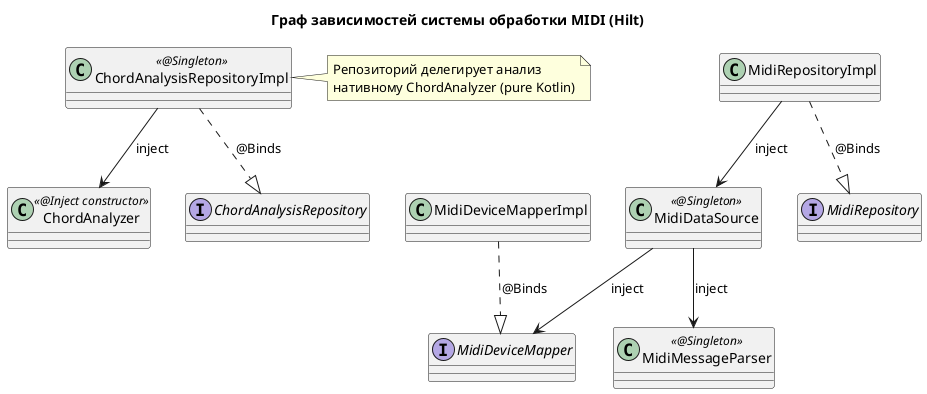
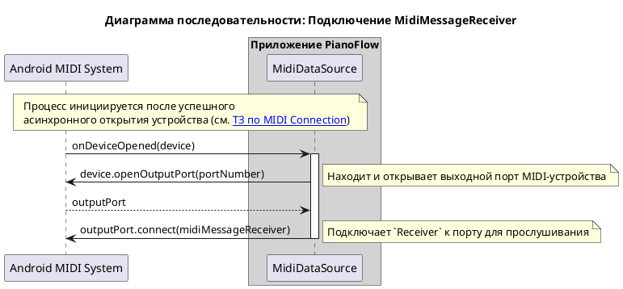
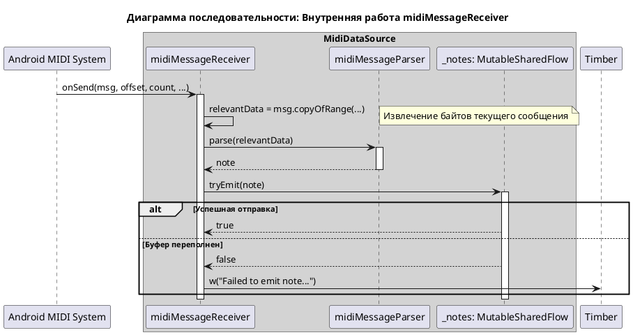
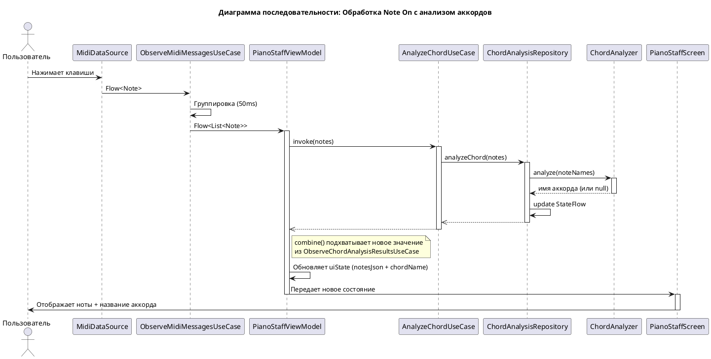
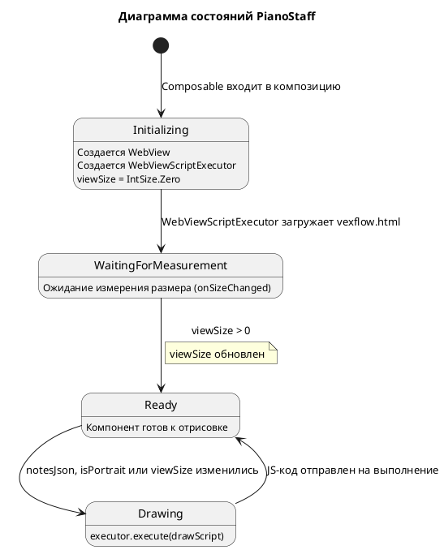

# Техническое задание: Реализация обработки и отображения MIDI-сообщений

## 1. Общая информация

### 1.1. Цель доработки

Реализовать функционал для приема, обработки, анализа и визуализации MIDI-сообщений (нот), поступающих от подключенной MIDI-клавиатуры. Основные задачи:
- Отображать сыгранные пользователем ноты и аккорды на нотном стане в реальном времени.
- Анализировать распознанные аккорды и отображать их названия (например, "C Major", "Am", "G7").
- Правильно обрабатывать одиночные ноты (не отображать их как неопознанные аккорды).

### 1.2. Базовые документы

- [Архитектурные принципы](../plans/ARCHITECTURE_PRINCIPLES.md)
- [Сценарии: Прием и отображение MIDI-сообщений](../uc/MIDI_MESSAGE_PROCESSING.md)
- [Техническое задание: Реализация отслеживания состояния подключения MIDI-клавиатуры](./MIDI_CONNECTION.md)

## 2. Архитектурное решение

### 2.1. Архитектурные диаграммы

Система обработки MIDI-сообщений интегрирована в существующую архитектуру, расширяя функционал `Data` и `Domain` слоев и добавляя новые компоненты в `Presentation` слой. Анализ аккордов выполняется встроенным движком `ChordAnalyzer` на чистом Kotlin (см. [Нативный анализ аккордов на Kotlin](./CHORD_ANALYSIS.md)).

**Data Layer**
- **`MidiDataSource`:** Расширен для обработки входящих MIDI-сообщений. После успешного открытия устройства (`MidiManager.openDevice`), он подключает `MidiReceiver` к **выходному порту** устройства (`MidiOutputPort`) для приема данных.
- **`MidiMessageReceiver`:** Внутренняя реализация `android.media.midi.MidiReceiver`, ответственная за прием сырых MIDI-данных (`byte[]`).
- **`MidiMessageParser`:** Компонент, который получает сырые данные от `MidiMessageReceiver`, парсит их и преобразует в доменную модель `Note`. Игнорирует все сообщения, кроме `Note On` (с velocity > 0).
- **`MidiRepositoryImpl`:** Реализация репозитория, которая предоставляет поток входящих нот.
- **`ChordAnalysisRepositoryImpl`:** Реализация репозитория анализа аккордов. Делегирует распознавание движку `ChordAnalyzer` синхронно и обновляет `StateFlow<String?>` напрямую без переходов между потоками.

**Domain Layer**
- **`Note`:** Доменная модель ноты (MIDI-номер и музыкальное имя, например "C4").
- **`MidiRepository`:** Интерфейс для получения потока нот.
- **`ObserveMidiMessagesUseCase`:** Группирует одиночные ноты в аккорды (списки) через `channelFlow` с задержкой 50 мс.
- **`ChordAnalysisRepository`:** Интерфейс с методами `analyzeChord()` и `chordAnalysisResult`.
- **`AnalyzeChordUseCase`:** Use case для запуска асинхронного анализа аккорда (fire-and-forget).
- **`ObserveChordAnalysisResultsUseCase`:** Use case для подписки на результаты анализа.
- **`ChordAnalyzer`:** Доменный сервис нативного распознавания аккордов и упрощения одиночных нот. Pure Kotlin, синхронный, main-safe. Внутренняя структура и алгоритм описаны в [спецификации Chord Analysis](./CHORD_ANALYSIS.md).

**Presentation Layer**
- **`PianoStaffViewModel`:** Управляет состоянием UI. Объединяет (`combine`) поток нот и результаты анализа. При изменении состава нот инициирует новый анализ.
- **`PianoStaffUiState`:** Состояние UI:
  - `notesJson: String` — JSON-представление нот для визуализации через VexFlow.
  - `chordName: String?` — название распознанного аккорда или локализованная строка "Не определен".
- **`PianoStaffScreen`:** Composable-экран, который отображает сыгранные ноты на нотном стане и название аккорда.
- **`PianoStaff`:** Composable, который инкапсулирует `WebView` и отрисовывает нотный стан через JS-библиотеку VexFlow.
- **`VexflowNoteMapper`:** Преобразует `List<Note>` в JSON-формат, ожидаемый VexFlow.
- **`WebViewScriptExecutor`:** Универсальный исполнитель JavaScript внутри скрытого `WebView`. Управляет жизненным циклом WebView и очередью отложенных скриптов. Используется `PianoStaff` для отрисовки через VexFlow, но не содержит музыкальной логики.

#### 2.1.1. C4 Level 2: Контейнеры

```plantuml
@startuml
!include https://raw.githubusercontent.com/plantuml-stdlib/C4-PlantUML/master/C4_Container.puml

title C4 - Level 2: Контейнеры приложения PianoFlow

Person(user, "Пользователь", "Музыкант, играющий на клавиатуре")
System_Ext(midi_device, "MIDI Keyboard", "Внешнее физическое устройство")
System_Ext(vexflow, "VexFlow", "JavaScript-библиотека нотации (vexflow.html)")

System_Boundary(piano_flow, "Приложение PianoFlow") {
    Container(ui, "UI (Compose)", "Kotlin, Jetpack Compose", "Отображает нотный стан и названия аккордов")
    Container(vm, "ViewModel", "Kotlin", "Управляет состоянием UI и координирует анализ")
    Container(observe_midi, "ObserveMidiMessagesUseCase", "Kotlin Flow", "Группирует ноты в аккорды")
    Container(analyze_chord, "AnalyzeChordUseCase", "Kotlin", "Инициирует анализ аккордов")
    Container(observe_chord, "ObserveChordAnalysisResultsUseCase", "Kotlin Flow", "Предоставляет результаты анализа")
    Container(midi_repo, "MidiRepository", "Kotlin", "Абстракция для MIDI-данных")
    Container(chord_repo, "ChordAnalysisRepository", "Kotlin", "Абстракция для анализа аккордов")
    Container(midi_repo_impl, "MidiRepositoryImpl", "Kotlin", "Реализация MIDI-репозитория")
    Container(chord_repo_impl, "ChordAnalysisRepositoryImpl", "Kotlin", "Реализация анализа аккордов")
    Container(chord_analyzer, "ChordAnalyzer", "Pure Kotlin", "Нативный движок распознавания аккордов")
    Container(script_executor, "WebViewScriptExecutor", "Kotlin + WebView", "Универсальный исполнитель JS; используется PianoStaff для отрисовки через VexFlow")
}

Rel(user, midi_device, "Играет ноты")
Rel(midi_device, midi_repo_impl, "Отправляет MIDI-сообщения")
Rel(midi_repo_impl, midi_repo, "Реализует")
Rel(chord_repo_impl, chord_repo, "Реализует")
Rel(chord_repo_impl, chord_analyzer, "Делегирует analyze()")

Rel(vm, observe_midi, "observeNotes()")
Rel(vm, analyze_chord, "analyzeChord()")
Rel(vm, observe_chord, "observeChordAnalysisResults()")

Rel(observe_midi, midi_repo, "observeNotes()")
Rel(analyze_chord, chord_repo, "analyzeChord()")
Rel(observe_chord, chord_repo, "observeChordAnalysisResults()")

Rel(midi_repo_impl, midi_repo, "@Binds")
Rel(chord_repo_impl, chord_repo, "@Binds")

Rel(vm, ui, "Обновляет UiState")
Rel(ui, script_executor, "PianoStaff вызывает execute(drawScript)")
Rel(script_executor, vexflow, "Загружает vexflow.html, вызывает drawGrandStaff()")

@enduml
```

#### 2.1.2. C4 Level 3a: Компоненты MIDI подсистемы

```plantuml
@startuml
!include https://raw.githubusercontent.com/plantuml-stdlib/C4-PlantUML/master/C4_Component.puml

title C4 - Level 3a: Компоненты MIDI подсистемы

System_Ext(midi_device, "MIDI Keyboard", "Физическое устройство")
System_Ext(android_sdk, "Android SDK", "MidiReceiver, MidiOutputPort")

Container_Boundary(presentation, "Presentation Layer") {
    Component(vm, "PianoStaffViewModel", "ViewModel", "Обновляет notesJson")
}

Container_Boundary(domain, "Domain Layer") {
    Component(observe_midi_uc, "ObserveMidiMessagesUseCase", "Use Case", "Группирует ноты в аккорды")
    Component(midi_repo, "MidiRepository", "Interface", "Контракт для MIDI-данных")
    Component(note, "Note", "Model", "Доменная модель ноты")
}

Container_Boundary(data, "Data Layer") {
    Component(midi_repo_impl, "MidiRepositoryImpl", "Repository Impl", "Управляет потоком нот")
    Component(ds, "MidiDataSource", "Data Source", "Преобразует MIDI в ноты")
    Component(parser, "MidiMessageParser", "Parser", "Парсит сырые MIDI-данные")
    Component(receiver, "MidiMessageReceiver", "Receiver", "android.media.midi.MidiReceiver")
}

' Связи Presentation-Domain
Rel(vm, observe_midi_uc, "observeNotes()")

' Связи Domain-Domain
Rel(observe_midi_uc, midi_repo, "observeNotes()")
Rel(observe_midi_uc, note, "Flow<List<Note>>")

' Bindings
Rel(midi_repo_impl, midi_repo, "@Binds")

' Связи Data Layer
Rel(midi_repo_impl, ds, "Использует")
Rel(ds, parser, "Использует")
Rel(ds, receiver, "Создает")
Rel(parser, note, "Создает")
Rel(receiver, android_sdk, "Реализует")

' Внешние системы
Rel(midi_device, ds, "Отправляет MIDI сообщения")

@enduml
```

#### 2.1.3. C4 Level 3b: Компоненты подсистемы анализа аккордов

```plantuml
@startuml
!include https://raw.githubusercontent.com/plantuml-stdlib/C4-PlantUML/master/C4_Component.puml

title C4 - Level 3b: Компоненты подсистемы анализа аккордов

Container_Boundary(presentation, "Presentation Layer") {
    Component(vm, "PianoStaffViewModel", "ViewModel", "Вызывает анализ и получает результаты")
}

Container_Boundary(domain, "Domain Layer") {
    Component(analyze_chord_uc, "AnalyzeChordUseCase", "Use Case", "Fire-and-forget анализ")
    Component(observe_chord_uc, "ObserveChordAnalysisResultsUseCase", "Use Case", "Подписка на результаты")
    Component(chord_repo, "ChordAnalysisRepository", "Interface", "Контракт анализа аккордов")
    Component(chord_analyzer, "ChordAnalyzer", "Domain Service", "Нативный движок: analyze(noteNames)")
}

Container_Boundary(data, "Data Layer") {
    Component(chord_repo_impl, "ChordAnalysisRepositoryImpl", "Repository Impl", "Владеет StateFlow, делегирует ChordAnalyzer")
}

' Связи Presentation-Domain
Rel(vm, analyze_chord_uc, "analyzeChord()")
Rel(vm, observe_chord_uc, "observeChordAnalysisResults()")

' Связи Use Cases-Repository
Rel(analyze_chord_uc, chord_repo, "analyzeChord()")
Rel(observe_chord_uc, chord_repo, "observeChordAnalysisResults()")

' Bindings
Rel(chord_repo_impl, chord_repo, "@Binds")

' Связи Data Layer
Rel(chord_repo_impl, chord_analyzer, "Использует")

@enduml
```

> Внутренняя структура `ChordAnalyzer` (парсер, реестр типов аккордов, модели `Pitch` и `ChordType`) описана в [Нативный анализ аккордов на Kotlin](./CHORD_ANALYSIS.md).

#### 2.1.4. C4 Level 3c: Конвейер отрисовки нот

```plantuml
@startuml
!include https://raw.githubusercontent.com/plantuml-stdlib/C4-PlantUML/master/C4_Component.puml

title C4 - Level 3c: Конвейер отрисовки нот

System_Ext(android_sdk, "Android SDK", "WebView, WebViewClient")
System_Ext(vexflow, "VexFlow", "JavaScript-библиотека (vexflow.html)")

Container_Boundary(presentation, "Presentation Layer") {
    Component(vm, "PianoStaffViewModel", "ViewModel", "Отдает notesJson через UiState")
    Component(screen, "PianoStaffScreen", "Composable", "Размещает PianoStaff и название аккорда")
    Component(staff, "PianoStaff", "Composable", "Инкапсулирует WebView, инициирует перерисовку")
    Component(mapper, "VexflowNoteMapper", "Mapper", "Преобразует List<Note> в VexFlow JSON")
    Component(executor, "WebViewScriptExecutor", "Infrastructure", "Управляет жизненным циклом WebView и очередью JS")
}

' Поток в Presentation
Rel(vm, mapper, "Формирует notesJson")
Rel(vm, screen, "uiState (notesJson, chordName)")
Rel(screen, staff, "Передает ноты и параметры отрисовки")
Rel(staff, executor, "execute(drawScript)")

' Инфраструктура
Rel(executor, android_sdk, "evaluateJavascript()")
Rel(android_sdk, vexflow, "Загружает vexflow.html, вызывает drawGrandStaff()")

@enduml
```

### 2.2. API и Модели данных

В этом разделе представлены программные интерфейсы и модели данных, распределенные по слоям архитектуры.

**Domain Layer:**

```kotlin
// com.astrizhachuk.pianoflow.domain.model.Note.kt
/**
 * Доменная модель ноты.
 */
data class Note(
    val pitch: Int,   // MIDI номер ноты (0-127)
    val name: String  // Музыкальное имя ноты (например, "C4")
)

// com.astrizhachuk.pianoflow.domain.repository.MidiRepository.kt
/**
 * Интерфейс репозитория для работы с MIDI.
 */
interface MidiRepository {
    fun observeConnectionState(): Flow<ConnectionState>
    fun observeNotes(): Flow<Note>
}

// com.astrizhachuk.pianoflow.domain.repository.ChordAnalysisRepository.kt
/**
 * Интерфейс репозитория для анализа аккордов.
 */
interface ChordAnalysisRepository {
    val chordAnalysisResult: StateFlow<String?>
    fun analyzeChord(notes: List<Note>)
}

// com.astrizhachuk.pianoflow.domain.service.analysis.ChordAnalyzer.kt
/**
 * Доменный сервис нативного анализа аккордов и одиночных нот.
 * Синхронный, main-safe, pure Kotlin.
 */
class ChordAnalyzer {
    fun analyze(noteNames: List<String>): String?
}
```

**Data Layer:**

```kotlin
// com.astrizhachuk.pianoflow.data.datasource.midi.MidiMessageParser.kt
/**
 * Парсер сырых MIDI сообщений.
 */
class MidiMessageParser {
    fun parse(data: ByteArray): Note?
}
```

**Presentation Layer:**

```kotlin
// com.astrizhachuk.pianoflow.presentation.model.pianostaff.PianoStaffUiState.kt
/**
 * Состояние UI для экрана с нотным станом.
 */
data class PianoStaffUiState(
    val notesJson: String = "{\"treble\":[], \"bass\":[]}",
    val chordName: String? = null
)

// com.astrizhachuk.pianoflow.presentation.ui.pianostaff.WebViewScriptExecutor.kt
/**
 * Выполняет JavaScript внутри скрытого WebView; используется PianoStaff для отрисовки через VexFlow.
 */
class WebViewScriptExecutor(webView: WebView, pageUrl: String) {
    fun execute(script: String, onResult: (String?) -> Unit)
}
```

### 2.3. Зависимости

Система использует Hilt для управления зависимостями.



## 3. Жизненный цикл и взаимодействие

### 3.1. Принцип работы

1.  **Подключение Receiver'а**:
    *   После того как `MidiDataSource` успешно открывает соединение с MIDI-устройством, он находит первый доступный **выходной порт** (`MidiOutputPort`) устройства.
    *   `MidiDataSource` вызывает `outputPort.connect(midiMessageReceiver)`, чтобы начать получать MIDI-данные.



2.  **Прием и парсинг сообщений**:
    *   Когда пользователь нажимает клавишу, MIDI-клавиатура отправляет сообщение. `MidiMessageReceiver.onSend()` вызывается с сырыми данными (`byte[]`).
    *   `MidiMessageReceiver` немедленно передает эти данные в `MidiMessageParser`.
    *   `MidiMessageParser` анализирует байты. Если это `Note On`, он извлекает номер ноты и создает объект `Note` (включая его музыкальное имя через `pitchToName`), который передает обратно в `MidiDataSource`.
    *   `MidiDataSource` отправляет полученную `Note` в `SharedFlow`.



3.  **Группировка и передача нот**:
    *   `MidiRepositoryImpl` через `observeNotes()` проксирует `Flow<Note>` из `MidiDataSource`.
    *   `ObserveMidiMessagesUseCase` подписывается на этот поток. Он использует операторы `Kotlin Flow` (внутри `channelFlow` с `launch` и `delay`) для группировки нот, пришедших в течение короткого промежутка времени (`50 мс`), в один список `List<Note>` (аккорд). Каждый новый `Note` сбрасывает таймер, позволяя собрать аккорды, сыгранные не идеально одновременно (арпеджиато).

4.  **Анализ аккордов**:
    *   `PianoStaffViewModel` наблюдает за `ObserveMidiMessagesUseCase`. При поступлении нового списка нот:
        1. Инициирует анализ через `AnalyzeChordUseCase(notes)`. Это операция типа "fire-and-forget".
        2. `AnalyzeChordUseCase` вызывает `ChordAnalysisRepository.analyzeChord(notes)`.
        3. Репозиторий дедуплицирует и сортирует имена нот, затем **синхронно** вызывает `ChordAnalyzer.analyze(noteNames)`.
        4. Результат напрямую записывается в `StateFlow<String?>` репозитория (без перехода между потоками, без callback-ов).
    *   Параллельно `PianoStaffViewModel` объединяет (`combine`) поток нот и поток результатов анализа из `ObserveChordAnalysisResultsUseCase`.
    *   Алгоритм и реестр типов аккордов описаны в [Нативный анализ аккордов на Kotlin](./CHORD_ANALYSIS.md).

5.  **Отображение на UI**:
    *   Результат объединения формирует `PianoStaffUiState`.
    *   Если аккорд распознан, `chordName` содержит название. Если ноты есть, но анализ пуст — отображается "Не определен".
    *   `PianoStaffScreen` получает `uiState` и передает `notesJson` в компонент `PianoStaff`.



### 3.2. Механизм отображения нот

Отрисовка нотного стана выполняется с помощью `WebView` и JavaScript-библиотеки [VexFlow](https://www.vexflow.com/). Этот подход позволяет отделить логику отрисовки от нативного кода, используя мощные возможности веб-технологий для визуализации музыкальной нотации.

**Ключевые компоненты:**

- **`PianoStaff` Composable:** Оборачивает `AndroidView`, в котором создается и настраивается `WebView`. Этот компонент отвечает за управление жизненным циклом `WebView` и его перерисовку.
- **`WebViewScriptExecutor`:** Используется внутри компонента для управления выполнением JS-кода и загрузки HTML-ресурса.
- **`VexflowNoteMapper.kt`**: Содержит логику преобразования `List<Note>` в конечный JSON-объект.
- **`vexflow.html`:** HTML-файл в `assets`, содержащий логику вызова функций `VexFlow` (версия [4.2.2](https://cdn.jsdelivr.net/npm/vexflow@4.2.2/build/cjs/vexflow.js), также расположенная в `assets`).

**Процесс работы:**

1.  **Инициализация**: `PianoStaff` создает экземпляр `WebView` и инициализирует `WebViewScriptExecutor`, который загружает `vexflow.html`.
2.  **Отслеживание размера**: Модификатор `onSizeChanged` обновляет состояние `viewSize`. Это необходимо для того, чтобы VexFlow знал доступную область отрисовки.
3.  **Триггер отрисовки**: `LaunchedEffect` следит за изменениями `notesJson`, `isPortrait` (входной параметр ориентации) и `viewSize`.
4.  **Выполнение отрисовки**: Когда `viewSize` становится отличным от нуля, формируется JavaScript-вызов функции `drawGrandStaff`. Вызов передается в `WebViewScriptExecutor`, который выполняет его в контексте `WebView`.
5.  **Формат JSON**: Данные передаются в виде единого JSON-объекта, который содержит отдельные массивы для скрипичного и басового ключей.
    ```json
    {
      "treble": [{"keys":["c/5"], "duration":"w"}, {"keys":["g/4"], "duration":"w", "ghost":true}],
      "bass": [{"keys":["c/4"], "duration":"w"}, {"keys":["e/3", "g/3"], "duration":"w"}]
    }
    ```

**Диаграмма состояний жизненного цикла `PianoStaff`**



**Диаграмма взаимодействия**


## 4. Критерии приемки

### Отображение нот
- При нажатии одной клавиши на MIDI-клавиатуре соответствующая нота немедленно отображается на нотном стане.
- При одновременном нажатии нескольких клавиш (аккорд) все соответствующие ноты отображаются на нотном стане.
- Каждое новое событие нажатия (`Note On`) приводит к полной очистке экрана перед отображением новых нот.
- Система реагирует только на сообщения о нажатии клавиш (`Note On`); сообщения об отпускании (`Note Off`) и другие типы MIDI-сообщений игнорируются.
- Визуализация нот на экране происходит без видимых задержек после нажатия клавиши.
- Функционал стабильно работает при быстром и многократном нажатии клавиш, приложение не падает и не зависает.
- При повороте экрана нотный стан корректно перерисовывается с учетом новой ориентации.

### Анализ и отображение аккордов
- Для каждого распознанного аккорда (2+ ноты) на экране отображается его название (например, "C Major", "Am", "G7sus4").
- Для одиночных нот НЕ отображается никакого названия аккорда (поле остается пустым).
- Если несколько нот не образуют известный аккорд, отображается текст "Не определен" (или согласно локализации).
- Анализ аккордов синхронный, выполняется менее чем за миллисекунду и main-safe; блокировка UI-потока не наблюдается.
- Результаты анализа обновляются в `StateFlow` и безопасны для одновременного доступа из разных потоков (thread-safe).
- Система использует встроенный движок распознавания аккордов на Kotlin (см. [Нативный анализ аккордов на Kotlin](./CHORD_ANALYSIS.md)), что обеспечивает точное распознавание стандартных музыкальных аккордов.

## См. также

- [Документ о Kotlin Flow](../tech/KOTLIN_FLOW.md)
- [Документ о MIDI API в Android](../tech/MIDI.md)
