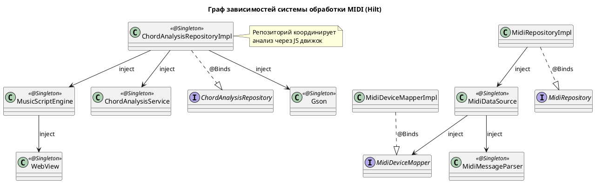
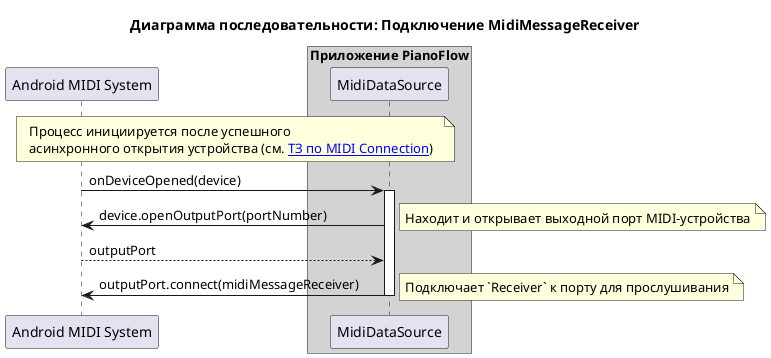
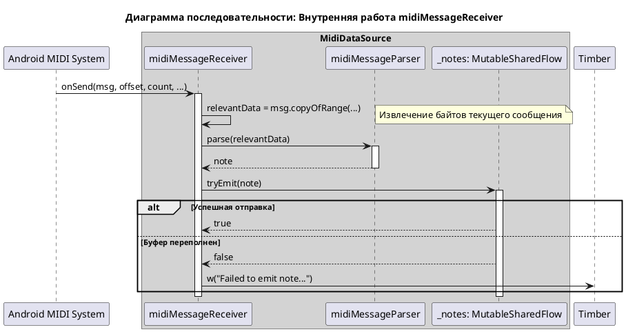
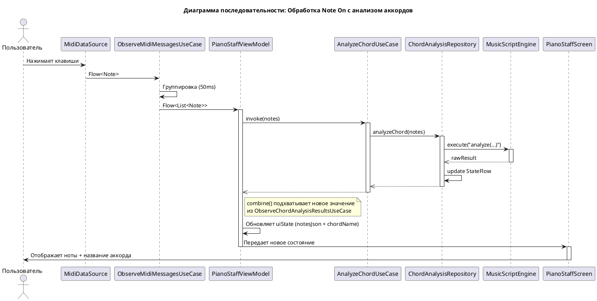
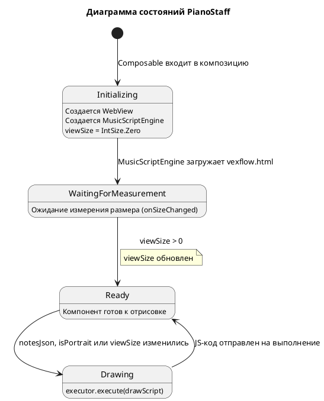
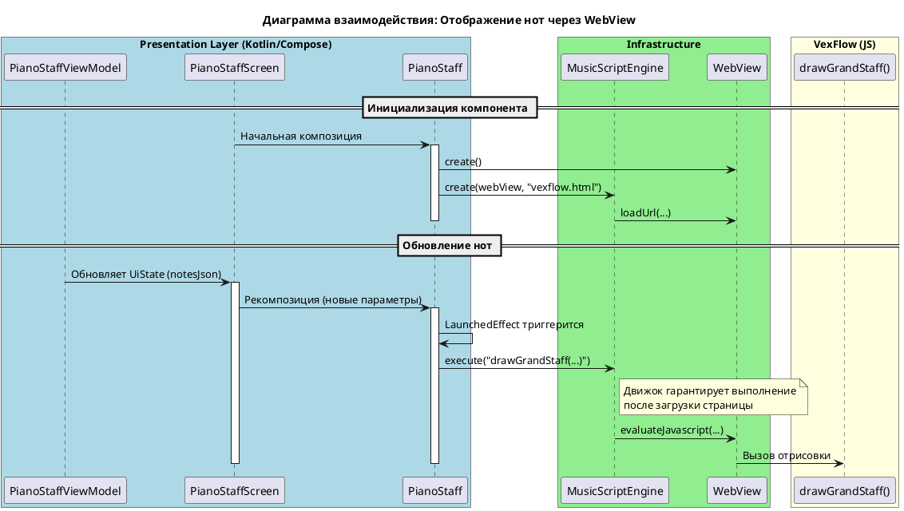

# Техническое задание: Реализация обработки и отображения MIDI-сообщений

## 1. Общая информация

### 1.1. Цель доработки

Реализовать функционал для приема, обработки, анализа и визуализации MIDI-сообщений (нот), поступающих от подключенной MIDI-клавиатуры. Основные задачи:
- Отображать сыгранные пользователем ноты и аккорды на нотном стане в реальном времени.
- Анализировать распознанные аккорды и отображать их названия (например, "C Major", "Am", "G7").
- Правильно обрабатывать одиночные ноты (не отображать их как неопознанные аккорды).

### 1.2. Базовые документы

- [Архитектурные принципы](../plans/ARCHITECTURE_PRINCIPLES.md)
- [Сценарии: Прием и отображение MIDI-сообщений](../uc/MIDI_MESSAGE_PROCESSING.md)
- [Техническое задание: Реализация отслеживания состояния подключения MIDI-клавиатуры](./MIDI_CONNECTION.md)

## 2. Архитектурное решение

### 2.1. Компоненты

Система обработки MIDI-сообщений интегрирована в существующую архитектуру, расширяя функционал `Data` и `Domain` слоев и добавляя новые компоненты в `Presentation` слой. Включает модули для анализа аккордов с использованием JavaScript-библиотеки [Tonal](https://github.com/tonaljs/tonal).

**Data Layer**
- **`MidiDataSource`:** Расширен для обработки входящих MIDI-сообщений. После успешного открытия устройства (`MidiManager.openDevice`), он подключает `MidiReceiver` к **выходному порту** устройства (`MidiOutputPort`) для приема данных.
- **`MidiMessageReceiver`:** Внутренняя реализация `android.media.midi.MidiReceiver`, ответственная за прием сырых MIDI-данных (`byte[]`).
- **`MidiMessageParser`:** Компонент, который получает сырые данные от `MidiMessageReceiver`, парсит их и преобразует в доменную модель `Note`. Игнорирует все сообщения, кроме `Note On` (с velocity > 0).
- **`MidiRepositoryImpl`:** Реализация репозитория, которая предоставляет поток входящих нот.
- **`MusicScriptEngine`:** Компонент для изоляции логики выполнения JavaScript-кода через WebView. Обеспечивает безопасное и изолированное выполнение скриптов Tonal.js для анализа аккордов.
- **`ChordAnalysisRepositoryImpl`:** Реализация репозитория анализа аккордов. Использует `MusicScriptEngine` для выполнения JavaScript-кода и `ChordAnalysisService` для постобработки результатов. Предоставляет `StateFlow<String?>` с результатами анализа.

**Domain Layer**
- **`Note`:** Доменная модель ноты (MIDI-номер и музыкальное имя, например "C4").
- **`MidiRepository`:** Интерфейс для получения потока нот.
- **`ObserveMidiMessagesUseCase`:** Группирует одиночные ноты в аккорды (списки) через `channelFlow` с задержкой 50 мс.
- **`ChordAnalysisRepository`:** Интерфейс с методами `analyzeChord()` и `chordAnalysisResult`.
- **`AnalyzeChordUseCase`:** Use case для запуска асинхронного анализа аккорда (fire-and-forget).
- **`ObserveChordAnalysisResultsUseCase`:** Use case для подписки на результаты анализа.
- **`ChordAnalysisService`:** Доменный сервис для обработки сырых строковых результатов из JavaScript (очистка от кавычек, нормализация имен).

**Presentation Layer**
- **`PianoStaffViewModel`:** Управляет состоянием UI. Объединяет (`combine`) поток нот и результаты анализа. При изменении состава нот инициирует новый анализ.
- **`PianoStaffUiState`:** Состояние UI:
  - `notesJson: String` - JSON-представление нот для визуализации через VexFlow.
  - `chordName: String?` - название распознанного аккорда или локализованная строка "Не определен".
- **`PianoStaffScreen`:** Composable-экран, который отображает сыгранные ноты на нотном стане и название аккорда.

#### 2.1.1. C4 Level 3 Overview: Обзор подсистем

```plantuml
@startuml
!include https://raw.githubusercontent.com/plantuml-stdlib/C4-PlantUML/master/C4_Component.puml

title C4 - Level 3 Overview: Обзор подсистем обработки MIDI-сообщений

System_Ext(midi_device, "MIDI Keyboard", "Физическое устройство")
System_Ext(webview_js, "WebView + Tonal.js", "JavaScript анализ аккордов")

Container_Boundary(presentation, "Presentation Layer") {
    Component(vm, "PianoStaffViewModel", "ViewModel", "Управляет ноты + аккорды")
    Component(screen, "PianoStaffScreen", "Composable", "Отображает ноты и названия")
}

Container_Boundary(domain, "Domain Layer") {
    Container_Boundary(midi_subsystem, "MIDI Subsystem") {
        Component(observe_midi, "ObserveMidiMessagesUseCase", "Use Case", "")
        Component(midi_repo, "MidiRepository", "Interface", "")
    }
    
    Container_Boundary(chord_subsystem, "Chord Analysis Subsystem") {
        Component(analyze_chord, "AnalyzeChordUseCase", "Use Case", "")
        Component(observe_chord, "ObserveChordAnalysisResultsUseCase", "Use Case", "")
        Component(chord_repo, "ChordAnalysisRepository", "Interface", "")
    }
}

Container_Boundary(data, "Data Layer") {
    Container_Boundary(midi_impl, "MIDI Implementation") {
        Component(midi_repo_impl, "MidiRepositoryImpl", "Impl", "")
        Component(ds, "MidiDataSource", "Data Source", "")
    }
    
    Container_Boundary(chord_impl, "Chord Analysis Implementation") {
        Component(chord_repo_impl, "ChordAnalysisRepositoryImpl", "Impl", "")
        Component(js_engine, "MusicScriptEngine", "JS Engine", "")
    }
}

' Связи
Rel(midi_device, ds, "MIDI сообщения")
Rel(chord_repo_impl, js_engine, "Использует для анализа")
Rel(js_engine, webview_js, "Выполняет JS")

Rel(vm, observe_midi, "observeNotes()")
Rel(vm, analyze_chord, "analyzeChord()")
Rel(vm, observe_chord, "observeChordAnalysisResults()")

Rel(observe_midi, midi_repo, "observeNotes()")
Rel(analyze_chord, chord_repo, "analyzeChord()")
Rel(observe_chord, chord_repo, "observeChordAnalysisResults()")

Rel(midi_repo_impl, midi_repo, "@Binds")
Rel(chord_repo_impl, chord_repo, "@Binds")

Rel(vm, screen, "Обновляет UiState")

@enduml
```

#### 2.1.2. C4 Level 3a: Компоненты MIDI подсистемы

```plantuml
@startuml
!include https://raw.githubusercontent.com/plantuml-stdlib/C4-PlantUML/master/C4_Component.puml

title C4 - Level 3a: Компоненты MIDI подсистемы

System_Ext(midi_device, "MIDI Keyboard", "Физическое устройство")
System_Ext(android_sdk, "Android SDK", "MidiReceiver, MidiOutputPort")

Container_Boundary(presentation, "Presentation Layer") {
    Component(vm, "PianoStaffViewModel", "ViewModel", "Обновляет notesJson")
}

Container_Boundary(domain, "Domain Layer") {
    Component(observe_midi_uc, "ObserveMidiMessagesUseCase", "Use Case", "Группирует ноты в аккорды")
    Component(midi_repo, "MidiRepository", "Interface", "Контракт для MIDI-данных")
    Component(note, "Note", "Model", "Доменная модель ноты")
}

Container_Boundary(data, "Data Layer") {
    Component(midi_repo_impl, "MidiRepositoryImpl", "Repository Impl", "Управляет потоком нот")
    Component(ds, "MidiDataSource", "Data Source", "Преобразует MIDI в ноты")
    Component(parser, "MidiMessageParser", "Parser", "Парсит сырые MIDI-данные")
    Component(receiver, "MidiMessageReceiver", "Receiver", "android.media.midi.MidiReceiver")
}

' Связи Presentation-Domain
Rel(vm, observe_midi_uc, "observeNotes()")

' Связи Domain-Domain
Rel(observe_midi_uc, midi_repo, "observeNotes()")
Rel(observe_midi_uc, note, "Flow<List<Note>>")

' Bindings
Rel(midi_repo_impl, midi_repo, "@Binds")

' Связи Data Layer
Rel(midi_repo_impl, ds, "Использует")
Rel(ds, parser, "Использует")
Rel(ds, receiver, "Создает")
Rel(parser, note, "Создает")
Rel(receiver, android_sdk, "Реализует")

' Внешние системы
Rel(midi_device, ds, "Отправляет MIDI сообщения")

@enduml
```

#### 2.1.3. C4 Level 3b: Компоненты подсистемы анализа аккордов

```plantuml
@startuml
!include https://raw.githubusercontent.com/plantuml-stdlib/C4-PlantUML/master/C4_Component.puml

title C4 - Level 3b: Компоненты подсистемы анализа аккордов

System_Ext(webview_js, "WebView + Tonal.js", "JavaScript анализ аккордов")

Container_Boundary(presentation, "Presentation Layer") {
    Component(vm, "PianoStaffViewModel", "ViewModel", "Вызывает анализ и получает результаты")
}

Container_Boundary(domain, "Domain Layer") {
    Component(analyze_chord_uc, "AnalyzeChordUseCase", "Use Case", "Fire-and-forget анализ")
    Component(observe_chord_uc, "ObserveChordAnalysisResultsUseCase", "Use Case", "Подписка на результаты")
    Component(chord_repo, "ChordAnalysisRepository", "Interface", "Контракт анализа аккордов")
    Component(chord_service, "ChordAnalysisService", "Domain Service", "Бизнес-логика обработки строк")
}

Container_Boundary(data, "Data Layer") {
    Component(chord_repo_impl, "ChordAnalysisRepositoryImpl", "Repository Impl", "Управляет анализом и StateFlow")
    Component(js_executor, "MusicScriptEngine", "JS Executor", "Выполняет Tonal.js код")
}

' Связи Presentation-Domain
Rel(vm, analyze_chord_uc, "analyzeChord()")
Rel(vm, observe_chord_uc, "observeChordAnalysisResults()")

' Связи Use Cases-Repository
Rel(analyze_chord_uc, chord_repo, "analyzeChord()")
Rel(observe_chord_uc, chord_repo, "observeChordAnalysisResults()")

' Bindings
Rel(chord_repo_impl, chord_repo, "@Binds")

' Связи Data Layer
Rel(chord_repo_impl, chord_service, "Использует")
Rel(chord_repo_impl, js_executor, "Использует для JS")

' Внешние системы
Rel(js_executor, webview_js, "Выполняет анализ")

@enduml
```

### 2.2. API и Модели данных

В этом разделе представлены программные интерфейсы и модели данных, распределенные по слоям архитектуры.

**Domain Layer:**

```kotlin
// com.astrizhachuk.pianoflow.domain.model.Note.kt
/**
 * Доменная модель ноты.
 */
data class Note(
    val pitch: Int,   // MIDI номер ноты (0-127)
    val name: String  // Музыкальное имя ноты (например, "C4")
)

// com.astrizhachuk.pianoflow.domain.repository.MidiRepository.kt
/**
 * Интерфейс репозитория для работы с MIDI.
 */
interface MidiRepository {
    fun observeConnectionState(): Flow<ConnectionState>
    fun observeNotes(): Flow<Note>
}

// com.astrizhachuk.pianoflow.domain.repository.ChordAnalysisRepository.kt
/**
 * Интерфейс репозитория для анализа аккордов.
 */
interface ChordAnalysisRepository {
    val chordAnalysisResult: StateFlow<String?>
    fun analyzeChord(notes: List<Note>)
}

// com.astrizhachuk.pianoflow.domain.service.ChordAnalysisService.kt
/**
 * Доменный сервис для обработки строковых результатов анализа.
 */
class ChordAnalysisService {
    fun processChordAnalysisResult(rawChord: String?): String?
}
```

**Data Layer:**

```kotlin
// com.astrizhachuk.pianoflow.data.datasource.midi.MidiMessageParser.kt
/**
 * Парсер сырых MIDI сообщений.
 */
class MidiMessageParser {
    fun parse(data: ByteArray): Note?
}

// com.astrizhachuk.pianoflow.data.datasource.analysis.MusicScriptEngine.kt
/**
 * Движок для выполнения JavaScript кода.
 */
class MusicScriptEngine {
    fun execute(script: String, callback: (String?) -> Unit)
}
```

**Presentation Layer:**

```kotlin
// com.astrizhachuk.pianoflow.presentation.model.pianostaff.PianoStaffUiState.kt
/**
 * Состояние UI для экрана с нотным станом.
 */
data class PianoStaffUiState(
    val notesJson: String = "{\"treble\":[], \"bass\":[]}",
    val chordName: String? = null
)
```

### 2.3. Расширение зависимостей

Система использует Hilt для управления зависимостями.



## 3. Жизненный цикл и взаимодействие

### 3.1. Принцип работы

1.  **Подключение Receiver'а**:
    *   После того как `MidiDataSource` успешно открывает соединение с MIDI-устройством, он находит первый доступный **выходной порт** (`MidiOutputPort`) устройства.
    *   `MidiDataSource` вызывает `outputPort.connect(midiMessageReceiver)`, чтобы начать получать MIDI-данные.



2.  **Прием и парсинг сообщений**:
    *   Когда пользователь нажимает клавишу, MIDI-клавиатура отправляет сообщение. `MidiMessageReceiver.onSend()` вызывается с сырыми данными (`byte[]`).
    *   `MidiMessageReceiver` немедленно передает эти данные в `MidiMessageParser`.
    *   `MidiMessageParser` анализирует байты. Если это `Note On`, он извлекает номер ноты и создает объект `Note` (включая его музыкальное имя через `pitchToName`), который передает обратно в `MidiDataSource`.
    *   `MidiDataSource` отправляет полученную `Note` в `SharedFlow`.



3.  **Группировка и передача нот**:
    *   `MidiRepositoryImpl` через `observeNotes()` проксирует `Flow<Note>` из `MidiDataSource`.
    *   `ObserveMidiMessagesUseCase` подписывается на этот поток. Он использует операторы `Kotlin Flow` (внутри `channelFlow` с `launch` и `delay`) для группировки нот, пришедших в течение короткого промежутка времени (`50 мс`), в один список `List<Note>` (аккорд). Каждый новый `Note` сбрасывает таймер, позволяя собрать аккорды, сыгранные не идеально одновременно (арпеджиато).

4.  **Анализ аккордов**:
    *   `PianoStaffViewModel` наблюдает за `ObserveMidiMessagesUseCase`. При поступлении нового списка нот:
        1. Инициирует анализ через `AnalyzeChordUseCase(notes)`. Это операция типа "fire-and-forget".
        2. `AnalyzeChordUseCase` вызывает `ChordAnalysisRepository.analyzeChord(notes)`.
        3. Репозиторий подготавливает JS-скрипт и выполняет его через `MusicScriptEngine` (WebView + Tonal.js).
        4. Результат очищается через `ChordAnalysisService` и сохраняется в `StateFlow` репозитория.
    *   Параллельно `PianoStaffViewModel` объединяет (`combine`) поток нот и поток результатов анализа из `ObserveChordAnalysisResultsUseCase`.

5.  **Отображение на UI**:
    *   Результат объединения формирует `PianoStaffUiState`.
    *   Если аккорд распознан, `chordName` содержит название. Если ноты есть, но анализ пуст — отображается "Не определен".
    *   `PianoStaffScreen` получает `uiState` и передает `notesJson` в компонент `PianoStaff`.



### 3.2. Механизм отображения нот

Отрисовка нотного стана выполняется с помощью `WebView` и JavaScript-библиотеки [VexFlow](https://www.vexflow.com/). Этот подход позволяет отделить логику отрисовки от нативного кода, используя мощные возможности веб-технологий для визуализации музыкальной нотации.

**Ключевые компоненты:**

- **`PianoStaff` Composable:** Оборачивает `AndroidView`, в котором создается и настраивается `WebView`. Этот компонент отвечает за управление жизненным циклом `WebView` и его перерисовку.
- **`MusicScriptEngine`:** Используется внутри компонента для управления выполнением JS-кода и загрузки HTML-ресурса.
- **`VexflowNoteMapper.kt`**: Содержит логику преобразования `List<Note>` в конечный JSON-объект.
- **`vexflow.html`:** HTML-файл в `assets`, содержащий логику вызова функций `VexFlow` (версия [4.2.2](https://cdn.jsdelivr.net/npm/vexflow@4.2.2/build/cjs/vexflow.js), также расположенная в `assets`).

**Процесс работы:**

1.  **Инициализация**: `PianoStaff` создает экземпляр `WebView` и инициализирует `MusicScriptEngine`, который загружает `vexflow.html`.
2.  **Отслеживание размера**: Модификатор `onSizeChanged` обновляет состояние `viewSize`. Это необходимо для того, чтобы VexFlow знал доступную область отрисовки.
3.  **Триггер отрисовки**: `LaunchedEffect` следит за изменениями `notesJson`, `isPortrait` (входной параметр ориентации) и `viewSize`.
4.  **Выполнение отрисовки**: Когда `viewSize` становится отличным от нуля, формируется JavaScript-вызов функции `drawGrandStaff`. Вызов передается в `MusicScriptEngine`, который выполняет его в контексте `WebView`.
5.  **Формат JSON**: Данные передаются в виде единого JSON-объекта, который содержит отдельные массивы для скрипичного и басового ключей.
    ```json
    {
      "treble": [{"keys":["c/5"], "duration":"w"}, {"keys":["g/4"], "duration":"w", "ghost":true}],
      "bass": [{"keys":["c/4"], "duration":"w"}, {"keys":["e/3", "g/3"], "duration":"w"}]
    }
    ```

**Диаграмма состояний жизненного цикла `PianoStaff`**



**Диаграмма взаимодействия**



## 4. Критерии приемки

### Отображение нот
- При нажатии одной клавиши на MIDI-клавиатуре соответствующая нота немедленно отображается на нотном стане.
- При одновременном нажатии нескольких клавиш (аккорд) все соответствующие ноты отображаются на нотном стане.
- Каждое новое событие нажатия (`Note On`) приводит к полной очистке экрана перед отображением новых нот.
- Система реагирует только на сообщения о нажатии клавиш (`Note On`); сообщения об отпускании (`Note Off`) и другие типы MIDI-сообщений игнорируются.
- Визуализация нот на экране происходит без видимых задержек после нажатия клавиши.
- Функционал стабильно работает при быстром и многократном нажатии клавиш, приложение не падает и не зависает.
- При повороте экрана нотный стан корректно перерисовывается с учетом новой ориентации.

### Анализ и отображение аккордов
- Для каждого распознанного аккорда (2+ ноты) на экране отображается его название (например, "C Major", "Am", "G7sus4").
- Для одиночных нот НЕ отображается никакого названия аккорда (поле остается пустым).
- Если несколько нот не образуют известный аккорд, отображается текст "Не определен" (или согласно локализации).
- Анализ аккордов выполняется в отдельном потоке и не блокирует UI поток.
- Результаты анализа обновляются в `StateFlow` и безопасны для одновременного доступа из разных потоков (thread-safe).
- Система использует Tonal.js для анализа аккордов, что обеспечивает точное распознавание стандартных музыкальных аккордов.

## См. также

- [Архитектурные принципы](../plans/ARCHITECTURE_PRINCIPLES.md)
- [Документ о Kotlin Flow](../tech/KOTLIN_FLOW.md)
- [Документ о MIDI API в Android](../tech/MIDI.md)
