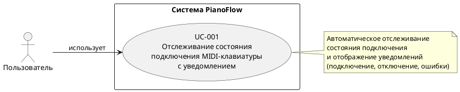
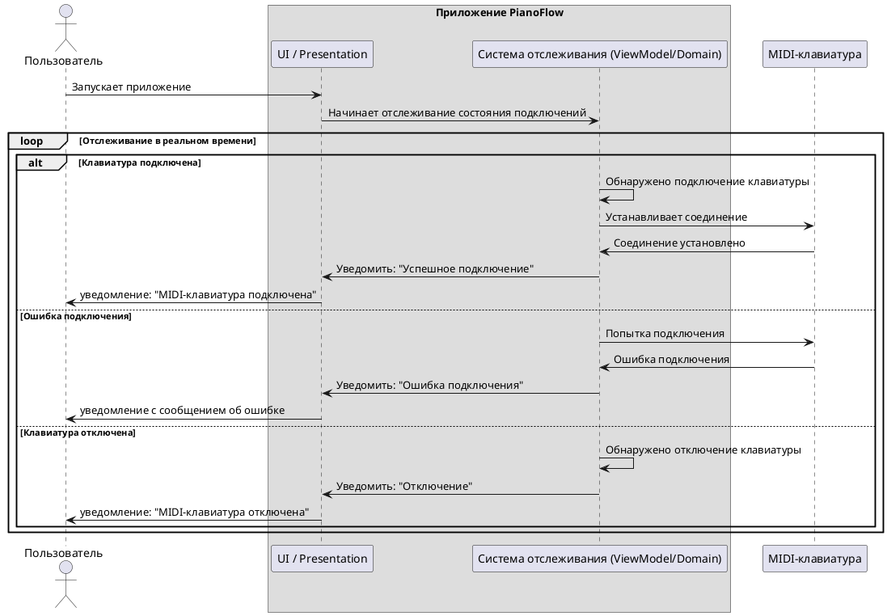

# Сценарии отслеживания состояния подключения MIDI-клавиатуры

## Цель документа

Данный документ описывает сценарии использования функционала отслеживания состояния подключения MIDI-клавиатуры к Android-устройству, включая информирование пользователя.

## Общее описание функционала

Приложение автоматически отслеживает состояние подключения MIDI-клавиатуры через USB и информирует пользователя о его изменениях через системные уведомления (например, Toast/Snackbar):

- **При подключении клавиатуры**: автоматически подключается к первой найденной клавиатуре и отображает уведомление о подключении.
- **При отключении клавиатуры**: отображает уведомление об отключении.
- **При ошибке подключения**: отображает уведомление с сообщением об ошибке.
- **При отсутствии подключения и ошибки**: ничего не отображает пользователю.

**Ограничения:**

- Поддерживается только одна MIDI-клавиатура одновременно.
- Автоматическое подключение к первой найденной клавиатуре.
- Обратная связь о состоянии подключения предоставляется исключительно через системные уведомления, без возможности их отключения.

---

## UC-001: Отслеживание состояния и уведомление о подключении MIDI-клавиатуры

### Идентификатор
UC-001

### Название
Отслеживание состояния и уведомление о подключении MIDI-клавиатуры

### Краткое описание
Система автоматически отслеживает подключение и отключение MIDI-клавиатуры через USB. При обнаружении первой доступной клавиатуры система автоматически подключается к ней и информирует пользователя о состоянии подключения через уведомления.

### Актор
Пользователь

### Предусловия
1. Разрешение на работу с MIDI предоставлено (если требуется системой).

### Постусловия
1. Система продолжает отслеживать изменения состояния подключения.
2. Пользователь информирован о текущем состоянии подключения (если клавиатура подключена, отключена или произошла ошибка).

### Основной поток

1. Пользователь запускает приложение.
2. Система начинает автоматическое отслеживание состояния подключений MIDI-клавиатур.
3. Пользователь подключает MIDI-клавиатуру через USB к Android-устройству.
4. Система обнаруживает подключенную MIDI-клавиатуру.
5. Система автоматически подключается к найденной клавиатуре.
6. Система успешно устанавливает соединение с клавиатурой.
7. Система формирует и отображает пользователю уведомление об успешном подключении.
8. Система продолжает отслеживать состояние подключения.

### Альтернативные потоки

#### A1: Клавиатура уже подключена при запуске приложения
1. Пользователь запускает приложение.
2. Система начинает автоматическое отслеживание состояния подключений MIDI-клавиатур.
3. Система обнаруживает уже подключенную MIDI-клавиатуру.
4. Система автоматически подключается к найденной клавиатуре.
5. Система успешно устанавливает соединение.
6. Система формирует и отображает пользователю уведомление об успешном подключении.
7. Система продолжает отслеживать состояние подключения.

#### A2: Ошибка при подключении к клавиатуре
1. Система начинает автоматическое отслеживание состояния подключений MIDI-клавиатур.
2. Пользователь подключает MIDI-клавиатуру через USB.
3. Система обнаруживает подключенную MIDI-клавиатуру.
4. Система пытается автоматически подключиться к клавиатуре.
5. Система не может установить соединение (возникает ошибка).
6. Система формирует и отображает пользователю уведомление об ошибке.
7. Система продолжает отслеживать состояние подключения.

#### A3: Клавиатура отключена во время работы
1. Система отслеживает подключенную MIDI-клавиатуру.
2. Пользователь отключает MIDI-клавиатуру от Android-устройства.
3. Система обнаруживает отключение клавиатуры.
4. Система прекращает соединение с клавиатурой.
5. Система формирует и отображает пользователю уведомление об отключении.
6. Система продолжает отслеживать состояние подключения для обнаружения новых клавиатур.

#### A4: Несколько клавиатур подключены одновременно
1. Система обнаруживает несколько подключенных MIDI-клавиатур.
2. Система выбирает первую найденную клавиатуру.
3. Система автоматически подключается только к первой клавиатуре.
4. Система игнорирует остальные клавиатуры.
5. Система формирует и отображает пользователю уведомление об успешном подключении.
6. Система продолжает отслеживать состояние подключения.

#### A5: Нет разрешения на работу с MIDI
1. Система начинает автоматическое отслеживание состояния подключений MIDI-клавиатур.
2. Система не может получить доступ к MIDI-устройствам из-за отсутствия разрешений.
3. Система формирует и отображает пользователю уведомление об ошибке.
4. Система продолжает отслеживать состояние подключения.

#### A6: MIDI API недоступен
1. Система начинает автоматическое отслеживание состояния подключений MIDI-клавиатур.
2. Система не может использовать MIDI API (не поддерживается устройством).
3. Система формирует и отображает пользователю уведомление об ошибке.
4. Система продолжает отслеживать состояние подключения.

---

## Критерии приемки

- При подключении MIDI-клавиатуры система автоматически подключается к первой найденной.
- При успешном подключении пользователь видит уведомление "MIDI-клавиатура подключена".
- При отключении клавиатуры отображается уведомление "MIDI-клавиатура отключена".
- При ошибке подключения пользователь видит уведомление с понятным сообщением об ошибке.
- Все ошибки, связанные с подключением, обрабатываются и отображаются пользователю в виде уведомлений.
- Система реагирует на подключение/отключение клавиатуры в реальном времени и продолжает отслеживать состояние.
- При наличии нескольких клавиатур система подключается только к первой найденной, игнорируя остальные.
- Функционал работает стабильно при многократных подключениях и отключениях.
- Поддерживается одновременное подключение только одной MIDI-клавиатуры.

