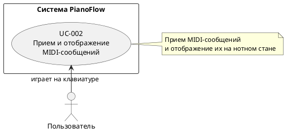
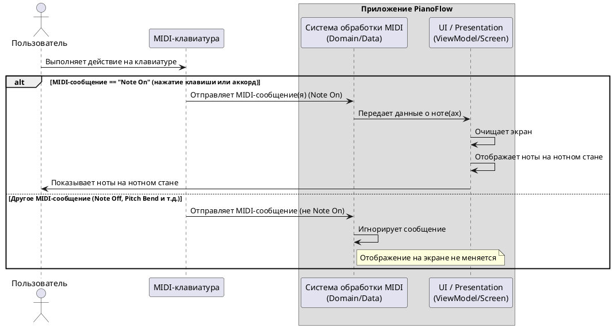

# Сценарии приема и обработки MIDI-сообщений

## Цель документа

Данный документ описывает сценарии использования функционала приема и обработки MIDI-сообщений от подключенной MIDI-клавиатуры. Основное внимание уделяется отображению информации о сыгранных нотах на экране приложения.

## Общее описание функционала

После успешного подключения MIDI-клавиатуры (согласно [UC-001](./MIDI_KEYBOARD_CONNECTION_STATE.md)), приложение начинает слушать входящие MIDI-сообщения. При получении событий о нажатии клавиш (`Note On`), система обрабатывает их и отображает на экране.

-   **Отображение одиночных нот**: При нажатии одной клавиши на экране отображается нота на нотном стане.
-   **Отображение аккордов**: При одновременном нажатии нескольких клавиш на экране отображаются все ноты аккорда на нотном стане.
-   **Обновление экрана**: Перед отображением новых нот, экран очищается от предыдущих.

**Ограничения:**
-   Отображение нот происходит только по событию `Note On`. События `Note Off` (отпускание клавиши) в данном сценарии игнорируются для обновления дисплея.
-   Система не обрабатывает и не отображает длительность нот или другие параметры (например, сила нажатия - velocity), только высоту тона.

---
## UC-002: Прием и отображение MIDI-сообщений

### Идентификатор
UC-002

### Название
Прием и отображение MIDI-сообщений

### Краткое описание
Система принимает MIDI-сообщения от подключенной клавиатуры, обрабатывает события нажатия клавиш и отображает сыгранные ноты или аккорды на нотном стане.

### Актор
Пользователь

### Предусловия
1.  Приложение запущено.
2.  MIDI-клавиатура успешно подключена к устройству, и система готова к приему данных (постусловие [UC-001](./MIDI_KEYBOARD_CONNECTION_STATE.md)).

### Постусловия
1.  Пользователь видит на экране ноты, соответствующие нажатым на клавиатуре клавишам.
2.  Система готова к приему следующих MIDI-сообщений.

### Основной поток (нажатие одной клавиши)

1.  Пользователь нажимает одну клавишу на подключенной MIDI-клавиатуре.
2.  Система получает MIDI-сообщение `Note On` с информацией о высоте ноты.
3.  Система очищает экран от всех ранее отображенных нот.
4.  Система обрабатывает сообщение, извлекая MIDI-номер ноты.
5.  Система отображает ноту на нотном стане.
6.  Система ожидает следующего события нажатия.

### Альтернативные потоки

#### A1: Нажатие нескольких клавиш одновременно (аккорд)
1.  Пользователь нажимает несколько клавиш на MIDI-клавиатуре одновременно или с минимальной задержкой.
2.  Система получает несколько MIDI-сообщений `Note On`.
3.  Система очищает экран от всех ранее отображенных нот.
4.  Система обрабатывает все полученные сообщения, формируя список MIDI-номеров.
5.  Система отображает все ноты аккорда на нотном стане.
6.  Система ожидает следующего события нажатия.

#### A2: Получение MIDI-сообщения, не являющегося нажатием ноты
1.  Пользователь выполняет действие на MIDI-клавиатуре, которое не является нажатием клавиши (например, использует колесо Pitch Bend или отпускает клавишу - `Note Off`).
2.  Система получает соответствующее MIDI-сообщение (не `Note On`).
3.  Система игнорирует это сообщение.
4.  Отображение на экране не изменяется.

---

## Критерии приемки

1.  При нажатии одной клавиши на MIDI-клавиатуре соответствующая нота немедленно отображается на нотном стане.
2.  При одновременном нажатии нескольких клавиш (аккорд) все соответствующие ноты отображаются на нотном стане.
3.  Каждое новое событие нажатия (`Note On`) приводит к полной очистке экрана перед отображением новых нот.
4.  Система реагирует только на сообщения о нажатии клавиш (`Note On`); сообщения об отпускании (`Note Off`) и другие типы MIDI-сообщений игнорируются.
5.  Визуализация нот на экране происходит без видимых задержек после нажатия клавиши.
6.  Функционал стабильно работает при быстром и многократном нажатии клавиш, приложение не падает и не зависает.

---
