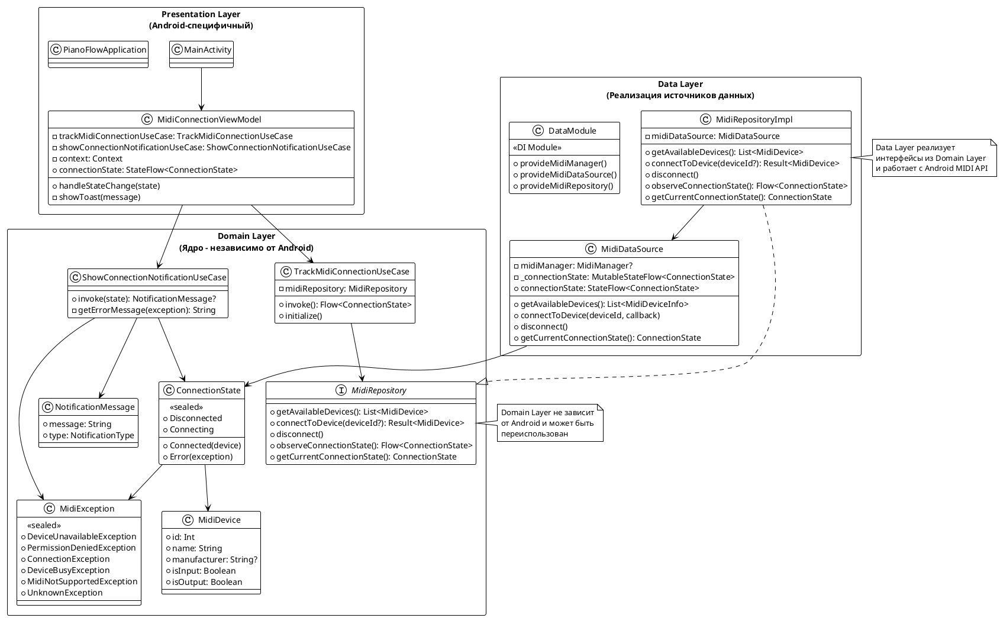
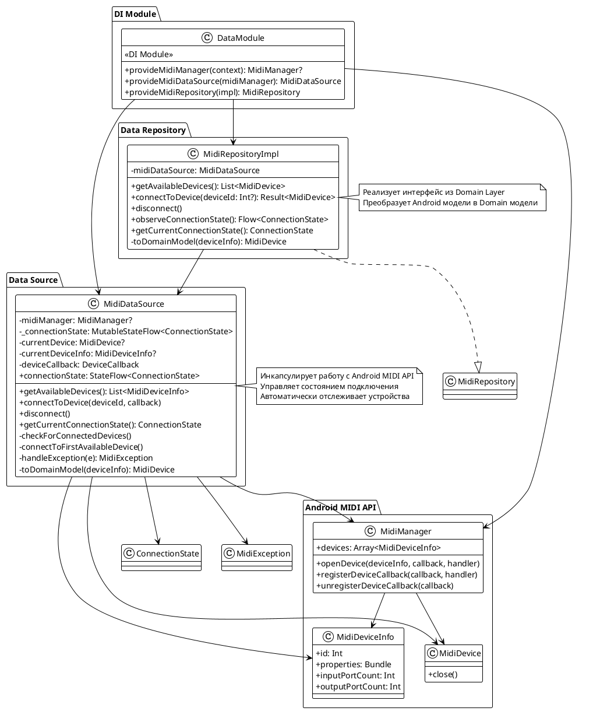
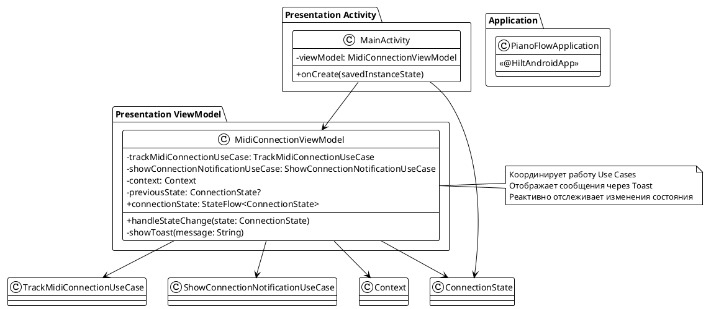
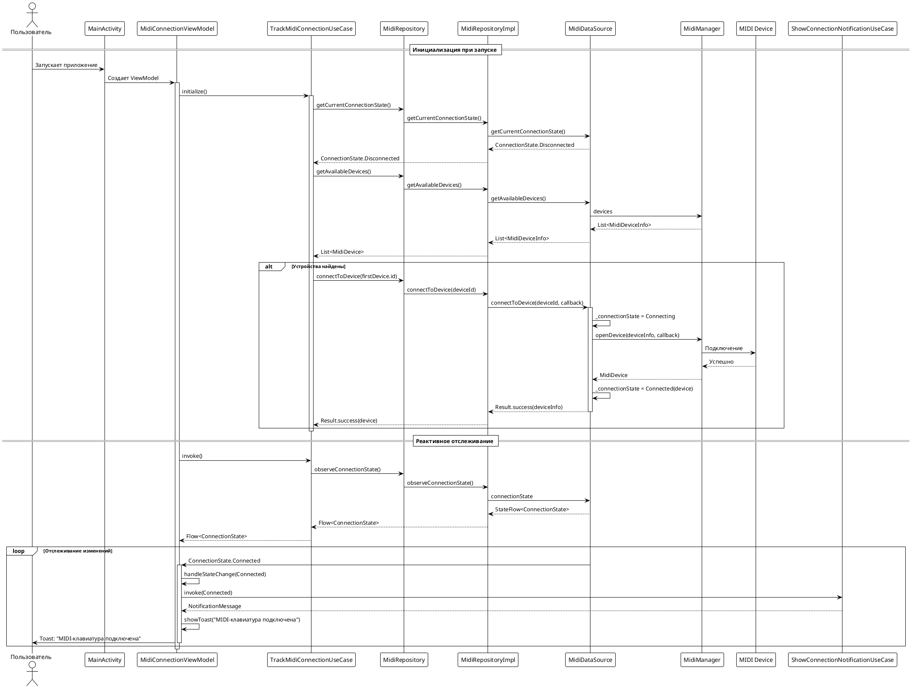
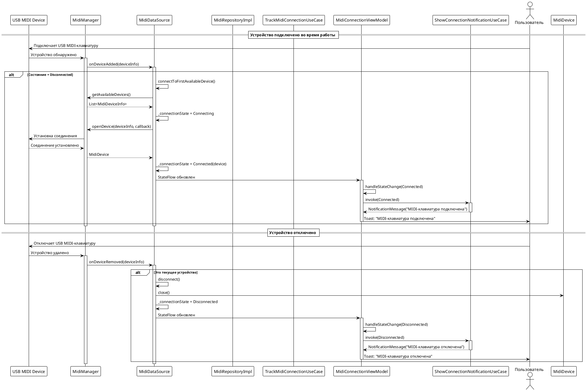
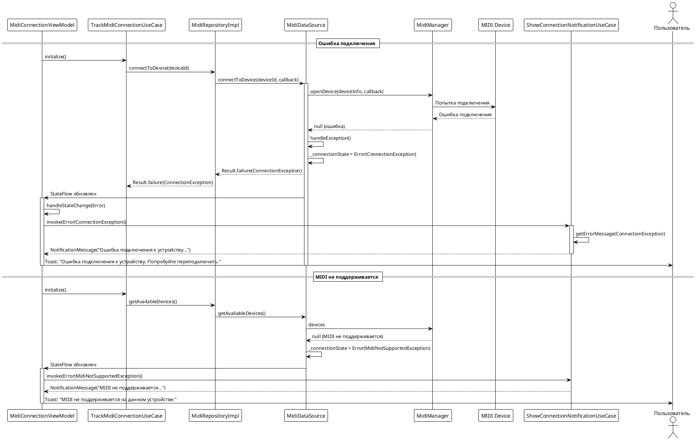
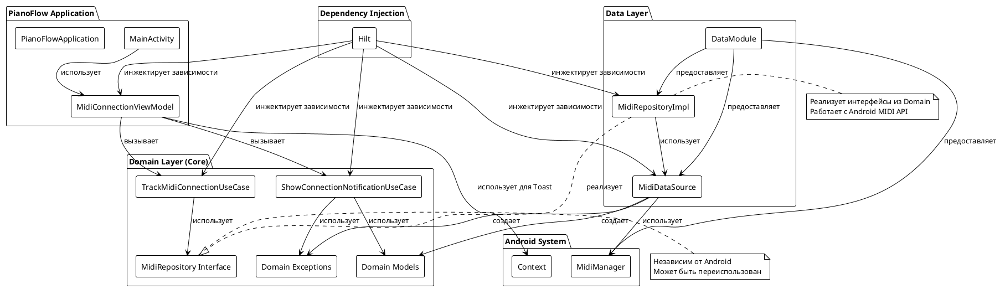

# Техническое задание: Реализация отслеживания подключения USB MIDI-клавиатуры

## 1. Общая информация

**Дата реализации:** 2024-12-28  
**Версия:** 1.0  
**Статус:** ✅ Реализовано и протестировано

### 1.1. Цель доработки

Реализация функционала автоматического отслеживания подключения и отключения USB MIDI-клавиатуры к Android-устройству с информированием пользователя о состоянии подключения.

### 1.2. Базовые документы

- [Use Cases: USB MIDI клавиатура](../uc/USB_MIDI_KEYBOARD.md) — описание функциональных требований
- [Архитектурные принципы](../plans/ARCHITECTURE_PRINCIPLES.md) — принципы проектирования
- [Описание приложения](../plans/APPLICATION_DESCRIPTION.md) — общее описание приложения

## 2. Реализованные Use Cases

### 2.1. UC-001: Отслеживание подключения MIDI-клавиатуры

**Статус:** ✅ Реализовано

**Реализованные сценарии:**
- ✅ Автоматическое отслеживание подключенных MIDI-устройств при запуске приложения
- ✅ Автоматическое подключение к первому найденному устройству
- ✅ Обнаружение устройства, уже подключенного при запуске приложения
- ✅ Обработка ошибок подключения
- ✅ Обнаружение отключения устройства
- ✅ Поддержка только одного устройства одновременно
- ✅ Обработка случая, когда MIDI не поддерживается на устройстве

**Реализованные компоненты:**
- `TrackMidiConnectionUseCase` — Use Case для отслеживания подключений
- `MidiRepository` — интерфейс репозитория
- `MidiRepositoryImpl` — реализация репозитория
- `MidiDataSource` — Data Source для работы с Android MIDI API
- `MidiConnectionViewModel` — ViewModel для управления состоянием

### 2.2. UC-002: Отображение уведомлений о состоянии подключения

**Статус:** ✅ Реализовано (упрощенная версия через Toast)

**Реализованные сценарии:**
- ✅ Преобразование состояний подключения в понятные сообщения
- ✅ Отображение сообщения "MIDI-клавиатура подключена" при успешном подключении
- ✅ Отображение сообщения "MIDI-клавиатура отключена" при отключении
- ✅ Отображение понятных сообщений об ошибках для всех типов ошибок
- ✅ Отображение сообщений только при изменении состояния

**Реализованные компоненты:**
- `ShowConnectionNotificationUseCase` — Use Case для формирования сообщений
- `NotificationMessage` — доменная модель сообщения
- `MidiException` — иерархия исключений для различных типов ошибок
- Отображение через `Toast` (упрощенная реализация)

**Примечание:** Изначально планировалось использование системных уведомлений, но для упрощения реализации было решено использовать Toast. В будущем можно легко заменить на другой способ отображения.

## 3. Архитектурные решения

### 3.1. Соблюдение принципов Clean Architecture

Реализация полностью соответствует архитектурным принципам проекта:

- **Domain Layer (Ядро)** — независим от Android, содержит бизнес-логику
- **Data Layer** — реализует источники данных через Android MIDI API
- **Presentation Layer** — Android-специфичный слой для UI

### 3.2. Использованные паттерны

1. **MVVM (Model-View-ViewModel)**
   - `MidiConnectionViewModel` управляет UI-состоянием
   - Использует Use Cases из Domain-слоя

2. **Repository Pattern**
   - Интерфейс `MidiRepository` определен в Domain-слое
   - Реализация `MidiRepositoryImpl` в Data-слое
   - Изоляция Domain-слоя от деталей Android MIDI API

3. **Use Cases (Interactors)**
   - `TrackMidiConnectionUseCase` — координация отслеживания подключений
   - `ShowConnectionNotificationUseCase` — формирование сообщений

4. **Dependency Injection (Hilt)**
   - Все зависимости инжектируются через Hilt
   - Модули DI разделены по слоям

### 3.3. Реактивное программирование

- Использование Kotlin Flow для реактивного отслеживания изменений состояния
- `StateFlow` для хранения текущего состояния подключения
- Автоматическое обновление UI при изменении состояния

## 4. UML Диаграммы

### 4.1. Диаграмма слоев архитектуры



### 4.2. Диаграмма классов Domain Layer

```plantuml
@startuml
!theme plain
skinparam classAttributeIconSize 0

package "Domain Models" {
    class MidiDevice {
        + id: Int
        + name: String
        + manufacturer: String?
        + isInput: Boolean
        + isOutput: Boolean
    }
    
    class MidiConnection {
        + device: MidiDevice
        + isConnected: Boolean
    }
    
    class ConnectionState <<sealed>> {
        + Disconnected
        + Connecting
        + Connected(device: MidiDevice)
        + Error(exception: MidiException)
    }
    
    class NotificationMessage {
        + message: String
        + type: NotificationType
        --
        enum NotificationType {
            SUCCESS
            ERROR
            INFO
        }
    }
}

package "Domain Exceptions" {
    class MidiException <<sealed>> {
        + message: String
        + cause: Throwable?
    }
    
    class DeviceUnavailableException extends MidiException
    class PermissionDeniedException extends MidiException
    class ConnectionException extends MidiException
    class DeviceBusyException extends MidiException
    class MidiNotSupportedException extends MidiException
    class UnknownException extends MidiException
}

package "Domain Use Cases" {
    class TrackMidiConnectionUseCase {
        - midiRepository: MidiRepository
        + invoke(): Flow<ConnectionState>
        + initialize()
    }
    
    class ShowConnectionNotificationUseCase {
        + invoke(state: ConnectionState): NotificationMessage?
        - getErrorMessage(exception: MidiException): String
    }
}

package "Domain Repository" {
    interface MidiRepository {
        + getAvailableDevices(): List<MidiDevice>
        + connectToDevice(deviceId: Int?): Result<MidiDevice>
        + disconnect()
        + observeConnectionState(): Flow<ConnectionState>
        + getCurrentConnectionState(): ConnectionState
    }
}

ConnectionState --> MidiDevice
ConnectionState --> MidiException
NotificationMessage --> NotificationMessage.NotificationType
TrackMidiConnectionUseCase --> MidiRepository
TrackMidiConnectionUseCase --> ConnectionState
ShowConnectionNotificationUseCase --> ConnectionState
ShowConnectionNotificationUseCase --> NotificationMessage
ShowConnectionNotificationUseCase --> MidiException
MidiRepository --> MidiDevice
MidiRepository --> ConnectionState

@enduml
```

### 4.3. Диаграмма классов Data Layer



### 4.4. Диаграмма классов Presentation Layer



### 4.5. Диаграмма последовательности: Подключение устройства



### 4.6. Диаграмма последовательности: Автоматическое обнаружение устройства



### 4.7. Диаграмма последовательности: Обработка ошибок



### 4.8. Диаграмма компонентов (C4 Component)



## 5. Структура компонентов

### 5.1. Domain Layer (Ядро)

#### Модели
- `MidiDevice` — модель MIDI-устройства
- `MidiConnection` — модель соединения с устройством
- `ConnectionState` — sealed class состояний подключения
- `NotificationMessage` — модель сообщения для пользователя

#### Исключения
- `MidiException` — базовое исключение
  - `DeviceUnavailableException` — устройство недоступно
  - `PermissionDeniedException` — нет разрешения
  - `ConnectionException` — ошибка подключения
  - `DeviceBusyException` — устройство занято
  - `MidiNotSupportedException` — MIDI не поддерживается
  - `UnknownException` — неизвестная ошибка

#### Repository Interfaces
- `MidiRepository` — интерфейс для работы с MIDI-устройствами

#### Use Cases
- `TrackMidiConnectionUseCase` — отслеживание подключений (UC-001)
- `ShowConnectionNotificationUseCase` — формирование сообщений (UC-002)

### 5.2. Data Layer

#### Data Sources
- `MidiDataSource` — работа с Android MIDI API
  - Автоматическое отслеживание устройств через `MidiManager.DeviceCallback`
  - Управление состоянием подключения
  - Обработка ошибок и преобразование в Domain-исключения

#### Repository Implementations
- `MidiRepositoryImpl` — реализация `MidiRepository`
  - Преобразование Android-моделей в Domain-модели
  - Координация работы с `MidiDataSource`

#### DI Modules
- `DataModule` — модуль DI для Data-слоя
  - Предоставление `MidiManager`
  - Предоставление `MidiDataSource`
  - Предоставление `MidiRepository`

### 5.3. Presentation Layer

#### ViewModels
- `MidiConnectionViewModel` — управление состоянием подключения
  - Координация Use Cases
  - Отображение сообщений через Toast
  - Реактивное отслеживание изменений состояния

#### Activities
- `MainActivity` — главная Activity приложения
  - Инициализация отслеживания через ViewModel
  - Наблюдение за состоянием подключения

#### Application
- `PianoFlowApplication` — Application класс для инициализации Hilt

## 6. Технические детали реализации

### 6.1. Автоматическое отслеживание устройств

Реализовано через `MidiManager.DeviceCallback`:
- При добавлении устройства автоматически подключается к первому найденному
- При удалении устройства автоматически обновляется состояние
- Callback регистрируется при инициализации `MidiDataSource`

### 6.2. Обработка состояний подключения

Используется `StateFlow` для реактивного управления состоянием:
- `Disconnected` — устройство не подключено
- `Connecting` — идет процесс подключения
- `Connected(device)` — устройство подключено
- `Error(exception)` — произошла ошибка

### 6.3. Обработка ошибок

Все ошибки преобразуются в доменные исключения:
- Android-исключения маппятся в соответствующие `MidiException`
- Пользователю показываются понятные сообщения на русском языке
- Поддерживаются все типы ошибок из Use Case

### 6.4. Отображение сообщений

Текущая реализация использует `Toast`:
- Простая реализация без дополнительных разрешений
- Сообщения показываются только при изменении состояния
- Легко заменить на другой способ отображения в будущем

## 7. Зависимости

### 7.1. Добавленные зависимости

```kotlin
// Hilt для Dependency Injection
implementation("com.google.dagger:hilt-android:2.51.1")
ksp("com.google.dagger:hilt-compiler:2.51.1")

// Lifecycle для ViewModel
implementation("androidx.lifecycle:lifecycle-viewmodel-ktx:2.7.0")
implementation("androidx.lifecycle:lifecycle-runtime-ktx:2.7.0")

// Coroutines для асинхронности
implementation("org.jetbrains.kotlinx:kotlinx-coroutines-core:1.7.3")
implementation("org.jetbrains.kotlinx:kotlinx-coroutines-android:1.7.3")

// Activity KTX для viewModels()
implementation("androidx.activity:activity-ktx:1.8.0")

// KSP вместо Kapt (для поддержки Kotlin 2.0+)
ksp("com.google.devtools.ksp:2.0.21-1.0.27")
```

### 7.2. Тестовые зависимости

```kotlin
// Mockito для моков
testImplementation("org.mockito:mockito-core:5.11.0")
testImplementation("org.mockito.kotlin:mockito-kotlin:5.2.1")

// Coroutines Test
testImplementation("org.jetbrains.kotlinx:kotlinx-coroutines-test:1.7.3")
```

## 8. Тестирование

### 8.1. Unit-тесты

Реализованы unit-тесты для Use Cases:

- **TrackMidiConnectionUseCaseTest**
  - Тест возврата Flow состояний
  - Тест инициализации при отключенном состоянии
  - Тест инициализации при уже подключенном устройстве
  - Тест инициализации при отсутствии устройств

- **ShowConnectionNotificationUseCaseTest**
  - Тесты для всех типов состояний (Connected, Disconnected, Connecting, Error)
  - Тесты для всех типов ошибок (DeviceUnavailable, PermissionDenied, ConnectionException, DeviceBusy, MidiNotSupported, Unknown)

### 8.2. Интеграционное тестирование

Требуется ручное тестирование с реальным MIDI-устройством:
- Подключение устройства при запуске приложения
- Подключение устройства во время работы приложения
- Отключение устройства
- Обработка ошибок подключения

## 9. Соответствие критериям приемки

### 9.1. UC-001 критерии приемки

- ✅ При подключении MIDI-клавиатуры система автоматически подключается к первому найденному устройству
- ✅ При успешном подключении пользователь видит сообщение "MIDI-клавиатура подключена"
- ✅ При отключении устройства система отображает сообщение "MIDI-клавиатура отключена"
- ✅ При ошибке подключения пользователь видит сообщение с описанием ошибки
- ✅ Система реагирует на подключение/отключение устройства в реальном времени
- ✅ При наличии нескольких устройств система подключается только к первому
- ✅ Система продолжает отслеживать состояние после подключения/отключения

### 9.2. UC-002 критерии приемки

- ✅ Все типы состояний (успешные и ошибки) преобразуются в понятные сообщения
- ✅ Сообщения отображаются на русском языке
- ✅ Каждый тип состояния имеет соответствующее сообщение
- ✅ Неизвестные ошибки обрабатываются с общим сообщением
- ✅ Сообщения отображаются через Toast
- ✅ Сообщения помогают пользователю понять текущее состояние подключения или причину ошибки

## 10. Известные ограничения и будущие улучшения

### 10.1. Текущие ограничения

1. **Отображение сообщений через Toast**
   - Временное решение для упрощения реализации
   - Планируется замена на более подходящий способ отображения

2. **Поддержка только одного устройства**
   - Согласно требованиям Use Case
   - При наличии нескольких устройств подключается только первое

3. **Отсутствие UI для управления подключением**
   - Автоматическое подключение без возможности выбора устройства
   - В будущем можно добавить экран выбора устройства

### 10.2. Планируемые улучшения

1. Замена Toast на более подходящий способ отображения (например, Snackbar или системные уведомления)
2. Добавление UI для отображения текущего состояния подключения
3. Добавление возможности выбора устройства при наличии нескольких
4. Расширенное логирование для отладки
5. Добавление метрик и аналитики подключений

## 11. Структура файлов

```
app/src/main/java/com/astrizhachuk/pianoflow/
├── domain/
│   ├── model/
│   │   ├── MidiDevice.kt
│   │   ├── MidiConnection.kt
│   │   ├── ConnectionState.kt
│   │   └── NotificationMessage.kt
│   ├── exception/
│   │   └── MidiException.kt
│   ├── repository/
│   │   └── MidiRepository.kt
│   └── usecase/
│       └── midi/
│           ├── TrackMidiConnectionUseCase.kt
│           └── ShowConnectionNotificationUseCase.kt
├── data/
│   ├── datasource/
│   │   └── midi/
│   │       └── MidiDataSource.kt
│   ├── repository/
│   │   └── MidiRepositoryImpl.kt
│   └── di/
│       └── DataModule.kt
├── presentation/
│   └── viewmodel/
│       └── MidiConnectionViewModel.kt
├── MainActivity.kt
└── PianoFlowApplication.kt

app/src/test/java/com/astrizhachuk/pianoflow/
└── domain/
    └── usecase/
        └── midi/
            ├── TrackMidiConnectionUseCaseTest.kt
            └── ShowConnectionNotificationUseCaseTest.kt
```

## 12. Заключение

Реализован полный функционал отслеживания подключения USB MIDI-клавиатуры согласно Use Cases UC-001 и UC-002. Реализация соответствует архитектурным принципам проекта, использует Clean Architecture, покрыта unit-тестами и готова к использованию.

Все критерии приемки выполнены. Функционал работает стабильно и готов к дальнейшему развитию.

---

**Связанные документы:**
- [Use Cases: USB MIDI клавиатура](../uc/USB_MIDI_KEYBOARD.md)
- [Архитектурные принципы](../plans/ARCHITECTURE_PRINCIPLES.md)
- [Описание приложения](../plans/APPLICATION_DESCRIPTION.md)

