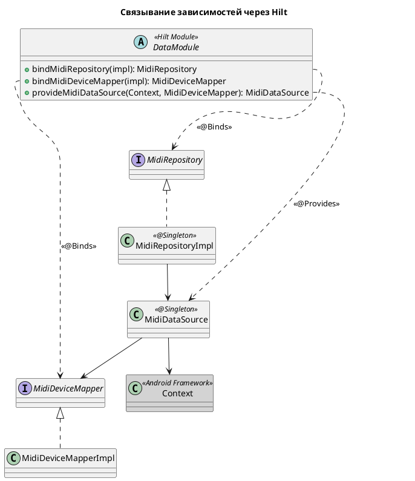
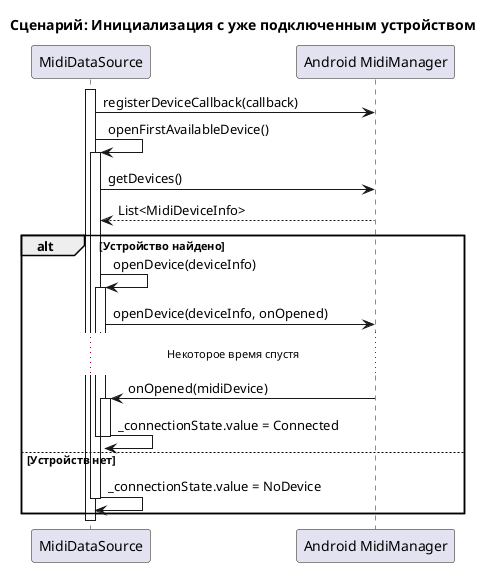
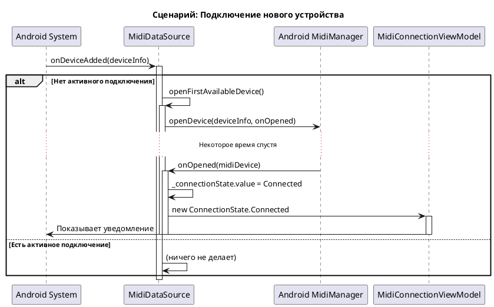
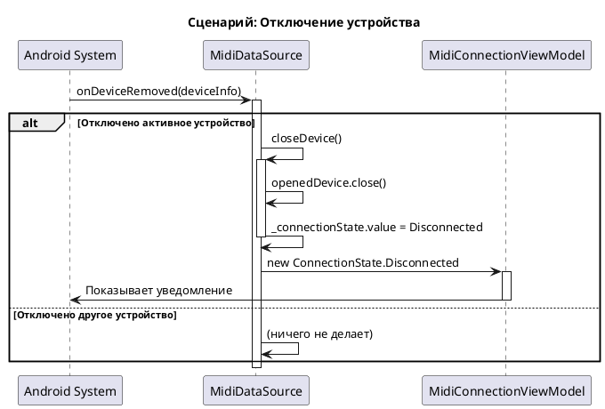

# Техническое задание: Реализация отслеживания состояния подключения MIDI-клавиатуры

## 1. Общая информация

### 1.1. Цель доработки

Реализовать функционал для автоматического отслеживания состояния подключения MIDI-клавиатуры к Android-устройству и информирования пользователя об изменениях этого состояния.

### 1.2. Базовые документы

- [Архитектурные принципы](../plans/ARCHITECTURE_PRINCIPLES.md)
- [Сценарии: Отслеживание состояния и уведомления](../uc/MIDI_KEYBOARD_CONNECTION_STATE.md)
- [Техническое задание: Реализация механизма уведомлений](./MIDI_NOTIFICATION.md)

## 2. Архитектурное решение

### 2.1. Компоненты

Система отслеживания будет построена на принципах многоуровневой архитектуры (Clean Architecture) и разделена на следующие компоненты, сгруппированные по слоям:

**Domain Layer**
- **`MidiRepository`:** Абстракция над источником данных, определяющая контракт для получения состояния подключения.
- **`MidiDevice`:** Доменная модель, представляющая информацию о подключенном MIDI-устройстве.
- **`MidiDeviceMapper`:** Интерфейс, определяющий контракт для преобразования моделей данных MIDI API в доменную модель `MidiDevice`.
- **`TrackMidiConnectionUseCase`:** Бизнес-логика, предоставляющая `Flow<ConnectionState>` для `Presentation Layer`.
- **`ShowConnectionNotificationUseCase`:** Компонент, который используется для отображения уведомлений пользователю.

**Data Layer**
- **`MidiDataSource`:** Инкапсулирует всю работу с Android MIDI API (`MidiManager`), используя `Context` для доступа к системным сервисам. Отслеживает подключения и отключения, транслируя их в `Flow`.
- **`MidiDeviceMapperImpl`:** Реализация интерфейса `MidiDeviceMapper`.

**Presentation Layer**
- **`MidiConnectionViewModel`:** `ViewModel`, которая подписывается на `Flow` из `UseCase` и инициирует отображение уведомлений.

```plantuml
@startuml
!include https://raw.githubusercontent.com/plantuml-stdlib/C4-PlantUML/master/C4_Component.puml

title C4 - Level 3: Компоненты системы отслеживания MIDI

System_Ext(android_sdk, "Android SDK", "Контекст и системные сервисы (MidiManager)")

Container_Boundary(presentation, "Presentation Layer") {
    Component(vm, "MidiConnectionViewModel", "ViewModel", "Подписывается на изменения и инициирует уведомления.")
    Component(activity, "MainActivity", "UI", "Запускает ViewModel и отображает UI.")
}

Container_Boundary(domain, "Domain Layer") {
    Component(track_uc, "TrackMidiConnectionUseCase", "Use Case", "Предоставляет Flow состояния.")
    Component(notify_uc, "ShowConnectionNotificationUseCase", "Use Case", "Отображает уведомления.")
    Component(repo, "MidiRepository", "Interface", "Контракт для получения данных.")
    Component(mapper, "MidiDeviceMapper", "Interface", "Контракт для преобразования DTO.")
    Component(state, "ConnectionState", "Sealed Interface", "Модель состояния.")
    Component(device, "MidiDevice", "Data Class", "Доменная модель устройства.")
}

Container_Boundary(data, "Data Layer") {
    Component(repo_impl, "MidiRepositoryImpl", "Implementation", "Проксирует данные из DataSource.")
    Component(ds, "MidiDataSource", "Data Source", "Работает с Android MIDI API, используя Context.")
    Component(mapper_impl, "MidiDeviceMapperImpl", "Implementation", "Преобразует DTO в доменную модель.")
}

' Связи
Rel(activity, vm, "Использует")
Rel(vm, track_uc, "Вызывает")
Rel(vm, notify_uc, "Вызывает")
Rel(track_uc, repo, "Зависит от")
Rel(repo_impl, repo, "@Binds")
Rel(repo_impl, ds, "Зависит от")
Rel(ds, mapper, "Зависит от")
Rel(ds, android_sdk, "Использует", "MidiManager, Context")
Rel(mapper_impl, mapper, "@Binds")
Rel(track_uc, state, "Возвращает Flow<ConnectionState>")

Rel(state, device, "Содержит")
Rel(mapper_impl, device, "Создает")

@enduml
```

### 2.2. API и Модели данных

**Domain Layer:**

```kotlin
// com.astrizhachuk.pianoflow.domain.model.ConnectionState.kt
sealed interface ConnectionState {
    data class Connected(val device: MidiDevice) : ConnectionState
    data object Disconnected : ConnectionState
    data class Error(val message: String) : ConnectionState
    data object NoDevice : ConnectionState
}

// com.astrizhachuk.pianoflow.domain.model.MidiDevice.kt
data class MidiDevice(val id: Int, val name: String, val vendor: String)

// com.astrizhachuk.pianoflow.domain.repository.MidiRepository.kt
interface MidiRepository {
    fun observeConnectionState(): Flow<ConnectionState>
}
```

### 2.3. Внедрение зависимостей

Чтобы Hilt знал, как предоставлять реализации для интерфейсов, используется `DataModule`.

```kotlin
// com.astrizhachuk.pianoflow.data.di.DataModule.kt

@Module
@InstallIn(SingletonComponent::class)
abstract class DataModule {

    @Binds
    abstract fun bindMidiRepository(impl: MidiRepositoryImpl): MidiRepository

    @Binds
    abstract fun bindMidiDeviceMapper(impl: MidiDeviceMapperImpl): MidiDeviceMapper

    companion object {
        @Provides
        @Singleton
        fun provideMidiDataSource(
            @ApplicationContext context: Context,
            midiDeviceMapper: MidiDeviceMapper
        ): MidiDataSource {
            return MidiDataSource(context, midiDeviceMapper)
        }
    }
}
```

- **`@Binds`** эффективно сообщает Hilt, какие реализации использовать для каких интерфейсов (`MidiRepository` и `MidiDeviceMapper`).
- **`@Provides`** используется для `provideMidiDataSource`, поскольку для создания этого объекта требуется логика.
- **`provideMidiDataSource`** создает `MidiDataSource`, внедряя в него контекст приложения и `MidiDeviceMapper`. Этот компонент является центральной точкой, инкапсулирующей всю логику работы с Android MIDI API.
- **`@Singleton`** гарантирует, что для каждого из этих компонентов будет создан только один экземпляр.



## 3. Жизненный цикл и взаимодействие

### 3.1. Принцип работы

1.  **Инициализация и жизненный цикл**:
    *   `MidiDataSource` внедряется как **синглтон** (`@Singleton`) на уровне всего приложения. Это означает, что он создается один раз при первом запуске и существует на протяжении всего жизненного цикла приложения.
    *   Для своей работы он использует **контекст приложения** (`ApplicationContext`), а не контекст `Activity`. Это гарантирует, что отслеживание MIDI-устройств продолжается в фоновом режиме, независимо от жизненного цикла конкретных экранов.
    *   В `init`-блоке `MidiDataSource` немедленно регистрирует `MidiManager.DeviceCallback`. Эта подписка на системные события остается активной до тех пор, пока живо приложение, обеспечивая непрерывное отслеживание подключений и отключений.
    *   Сразу после регистрации `MidiDataSource` пытается подключиться к любому уже подключенному устройству.

2.  **Обнаружение и подключение**:
    *   **При запуске**: `openFirstAvailableDevice()` запрашивает у `MidiManager` список устройств. Если устройства найдены, он берет первое и вызывает `openDevice()`.
    *   **Во время работы**: Когда пользователь подключает новое MIDI-устройство, срабатывает `DeviceCallback.onDeviceAdded()`. Если в данный момент нет активного подключения, `onDeviceAdded` вызывает `openFirstAvailableDevice()`.

3.  **Асинхронное открытие соединения**:
    *   Метод `openDevice()` вызывает `midiManager.openDevice()`, который работает асинхронно.
    *   В качестве коллбэка передается лямбда-функция, которая будет выполнена по завершении попытки открытия.
    *   **Успех**: Если `MidiDevice` успешно получен (не `null`), он сохраняется в `openedDevice`, а в `_connectionState` отправляется `ConnectionState.Connected`.
    *   **Неудача**: Если устройство не удалось открыть (`null`), в `_connectionState` отправляется `ConnectionState.Error`.

4.  **Отключение устройства**:
    *   Когда пользователь физически отключает MIDI-устройство, срабатывает `DeviceCallback.onDeviceRemoved()`.
    *   Если `id` отключенного устройства совпадает с `id` текущего `openedDevice`, вызывается `closeDevice()`.
    *   `closeDevice()` закрывает соединение (`openedDevice.close()`), обнуляет ссылку и отправляет в `_connectionState` значение `ConnectionState.Disconnected`.

5.  **Потребление состояния на уровне UI**:
    *   **`MidiConnectionViewModel`**, чей жизненный цикл привязан к `Activity`, получает `Flow<ConnectionState>` из `domain`-слоя.
    *   Она преобразует этот поток в `StateFlow`, который хранит последнее полученное состояние. Это позволяет `Activity` (или `Fragment`) подписываться на него и всегда иметь актуальные данные.
    *   `ViewModel` следит за состоянием и реагирует на его изменения (например, вызывая `ShowConnectionNotificationUseCase` для отображения уведомлений) только тогда, когда UI (например, `Activity`) активен и подписывается на `StateFlow`. Сам `MidiDataSource` при этом продолжает работать в фоне.

### 3.2. Диаграммы взаимодействия

#### Сценарий №1: Первичная инициализация и подключение к существующему устройству

Эта диаграмма показывает, что происходит при первом запуске `MidiDataSource`, когда MIDI-устройство уже подключено к телефону.



#### Сценарий №2: Подключение нового устройства во время работы приложения

Эта диаграмма иллюстрирует реакцию системы на подключение нового MIDI-устройства "на лету".



#### Сценарий №3: Отключение устройства

Эта диаграмма показывает, что происходит при физическом отключении текущего активного устройства.



## 4. Критерии приемки

- ✅ При подключении MIDI-клавиатуры система автоматически подключается к ней.
- ✅ Пользователь видит уведомление об успешном подключении с именем устройства.
- ✅ При отключении клавиатуры пользователь видит соответствующее уведомление.
- ✅ При возникновении ошибок (например, MIDI API недоступен) пользователь информируется через уведомление.
- ✅ Логика отслеживания и уведомления корректно работает при перезапусках `Activity` (с учетом `stateIn` и `WhileSubscribed`).

---
