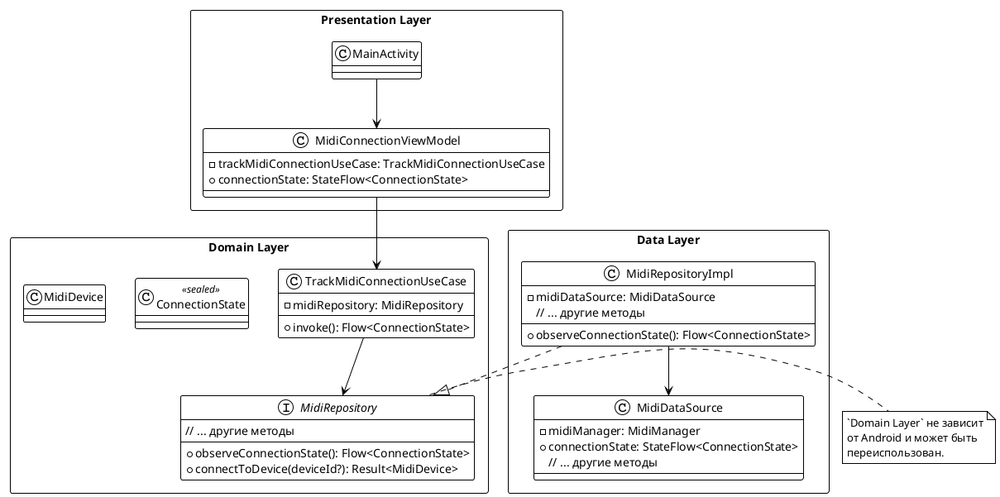

# Техническое задание: Реализация отслеживания состояния подключения MIDI-клавиатуры

## 1. Общая информация

### 1.1. Цель доработки

Реализация функционала автоматического отслеживания состояния подключения MIDI-клавиатуры к Android-устройству.

### 1.2. Базовые документы

- [Описание приложения](../plans/APPLICATION_DESCRIPTION.md)
- [Архитектурные принципы](../plans/ARCHITECTURE_PRINCIPLES.md)
- [Сценарии отслеживания состояния подключения MIDI-клавиатуры](../uc/MIDI_KEYBOARD_CONNECTION_STATE.md)
- [Техническое задание: Реализация уведомлений](./MIDI_NOTIFICATION.md)

## 2. Реализованный сценарий

### 2.1. UC-001: Отслеживание состояния подключения MIDI-клавиатуры

**Статус:** ✅ Реализовано

**Реализованные сценарии:**
- ✅ Автоматическое отслеживание подключенных MIDI-устройств при запуске приложения
- ✅ Автоматическое подключение к первому найденному устройству
- ✅ Обнаружение устройства, уже подключенного при запуске приложения
- ✅ Обнаружение отключения устройства
- ✅ Поддержка только одного устройства одновременно
- ✅ Обработка случая, когда MIDI не поддерживается на устройстве

**Реализованные компоненты:**
- `TrackMidiConnectionUseCase` (`Domain Layer`)
- `MidiRepository` (Интерфейс в `Domain Layer`, реализация в `Data Layer`)
- `MidiDataSource` (`Data Layer`)
- `MidiConnectionViewModel` (`Presentation Layer`)

## 3. Архитектурные решения

### 3.1. Архитектурные слои

Реализация разделена на три слоя:

- **`Domain Layer`** — независим от Android, содержит бизнес-логику.
- **`Data Layer`** — реализует источники данных через Android MIDI API.
- **`Presentation Layer`** — Android-специфичный слой для UI.

### 3.2. Диаграмма слоев и компонентов

Ниже представлена диаграмма взаимодействия компонентов.

## 4. Структура компонентов по слоям

### 4.1. Domain Layer

- **Модели**: `MidiDevice`, `ConnectionState`
- **Интерфейсы репозиториев**: `MidiRepository`
- **Сценарии (Use Cases)**: `TrackMidiConnectionUseCase`

### 4.2. Data Layer

- **Источники данных (Data Sources)**: `MidiDataSource` (работает с Android MIDI API)
- **Реализации репозиториев**: `MidiRepositoryImpl`
- **DI-модули**: `DataModule`

### 4.3. Presentation Layer

- **ViewModels**: `MidiConnectionViewModel`
- **UI Components (Activities/Fragments)**: `MainActivity`

## 5. Зависимости

...
(раздел без изменений)

## 6. Заключение

Реализован полный функционал отслеживания состояния подключения MIDI-клавиатуры. Реализация использует Clean Architecture, покрыта unit-тестами и готова к использованию.
