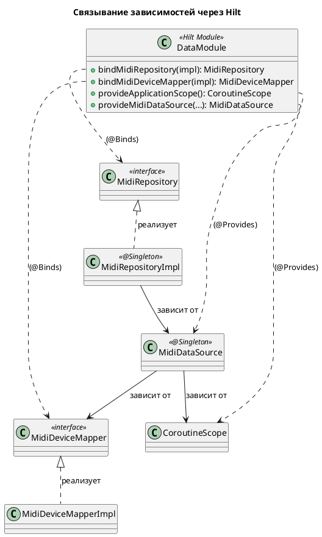
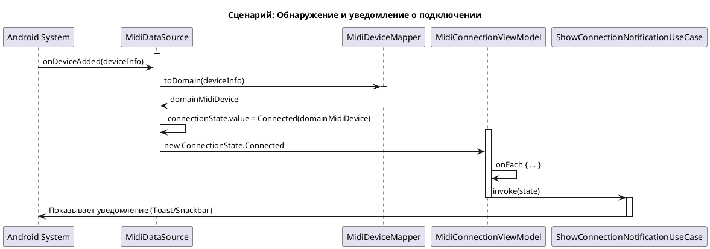

# Техническое задание: Реализация отслеживания состояния подключения MIDI-клавиатуры

## 1. Общая информация

### 1.1. Цель доработки

Реализовать функционал для автоматического отслеживания состояния подключения MIDI-клавиатуры к Android-устройству и информирования пользователя об изменениях этого состояния.

### 1.2. Базовые документы

- [Архитектурные принципы](../plans/ARCHITECTURE_PRINCIPLES.md)
- [Сценарии: Отслеживание состояния и уведомления](../uc/MIDI_KEYBOARD_CONNECTION_STATE.md)
- [Техническое задание: Реализация механизма уведомлений](./MIDI_NOTIFICATION.md)

## 2. Архитектурное решение

### 2.1. Компоненты

Система отслеживания будет построена на принципах многоуровневой архитектуры (Clean Architecture) и разделена на следующие компоненты, сгруппированные по слоям:

**Domain Layer**
- **`MidiRepository`:** Абстракция над источником данных, определяющая контракт для получения состояния подключения.
- **`MidiDevice`:** Доменная модель, представляющая информацию о подключенном MIDI-устройстве.
- **`MidiDeviceMapper`:** Интерфейс, определяющий контракт для преобразования моделей данных MIDI API в доменную модель `MidiDevice`.
- **`TrackMidiConnectionUseCase`:** Бизнес-логика, предоставляющая `Flow<ConnectionState>` для `Presentation Layer`.
- **`ShowConnectionNotificationUseCase`:** Компонент, который используется для отображения уведомлений пользователю.

**Data Layer**
- **`MidiDataSource`:** Инкапсулирует всю работу с Android MIDI API (`MidiManager`), отслеживает подключения и отключения, транслируя их в `Flow`.
- **`MidiDeviceMapperImpl`:** Реализация интерфейса `MidiDeviceMapper`.

**Presentation Layer**
- **`MidiConnectionViewModel`:** `ViewModel`, которая подписывается на `Flow` из `UseCase` и инициирует отображение уведомлений.

```plantuml
@startuml
!include https://raw.githubusercontent.com/plantuml-stdlib/C4-PlantUML/master/C4_Component.puml

title C4 - Level 3: Компоненты системы отслеживания MIDI

Container_Boundary(presentation, "Presentation Layer") {
    Component(vm, "MidiConnectionViewModel", "ViewModel", "Подписывается на изменения и инициирует уведомления.")
    Component(activity, "MainActivity", "UI", "Запускает ViewModel и отображает UI.")
}

Container_Boundary(domain, "Domain Layer") {
    Component(track_uc, "TrackMidiConnectionUseCase", "Use Case", "Предоставляет Flow состояния.")
    Component(notify_uc, "ShowConnectionNotificationUseCase", "Use Case", "Отображает уведомления.")
    Component(repo, "MidiRepository", "Interface", "Контракт для получения данных.")
    Component(mapper, "MidiDeviceMapper", "Interface", "Контракт для преобразования DTO.")
    Component(state, "ConnectionState", "Sealed Interface", "Модель состояния.")
    Component(device, "MidiDevice", "Data Class", "Доменная модель устройства.")
}

Container_Boundary(data, "Data Layer") {
    Component(repo_impl, "MidiRepositoryImpl", "Implementation", "Проксирует данные из DataSource.")
    Component(ds, "MidiDataSource", "Data Source", "Работает с Android MIDI API.")
    Component(mapper_impl, "MidiDeviceMapperImpl", "Implementation", "Преобразует DTO в доменную модель.")
}

' Связи
Rel(activity, vm, "Использует")
Rel(vm, track_uc, "Вызывает")
Rel(vm, notify_uc, "Вызывает")
Rel(track_uc, repo, "Зависит от")
Rel(repo_impl, repo, "@Binds")
Rel(repo_impl, ds, "Зависит от")
Rel(ds, mapper, "Зависит от")
Rel(mapper_impl, mapper, "@Binds")
Rel(track_uc, state, "Возвращает Flow<ConnectionState>")

Rel(state, device, "Содержит")
Rel(mapper_impl, device, "Создает")

@enduml
```

### 2.2. API и Модели данных

**Domain Layer:**

```kotlin
// com.astrizhachuk.pianoflow.domain.model.ConnectionState.kt
sealed interface ConnectionState {
    data class Connected(val device: MidiDevice) : ConnectionState
    data object Disconnected : ConnectionState
    data class Error(val message: String) : ConnectionState
    data object NoDevice : ConnectionState
}

// com.astrizhachuk.pianoflow.domain.model.MidiDevice.kt
data class MidiDevice(val id: Int, val name: String, val vendor: String)

// com.astrizhachuk.pianoflow.domain.repository.MidiRepository.kt
interface MidiRepository {
    fun observeConnectionState(): Flow<ConnectionState>
}
```

### 2.3. Внедрение зависимостей

Чтобы Hilt знал, как предоставлять реализации для интерфейсов, используется `DataModule`.

```kotlin
// com.astrizhachuk.pianoflow.data.di.DataModule.kt

@Module
@InstallIn(SingletonComponent::class)
abstract class DataModule {

    @Binds
    abstract fun bindMidiRepository(impl: MidiRepositoryImpl): MidiRepository

    @Binds
    abstract fun bindMidiDeviceMapper(impl: MidiDeviceMapperImpl): MidiDeviceMapper

    companion object {
        @Provides
        @Singleton
        fun provideApplicationScope(): CoroutineScope { 
            return CoroutineScope(SupervisorJob() + Dispatchers.Default)
        }

        @Provides
        @Singleton
        fun provideMidiDataSource(
            @ApplicationContext context: Context,
            scope: CoroutineScope,
            midiDeviceMapper: MidiDeviceMapper
        ): MidiDataSource {
            return MidiDataSource(context, scope, midiDeviceMapper)
        }
    }
}
```

- **`@Binds`** эффективно сообщает Hilt, какие реализации использовать для каких интерфейсов (`MidiRepository` и `MidiDeviceMapper`).
- **`@Provides`** используется для `provideMidiDataSource` и `provideApplicationScope`, поскольку для создания этих объектов требуется логика.
- **`provideApplicationScope`** создает `CoroutineScope` уровня приложения. Он необходим для `MidiDataSource`, чтобы отслеживание состояния подключения работало на протяжении всего жизненного цикла приложения, независимо от состояния UI.
- **`provideMidiDataSource`** создает `MidiDataSource`, внедряя в него контекст приложения, `CoroutineScope` и `MidiDeviceMapper`. Этот компонент является центральной точкой, инкапсулирующей всю логику работы с Android MIDI API.
- **`@Singleton`** гарантирует, что для каждого из этих компонентов будет создан только один экземпляр.



## 3. Жизненный цикл и взаимодействие

### 3.1. Принцип работы

1.  **`MidiDataSource`** при инициализации регистрирует `DeviceCallback` у `MidiManager` и немедленно проверяет наличие уже подключенных устройств.
2.  При получении системного `MidiDeviceInfo`, `MidiDataSource` использует внедренный `MidiDeviceMapper` для преобразования его в доменную модель `MidiDevice`.
3.  Любое изменение (подключение/отключение) транслируется в `StateFlow<ConnectionState>`.
4.  **`MidiConnectionViewModel`** через `TrackMidiConnectionUseCase` и `MidiRepository` получает этот `Flow`.
5.  С помощью оператора `stateIn` `ViewModel` превращает холодный `Flow` в горячий `StateFlow`, который кеширует последнее состояние. Это позволяет `MainActivity` и другим подписчикам безопасно подключаться к потоку данных.
6.  В операторе `onEach` `ViewModel` вызывает `ShowConnectionNotificationUseCase` для каждого нового состояния, инициируя показ уведомления.

### 3.2. Последовательность событий

Диаграмма иллюстрирует процесс от момента подключения устройства до отображения уведомления.



## 4. Критерии приемки

- ✅ При подключении MIDI-клавиатуры система автоматически подключается к ней.
- ✅ Пользователь видит уведомление об успешном подключении с именем устройства.
- ✅ При отключении клавиатуры пользователь видит соответствующее уведомление.
- ✅ При возникновении ошибок (например, MIDI API недоступен) пользователь информируется через уведомление.
- ✅ Логика отслеживания и уведомления корректно работает при перезапусках `Activity` (с учетом `stateIn` и `WhileSubscribed`).

---
