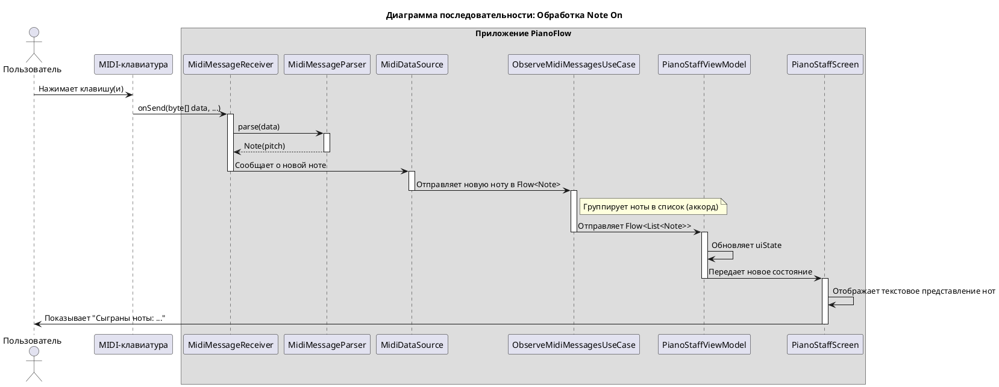

# Техническое задание: Реализация обработки и отображения MIDI-сообщений

## 1. Общая информация

### 1.1. Цель доработки

Реализовать функционал для приема, обработки и визуализации MIDI-сообщений (нот), поступающих от подключенной MIDI-клавиатуры. Основная задача — отображать сыгранные пользователем ноты и аккорды на экране в реальном времени.

### 1.2. Базовые документы

- [Архитектурные принципы](../plans/ARCHITECTURE_PRINCIPLES.md)
- [Сценарии: Прием и отображение MIDI-сообщений](../uc/MIDI_MESSAGE_PROCESSING.md)
- [Техническое задание: Реализация отслеживания состояния подключения MIDI-клавиатуры](./MIDI_CONNECTION.md)

## 2. Архитектурное решение

### 2.1. Компоненты

Система обработки MIDI-сообщений интегрирована в существующую архитектуру, расширяя функционал `Data` и `Domain` слоев и добавляя новые компоненты в `Presentation` слой.

**Data Layer**
- **`MidiDataSource`:** Расширен для обработки входящих MIDI-сообщений. После успешного открытия устройства (`MidiManager.openDevice`), он подключает `MidiReceiver` к **выходному порту** устройства (`MidiOutputPort`) для приема данных.
- **`MidiMessageReceiver`:** Внутренняя реализация `android.media.midi.MidiReceiver`, ответственная за прием сырых MIDI-данных (`byte[]`).
- **`MidiMessageParser`:** Компонент, который получает сырые данные от `MidiMessageReceiver`, парсит их и преобразует в доменную модель `Note`. Игнорирует все сообщения, кроме `Note On`.
- **`MidiRepositoryImpl`:** Реализация репозитория, которая предоставляет поток входящих нот.

**Domain Layer**
- **`Note`:** Доменная модель, представляющая одну ноту (высота тона).
- **`MidiRepository`:** Интерфейс дополнен методом для наблюдения за входящими нотами (`Flow<Note>`).
- **`ObserveMidiMessagesUseCase`:** `Use Case`, который получает поток одиночных нот и преобразует его в `Flow<List<Note>>`, группируя быстрые последовательные нажатия в один аккорд.

**Presentation Layer**
- **`PianoStaffViewModel`:** Новая `ViewModel` для экрана с нотным станом. Она получает `Flow` нот из `ObserveMidiMessagesUseCase` и преобразует его в состояние для UI.
- **`PianoStaffScreen`:** `Composable`-экран, который отображает сыгранные ноты. На данном этапе — в виде простого текста.
- **`MainActivity`**: Основная `Activity` приложения, которая была переведена на Jetpack Compose с помощью `setContent` для отображения `PianoStaffScreen` и использует `MaterialTheme`.

```plantuml
@startuml
!include https://raw.githubusercontent.com/plantuml-stdlib/C4-PlantUML/master/C4_Component.puml

title C4 - Level 3: Компоненты системы обработки MIDI-сообщений

System_Ext(midi_device, "MIDI Keyboard", "Физическое устройство")
System_Ext(android_sdk, "Android SDK", "MidiReceiver, MidiOutputPort")

Container_Boundary(presentation, "Presentation Layer") {
    Component(activity, "MainActivity", "Activity", "Отображает Composable UI")
    Component(vm, "PianoStaffViewModel", "ViewModel", "Управляет состоянием нотного стана.")
    Component(screen, "PianoStaffScreen", "Composable", "Отображает ноты.")
}

Container_Boundary(domain, "Domain Layer") {
    Component(observe_uc, "ObserveMidiMessagesUseCase", "Use Case", "Группирует ноты в аккорды.")
    Component(repo, "MidiRepository", "Interface", "Контракт для получения MIDI-данных.")
    Component(note, "Note", "Data Class", "Доменная модель ноты.")
}

Container_Boundary(data, "Data Layer") {
    Component(repo_impl, "MidiRepositoryImpl", "Implementation", "Реализация репозитория.")
    Component(ds, "MidiDataSource", "Data Source", "Получает сообщения через MidiReceiver.")
    Component(parser, "MidiMessageParser", "Parser", "Парсит сырые MIDI-сообщения.")
    Component(receiver, "MidiMessageReceiver", "Receiver", "Реализация android.media.midi.MidiReceiver.")
}

' Связи
Rel(activity, screen, "Отображает")
Rel(screen, vm, "Наблюдает за")
Rel(vm, observe_uc, "Вызывает")
Rel(observe_uc, repo, "Зависит от")

Rel(repo_impl, repo, "@Binds")
Rel(repo_impl, ds, "Зависит от")

Rel(ds, parser, "Использует")
Rel(ds, receiver, "Создает и подключает")
Rel(receiver, android_sdk, "Реализует")
Rel(receiver, parser, "Передает данные в")

Rel(midi_device, ds, "Отправляет MIDI-сообщения", "USB/Bluetooth")

Rel(observe_uc, note, "Возвращает Flow<List<Note>>")
Rel(parser, note, "Создает")

@enduml
```

### 2.2. API и Модели данных

**Domain Layer:**

```kotlin
// com.astrizhachuk.pianoflow.domain.model.Note.kt
data class Note(
    val pitch: Int // MIDI номер ноты (0-127)
)

// com.astrizhachuk.pianoflow.domain.repository.MidiRepository.kt
interface MidiRepository {
    fun observeConnectionState(): Flow<ConnectionState>
    fun observeNotes(): Flow<Note> // Возвращает поток одиночных нот
}
```

**Presentation Layer:**

```kotlin
// com.astrizhachuk.pianoflow.presentation.pianostaff.PianoStaffUiState.kt
data class PianoStaffUiState(
    val notes: List<Note> = emptyList()
)

// com.astrizhachuk.pianoflow.presentation.pianostaff.PianoStaffViewModel.kt
@HiltViewModel
class PianoStaffViewModel @Inject constructor(
    observeMidiMessagesUseCase: ObserveMidiMessagesUseCase
) : ViewModel() {

    val uiState: StateFlow<PianoStaffUiState> = observeMidiMessagesUseCase()
        .map { notes -> PianoStaffUiState(notes = notes) }
        .stateIn(
            scope = viewModelScope,
            started = SharingStarted.WhileSubscribed(5000),
            initialValue = PianoStaffUiState()
        )
}
```

### 2.3. Расширение зависимостей

`MidiMessageParser` был добавлен в граф зависимостей Hilt и внедрен в `MidiDataSource`.

```kotlin
// com.astrizhachuk.pianoflow.data.di.DataModule.kt
// ...
companion object {
    @Provides
    @Singleton
    fun provideMidiDataSource(
        @ApplicationContext context: Context,
        midiDeviceMapper: MidiDeviceMapper,
        midiMessageParser: MidiMessageParser // Добавлена зависимость
    ): MidiDataSource {
        return MidiDataSource(context, midiDeviceMapper, midiMessageParser)
    }

    @Provides
    @Singleton
    fun provideMidiMessageParser(): MidiMessageParser {
        return MidiMessageParser()
    }
}
```

### 3. Жизненный цикл и взаимодействие

### 3.1. Принцип работы

1.  **Подключение `Receiver`'а**:
    *   После того как `MidiDataSource` успешно открывает соединение с MIDI-устройством, он находит первый доступный **выходной порт** (`MidiOutputPort`) устройства.
    *   `MidiDataSource` вызывает `outputPort.connect(midiMessageReceiver)`, чтобы начать получать MIDI-данные.

2.  **Прием и парсинг сообщений**:
    *   Когда пользователь нажимает клавишу, MIDI-клавиатура отправляет сообщение. `MidiMessageReceiver.onSend()` вызывается с сырыми данными (`byte[]`).
    *   `MidiMessageReceiver` немедленно передает эти данные в `MidiMessageParser`.
    *   `MidiMessageParser` анализирует байты. Если это `Note On`, он извлекает номер ноты и создает объект `Note`, который передает обратно в `MidiDataSource`.
    *   `MidiDataSource` отправляет полученную `Note` в `SharedFlow`.

3.  **Группировка и передача нот**:
    *   `MidiRepositoryImpl` проксирует `Flow<Note>` из `MidiDataSource`.
    *   `ObserveMidiMessagesUseCase` подписывается на этот поток. Он использует операторы `Kotlin Flow` (например, `channelFlow` с `delay`) для группировки нот, пришедших в течение короткого промежутка времени (`50 мс`), в один список `List<Note>` (аккорд).

4.  **Отображение на UI**:
    *   `PianoStaffViewModel` подписывается на `Flow<List<Note>>` от `ObserveMidiMessagesUseCase` и обновляет свой `StateFlow<PianoStaffUiState>`.
    *   `MainActivity` через `setContent` устанавливает `MaterialTheme` и отображает `PianoStaffScreen`.
    *   `PianoStaffScreen` подписывается на `uiState` и перерисовывается, отображая актуальный список нот в виде текста.
    
    Примечание: Реализация уведомлений о подключении использует View-систему и будет переведена на Jetpack Compose в будущем.

### 3.2. Диаграмма последовательности

Эта диаграмма иллюстрирует актуальный поток данных от нажатия клавиши до отображения ноты на экране.


## 4. Критерии приемки

- При нажатии одной клавиши на MIDI-клавиатуре соответствующая нота немедленно отображается на экране (в виде MIDI-номера).
- При одновременном нажатии нескольких клавиш (аккорд) все соответствующие ноты отображаются на экране (в виде MIDI-номеров).
- Каждое новое событие нажатия (`Note On`) приводит к полной очистке экрана перед отображением новых нот.
- Система реагирует только на сообщения о нажатии клавиш (`Note On`); сообщения об отпускании (`Note Off`) и другие типы MIDI-сообщений игнорируются.
- Визуализация нот на экране происходит без видимых задержек после нажатия клавиши.
- Функционал стабильно работает при быстром и многократном нажатии клавиш, приложение не падает и не зависает.

## См. также

- [См. документ о Kotlin Flow](../tech/KOTLIN_FLOW.md)
- [См. документ о MIDI API в Android](../tech/MIDI.md)
