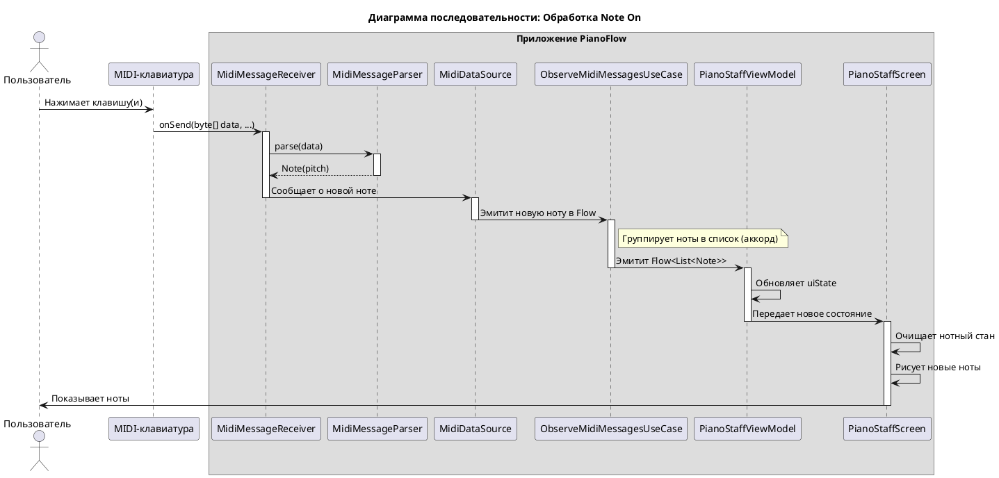

# Техническое задание: Реализация обработки и отображения MIDI-сообщений

## 1. Общая информация

### 1.1. Цель доработки

Реализовать функционал для приема, обработки и визуализации MIDI-сообщений (нот), поступающих от подключенной MIDI-клавиатуры. Основная задача — отображать сыгранные пользователем ноты и аккорды на виртуальном нотном стане в реальном времени.

### 1.2. Базовые документы

- [Архитектурные принципы](../plans/ARCHITECTURE_PRINCIPLES.md)
- [Сценарии: Прием и отображение MIDI-сообщений](../uc/MIDI_MESSAGE_PROCESSING.md)

## 2. Архитектурное решение

### 2.1. Компоненты

Система обработки MIDI-сообщений будет интегрирована в существующую архитектуру, расширяя функционал `Data` и `Domain` слоев и добавляя новые компоненты в `Presentation` слой.

**Data Layer**
- **`MidiDataSource`:** Будет расширен для обработки входящих MIDI-сообщений. После успешного открытия устройства (`MidiManager.openDevice`), он будет подключать кастомный `MidiReceiver` к входному порту устройства (`MidiInputPort`) для приема данных.
- **`MidiMessageReceiver`:** Новая внутренняя реализация `android.media.midi.MidiReceiver`, ответственная за прием сырых MIDI-данных (`byte[]`).
- **`MidiMessageParser`:** Новый компонент, который получает сырые данные от `MidiMessageReceiver`, парсит их и преобразует в доменную модель `Note`. Он будет игнорировать все сообщения, кроме `Note On`.
- **`MidiRepositoryImpl`:** Будет расширен для предоставления потока сыгранных нот.

**Domain Layer**
- **`Note`:** Новая доменная модель, представляющая одну ноту (высота тона).
- **`MidiRepository`:** Интерфейс будет дополнен методом для наблюдения за входящими нотами.
- **`ObserveMidiMessagesUseCase`:** `Use Case`, который предоставляет `Flow<List<Note>>` для `Presentation Layer`. Он инкапсулирует логику группировки быстрых последовательных нажатий в один аккорд.

**Presentation Layer**
- **`PianoStaffViewModel`:** Новая `ViewModel` для экрана с нотным станом. Она будет получать `Flow` нот из `ObserveMidiMessagesUseCase` и преобразовывать его в состояние для UI.
- **`PianoStaffScreen`:** Новый `Composable`-экран, который отображает нотный стан и визуализирует ноты на основе состояния, полученного от `ViewModel`.

```plantuml
@startuml
!include https://raw.githubusercontent.com/plantuml-stdlib/C4-PlantUML/master/C4_Component.puml

title C4 - Level 3: Компоненты системы обработки MIDI-сообщений

System_Ext(midi_device, "MIDI Keyboard", "Физическое устройство")
System_Ext(android_sdk, "Android SDK", "MidiReceiver, MidiInputPort")

Container_Boundary(presentation, "Presentation Layer") {
    Component(vm, "PianoStaffViewModel", "ViewModel", "Управляет состоянием нотного стана.")
    Component(screen, "PianoStaffScreen", "Composable", "Отображает ноты на нотном стане.")
}

Container_Boundary(domain, "Domain Layer") {
    Component(observe_uc, "ObserveMidiMessagesUseCase", "Use Case", "Предоставляет Flow<List<Note>>.")
    Component(repo, "MidiRepository", "Interface", "Контракт для получения MIDI-данных.")
    Component(note, "Note", "Data Class", "Доменная модель ноты.")
}

Container_Boundary(data, "Data Layer") {
    Component(repo_impl, "MidiRepositoryImpl", "Implementation", "Реализация репозитория.")
    Component(ds, "MidiDataSource", "Data Source", "Получает сообщения через MidiReceiver.")
    Component(parser, "MidiMessageParser", "Parser", "Парсит сырые MIDI-сообщения.")
    Component(receiver, "MidiMessageReceiver", "Receiver", "Реализация android.media.midi.MidiReceiver.")
}

' Связи
Rel(screen, vm, "Наблюдает за")
Rel(vm, observe_uc, "Вызывает")
Rel(observe_uc, repo, "Зависит от")

Rel(repo_impl, repo, "@Binds")
Rel(repo_impl, ds, "Зависит от")

Rel(ds, parser, "Использует")
Rel(ds, receiver, "Создает и подключает")
Rel(receiver, android_sdk, "Реализует")
Rel(receiver, parser, "Передает данные в")

Rel(midi_device, ds, "Отправляет MIDI-сообщения", "USB/Bluetooth")

Rel(observe_uc, note, "Возвращает Flow<List<Note>>")
Rel(parser, note, "Создает")

@enduml
```

### 2.2. API и Модели данных

**Domain Layer:**

```kotlin
// com.astrizhachuk.pianoflow.domain.model.Note.kt
data class Note(
    val pitch: Int // MIDI номер ноты (0-127)
)

// com.astrizhachuk.pianoflow.domain.repository.MidiRepository.kt
interface MidiRepository {
    fun observeConnectionState(): Flow<ConnectionState>
    fun observeNotes(): Flow<List<Note>> // Новый метод
}
```

**Presentation Layer:**

```kotlin
// com.astrizhachuk.pianoflow.presentation.pianostaff.PianoStaffUiState.kt
data class PianoStaffUiState(
    val notes: List<Note> = emptyList()
)

// com.astrizhachuk.pianoflow.presentation.pianostaff.PianoStaffViewModel.kt
@HiltViewModel
class PianoStaffViewModel @Inject constructor(
    observeMidiMessagesUseCase: ObserveMidiMessagesUseCase
) : ViewModel() {

    val uiState: StateFlow<PianoStaffUiState> = observeMidiMessagesUseCase()
        .map { notes -> PianoStaffUiState(notes = notes) }
        .stateIn(
            scope = viewModelScope,
            started = SharingStarted.WhileSubscribed(5000),
            initialValue = PianoStaffUiState()
        )
}
```

### 2.3. Расширение зависимостей

Новые компоненты будут внедряться с помощью Hilt. `MidiMessageParser` будет добавлен в граф зависимостей и внедрен в `MidiDataSource`.

```kotlin
// com.astrizhachuk.pianoflow.data.di.DataModule.kt

@Module
@InstallIn(SingletonComponent::class)
abstract class DataModule {
    // ... существующие @Binds для MidiRepository и MidiDeviceMapper ...

    companion object {
        // ... существующий provideMidiDataSource ...

        @Provides
        @Singleton
        fun provideMidiMessageParser(): MidiMessageParser {
            return MidiMessageParser()
        }
    }
}
```

### 3. Жизненный цикл и взаимодействие

### 3.1. Принцип работы

1.  **Подключение `Receiver`'а**:
    *   После того как `MidiDataSource` успешно открывает соединение с MIDI-устройством (`onDeviceOpened` callback от `MidiManager`), он получает объект `android.media.midi.MidiDevice`.
    *   `MidiDataSource` находит первый доступный входной порт (`MidiInputPort`) устройства.
    *   Создается экземпляр `MidiMessageReceiver`, и он подключается к порту с помощью `inputPort.onConnect(midiMessageReceiver)`.

2.  **Прием и парсинг сообщений**:
    *   Когда пользователь нажимает клавишу, MIDI-клавиатура отправляет сообщение. `MidiMessageReceiver.onSend()` вызывается с сырыми данными (`byte[]`).
    *   `MidiMessageReceiver` немедленно передает эти данные в `MidiMessageParser`.
    *   `MidiMessageParser` анализирует первый байт (статус). Если это `Note On` (например, `0x90` для канала 0), он извлекает второй байт (номер ноты/pitch). Сообщения `Note Off` и другие типы игнорируются, как указано в требованиях.
    *   Парсер создает объект `Note` и передает его обратно в `MidiDataSource`.

3.  **Группировка и передача нот**:
    *   `MidiDataSource` управляет внутренним потоком событий `Note`.
    *   Чтобы сгруппировать одновременно нажатые ноты (аккорды) и реализовать очистку стана перед отображением новых нот, в `ObserveMidiMessagesUseCase` поток от репозитория будет обработан с небольшой задержкой (например, с помощью `debounce` или `sample`). Это позволит собрать все ноты, пришедшие почти одновременно, в один список `List<Note>`.
    *   Каждая новая эмиссия `List<Note>` из `UseCase` представляет собой полный набор нот, которые должны быть отображены на экране в данный момент.

4.  **Отображение на UI**:
    *   `PianoStaffViewModel` подписывается на `Flow<List<Note>>` от `ObserveMidiMessagesUseCase`.
    *   При получении нового списка нот `ViewModel` обновляет свой `StateFlow<PianoStaffUiState>`.
    *   `PianoStaffScreen`, подписанный на `uiState`, получает новый список нот и перерисовывается, отображая актуальное состояние нотного стана.

### 3.2. Диаграмма последовательности

Эта диаграмма иллюстрирует поток данных от нажатия клавиши до отображения ноты на экране.


