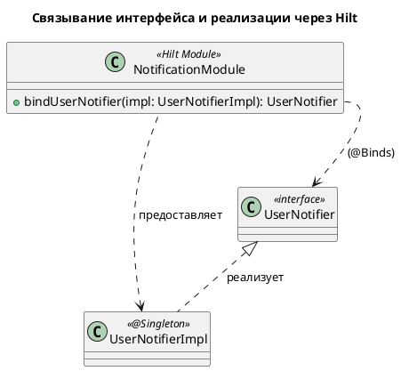
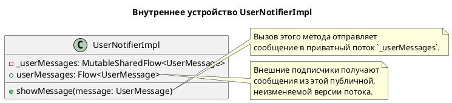
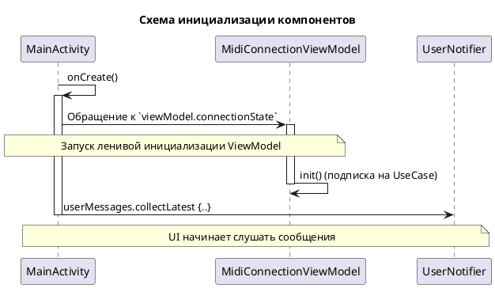

# Техническое задание: Реализация механизма уведомлений пользователя

## 1. Общая информация

### 1.1. Цель доработки

Реализовать универсальный, переиспользуемый компонент для асинхронной отправки и отображения уведомлений пользователю (например, Toast/Snackbar).

### 1.2. Базовые документы

- [Архитектурные принципы](../plans/ARCHITECTURE_PRINCIPLES.md)
- [Сценарии: Отслеживание состояния и уведомления](../uc/MIDI_KEYBOARD_CONNECTION_STATE.md)
- [Техническое задание: Отслеживание подключения USB MIDI-клавиатуры](./MIDI_CONNECTION.md)

## 2. Архитектурное решение

### 2.1. Компоненты

Для уведомления пользователя в приложении вводится механизм, состоящий из следующих компонентов в `Presentation Layer`:

*   `UserNotifier` (интерфейс) и `UserNotifierImpl` (реализация): Обеспечивают асинхронную передачу UI-событий от `ViewModel` к `View` (`Activity`/`Fragment`) по принципу "издатель-подписчик".
*   `UserMessage`: Модель данных для сообщения, отображаемого пользователю.
*   `NotificationModule`: Hilt-модуль, который предоставляет зависимость `UserNotifier` для использования в других компонентах.

Этот механизм позволяет `ViewModel` отправлять сообщения, не имея прямой ссылки на `View`, что соответствует принципам чистой архитектуры.

```plantuml
@startuml
!include https://raw.githubusercontent.com/plantuml-stdlib/C4-PlantUML/master/C4_Component.puml

title C4 - Уровень 3: Компоненты механизма уведомлений

Container_Boundary(presentation, "Presentation Layer") {
    Component(vm, "MidiConnectionViewModel", "ViewModel", "Формирует и отправляет сообщение.")
    Component(ui, "MainActivity", "Activity", "Отображает сообщение.")

    Component(notifier, "UserNotifier", "Интерфейс", "Контракт для отправки и получения уведомлений.")
    Component(impl, "UserNotifierImpl", "Singleton", "Реализация шины событий на SharedFlow.")
    Component(message, "UserMessage", "Data Class", "Модель данных для UI.")
    Component(di, "NotificationModule", "Hilt Module", "Предоставляет зависимость UserNotifier.")

    Rel(impl, notifier, "Реализует")
    Rel(di, notifier, "@Binds")

    Rel(vm, notifier, "Использует для отправки")
    Rel(ui, notifier, "Использует для подписки")
    
    Rel(vm, message, "Создает")
    Rel(notifier, message, "Передает")
}
@enduml
```

### 2.2. API

```kotlin
// Модель для сообщения пользователю
data class UserMessage(val text: String)

// Интерфейс для отправки и получения сообщений
interface UserNotifier {
    val userMessages: Flow<UserMessage>
    fun showMessage(message: UserMessage)
}
```

### 2.3. Внедрение зависимостей

Чтобы Hilt знал, что при запросе интерфейса `UserNotifier` нужно предоставлять экземпляр класса `UserNotifierImpl`, используется **@Module**.

```kotlin
// Файл: di/NotificationModule.kt
@Module
@InstallIn(SingletonComponent::class)
interface NotificationModule {

    @Binds
    fun bindUserNotifier(impl: UserNotifierImpl): UserNotifier
}

// Файл: service/UserNotifierImpl.kt
@Singleton
class UserNotifierImpl @Inject constructor() : UserNotifier {
    // ... реализация ...
}
```

*   `@Singleton` на классе `UserNotifierImpl` указывает Hilt, что этот класс должен иметь один экземпляр на все приложение.
*   `@Binds` в `NotificationModule` связывает запрос `UserNotifier` с его реализацией. Hilt автоматически применяет скоуп `@Singleton` из реализации к этому связыванию.



### 2.4. Реализация UserNotifierImpl

Класс `UserNotifierImpl` использует `MutableSharedFlow` для создания шины событий. Поток сконфигурирован со следующими параметрами:

*   `replay = 0`: Новые подписчики не получают предыдущие сообщения.
*   `extraBufferCapacity = 1`: Хранит одно сообщение, если подписчик не успевает его обработать.
*   `onBufferOverflow = BufferOverflow.DROP_OLDEST`: Отбрасывает самое старое сообщение при переполнении буфера.



## 3. Проблема ленивой инициализации и ее решение

### 3.1. Описание проблемы

Делегат `by viewModels()` в Android является **ленивым**. Это означает, что экземпляр `MidiConnectionViewModel` не создается до первого обращения к нему. Так как `MainActivity` напрямую взаимодействовала только с `UserNotifier`, `ViewModel` не создавался, и вся логика отслеживания подключения не запускалась.

### 3.2. Реализованное решение

Для решения этой проблемы реализована **принудительная инициализация `ViewModel`**. В `onCreate` `MainActivity` запускается корутина, которая обращается к `viewModel.connectionState` и начинает собирать этот `Flow`, ничего не делая с результатом (`collect()`). Это обращение служит триггером, который гарантирует создание `MidiConnectionViewModel`.

### 3.3. Диаграмма последовательности инициализации



## 4. Критерии приемки

- ✅ При подключении MIDI-клавиатуры на экране появляется Toast с сообщением, содержащим ее имя.
- ✅ При отключении MIDI-клавиатуры на экране появляется Toast с сообщением "MIDI-клавиатура отключена".
- ✅ Принудительной инициализации `MidiConnectionViewModel` в `MainActivity` гарантирует, что отслеживание подключения запускается при старте приложения.
