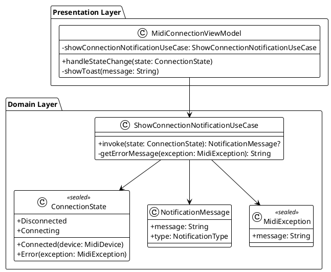

# Техническое задание: Реализация уведомлений о состоянии подключения MIDI-клавиатуры

## 1. Общая информация

**Дата реализации:** 2024-12-28  
**Версия:** 1.0  
**Статус:** ✅ Реализовано и протестировано

### 1.1. Цель доработки

Реализация функционала отображения уведомлений для пользователя о состоянии подключения USB MIDI-клавиатуры.

### 1.2. Базовые документы

- [Техническое задание: Отслеживание подключения USB MIDI-клавиатуры](./MIDI_CONNECTION.md) — основное техническое задание по подключению
- [Use Cases: USB MIDI клавиатура](../uc/USB_MIDI_KEYBOARD.md) — описание функциональных требований
- [Архитектурные принципы](../plans/ARCHITECTURE_PRINCIPLES.md) — принципы проектирования

## 2. Реализованный Use Case

### 2.1. UC-002: Отображение уведомлений о состоянии подключения

**Статус:** ✅ Реализовано (упрощенная версия через Toast)

**Реализованные сценарии:**
- ✅ Преобразование состояний подключения в понятные сообщения
- ✅ Отображение сообщения "MIDI-клавиатура подключена" при успешном подключении
- ✅ Отображение сообщения "MIDI-клавиатура отключена" при отключении
- ✅ Отображение понятных сообщений об ошибках для всех типов ошибок
- ✅ Отображение сообщений только при изменении состояния

**Реализованные компоненты:**
- `ShowConnectionNotificationUseCase` — Use Case для формирования сообщений
- `NotificationMessage` — доменная модель сообщения
- `MidiException` — иерархия исключений для различных типов ошибок
- Отображение через `Toast` (упрощенная реализация)

**Примечание:** Изначально планировалось использование системных уведомлений, но для упрощения реализации было решено использовать Toast. В будущем можно легко заменить на другой способ отображения.

## 3. Архитектурные решения

Реализация основана на общих архитектурных принципах проекта, описанных в [основном ТЗ](./MIDI_CONNECTION.md).

Ключевые компоненты, задействованные в данном use case:

- **`ShowConnectionNotificationUseCase` (Domain Layer):** Отвечает за преобразование `ConnectionState` в человеко-читаемое `NotificationMessage`. Не зависит от Android.
- **`MidiConnectionViewModel` (Presentation Layer):** Использует `ShowConnectionNotificationUseCase` для получения сообщения и отображает его пользователю через `Toast`.
- **`NotificationMessage` (Domain Layer):** Доменная модель, представляющая сообщение для пользователя.
- **`MidiException` (Domain Layer):** Иерархия исключений, которая используется для создания информативных сообщений об ошибках.

## 4. UML Диаграммы

Для полного понимания взаимодействия компонентов, пожалуйста, обратитесь к диаграммам в [основном техническом задании](./MIDI_CONNECTION.md).

Ниже представлена упрощенная диаграмма классов, относящихся к данному функционалу.

