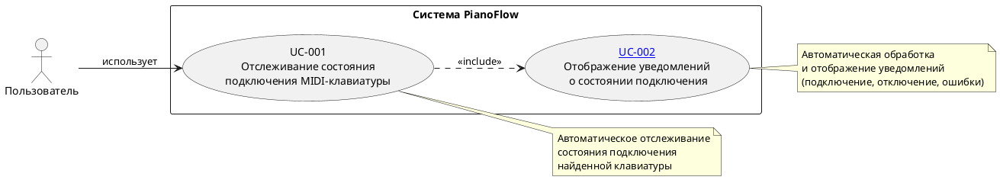
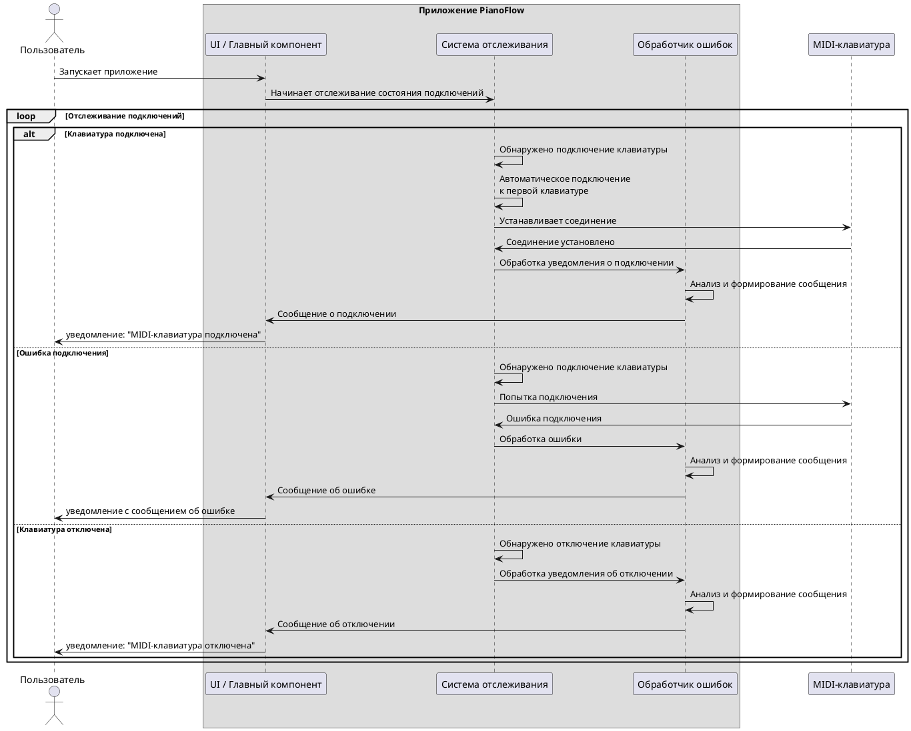

# Сценарии отслеживания состояния подключения MIDI-клавиатуры

## Цель документа

Данный документ описывает сценарии использования функционала отслеживания состояния подключения MIDI-клавиатуры к Android-устройству. Документ предназначен для:

- Формального описания функциональных требований
- Планирования приемки функционала
- Тестирования функциональности

## Общее описание функционала

Приложение автоматически отслеживает состояние подключения MIDI-клавиатуры через USB и информирует пользователя о его изменениях:

- **При подключении клавиатуры**: автоматически подключается к первой найденной клавиатуре и отображает уведомление о подключении
- **При отключении клавиатуры**: отображает уведомление об отключении
- **При ошибке подключения**: отображает уведомление с сообщением об ошибке
- **При отсутствии подключения и ошибки**: ничего не отображает пользователю

**Ограничения:**

- Поддерживается только одна MIDI-клавиатура одновременно
- Автоматическое подключение к первой найденной клавиатуре
- Обратная связь о состоянии подключения предоставляется исключительно через системные уведомления, без возможности их отключения.

## Диаграмма сценариев использования

---

## UC-001: Отслеживание состояния подключения MIDI-клавиатуры

### Идентификатор
UC-001

### Название
Отслеживание состояния подключения MIDI-клавиатуры

### Краткое описание
Система автоматически отслеживает подключение и отключение MIDI-клавиатуры через USB. При обнаружении первой доступной клавиатуры система автоматически подключается к ней и информирует пользователя о состоянии подключения через уведомления.

### Актор
Пользователь

### Предусловия
1. Разрешение на работу с MIDI предоставлено (если требуется системой)

### Постусловия
1. Система продолжает отслеживать изменения состояния подключения
2. Пользователь информирован о текущем состоянии подключения (если клавиатура подключена или произошла ошибка)

### Основной поток

1. Пользователь запускает приложение.
2. Система начинает автоматическое отслеживание состояния подключений MIDI-клавиатур
3. Пользователь подключает MIDI-клавиатуру через USB к Android-устройству
4. Система обнаруживает подключенную MIDI-клавиатуру
5. Система автоматически подключается к найденной клавиатуре
6. Система успешно устанавливает соединение с клавиатурой
7. Система обрабатывает уведомление о подключении через [UC-002](./MIDI_CONNECTION_NOTIFICATIONS.md)
8. Система продолжает отслеживать состояние подключения

### Альтернативные потоки

#### A1: Клавиатура уже подключена при запуске приложения
1. Пользователь запускает приложение.
2. Система начинает автоматическое отслеживание состояния подключений MIDI-клавиатур
3. Система обнаруживает уже подключенную MIDI-клавиатуру
4. Система автоматически подключается к найденной клавиатуре
5. Система успешно устанавливает соединение
6. Система обрабатывает уведомление о подключении через [UC-002](./MIDI_CONNECTION_NOTIFICATIONS.md)
7. Система продолжает отслеживать состояние подключения

#### A2: Ошибка при подключении к клавиатуре
1. Система начинает автоматическое отслеживание состояния подключений MIDI-клавиатур
2. Пользователь подключает MIDI-клавиатуру через USB
3. Система обнаруживает подключенную MIDI-клавиатуру
4. Система пытается автоматически подключиться к клавиатуре
5. Система не может установить соединение (возникает ошибка)
6. Система обрабатывает ошибку через [UC-002](./MIDI_CONNECTION_NOTIFICATIONS.md)
7. Система продолжает отслеживать состояние подключения

#### A3: Клавиатура отключена во время работы
1. Система отслеживает подключенную MIDI-клавиатуру
2. Пользователь отключает MIDI-клавиатуру от Android-устройства
3. Система обнаруживает отключение клавиатуры
4. Система прекращает соединение с клавиатурой
5. Система обрабатывает уведомление об отключении через [UC-002](./MIDI_CONNECTION_NOTIFICATIONS.md)
6. Система продолжает отслеживать состояние подключения для обнаружения новых клавиатур

#### A4: Несколько клавиатур подключены одновременно
1. Система обнаруживает несколько подключенных MIDI-клавиатур
2. Система выбирает первую найденную клавиатуру
3. Система автоматически подключается только к первой клавиатуре
4. Система игнорирует остальные клавиатуры
5. Система обрабатывает уведомление о подключении через [UC-002](./MIDI_CONNECTION_NOTIFICATIONS.md)
6. Система продолжает отслеживать состояние подключения

#### A5: Нет разрешения на работу с MIDI
1. Система начинает автоматическое отслеживание состояния подключений MIDI-клавиатур
2. Система не может получить доступ к MIDI-устройствам из-за отсутствия разрешений
3. Система обрабатывает ошибку через [UC-002](./MIDI_CONNECTION_NOTIFICATIONS.md)
4. Система продолжает отслеживать состояние подключения

#### A6: MIDI API недоступен
1. Система начинает автоматическое отслеживание состояния подключений MIDI-клавиатур
2. Система не может использовать MIDI API (не поддерживается устройством)
3. Система обрабатывает ошибку через [UC-002](./MIDI_CONNECTION_NOTIFICATIONS.md)
4. Система продолжает отслеживать состояние подключения

### Критерии приемки

1. ✅ При подключении MIDI-клавиатуры система автоматически подключается к первой найденной клавиатуре
2. ✅ При успешном подключении пользователь видит уведомление "MIDI-клавиатура подключена"
3. ✅ При отключении клавиатуры система отображает уведомление "MIDI-клавиатура отключена"
4. ✅ При ошибке подключения пользователь видит уведомление с описанием ошибки
5. ✅ Система реагирует на подключение/отключение клавиатуры в реальном времени
6. ✅ При наличии нескольких клавиатур система подключается только к первой
7. ✅ Система продолжает отслеживать состояние после подключения/отключения

---

## Диаграмма последовательности основного сценария

## Общие критерии приемки функционала

1. ✅ При подключении MIDI-клавиатуры система автоматически подключается к первой найденной клавиатуре
2. ✅ При успешном подключении пользователь видит уведомление "MIDI-клавиатура подключена"
3. ✅ При ошибке подключения пользователь видит уведомление с понятным сообщением об ошибке
4. ✅ При отключении клавиатуры пользователь видит уведомление "MIDI-клавиатура отключена"
5. ✅ Система реагирует на подключение/отключение клавиатуры в реальном времени
6. ✅ Все ошибки обрабатываются и отображаются пользователю в понятном формате через уведомления
7. ✅ Функционал работает стабильно при многократных подключениях/отключениях
8. ✅ Поддерживается только одна MIDI-клавиатура одновременно
9. ✅ При наличии нескольких клавиатур система подключается только к первой найденной
