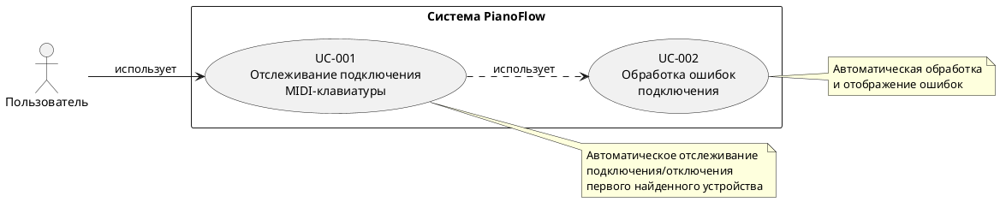
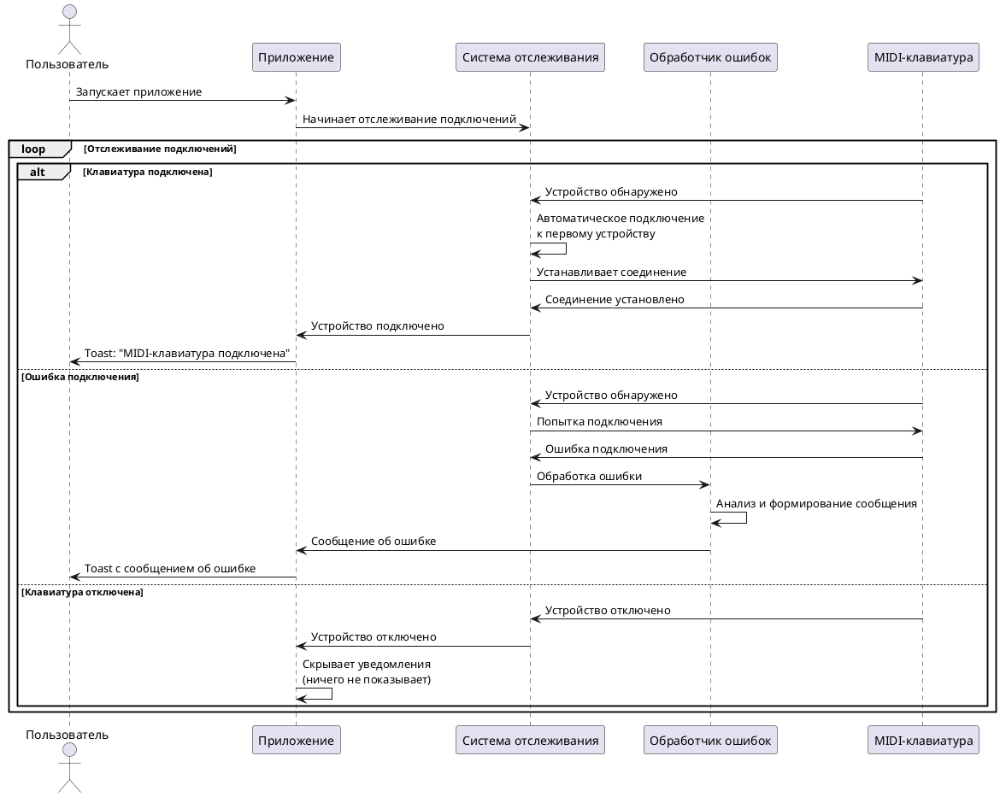

# Use Cases для подключения USB MIDI-клавиатуры

## Цель документа

Данный документ описывает формальные Use Cases (сценарии использования) функционала подключения MIDI-клавиатуры через USB к Android-устройству. Документ следует стандартной структуре Use Case и предназначен для:

- Формального описания функциональных требований
- Планирования приемки функционала
- Тестирования функциональности

## Общее описание функционала

Приложение автоматически отслеживает подключение MIDI-клавиатуры через USB и информирует пользователя о состоянии подключения:

- **При подключении устройства**: автоматически подключается к первому найденному устройству и отображает Toast-уведомление о подключении
- **При ошибке подключения**: отображает Toast-уведомление с сообщением об ошибке
- **При отсутствии подключения и ошибки**: ничего не отображает пользователю

**Ограничения:**

- Поддерживается только одно MIDI-устройство одновременно
- Автоматическое подключение к первому найденному устройству
- Уведомления отображаются через Toast

## Диаграмма Use Cases

---

## UC-001: Отслеживание подключения MIDI-клавиатуры

### Идентификатор
UC-001

### Название
Отслеживание подключения MIDI-клавиатуры

### Краткое описание
Система автоматически отслеживает подключение и отключение MIDI-клавиатуры через USB. При обнаружении первого доступного устройства система автоматически подключается к нему и информирует пользователя о состоянии подключения через Toast-уведомления.

### Актор
Пользователь

### Предусловия
1. Приложение запущено и активно
2. Разрешение на работу с MIDI предоставлено (если требуется системой)

### Постусловия
1. Система продолжает отслеживать изменения состояния подключения
2. Пользователь информирован о текущем состоянии подключения (если устройство подключено или произошла ошибка)

### Основной поток

1. Система начинает автоматическое отслеживание подключенных MIDI-устройств
2. Пользователь подключает MIDI-клавиатуру через USB к Android-устройству
3. Система обнаруживает подключенное MIDI-устройство
4. Система автоматически подключается к первому найденному устройству
5. Система успешно устанавливает соединение с устройством
6. Система отображает Toast-уведомление с текстом "MIDI-клавиатура подключена"
7. Система продолжает отслеживать состояние подключения

### Альтернативные потоки

#### A1: Устройство уже подключено при запуске приложения
1. Система начинает автоматическое отслеживание подключенных MIDI-устройств
2. Система обнаруживает уже подключенную MIDI-клавиатуру
3. Система автоматически подключается к найденному устройству
4. Система успешно устанавливает соединение
5. Система отображает Toast-уведомление с текстом "MIDI-клавиатура подключена"
6. Система продолжает отслеживать состояние подключения

#### A2: Ошибка при подключении к устройству
1. Система начинает автоматическое отслеживание подключенных MIDI-устройств
2. Пользователь подключает MIDI-клавиатуру через USB
3. Система обнаруживает подключенное MIDI-устройство
4. Система пытается автоматически подключиться к устройству
5. Система не может установить соединение (возникает ошибка)
6. Система обрабатывает ошибку через UC-002
7. Система отображает Toast-уведомление с сообщением об ошибке
8. Система продолжает отслеживать состояние подключения

#### A3: Устройство отключено во время работы
1. Система отслеживает подключенное MIDI-устройство
2. Пользователь отключает MIDI-клавиатуру от Android-устройства
3. Система обнаруживает отключение устройства
4. Система прекращает соединение с устройством
5. Система не отображает никаких уведомлений пользователю
6. Система продолжает отслеживать состояние подключения для обнаружения новых устройств

#### A4: Несколько устройств подключены одновременно
1. Система обнаруживает несколько подключенных MIDI-устройств
2. Система выбирает первое найденное устройство
3. Система автоматически подключается только к первому устройству
4. Система игнорирует остальные устройства
5. Система отображает Toast-уведомление о подключении первого устройства
6. Система продолжает отслеживать состояние подключения

### Исключения

#### E1: Нет разрешения на работу с MIDI
1. Система не может получить доступ к MIDI-устройствам
2. Система обрабатывает ошибку через UC-002
3. Система отображает Toast-уведомление с текстом "Нет разрешения на доступ к MIDI-устройству"

#### E2: MIDI API недоступен
1. Система не может использовать MIDI API (не поддерживается устройством)
2. Система обрабатывает ошибку через UC-002
3. Система отображает Toast-уведомление с текстом "MIDI не поддерживается на данном устройстве"

### Критерии приемки

1. ✅ При подключении MIDI-клавиатуры система автоматически подключается к первому найденному устройству
2. ✅ При успешном подключении пользователь видит Toast-уведомление "MIDI-клавиатура подключена"
3. ✅ При отключении устройства система не отображает никаких уведомлений
4. ✅ При ошибке подключения пользователь видит Toast-уведомление с описанием ошибки
5. ✅ Система реагирует на подключение/отключение устройства в реальном времени
6. ✅ При наличии нескольких устройств система подключается только к первому
7. ✅ Система продолжает отслеживать состояние после подключения/отключения

---

## UC-002: Обработка ошибок подключения

### Идентификатор
UC-002

### Название
Обработка ошибок подключения

### Краткое описание
Система обрабатывает различные типы ошибок, возникающих при работе с MIDI-клавиатурой, и преобразует их в понятные сообщения для пользователя, отображаемые через Toast-уведомления.

### Актор
Система (автоматическая обработка)

### Предусловия
1. При работе с MIDI-устройством возникла ошибка
2. Система вызвала обработчик ошибок

### Постусловия
1. Ошибка классифицирована и преобразована в понятное сообщение
2. Пользователь информирован об ошибке через Toast-уведомление

### Основной поток

1. Система получает информацию об ошибке (исключение или описание)
2. Система анализирует тип ошибки
3. Система определяет категорию ошибки согласно таблице соответствия
4. Система формирует понятное сообщение для пользователя на русском языке
5. Система отображает Toast-уведомление с сообщением об ошибке

### Таблица соответствия ошибок и сообщений

| Тип ошибки / Ситуация                | Сообщение для пользователя                                    |
| ------------------------------------ | ------------------------------------------------------------- |
| Устройство недоступно                | "Устройство недоступно. Проверьте подключение."               |
| Нет разрешения на доступ к MIDI      | "Нет разрешения на доступ к MIDI-устройству."                 |
| Ошибка соединения с устройством      | "Ошибка подключения к устройству. Попробуйте переподключить." |
| Устройство занято другим приложением | "Устройство уже используется другим приложением."             |
| MIDI не поддерживается на устройстве | "MIDI не поддерживается на данном устройстве."                |
| Неизвестная ошибка                   | "Произошла ошибка при подключении к устройству."              |

### Альтернативные потоки

#### A1: Ошибка устройства недоступно
1. Система получает ошибку о недоступности устройства
2. Система определяет категорию: "Устройство недоступно"
3. Система формирует сообщение: "Устройство недоступно. Проверьте подключение."
4. Система отображает Toast-уведомление с этим сообщением

#### A2: Ошибка отсутствия разрешений
1. Система получает ошибку о недостатке разрешений
2. Система определяет категорию: "Нет разрешения"
3. Система формирует сообщение: "Нет разрешения на доступ к MIDI-устройству."
4. Система отображает Toast-уведомление с этим сообщением

#### A3: Ошибка соединения
1. Система получает ошибку соединения с устройством
2. Система определяет категорию: "Ошибка соединения"
3. Система формирует сообщение: "Ошибка подключения к устройству. Попробуйте переподключить."
4. Система отображает Toast-уведомление с этим сообщением

#### A4: Устройство занято
1. Система получает ошибку о том, что устройство занято
2. Система определяет категорию: "Устройство занято"
3. Система формирует сообщение: "Устройство уже используется другим приложением."
4. Система отображает Toast-уведомление с этим сообщением

#### A5: Неизвестная ошибка
1. Система получает ошибку неизвестного типа
2. Система не может определить конкретную категорию
3. Система определяет категорию: "Неизвестная ошибка"
4. Система формирует общее сообщение: "Произошла ошибка при подключении к устройству."
5. Система отображает Toast-уведомление с этим сообщением

### Исключения

#### E1: Ошибка при обработке ошибки
1. Система не может обработать ошибку (критическая ситуация)
2. Система отображает общее сообщение: "Произошла ошибка при подключении к устройству."
3. Система логирует техническую информацию об ошибке для отладки

### Критерии приемки

1. ✅ Все типы ошибок преобразуются в понятные сообщения для пользователя
2. ✅ Сообщения об ошибках отображаются на русском языке
3. ✅ Каждый тип ошибки имеет соответствующее сообщение из таблицы соответствия
4. ✅ Неизвестные ошибки обрабатываются с общим сообщением
5. ✅ Все сообщения отображаются через Toast-уведомления
6. ✅ Сообщения помогают пользователю понять причину ошибки

---

## Диаграмма последовательности основного сценария

## Общие критерии приемки функционала

1. ✅ При подключении MIDI-клавиатуры система автоматически подключается к первому найденному устройству
2. ✅ При успешном подключении пользователь видит Toast-уведомление "MIDI-клавиатура подключена"
3. ✅ При ошибке подключения пользователь видит Toast-уведомление с понятным сообщением об ошибке
4. ✅ При отключении устройства пользователь не видит никаких уведомлений
5. ✅ Система реагирует на подключение/отключение устройства в реальном времени
6. ✅ Все ошибки обрабатываются и отображаются пользователю в понятном формате через Toast
7. ✅ Функционал работает стабильно при многократных подключениях/отключениях
8. ✅ Поддерживается только одно MIDI-устройство одновременно
9. ✅ При наличии нескольких устройств система подключается только к первому найденному

