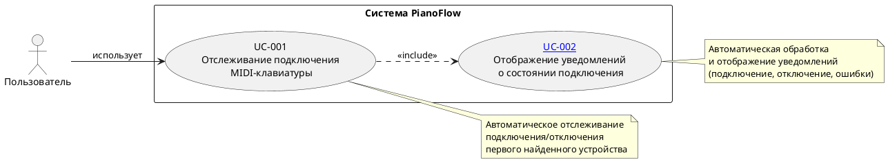
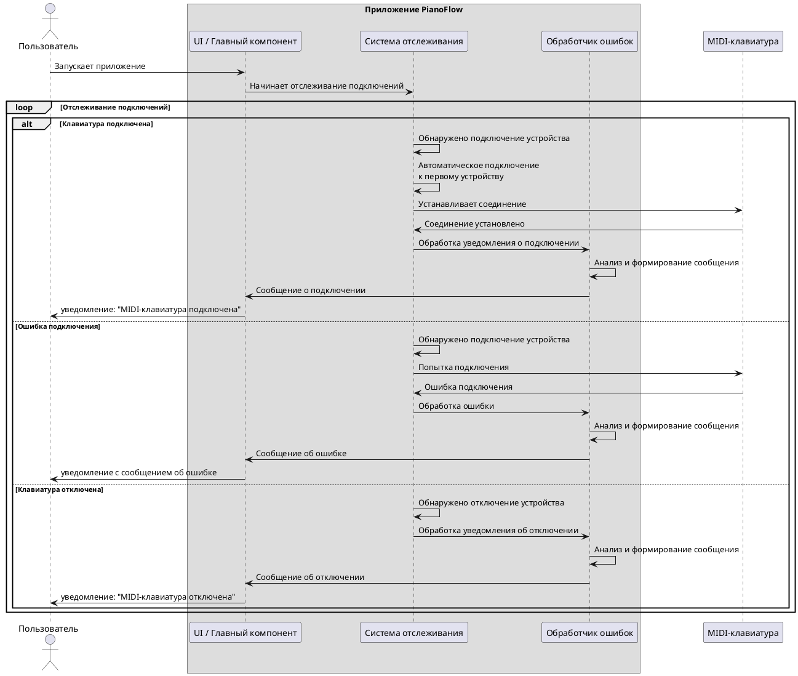

# Use Cases для подключения USB MIDI-клавиатуры

## Цель документа

Данный документ описывает формальные Use Cases (сценарии использования) функционала подключения MIDI-клавиатуры через USB к Android-устройству. Документ следует стандартной структуре Use Case и предназначен для:

- Формального описания функциональных требований
- Планирования приемки функционала
- Тестирования функциональности

## Общее описание функционала

Приложение автоматически отслеживает подключение MIDI-клавиатуры через USB и информирует пользователя о состоянии подключения:

- **При подключении устройства**: автоматически подключается к первому найденному устройству и отображает уведомление о подключении
- **При отключении устройства**: отображает уведомление об отключении
- **При ошибке подключения**: отображает уведомление с сообщением об ошибке
- **При отсутствии подключения и ошибки**: ничего не отображает пользователю

**Ограничения:**

- Поддерживается только одно MIDI-устройство одновременно
- Автоматическое подключение к первому найденному устройству
- Обратная связь о состоянии подключения предоставляется исключительно через системные уведомления, без возможности их отключения.

## Диаграмма Use Cases

---

## UC-001: Отслеживание подключения MIDI-клавиатуры

### Идентификатор
UC-001

### Название
Отслеживание подключения MIDI-клавиатуры

### Краткое описание
Система автоматически отслеживает подключение и отключение MIDI-клавиатуры через USB. При обнаружении первого доступного устройства система автоматически подключается к нему и информирует пользователя о состоянии подключения через уведомления.

### Актор
Пользователь

### Предусловия
1. Приложение запущено и активно
2. Разрешение на работу с MIDI предоставлено (если требуется системой)

### Постусловия
1. Система продолжает отслеживать изменения состояния подключения
2. Пользователь информирован о текущем состоянии подключения (если устройство подключено или произошла ошибка)

### Основной поток

1. Система начинает автоматическое отслеживание подключенных MIDI-устройств
2. Пользователь подключает MIDI-клавиатуру через USB к Android-устройству
3. Система обнаруживает подключенное MIDI-устройство
4. Система автоматически подключается к первому найденному устройству
5. Система успешно устанавливает соединение с устройством
6. Система обрабатывает уведомление о подключении через [UC-002](./MIDI_CONNECTION_NOTIFICATIONS.md)
7. Система продолжает отслеживать состояние подключения

### Альтернативные потоки

#### A1: Устройство уже подключено при запуске приложения
1. Система начинает автоматическое отслеживание подключенных MIDI-устройств
2. Система обнаруживает уже подключенную MIDI-клавиатуру
3. Система автоматически подключается к найденному устройству
4. Система успешно устанавливает соединение
5. Система обрабатывает уведомление о подключении через [UC-002](./MIDI_CONNECTION_NOTIFICATIONS.md)
6. Система продолжает отслеживать состояние подключения

#### A2: Ошибка при подключении к устройству
1. Система начинает автоматическое отслеживание подключенных MIDI-устройств
2. Пользователь подключает MIDI-клавиатуру через USB
3. Система обнаруживает подключенное MIDI-устройство
4. Система пытается автоматически подключиться к устройству
5. Система не может установить соединение (возникает ошибка)
6. Система обрабатывает ошибку через [UC-002](./MIDI_CONNECTION_NOTIFICATIONS.md)
7. Система продолжает отслеживать состояние подключения

#### A3: Устройство отключено во время работы
1. Система отслеживает подключенное MIDI-устройство
2. Пользователь отключает MIDI-клавиатуру от Android-устройства
3. Система обнаруживает отключение устройства
4. Система прекращает соединение с устройством
5. Система обрабатывает уведомление об отключении через [UC-002](./MIDI_CONNECTION_NOTIFICATIONS.md)
6. Система продолжает отслеживать состояние подключения для обнаружения новых устройств

#### A4: Несколько устройств подключены одновременно
1. Система обнаруживает несколько подключенных MIDI-устройств
2. Система выбирает первое найденное устройство
3. Система автоматически подключается только к первому устройству
4. Система игнорирует остальные устройства
5. Система обрабатывает уведомление о подключении через [UC-002](./MIDI_CONNECTION_NOTIFICATIONS.md)
6. Система продолжает отслеживать состояние подключения

#### A5: Нет разрешения на работу с MIDI
1. Система начинает автоматическое отслеживание подключенных MIDI-устройств
2. Система не может получить доступ к MIDI-устройствам из-за отсутствия разрешений
3. Система обрабатывает ошибку через [UC-002](./MIDI_CONNECTION_NOTIFICATIONS.md)
4. Система продолжает отслеживать состояние подключения

#### A6: MIDI API недоступен
1. Система начинает автоматическое отслеживание подключенных MIDI-устройств
2. Система не может использовать MIDI API (не поддерживается устройством)
3. Система обрабатывает ошибку через [UC-002](./MIDI_CONNECTION_NOTIFICATIONS.md)
4. Система продолжает отслеживать состояние подключения

### Критерии приемки

1. ✅ При подключении MIDI-клавиатуры система автоматически подключается к первому найденному устройству
2. ✅ При успешном подключении пользователь видит уведомление "MIDI-клавиатура подключена"
3. ✅ При отключении устройства система отображает уведомление "MIDI-клавиатура отключена"
4. ✅ При ошибке подключения пользователь видит уведомление с описанием ошибки
5. ✅ Система реагирует на подключение/отключение устройства в реальном времени
6. ✅ При наличии нескольких устройств система подключается только к первому
7. ✅ Система продолжает отслеживать состояние после подключения/отключения

---

## Диаграмма последовательности основного сценария

## Общие критерии приемки функционала

1. ✅ При подключении MIDI-клавиатуры система автоматически подключается к первому найденному устройству
2. ✅ При успешном подключении пользователь видит уведомление "MIDI-клавиатура подключена"
3. ✅ При ошибке подключения пользователь видит уведомление с понятным сообщением об ошибке
4. ✅ При отключении устройства пользователь видит уведомление "MIDI-клавиатура отключена"
5. ✅ Система реагирует на подключение/отключение устройства в реальном времени
6. ✅ Все ошибки обрабатываются и отображаются пользователю в понятном формате через уведомления
7. ✅ Функционал работает стабильно при многократных подключениях/отключениях
8. ✅ Поддерживается только одно MIDI-устройство одновременно
9. ✅ При наличии нескольких устройств система подключается только к первому найденному
