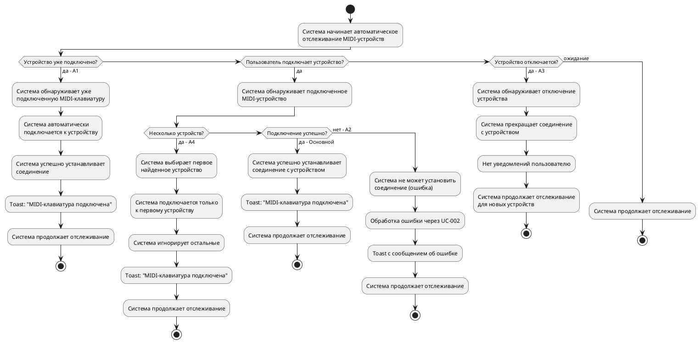

# Пример: UC-001 с визуализацией различий сценариев

## UC-001: Отслеживание подключения MIDI-клавиатуры

### Идентификатор
UC-001

### Название
Отслеживание подключения MIDI-клавиатуры

### Краткое описание
Система автоматически отслеживает подключение и отключение MIDI-клавиатуры через USB. При обнаружении первого доступного устройства система автоматически подключается к нему и информирует пользователя о состоянии подключения через Toast-уведомления.

### Актор
Пользователь

### Предусловия
1. Приложение запущено и активно
2. Разрешение на работу с MIDI предоставлено (если требуется системой)

### Постусловия
1. Система продолжает отслеживать изменения состояния подключения
2. Пользователь информирован о текущем состоянии подключения (если устройство подключено или произошла ошибка)

---

## Визуализация различий между сценариями

### Блок-схема всех сценариев

---

### Сравнительная таблица сценариев

| № | Шаг | Основной поток | A1: Уже подключено | A2: Ошибка | A3: Отключение | A4: Несколько устройств |
|---|-----|----------------|-------------------|------------|----------------|------------------------|
| 1 | Начало отслеживания | ✅ Система начинает автоматическое отслеживание | ✅ То же | ✅ То же | ⚠️ Система **уже** отслеживает подключенное устройство | ✅ То же |
| 2 | Действие пользователя | ✅ Пользователь **подключает** MIDI-клавиатуру | ❌ — | ✅ Пользователь подключает MIDI-клавиатуру | ✅ Пользователь **отключает** MIDI-клавиатуру | ❌ — |
| 3 | Обнаружение устройства | ✅ Система обнаруживает подключенное устройство | ✅ Система обнаруживает **уже подключенную** клавиатуру | ✅ Система обнаруживает подключенное устройство | ✅ Система обнаруживает **отключение** устройства | ⚠️ Система обнаруживает **несколько** подключенных устройств |
| 4 | Выбор устройства | ❌ — | ❌ — | ❌ — | ❌ — | ✅ Система **выбирает первое** найденное устройство |
| 5 | Подключение | ✅ Система автоматически подключается к устройству | ✅ То же | ⚠️ Система **пытается** подключиться | ❌ — | ✅ Система подключается только к первому |
| 6 | Игнорирование других | ❌ — | ❌ — | ❌ — | ❌ — | ✅ Система **игнорирует остальные** устройства |
| 7 | Результат подключения | ✅ Соединение установлено **успешно** | ✅ То же | ❌ Соединение **не установлено** (ошибка) | ❌ — | ✅ Соединение установлено успешно |
| 8 | Обработка ошибки | ❌ — | ❌ — | ✅ Обработка ошибки через **UC-002** | ❌ — | ❌ — |
| 9 | Уведомление пользователю | ✅ Toast: "MIDI-клавиатура подключена" | ✅ То же | ✅ Toast с **сообщением об ошибке** | ❌ **Нет уведомлений** | ✅ Toast: "MIDI-клавиатура подключена" |
| 10 | Продолжение работы | ✅ Система продолжает отслеживание | ✅ То же | ✅ То же | ✅ Система продолжает отслеживание **для новых устройств** | ✅ То же |

**Условные обозначения:**
- ✅ — шаг присутствует
- ❌ — шаг отсутствует
- ⚠️ — шаг отличается от основного потока

---

### Матрица наличия шагов по сценариям

| Шаг | Основной | A1 | A2 | A3 | A4 |
|-----|:--------:|:--:|:--:|:--:|:--:|
| Начало отслеживания | ✅ | ✅ | ✅ | ⚠️ | ✅ |
| Пользователь подключает | ✅ | ❌ | ✅ | ❌ | ❌ |
| Пользователь отключает | ❌ | ❌ | ❌ | ✅ | ❌ |
| Обнаружение устройства | ✅ | ✅ | ✅ | ⚠️ | ⚠️ |
| Выбор первого устройства | ❌ | ❌ | ❌ | ❌ | ✅ |
| Подключение к устройству | ✅ | ✅ | ⚠️ | ❌ | ✅ |
| Игнорирование других устройств | ❌ | ❌ | ❌ | ❌ | ✅ |
| Успешное соединение | ✅ | ✅ | ❌ | ❌ | ✅ |
| Ошибка соединения | ❌ | ❌ | ✅ | ❌ | ❌ |
| Обработка ошибки UC-002 | ❌ | ❌ | ✅ | ❌ | ❌ |
| Toast "подключена" | ✅ | ✅ | ❌ | ❌ | ✅ |
| Toast с ошибкой | ❌ | ❌ | ✅ | ❌ | ❌ |
| Нет уведомлений | ❌ | ❌ | ❌ | ✅ | ❌ |
| Продолжение отслеживания | ✅ | ✅ | ✅ | ✅ | ✅ |

**Условные обозначения:**
- ✅ — шаг идентичен основному потоку
- ⚠️ — шаг отличается от основного потока
- ❌ — шаг отсутствует в сценарии

---

### Детальное сравнение с выделением различий

#### Основной поток

1. Система начинает автоматическое отслеживание подключенных MIDI-устройств
2. **Пользователь подключает** MIDI-клавиатуру через USB к Android-устройству
3. Система обнаруживает **подключенное** MIDI-устройство
4. Система автоматически подключается к **первому найденному** устройству
5. Система **успешно** устанавливает соединение с устройством
6. Система отображает Toast-уведомление с текстом "MIDI-клавиатура подключена"
7. Система продолжает отслеживать состояние подключения

#### A1: Устройство уже подключено при запуске приложения

1. Система начинает автоматическое отслеживание подключенных MIDI-устройств
2. ~~Пользователь подключает MIDI-клавиатуру~~ → **Система обнаруживает уже подключенную MIDI-клавиатуру**
3. Система автоматически подключается к найденному устройству
4. Система успешно устанавливает соединение
5. Система отображает Toast-уведомление с текстом "MIDI-клавиатура подключена"
6. Система продолжает отслеживать состояние подключения

**Ключевое отличие:** Шаг 2 — устройство уже подключено, нет действия пользователя.

#### A2: Ошибка при подключении к устройству

1. Система начинает автоматическое отслеживание подключенных MIDI-устройств
2. Пользователь подключает MIDI-клавиатуру через USB
3. Система обнаруживает подключенное MIDI-устройство
4. Система **пытается** автоматически подключиться к устройству
5. ~~Система успешно устанавливает соединение~~ → **Система не может установить соединение (возникает ошибка)**
6. **Система обрабатывает ошибку через UC-002** ← *новый шаг*
7. ~~Toast "подключена"~~ → **Система отображает Toast-уведомление с сообщением об ошибке**
8. Система продолжает отслеживать состояние подключения

**Ключевые отличия:** 
- Шаг 4 — "пытается" вместо "подключается"
- Шаг 5 — ошибка вместо успеха
- Шаг 6 — обработка ошибки (новый шаг)
- Шаг 7 — Toast с ошибкой вместо успешного подключения

#### A3: Устройство отключено во время работы

1. ~~Система начинает отслеживание~~ → **Система отслеживает подключенное MIDI-устройство** (уже работает)
2. ~~Пользователь подключает~~ → **Пользователь отключает** MIDI-клавиатуру от Android-устройства
3. ~~Система обнаруживает подключенное устройство~~ → **Система обнаруживает отключение устройства**
4. ~~Система подключается~~ → **Система прекращает соединение** с устройством
5. ~~Toast "подключена"~~ → **Система не отображает никаких уведомлений пользователю**
6. Система продолжает отслеживать состояние подключения **для обнаружения новых устройств**

**Ключевые отличия:**
- Все шаги инвертированы (отключение вместо подключения)
- Нет уведомлений пользователю
- Фокус на обнаружении новых устройств

#### A4: Несколько устройств подключены одновременно

1. ~~Система начинает отслеживание~~ → **Система обнаруживает несколько подключенных MIDI-устройств**
2. **Система выбирает первое найденное устройство** ← *новый шаг*
3. Система автоматически подключается **только к первому устройству**
4. **Система игнорирует остальные устройства** ← *новый шаг*
5. Система отображает Toast-уведомление о подключении **первого устройства**
6. Система продолжает отслеживать состояние подключения

**Ключевые отличия:**
- Шаг 1 — обнаружение нескольких устройств
- Шаг 2 — выбор первого (новый шаг)
- Шаг 4 — игнорирование остальных (новый шаг)
- Шаг 5 — уточнение "первого устройства"

---

### Основной поток (текстовый формат)

1. Система начинает автоматическое отслеживание подключенных MIDI-устройств
2. Пользователь подключает MIDI-клавиатуру через USB к Android-устройству
3. Система обнаруживает подключенное MIDI-устройство
4. Система автоматически подключается к первому найденному устройству
5. Система успешно устанавливает соединение с устройством
6. Система отображает Toast-уведомление с текстом "MIDI-клавиатура подключена"
7. Система продолжает отслеживать состояние подключения

### Альтернативные потоки (текстовый формат)

#### A1: Устройство уже подключено при запуске приложения
1. Система начинает автоматическое отслеживание подключенных MIDI-устройств
2. Система обнаруживает уже подключенную MIDI-клавиатуру
3. Система автоматически подключается к найденному устройству
4. Система успешно устанавливает соединение
5. Система отображает Toast-уведомление с текстом "MIDI-клавиатура подключена"
6. Система продолжает отслеживать состояние подключения

#### A2: Ошибка при подключении к устройству
1. Система начинает автоматическое отслеживание подключенных MIDI-устройств
2. Пользователь подключает MIDI-клавиатуру через USB
3. Система обнаруживает подключенное MIDI-устройство
4. Система пытается автоматически подключиться к устройству
5. Система не может установить соединение (возникает ошибка)
6. Система обрабатывает ошибку через UC-002
7. Система отображает Toast-уведомление с сообщением об ошибке
8. Система продолжает отслеживать состояние подключения

#### A3: Устройство отключено во время работы
1. Система отслеживает подключенное MIDI-устройство
2. Пользователь отключает MIDI-клавиатуру от Android-устройства
3. Система обнаруживает отключение устройства
4. Система прекращает соединение с устройством
5. Система не отображает никаких уведомлений пользователю
6. Система продолжает отслеживать состояние подключения для обнаружения новых устройств

#### A4: Несколько устройств подключены одновременно
1. Система обнаруживает несколько подключенных MIDI-устройств
2. Система выбирает первое найденное устройство
3. Система автоматически подключается только к первому устройству
4. Система игнорирует остальные устройства
5. Система отображает Toast-уведомление о подключении первого устройства
6. Система продолжает отслеживать состояние подключения

### Исключения

#### E1: Нет разрешения на работу с MIDI
1. Система не может получить доступ к MIDI-устройствам
2. Система обрабатывает ошибку через UC-002
3. Система отображает Toast-уведомление с текстом "Нет разрешения на доступ к MIDI-устройству"

#### E2: MIDI API недоступен
1. Система не может использовать MIDI API (не поддерживается устройством)
2. Система обрабатывает ошибку через UC-002
3. Система отображает Toast-уведомление с текстом "MIDI не поддерживается на данном устройстве"

---

### Критерии приемки

1. ✅ При подключении MIDI-клавиатуры система автоматически подключается к первому найденному устройству
2. ✅ При успешном подключении пользователь видит Toast-уведомление "MIDI-клавиатура подключена"
3. ✅ При отключении устройства система не отображает никаких уведомлений
4. ✅ При ошибке подключения пользователь видит Toast-уведомление с описанием ошибки
5. ✅ Система реагирует на подключение/отключение устройства в реальном времени
6. ✅ При наличии нескольких устройств система подключается только к первому
7. ✅ Система продолжает отслеживать состояние после подключения/отключения

